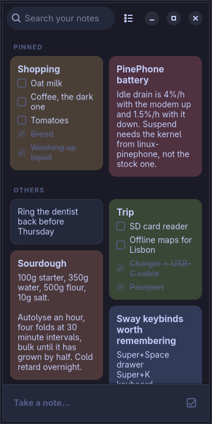
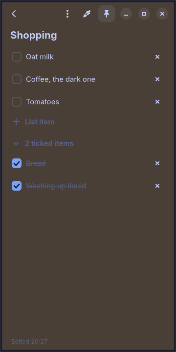
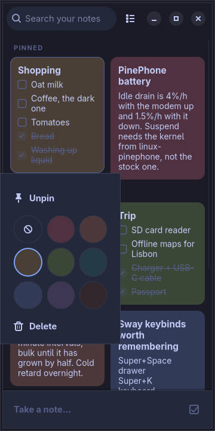

# moarchy-keep

Notes and checklists for a Linux phone, in the shape of Google Keep: a two
column grid of coloured cards, a note that fills the screen when you tap it, and
nothing between typing and it being saved.

<p align="center">
  
  
  
</p>

<p align="center"><em>360×720, the size of a PinePhone's screen under
mobileomarchy. The colours are not the app's own — every one of them is derived
from the active Omarchy theme, here tokyo-night.</em></p>

Built for [mobileomarchy](https://github.com/SimonSchubert/mobileomarchy), but
nothing in it is specific to that: it is a GTK4/libadwaita app and runs on
Phosh, Plasma Mobile, postmarketOS or an ordinary desktop.

## What it does

- **Text notes and checklists**, and either can become the other
- **A masonry grid**, so a two-word note takes two words of space
- **Nine colours**, pinning, search, and a single-column view
- **Everything local.** One JSON file, no account, no network code in the app

## Two kinds of note, one card

A note is prose or it is a list of tick boxes, and the menu turns one into the
other without losing anything — converting a list to text keeps each ticked item
as a `✓`, converting back splits on lines. Ticked items drop to the bottom of the
list under a heading that collapses them, which is what stops a shopping list
from being mostly things you have already bought.

Typing is the whole interaction. Enter at the end of a list item makes the next
one, backspace at the start of an empty one removes it, and a note you open and
back out of without typing is discarded rather than left as a blank card.

## The colours come from your theme

Keep's identity is coloured notes. Omarchy's is that one `omarchy-theme-set`
recolours everything at once. Shipping Google's yellow would have made this the
one surface on the phone that ignored the theme, so the nine note colours are
*derived* instead: each is a hue from the active theme — its red, its orange, its
green — mixed a short way into the theme's own background.

| theme | Coral | Sand | Mint | Fog |
|---|---|---|---|---|
| tokyo-night (dark) | `#4f313f` | `#4a3f36` | `#3a4636` | `#313b58` |
| rose-pine (light) | `#e5c8ca` | `#f5dab5` | `#bbcacd` | `#c9d7d6` |

Same code, same nine names: deep and desaturated on a dark theme, pastel on a
light one. With no Omarchy installed it falls back to the GNOME palette and
looks deliberate rather than broken.


The stylesheet is rebuilt when `colors.toml` changes, so `omarchy-theme-set`
repaints the notes in place — the two halves of that picture are one run of the
app, a second apart, with the theme file replaced in between.

## Where the notes live

`~/.local/share/moarchy-keep/notes.json`, and that is the whole storage layer.
A phone holding a few hundred notes does not need a database, and a plain file
can be read by anything, diffed, synced with rsync or git, and repaired by hand —
which `sqlite3 .dump` cannot be on a device with no keyboard.

Writes go to a temporary file, an fsync, a rename, and an fsync of the
directory. On a phone "killed while saving" is the ordinary case rather than the
strange one: the compositor kills backgrounded apps under memory pressure and
the battery is the only power supply. A note that was saved stays saved, and an
interrupted save leaves the previous file untouched rather than half of the new
one. Typing is written out half a second after you stop.

If the file cannot be parsed it is **kept, not overwritten**: it is moved to
`notes.broken-<timestamp>.json`, the app starts empty and says so, and it will
not save over what it could not read.

## Install

```bash
yay -S moarchy-keep-git
```

Or run it from a checkout with `python3 -m moarchy_keep`.

## Checking it without a phone

The app needs GTK4, libadwaita and a display server, none of which a Mac has.
The container has all three at the versions Arch Linux ARM ships, and on Apple
Silicon it runs natively:

```bash
docker build --platform linux/arm64 -f docker/Dockerfile.dev -t moarchy-keep-dev .
docker run --rm --platform linux/arm64 -v "$PWD:/src" -w /src moarchy-keep-dev ./scripts/check.sh
```

`scripts/check.sh` lints, runs the tests — the storage ones, plus widget tests
that build the real window on the virtual screen and call what the buttons call —
and then **starts the app and fails on any GTK warning**. That last part is the one
that matters: a GTK layout error is not an exception. The app starts, the window
appears, one widget is the wrong size or missing, and a single line on stderr is
the only sign — which on a phone goes to a journal nobody reads.

Two scripts go further:

- `scripts/interact.sh` taps the app with `xdotool` — takes a note, types a
  title and a body, makes a list, presses Enter for the next item — and then
  asserts against `notes.json`. Screenshots prove it draws; this proves that
  tapping "Take a note…" writes a note that survives being closed.
- `scripts/screenshot.sh` photographs it, optionally under a real Omarchy
  palette: `./scripts/fetch-themes.sh /tmp/themes` then
  `THEME=/tmp/themes/tokyo-night/colors.toml ./scripts/screenshot.sh`.

The cairo renderer these use is not a compromise for the container: the
PinePhone's Mali-400 tops out at GLES 2.0, so GTK falls back to software
rendering there too. What is photographed here is what the phone draws.

## Status

Runs clean under the checks above — 44 tests, no GTK warnings, and the
interaction script passing — on Arch Linux ARM at 360×720.

**It has now run on the phone.** `scripts/device.sh` builds the package, installs
it with pacman, launches it through the compositor and photographs the result.
What that showed:

- It installs and starts. `pacman -U` is clean, `desktop-file-validate` passes,
  and the app appears in the drawer under its own icon — so it is reachable by
  tapping rather than only from a shell.
- It renders correctly at 720×1440 under the live theme, and the note colours
  derived from `colors.toml` look on the device the way they look in the
  container.
- One warning in the log, and it is the expected one: `Unable to create a GL
  context`. The Mali-400 has no usable GL, GTK falls back to software rendering,
  and that is the case this app was drawn flat for.
- First launch is slow — more than six seconds to first paint on a cold cache,
  sometimes past fourteen. Warm launches are quick. Worth knowing before
  concluding that a launch failed.


**Not yet answered: whether the on-screen keyboard covers the note being
edited.** What is established is that the keyboard reserves 200px and the
compositor shrinks the workspace to match — 674 → 474, measured three ways on
the same evening by three different surfaces. What is *not* established is that
a moarchy-keep editor is one of the surfaces that gets shrunk: the phone is
shared, and the rect I measured turned out to belong to the app drawer's search
field in someone else's test rather than to this app's note. The apparatus is
ready — `MOARCHY_KEEP_NEW=text` opens a note with the cursor already in the
body, which raises the keyboard without a finger — and it wants ninety seconds
of an undisturbed session.

The other open question is whether a long press on a card competes with the
shell's own gestures.

## Not in this version

Labels, archive, reminders, images, drawing, voice notes, sharing and sync. Keep
has all of them; this has notes, lists and colours, which is the part that is
used every day. The storage format has room for the rest — every note carries an
id and timestamps — but nothing here is waiting on them.

## Licence

MIT.
