# moarchy-apps

The apps for a Linux phone that Android has and Linux does not.

`docs/android-gaps.md` in moarchy-store lists thirteen of them: things with a
good, translated, maintained implementation on F-Droid and no Linux answer in
the aarch64 repos, the AUR or Flathub. This is where they get written.

| | app | what it is | state |
|---|---|---|---|
| 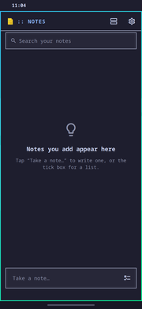 | [keep](apps/keep) | Notes and checklists, in the shape of Google Keep — in Quickshell, for the desktop and the phone | v0.2.0 |
| 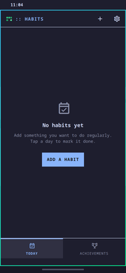 | [habits](apps/habits) | Habit tracking: a tap a day, a streak, sixteen weeks of history — in Quickshell, for the desktop and the phone | v0.2.0 |
| 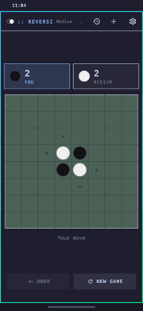 | [reversi](apps/reversi) | Reversi: an opponent on a clock, on its own thread — in Quickshell, for the desktop and the phone | v0.2.0 |
|  | [chess](apps/chess) | Chess: two taps a move, an opponent in the app, no second package — in Quickshell, for the desktop and the phone | v0.2.0 |
|  | [queens](apps/queens) | *Packaging only:* sidhant947's crown-placement puzzle, and the Linux runner it does not ship | 1.0.8 |
| 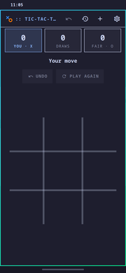 | [tictactoe](apps/tictactoe) | Noughts and crosses: the game solved at startup, then told to err — in Quickshell, for the desktop and the phone | v0.2.0 |
| 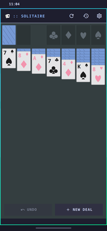 | [solitaire](apps/solitaire) | Klondike: one tap a move, and an app that says when a deal is lost — in Quickshell, for the desktop and the phone | v0.2.0 |
| 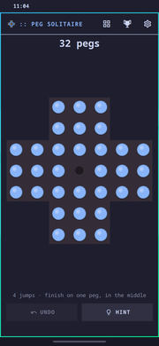 | [pegsolitaire](apps/pegsolitaire) | Peg solitaire: nine figures, all solvable, and a hint that is a proof — in Quickshell, for the desktop and the phone | v0.2.0 |
| 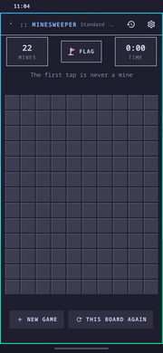 | [minesweeper](apps/minesweeper) | Minesweeper: a portrait board, a latching flag, and a clock that stops — in Quickshell, for the desktop and the phone | v0.2.0 |
| 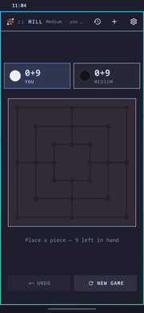 | [mill](apps/mill) | Nine Men's Morris: three squares, an opponent on a clock, and the rule everybody forgets — in Quickshell, for the desktop and the phone | v0.2.0 |
| 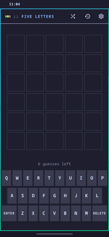 | [fiveletters](apps/fiveletters) | A five-letter word a day: its own keyboard, and a mark as well as a colour — in Quickshell, for the desktop and the phone | v0.2.0 |
| 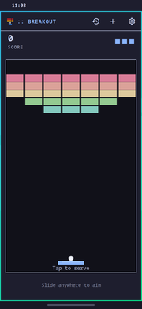 | [breakout](apps/breakout) | Breakout: a bat that follows your thumb, and a clock that stops with the window — in Quickshell, for the desktop and the phone | v0.2.0 |
| 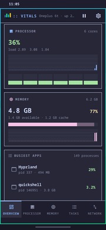 | [vitals](apps/vitals) | A task manager: processor, memory, storage, battery, network and tasks, read from /proc — in Quickshell, for the desktop and the phone | v0.2.1 |
|  | [puzzle-games](apps/puzzle-games) | *Packaging only:* sidhant947's suite of 300+ small puzzles, minus the titlebar | 1.1.4 |
|  | [crypto-market](apps/crypto-market) | *Not a moarchy app:* CoinGecko prices, coin pages, a watchlist and a portfolio, for any Quickshell desktop | v1.1.1 |
|  | [couch-for-trakt](apps/couch-for-trakt) | *Not a moarchy app:* a movie and TV tracker for Trakt — discover, up next, calendar, watchlist, history — for any Quickshell desktop | v1.1.0 |
|  | [transit](apps/transit) | *Not a moarchy app:* public transport journeys and live departures, worldwide, on Transitous, for any Quickshell desktop | v1.1.0 |
|  | [airwaves](apps/airwaves) | *Not a moarchy app:* internet radio from radio-browser.info — 50,000 stations by genre, country and language, the song on air, favourites — for any Quickshell desktop | v1.0.0 |
| 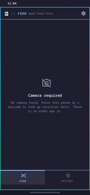 | [food](apps/food) | Point the camera at a barcode: nutrition facts from Open Food Facts — in Quickshell, for the desktop and the phone | v0.2.0 |
| 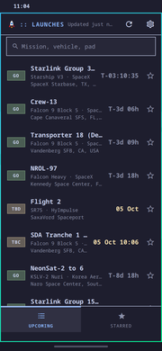 | [launches](apps/launches) | Upcoming rockets: a countdown, a pad, and the ones you star — in Quickshell, for the desktop and the phone | v0.2.0 |
| 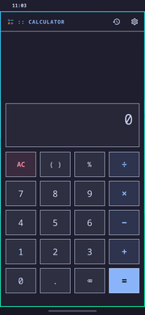 | [calculator](apps/calculator) | The four operations, a tape you can tap, and arithmetic that counts in tens — in Quickshell, for the desktop and the phone | v0.2.0 |
| 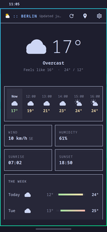 | [weather](apps/weather) | Now, the next day and the week, where you are and in the places you named — in Quickshell, for the desktop and the phone | v0.2.0 |
| 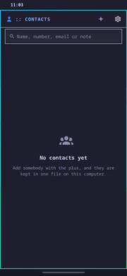 | [contacts](apps/contacts) | A name, a number, an email and a note, in one file, with no accounts behind it — in Quickshell, for the desktop and the phone | v0.2.0 |
| 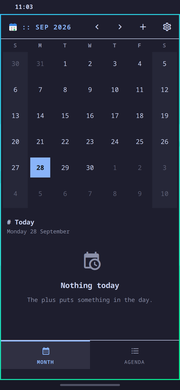 | [calendar](apps/calendar) | The month, the day under it, and what is next — in Quickshell, for the desktop and the phone | v0.2.0 |
| 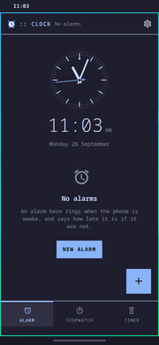 | [clock](apps/clock) | An alarm that rings late and says so, a stopwatch and a timer — in Quickshell, for the desktop and the phone | v0.2.0 |
| 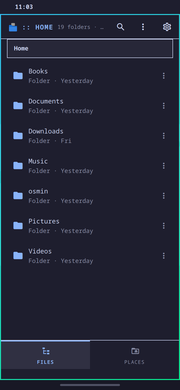 | [files](apps/files) | One folder at a time: copy, move, rename, and a delete that goes to the trash every other app reads — in Quickshell, for the desktop and the phone | v0.2.0 |
| 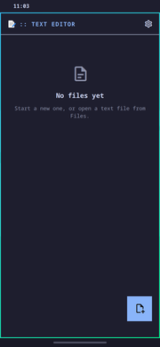 | [editor](apps/editor) | One text file at a time, and an `$EDITOR` that waits — in Quickshell, for the desktop and the phone | v0.2.0 |
| 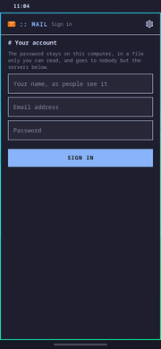 | [mail](apps/mail) | One account over IMAP and SMTP, no HTML drawn, and new mail noticed with the window closed — in Quickshell, for the desktop and the phone | v0.2.0 |

Food is the Open Food Facts row on that list: barcode to nutrition, and Linux
has `qrca` and `decoder`, which read a code and do not say what the packet is.
There is no typed entry. A camera the phone does not have is an empty state,
which is the honest version of requiring one.

Launches is not on that list. Space Launch Now is the F-Droid analogue and it
did not survive the filter; the probe the list describes still comes back
empty, the same way Coins' did. One GET of Launch Library 2, a countdown that
stops lying when the NET is a quarter, and no livestream.

Habits is gap #9 on that list — Loop has 72 translations and Linux has nothing;
`francis`, the nearest thing in the catalogue, is a pomodoro timer. Keep came in
from its own repository with its history, and is the reason the shared half of
`theme.py` exists.

Queens is the odd row: nobody here wrote it. It is a Flutter app by sidhant947
that targets Android, runs on aarch64 Linux without a line of its code changing,
and has no `linux/` directory because `flutter create` generates one on demand.
That generated runner is not in upstream's repository, changes with the SDK, and
is exactly where a phone's one change has to live — so it is committed in
`apps/queens` and the PKGBUILD builds upstream's code against it. A fork would
carry their whole history to hold ten files; this carries the ten files.
`apps/queens/README.md` says what the change is and why it is an environment
variable rather than an `#ifdef`.

Puzzle is the same arrangement and a smaller one. Upstream commits `linux/`
there — alongside `snap/`, `macos/` and `windows/` — so the Linux target already
works and the whole delta is one patch against a real, versioned file. Queens
needed the runner carried; Puzzle needed a branch. Both are upstream as
[Queens#15](https://github.com/sidhant947/Queens/pull/15) and
[Puzzle#168](https://github.com/sidhant947/Puzzle/pull/168), and if they land
these directories keep only their PKGBUILDs.

Reversi and Chess are **not** on that list, and both READMEs say so in as many
words: GNOME has shipped Iagno and Chess for twenty years and they are
`gnome-reversi` and `gnome-chess` in `extra`. They are here because the list
measures what Linux lacks, and a phone lacks things the list does not ask about
— a board drawn for 360px, an opponent that answers on a clock rather than at a
depth chosen on a laptop, and a game written to disk on every move because
phones reclaim apps rather than closing them. Chess adds one more: `pacman -Si
gnome-chess` lists `gnuchess` as an *optional* dependency, so the board you
install has nobody in it until you install a second package, and the search here
is in the app. Whether either survives 360px is a question for moarchy-store's
sweep, which exists to score exactly that.

Vitals is the third of those, and the honest version of the argument is in its
README: Linux is not short of system monitors, and moarchy-store's own catalogue
already lists two — `gnome-usage`, and `bottom`, which is there because *btop
does not fit a phone's terminal at 47 columns*. What a phone lacks is the
content of btop with a thumb-sized switcher along the bottom: per-core bars,
network throughput, heat and charge, and a task list that groups a browser's
twenty processes into one row you can end with a tap. It reads nothing but
`/proc` and `/sys`, and since 0.2.0 it is a Quickshell app in the shape Couch
and Airwaves have: a window of its own on any Quickshell desktop, a panel
inside the Omarchy shell when the shell has it, one column on a phone and two
or three across on a desktop. The GTK version and the plugin in `plugins/`
were replaced by it rather than kept beside it.

Coins was the fourth, and it has gone. Its place is taken by
[Crypto Market](apps/crypto-market), which is the one row here that is not a
moarchy app: it is a Quickshell app for any Arch desktop, packaged as
`crypto-market` on the AUR, that runs in the Omarchy shell when the shell has
it and as its own window everywhere else. It is also the argument Coins made
against itself — it has a portfolio — which is one reason it does not carry
the name. It came in from its own repository with its history, as Keep did;
that repository stays up as the Omarchy plugin it was released as, and is not
developed any more.

Phone and Messages have gone too. Omarchy Mobile ships its own, and both
want the modem to themselves: two listeners on ModemManager is a text read
twice or a call that rings in two places. A phone that had ours installed
keeps `calls-daemon` and Chatty's daemon masked until
`systemctl --user unmask calls-daemon.service sm.puri.Chatty-daemon.service`.

Couch for Trakt came in the same way, from `omarchy-couch`, and is the same
kind of row: a Quickshell app for any Arch desktop, packaged as
`couch-for-trakt` on the AUR, whose old repository stays up as the plugin it
was released as.

Transit is the third, from `omarchy-transit`, on the same terms: `transit` on
the AUR.

Airwaves is the fourth, and the first written here rather than brought in: a
radio built the way Couch is, on radio-browser.info, playing through mpv.
`airwaves` on the AUR.

Calculator has no GTK half and is not going to get one: it was written as a
shell plugin first, which is what a calculator should have been all along, and
0.2.0 is the same app in `apps/calculator` with a package, a desktop layout and
a tape. The argument for the shell is that summoning an app can be
`visible = true` on a window the shell already holds rather than four seconds
of starting Python and GTK, and a calculator is the app that argument is
*about* — it is opened for eleven seconds, several times a day, usually while
somebody is holding something else in their other hand. It is also not a gap,
and its README says so in as many words: `gnome-calculator` is in `extra`, it
is adaptive, and it knows more mathematics than this ever will. What it is not
is a keypad whose keys are 62px with the sum sitting on them. The part worth
reading is `Decimal.js`, which is there
because `0.1 + 0.2` in JavaScript is 0.30000000000000004 and a calculator is the
one program on the phone where that is a wrong answer rather than a rounding
detail — Python's half of this repository would reach for `decimal`, and QML has
none, so this is one.

Weather is the second plugin with no app behind it, and it is the first one
here that has to say what it *is not*. moarchy-store's `docs/android-gaps.md`
puts Breezy Weather in tier one — "radar, air quality, pollen, warnings, many
sources" — and names it one of the three worth writing first. This is none of
those five things, so that row stays open. What the same catalogue already has
is `gnome-weather`, listed, featured, and swept as *"Ran at 360x674 and drew
correctly; follows the theme. 1 packages, 0.15 MB"*, with `kweather` beside it.
So the honest version is the calculator's argument again, and the two phone
things here are that it is already running when it is summoned, and that now,
today and the week are one column you scroll rather than three places to
navigate between — the towns live behind the pin, because choosing one is
something you do twice a year and reading the sky is something you do at a bus
stop. It opens on the town the connection's address is in, looked up from
GeoJS — a town rather than a street, asked only while that town is on the
screen, and switched off by a box on the places page that says all of this
beside it. That keeps the whole of its network behaviour a sentence: one
request per town being looked at, and one for where the phone is while that is
the town, each at most four times an hour, while the window is on the screen.

Calendar is the third of these with no app behind it, and the first whose
argument is a number. The gaps list has no calendar row because the store
already has one: `gnome-calendar` is in `extra`, catalogued, *featured*, and
swept as fitting — "a seven-column month grid with week numbers at 360px is as
tight as that can be drawn, and it is legible". What the sweep does not measure
is what it costs to put there. On the container these checks run in — Qt,
Quickshell and no GTK at all — `pacman -S gnome-calendar` wants **112
packages**, because a calendar with accounts in it needs
`evolution-data-server`, which is 30 MB installed, brings GTK3 alongside the
GTK4 that is already there, and brings a WebKit to show somebody a Google
consent screen; then `libedataserverui4` brings the *other* WebKit, because it
is built against GTK4 and the first one is not. Two browser engines behind a
month grid, and none of it anybody's fault: that is the price of accounts, and
a fair one if accounts are what is wanted. This is the other thing — one JSON
file, no daemon, nothing on the network, and three screens drawn for 360px
rather than reflowed onto it — and, since 0.2.0, a month grid on a desktop that
names what is on each day. Its README lists the four things it does not do
before it says anything it does, because "it does not ring" is the first thing
somebody should know about a calendar.

Clock is the fourth, and it is the one where being a plugin stops being an
argument about startup time and becomes the only arrangement that works.
`"keepLoaded": true` means the plugin host holds the `Item` from the moment the
shell starts, so the timer watching for an alarm runs inside a process that is
already running for the bar and the gestures — with no window anywhere on the
screen. A GTK app in `apps/` had two shapes available to it and both are worse:
an alarm that rings only while somebody is looking at the app, or a second
package holding a systemd service, with the alarms then living in a process the
app cannot see. `gnome-clocks` is in `extra` and this is not a gap either, and
its README says so before it says anything else — along with the 73 packages
and 60 MB that `pacman -S gnome-clocks` wants on a container with no GTK on it,
five of them a geolocation stack down to `libmm-glib`, so that a clock can ask
the modem where it is. That is the price of the world-clock page, and it is the
page this app does not have. What that README says *next*
is the part worth reading: nothing a user process can do will wake a suspended
phone — `WakeSystem=true` is root's and so is `rtcwake` — so an alarm that came
due while the phone was off rings when it comes back and says *4 minutes late*,
and past an hour does not ring at all and says it went by instead. Ringing at
ten for a seven o'clock alarm is not a late alarm, it is a confusing one.

Text Editor is the fifth, and the phone's editor rather than an app beside
one: it replaces `gnome-text-editor` on the phone, both as what
opens when a text file is tapped and as `$EDITOR`. The second is the part a
plugin is bad at, because opening a file in something the shell already holds
returns at once, and `git commit` reads its message back the moment the editor
returns. `moarchy-editor --wait` is the process that stays: it hands the
editor a marker path, and the editor touches it when the file is closed; with
no shell to hand it to, it runs the editor itself and waits for that. Its
README also lists the characters it will not write back — Qt's text control was
measured turning a no-break space into a space and U+2028 into a newline, so a
file with one in it opens read only and says why, rather than being changed
where nobody typed.

Mail is the sixth, and it replaces Geary, which moarchy-store's sweep had
already rejected for this screen and which, like Fractal, waits for a keyring
prompt that maps behind its own window. It is the first plugin that cannot do
its job in QML at all — there is no TLS socket to open — so
`libexec/moarchy-mail` does every conversation with a server, one short run
per request, in Python's standard library, and the app keeps what it was told
in files it alone writes. Two things in its README are worth the reading: nothing
it draws is HTML, so no message can make the phone fetch a picture, and its
checks run the helper against a real Dovecot, installed into the container for
the run, rather than against a fake of one.

## One shape, and where it lives

Every app here is the same kind of thing: a Quickshell `Item` that the Omarchy
shell keeps loaded as a panel plugin, and that `shell.qml` runs as its own
process anywhere the shell is not. Its launcher, `moarchy-<name>`, asks the
shell first (`omarchy-shell shell summon`) and starts its own copy only when
the shell does not have it -- so one package serves the phone, an Omarchy
desktop and any other Quickshell desktop, and inside the shell opening an app
is showing a window that is already there rather than starting a process.

What they share is [`shared/kit`](shared/kit): the window and the host API,
the theme -- the shell's own while inside it, Omarchy's theme files outside
it, a plain light or dark with neither -- and the two layouts every app
chooses between by its width, never by the device: below 720 px tabs at the
bottom and pages that stack, above it a rail and panes side by side. A colour
written into a view is a view that ignores the theme, so `scripts/app-lint.py`
fails one; colours live in each app's Tokens, as the theme's fallbacks.
[`shared/kit-gallery`](shared/kit-gallery) draws every widget on one screen,
so a change to the kit is looked at rather than argued about.

Each app still reads and writes the file its GTK version wrote under
`~/.local/share/moarchy-<name>`, so an upgrade finds its notes, games and
scores where they were.

## Why one repo

Because there are a dozen of these coming, and the alternative is a dozen
repositories that each need their own CI, their own container, their own
`ruff.toml`, and their own copy of the code that reads an Omarchy theme — which
had already been copied three times before this repo existed, at 440, 360 and
287 lines, differing by four.

The usual objection to a monorepo is that it forces one version number across
unrelated apps. It does not. `git archive` takes a **subtree at a tag**:

```sh
git archive --prefix=moarchy-habits-0.2.0/ habits-v0.2.0:apps/habits
```

So each app keeps its own tag, its own version, its own PKGBUILD and its own
pacman package. `packaging/release.sh` assembles the release tarball from two
subtrees of one tag — the app, and the kit it links — which makes each
tarball self-contained: no submodule, no runtime dependency between apps, and a
checksum that still names exact code.

## Layout

```
apps/<name>/           one app: Panel.qml and its views, bin/ (the launcher),
                       tests/, dev/ (demo fixture, shot list), PKGBUILD, README
apps/<name>/kit        a link to shared/kit
shared/kit/            what every app has in common, and its tests
shared/kit-gallery/    every kit widget on one screen
packaging/release.sh   tag -> per-app tarball (the kit resolved) + sha256
packaging/publish-market.sh   built packages -> [market-apps], the Omarchy
                       Mobile Market's prebuilt repo (gh-pages)
scripts/check.sh       every check: ruff, the lints, the Python helper tests,
                       and app-check.sh
scripts/app-check.sh   per app: app-lint, qmllint, its tests, a real quickshell
                       run that fails on any QML warning
scripts/app-shot.sh    the photo harness, under headless sway at 360x720 and
                       1280x820; apps/<name>/dev/shots says what to shoot
scripts/package.sh     build one app's package from the working tree
scripts/device.sh      install and photograph an app's package on the phone
scripts/install-plugin.sh     put an app into the phone's shell as a plugin
docker/Dockerfile.qml  the Qt and Quickshell stack, with the fonts the apps
                       draw in
docs/publishing.md     the three channels every app ships in, and what is
                       in which of them today
```

`queens` and `puzzle-games` are packaging for somebody else's Flutter apps and
are none of the above: their PKGBUILDs build from upstream.

The kit is **vendored into each package at build time**, not shipped as its
own pacman package. A second package for the kit would be one more thing to
download and keep in step on every phone, with nothing behind it. One source copy here, many self-contained packages there.

## The part that is not writing the app

An app nobody can install is a hobby. Every app here is on the **AUR** -- one
PKGBUILD per app, pinning a release tarball by checksum, pushed by
`.github/workflows/aur.yml` whenever an app's PKGBUILD changes -- and that is
how a phone gets it as well: Omarchy Mobile's **App Finder** installs from the
AUR, building with `yay` and asking for the phone's PIN for the root steps.
Nothing to add to `pacman.conf`, no key to trust by hand.

What App Finder shows first is its recommended apps, with their screens
turning in a carousel: an entry each in
[mobile-market-data](https://github.com/SimonSchubert/mobile-market-data)'s
`aur/recommended.json`. All 22 apps here are in it.

The phone's other store, the Omarchy Mobile Market, installs prebuilt packages
from its own signed repo, `[market-apps]`, on this repo's `gh-pages`; ours are
kept there too, with `packaging/publish-market.sh`.
[`docs/publishing.md`](docs/publishing.md) has the table and the commands.

## Working on it

The checks want the Qt and Quickshell the phone has, which a Mac does not, so
they run in the container:

```sh
docker build --platform linux/arm64 -f docker/Dockerfile.qml -t moarchy-qml .
docker run --rm -v "$PWD:/src" -w /src moarchy-qml scripts/check.sh          # everything
docker run --rm -v "$PWD:/src" -w /src moarchy-qml scripts/check.sh habits   # one app
docker run --rm -v "$PWD:/src" -w /src moarchy-qml scripts/app-shot.sh habits
```

The real run is the one that matters: `quickshell -p shell.qml` exits 0 with a
ReferenceError in a tap handler, and the only sign is a line on stderr. The
photographs are the other half, at a phone's size and a desktop's, light and
dark: a layout that is wrong is not an error anywhere, and has to be looked at.

On the phone (`PHONE=omarchy@<address>`):

```sh
scripts/package.sh habits && scripts/device.sh all habits   # the package
scripts/install-plugin.sh habits                            # into the shell
```

**The container is also the authority on lint.** It carries a newer ruff than a
Mac's Homebrew usually does, and the two disagree in both directions. Run the
lint where the checks run.

## Adding an app

1. `apps/<name>/` in the shape the others have: `Panel.qml` an `App` from the
   kit, `shell.qml` three lines, `bin/moarchy-<name>`, `manifest.json`
   (`kinds: ["panel"]`), the `.desktop`, `icon.svg`, `tests/`, `dev/demo.py`
   and `dev/shots`, a `PKGBUILD` with `sha256sums=('SKIP')`, `README.md`, and
   `ln -s ../../shared/kit kit`. `apps/tictactoe` is the smallest to copy.
2. Both layouts: look at it at 360x720 and at 1280x820 before calling it done.
3. `scripts/check.sh <name>` green, including the real run.
4. Tag `<name>-v<version>`, `packaging/release.sh <name> <version>`, put the
   printed sha256 in the PKGBUILD, upload the tarball as the release asset.
5. Commit the pinned PKGBUILD and a regenerated `.SRCINFO`, and push:
   `aur.yml` publishes it to the AUR, which is what App Finder installs from.
6. For App Finder to show it: an entry in mobile-market-data's
   `aur/recommended.json`, with three screens and an icon.
7. `scripts/package.sh <name>`, then `packaging/publish-market.sh`, to keep the
   Market's `[market-apps]` copy in step.

[`docs/publishing.md`](docs/publishing.md) holds the table of which app has
reached which channel, the exact commands, and what fails late.

## Licence

MIT.
