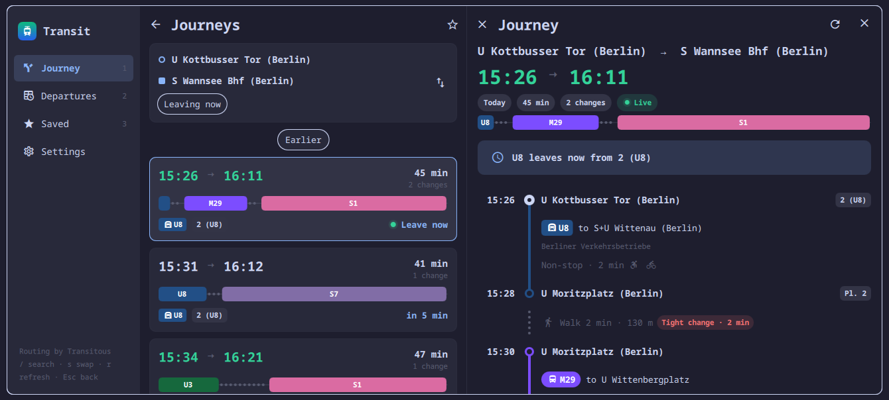
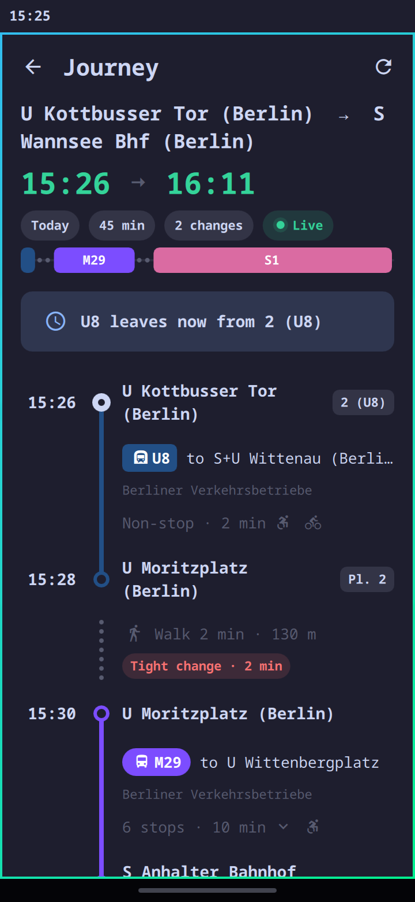

# Transit

Public transport as an Omarchy app: journeys and live departures for trains,
metros, trams, buses and ferries, anywhere with an open timetable. One app
window lays itself out for the desktop and for the phone.





## What it does

- **Journeys** between any two stops, addresses or places. You can leave now,
  leave at a set time or arrive by one, on any of the next seven days, and page
  to earlier and later connections.
  - Each result shows departure and arrival, the duration and the number of
    changes, plus a to-scale bar of the whole trip. Every ride is drawn in its
    line's own colour and walks are dotted, so a long wait on a platform is
    easy to spot.
  - Live times are green when on time, amber when a few minutes late and red
    when later. The planned time is struck through beside them.
- **Journey timeline**:
  - every ride in its line's colour, with the line, direction and operator
  - the platform at each stop
  - the stops along the way, one tap to expand
  - operator notices
  - each change and the minutes it leaves you; a change too tight for the
    walk is marked red
  - a countdown to when you have to leave
- **Departures**: a live board for any stop. It shows the line badge, the
  destination, the platform and a countdown, plus delays and cancellations.
  You can switch to arrivals or filter by kind of transport. Tap a row to see
  that vehicle's whole trip, which scrolls to your stop.
- **Platform changes**: the new platform in amber, with the old one struck
  through.
- **Your trips**: star a search, and the Journey tab keeps that trip's next
  connection with a live countdown. Home and work are one tap from anywhere.
- **Your stops**: star a stop to switch between boards in one tap.
- **Settings**: which kinds of transport to use, the most changes allowed,
  walking speed, step-free routing, and a 12- or 24-hour clock.

It opens instantly with the last boards and journeys it saw. It refreshes only
while it is open and only what is on screen: a board or journey every 30
seconds, saved trips every two minutes.

## Coverage

Routing and departures come from [Transitous](https://transitous.org), a free,
community-run journey planner built on open timetable data. It covers most of
Europe, the United States and Canada, and parts of Latin America, Asia and
Oceania: see the [list of sources](https://transitous.org/sources/).

Live times, platforms, cancellations and notices appear wherever the local
operator publishes them. Where it doesn't, Transit shows the timetable times
in plain text and labels the journey **Timetable only**. It never shows "on
time" unless the data is live. Platform changes and disruption notes are
thinner than in an operator's own app in some regions, for example in Germany
for DB's long-distance trains.

Times are shown in the time zone your device is set to.

## Install

```sh
omarchy plugin add https://github.com/SimonSchubert/omarchy-transit.git --enable
```

To open it, bind a key in `~/.config/hypr/bindings.lua`:

```lua
o.bind("SUPER + SHIFT + T", "Transit", "omarchy-shell shell toggle io.github.simonschubert.transit")
```

Or run `omarchy-shell shell toggle io.github.simonschubert.transit` from
anywhere.

The first time it loads, Transit also adds itself to Omarchy's app menu, so
you can search for it by name. It does this once, and only if no entry by that
name exists yet. **Settings → App launcher** hides or shows the entry.

On Omarchy Mobile it appears in the app drawer as its own app.

## Remove

```sh
omarchy plugin remove io.github.simonschubert.transit
```

That removes the plugin itself. Your places, trips and settings stay in
`~/.local/state/transit/`, the saved boards stay in `~/.cache/transit/`, and
the app menu entry stays in `~/.local/share/applications/`. To remove those
as well:

```sh
rm -rf ~/.local/state/transit ~/.cache/transit
rm -f ~/.local/share/applications/omarchy-plugin-io.github.simonschubert.transit.desktop
```

If you added a keybinding, remove it from `~/.config/hypr/bindings.lua`.

## Requirements

Omarchy with its Quickshell shell, and network access to `api.transitous.org`.
It installs no packages and changes no Omarchy configuration. It reads and
writes only its own files, listed below.

## Keys (desktop)

Transit opens as a normal window, so Hyprland tiles, focuses and closes it
like any other app. The keybinding above toggles it.

| Key | Action |
| --- | --- |
| `1`–`3` | Journey, Departures, Saved |
| `/` | Search a destination (a stop, on the Departures tab) |
| `s` | Swap start and destination |
| `↑` `↓` | Scroll |
| `r` | Refresh |
| `Esc` | Back one step (close the window with your usual close key) |

## Being a good guest

Transitous is run by volunteers and asks its clients to go easy on it.
Transit sends one request at a time with a gap between them, and caches every
answer: journeys for a minute, boards for 30 seconds, stop names for a day. It
asks only for what is on screen, and every request carries a User-Agent that
names the app and links to this repository, as Transitous requests. When the
server asks it to slow down, it keeps showing what it has and retries by
itself.

## Privacy and security

- The only network access is HTTPS requests from QML to `api.transitous.org`.
  What you search for, and the stops and trips you look up, are sent there.
  Nothing else is.
- It runs no shell commands. At startup it runs `install -d -m 700` on its own
  state and cache folders, and `chmod 600` on its two data files, so where you
  live and work and the trips you make are readable only by you. It runs no
  other processes. If either step fails, it saves nothing and says so on
  screen.
- It writes only these files:
  - `~/.local/state/transit/prefs.json`: home, work, your stops, saved and
    recent trips, and settings
  - `~/.cache/transit/snapshot.json`: the last boards and journeys, for
    opening instantly
  - `~/.local/share/applications/omarchy-plugin-io.github.simonschubert.transit.desktop`:
    its app menu entry, created once and never over an existing file
- Everything the server sends is shown as plain text: stop names and operator
  notices can't render as markup.

## Credits

Routing by [Transitous](https://transitous.org), with timetables from
[these sources](https://transitous.org/sources/). Map data ©
[OpenStreetMap contributors](https://www.openstreetmap.org/copyright).

Icons are from [Material Design Icons](https://pictogrammers.com/library/mdi/)
by Pictogrammers (Apache License 2.0), as drawn by the Nerd Fonts; the app icon
uses its tram.

MIT licensed.
