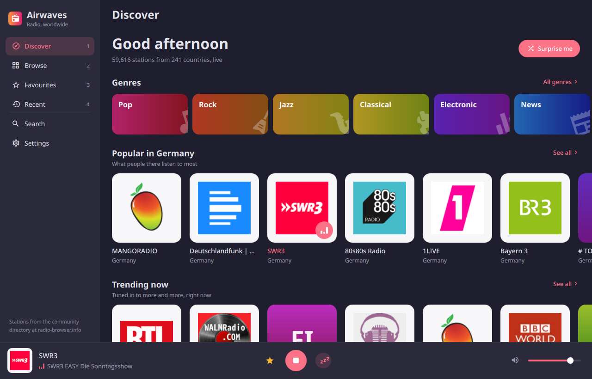
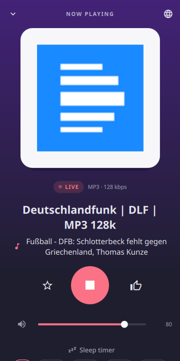

# Airwaves

Internet radio for Quickshell desktops, from the community directory at
[radio-browser.info](https://www.radio-browser.info): over 50,000 stations
from every country, in an app window that lays itself out for the desktop and
for the phone.

Airwaves is an independent app. It is not affiliated with or endorsed by
radio-browser.info or by any station.





## What it does

- **Discover**: genres as tiles, what is popular in your country, what is
  trending everywhere, and the most loved stations in the directory, loading
  more as you scroll. **Surprise me** plays something popular.
- **Browse**: every genre, country and language, biggest first, with a field
  to narrow them down. Each opens a list ordered by popularity, trend, votes,
  quality or name.
- **Search**: any station by name, or by a genre it is tagged with.
- **Now Playing**:
  - the song the station says is on, as it changes
  - play and stop, volume, and a sleep timer
  - the station's tags, place, language, stream quality, votes and
    listens, each tag, country and language a way into more like it
  - its website, a link to the stream, and a vote for it
- **Favourites**: star any station. They are kept on this computer and open
  offline.
- **Recent**: what you listened to, newest first.

A tap on a station plays it. On the desktop the player runs along the foot of
the window; on a phone it sits above the tabs, and a tap opens Now Playing.
The app opens instantly, even offline, with the lists it saw last. It fetches
lists only while it is open.

## Install

On Arch Linux or Arch Linux ARM, with a Wayland desktop, from the AUR:

```sh
yay -S airwaves      # or any AUR helper
```

That installs Quickshell and mpv too if they are not there yet, and gives you
an `airwaves` command and an app menu entry. The app opens in a window of its
own; closing the window ends it, and the music with it. Under Omarchy it takes
the Omarchy theme when its shell has the plugin installed, and opens inside
that shell -- where the music keeps playing after the window closes, until you
stop it.

To open it with a key on Hyprland:

```
bind = SUPER SHIFT, R, exec, airwaves
```

## The player

Airwaves plays through [mpv](https://mpv.io), started when you first press
play and stopped when you close the app. mpv reads your own configuration, so
an audio device chosen in `~/.config/mpv/mpv.conf` applies here too, and so
do mpv scripts. With [mpv-mpris](https://github.com/hoyon/mpv-mpris)
installed, the station and its song appear on your media keys, in your bar
and on the lock screen.

The play button plays and stops rather than pausing: a paused live stream
resumes minutes behind the broadcast. A stream that drops is tried again
twice before the app says it can't be played.

## Remove

```sh
sudo pacman -Rns airwaves
```

Your favourites, history and settings stay in `~/.local/state/airwaves/`, and
the saved lists and logos in `~/.cache/airwaves/`. To remove those as well:

```sh
rm -rf ~/.local/state/airwaves ~/.cache/airwaves
```

## Requirements

Quickshell and mpv (the package depends on both, along with
`qt6-imageformats` for WebP logos and the JetBrains Mono Nerd Font the icons
are drawn in), and network access to `*.api.radio-browser.info` and to the
stations you play. Omarchy is optional: without it the app runs as its own
Quickshell window, in a light or dark palette that follows the desktop's
preference, or the one chosen in **Settings → Appearance**.

## Keys (desktop)

Airwaves opens as a normal window, so Hyprland tiles, focuses and closes it
like any other app.

| Key | Action |
| --- | --- |
| `Space` | Play or stop |
| `1`–`4` | Discover, Browse, Favourites, Recent |
| `/` | Search |
| `↑` `↓` `←` `→` `Enter` | Move through a list, play a station |
| `f` | Star the selected station, or the one playing |
| `n` | Now Playing |
| `+` `-` `m` | Volume up, down, mute |
| `r` | Refresh |
| `Esc` | Back one step (close the window with your usual close key) |

## Privacy and security

- **Network.** Lists come from radio-browser.info's API over HTTPS, from one
  of its mirrors picked at random, as the directory asks. When you play a
  station, the app tells the directory (that is how *popular* is counted), and
  mpv connects to the station's stream. Station logos are downloaded from each
  station's own website; **Settings → Station logos → Hide** turns that off,
  and then nothing is fetched outside radio-browser.info except the stream you
  play.
- **Streams.** A station's address is whatever somebody typed into the
  directory, so mpv is started with youtube-dl off and a protocol whitelist
  that lets a stream reach the network and nothing else: no local files,
  whatever a playlist inside the stream says.
- **Size limits.** Every answer is capped while it downloads: 4 MB for a
  list, 1 MB for a logo. Anything larger is dropped mid-download and never
  parsed.
- **Processes.** It runs no shell commands. It starts `mpv` with a fixed
  argument list when you press play, through `setpriv --pdeathsig` so that it
  ends with the app however the app ends, and talks to it over a socket in
  `$XDG_RUNTIME_DIR`. At startup it runs `install -d -m 700` on its own state
  and cache folders, and `chmod 600` on its two data files, so your history is
  readable only by you. If either step fails, it saves nothing and says so on
  screen.
- **Files.** It writes only these files:
  - `~/.local/state/airwaves/prefs.json`: settings, favourites and history
  - `~/.cache/airwaves/`: the last lists, for opening offline, and the logos
- **Your data.** Favourites and history never leave this computer. Station
  names and descriptions are shown as plain text. Links open in your browser,
  and only `http:` and `https:` links are opened.

## Credits

Station data from [radio-browser.info](https://www.radio-browser.info), a
free, community-run directory. Airwaves is not affiliated with or endorsed by
radio-browser.info, any station, Omarchy or Quickshell.

MIT licensed.
