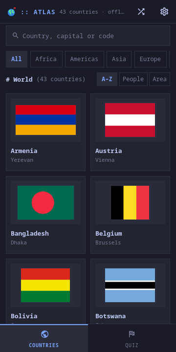
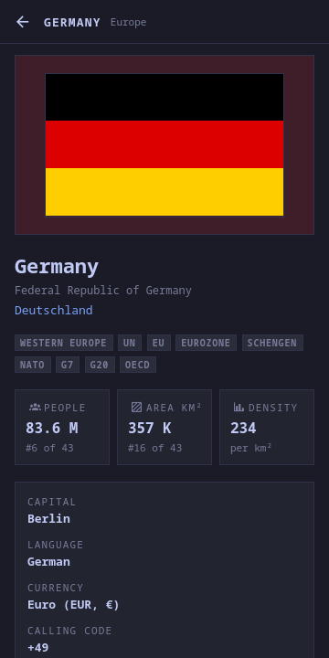
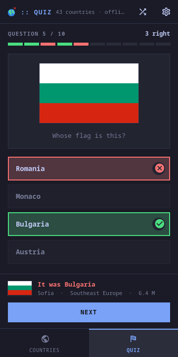
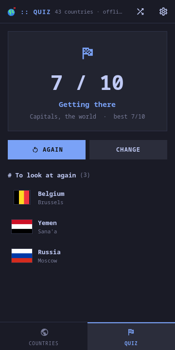
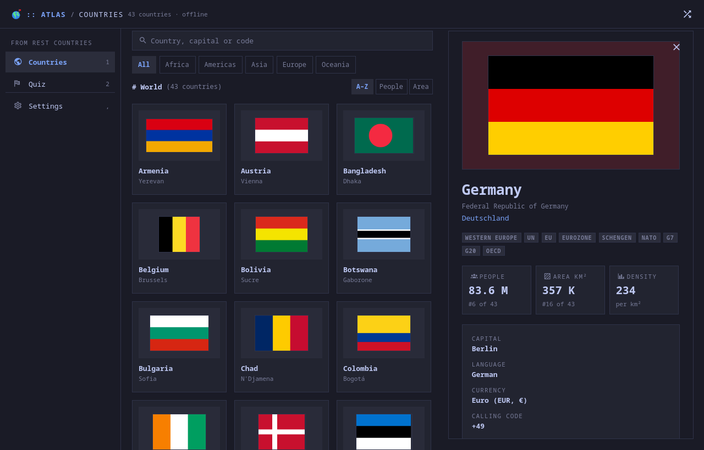

# moarchy-atlas

A world atlas for a Linux phone: every country's flag, capital and figures,
its neighbours a tap away, and a flag quiz whose wrong answers come from next
door.

<p align="center">
  
  
  
  
</p>
<p align="center">
  
</p>

<p align="center"><em>360×720, and a desktop window. One app: below 720 px it
lays out as a phone app with the tabs at the bottom and a country as a page;
wider, the tabs are a rail and a country opens beside the grid. The colours are
the active Omarchy theme's. The shots are taken offline against
<code>dev/demo.py</code>, which writes forty real countries and draws their
flags itself -- stripes, discs and crosses -- so the world in the pictures is a
little smaller than the one in the app.</em></p>

A Quickshell app. Inside the Omarchy shell it is a panel the shell keeps
loaded, so opening it is showing a window rather than starting a process; on
any other Quickshell desktop `moarchy-atlas` runs it as its own.

## What it does

Two pages. On a phone the switcher is along the bottom; on a desktop it is the
rail, and `1` and `2`.

**Countries** — all 250, as a wall of flags: two columns on a phone, as many
as fit on a desktop. A search that finds a country by its name, its official
name, its name in its own languages, its capital or its code, and does not
mind accents (`cote`, `reykjavik`). The regions as a row of chips, and three
orders: A–Z, most people, most land -- in the two figure orders the line
under each flag becomes the figure.

**A country** — the flag large, on a wash of its own strongest colour (the
page takes a little of Germany's red without the theme growing a red of its
own); its official name and its names in its own languages; what it belongs
to (UN, EU, Schengen, NATO, G7, the African Union, ASEAN...), whether it is
landlocked or a territory; people, area and density, each with its place among
everybody; capital, languages, currency, calling code, domain, time zones,
what its people are called, which side of the road, which day the week
starts; what REST Countries says about it and about its flag; and its
neighbours, each a chip with its flag that opens the next page. Walking
Europe border by border is the thing this app is best at.

**Quiz** — ten questions, four answers each, in three kinds: *Name the flag*
(a flag, four countries), *Find the flag* (a country, four flags) and
*Capitals* (a country, four cities), over the world or one region. The wrong
three are chosen from the right one's subregion first, then its region, so a
round in Europe is about telling Estonia from Lithuania, not Sweden from
Nepal. Flags nobody can tell apart at a glance -- Chad and Romania, Monaco and
Indonesia, Ireland and Côte d'Ivoire -- are never offered side by side, and
territories are never asked about, because Bouvet Island flies Norway's flag
and asking for it is a trick. An answer says whether it was right with a mark
as well as a colour, and then what the answer was, with its capital and its
people, before Next. The round ends on a score, a verdict, your best for that
kind and place, and the ones you missed, each a way into its page. The record
is kept: rounds, the share right, and a best per kind and region.

A die in the header opens a country at random.

## Where it comes from, and the key

[REST Countries](https://restcountries.com). Since 2026 its old keyless
v1–v4 are gone and v5 asks for a key on every request -- the page that says
so is candid about why. A free account is 1,000 requests a month, so this is
built around never spending them: the whole world is three pages of a hundred
(`/countries/v5?limit=100&offset=…&response_fields=…`, only the fields the
screens draw), asked for once and kept for a month in `countries.json`.
Browsing, searching and every round of the quiz ask the network nothing.

With no key and nothing saved, the Countries page is the place to paste one,
with a button to the sign-up page. Settings has it too, and
`MOARCHY_ATLAS_KEY` wins over both. A refused key says so and stops asking; a
429 waits as long as it is told; any other failure keeps whatever world is
already on the screen, says so under the title, and backs off. REST
Countries' demo key answers every request with one sample country, and Atlas
says that too rather than keeping Canada as the world.

The flags come from REST Countries' flag CDN, which needs no key. After the
world arrives, the missing ones are fetched in one curl, eight at a time, into
`flags/` -- about two megabytes -- so the quiz works on a plane. A flag the
CDN does not have is removed rather than left half-written, and drawn as the
country's two letters.

Nothing is asked while the window is closed.

## Files

`~/.local/share/moarchy-atlas/`:

- `countries.json` -- the world as it was last described, and when.
- `flags/<code>.png` -- one picture per country, at 320 px.
- `quiz.json` -- rounds played, answers right, and the best per kind and
  region.
- `account.json` -- the key.

The first three are disposable: delete them and the next open fetches them
again. An unreadable file is moved aside as `<name>.broken-<epoch>.json`
rather than written over.

## Keys

| key | does |
|---|---|
| `1` `2` | Countries, Quiz |
| `/` | search |
| arrows, `Enter` | move through the flags, open one |
| `?` | a country at random |
| `1`–`4` | answer, in the quiz |
| `Enter` | next question, start, again |
| `r` | fetch the world again |
| `,` | Settings |
| `Esc` | back one step |

`qs ipc -c <config> call atlas show DE` opens a country from outside.

## Checking it

```sh
docker run --rm -v "$PWD:/src" -w /src moarchy-qml scripts/app-check.sh atlas
docker run --rm -v "$PWD:/src" -w /src moarchy-qml scripts/app-shot.sh atlas .shots/atlas
```

`tests/` is REST Countries' v5 record shape (the sample its demo key returns,
trimmed) and the ways a record goes wrong, the quiz's rules against a seeded
generator, and the three files. `dev/shots` says what is photographed and
with which seed.
