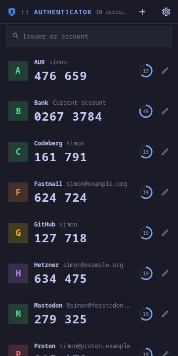
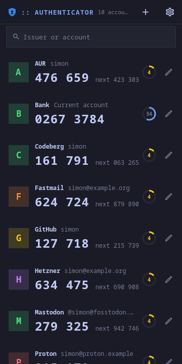
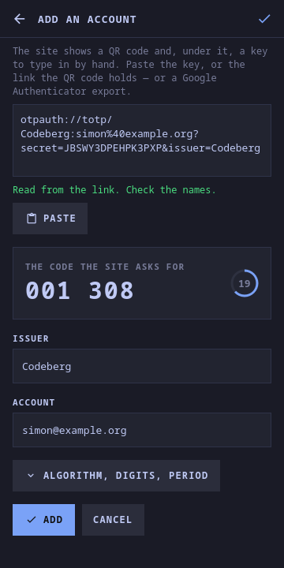

# moarchy-authenticator

The six digits two-factor sign-in asks for, one tap from the clipboard: TOTP
codes for a Linux phone and a desktop, with the keys in one file and nothing
behind it on a network.

<p align="center">
  
  
  
</p>
<p align="center">
  
</p>

<p align="center"><em>360×720, and a desktop window. One app: below 720 px a
single column, above it as many columns of cards as fit. The tiles are the
active Omarchy theme's hues, and a theme switch repaints them.</em></p>

A Quickshell app. Inside the Omarchy shell it is a panel the shell keeps
loaded, so opening it is showing a window rather than starting a process; on
any other Quickshell desktop `moarchy-authenticator` runs it as its own.

## What it does

- **Tap an account to copy its code.** That is the whole of using it. The
  ring says how long the code has left, and for the last five seconds the next
  code is beside it, so a slow login form is not a race
- **Add one from whatever the site gave you.** One box takes the key printed
  under the QR code, the `otpauth://` link inside it, several links at once,
  or Google Authenticator's "Transfer accounts" export, and says which it got
  as you type
- **The code shows before you save.** The site asks for one to confirm the
  setup; a mistyped key shows up here, as a code the site refuses, rather than
  later
- **Scan a QR code off the screen**, on a desktop: drag a box round it. Needs
  `grim`, `slurp` and `zbar`, and the button is only there when they are
- **SHA1, SHA256 and SHA512; six, seven or eight digits; any period.** Read from
  the link, or set by hand under *Algorithm, digits, period*
- **Hide codes until tapped**, for a screen other people can see
- **Show the key, or copy the link**, to move an account to another
  authenticator
- **The same key twice is skipped**, whatever it is labelled
- **Delete asks, and says why**: without the codes, the login is locked

## No library, no oathtool

QML has `Qt.md5` and nothing else. The codes here are worked out in
`Otp.js` -- SHA-1, SHA-256 and SHA-512, HMAC, and RFC 4226's truncation -- in
plain JavaScript, with SHA-512's 64-bit words as pairs of 32-bit halves. That
sounds like the part to worry about, so it is the part that is tested
hardest: `tests/tst_otp.qml` checks every row of RFC 6238's table for all three
algorithms, RFC 4226's ten HOTP values, the NIST hashes and RFC 2202/4231's
HMACs. A code wrong in one digit is a login refused with no hint why.

Speed does not come into it. A screen of codes is one HMAC per account per
thirty seconds: a code is a property bound to the *counter*, not to the clock,
and a QML property only notifies when its value changes.

## The keys

`~/.local/share/moarchy-authenticator/accounts.json`, or
`$MOARCHY_AUTHENTICATOR_DIR`:

```json
{
 "schema": 1,
 "accounts": [
  {"id": "amutqml768j80", "issuer": "GitHub", "name": "me",
   "secret": "JBSWY3DPEHPK3PXP", "algorithm": "SHA1", "digits": 6, "period": 30}
 ]
}
```

The folder is made `0700` before anything is written to it, and the file is
`0600` after every write, whatever the umask said.

**They are not encrypted.** That is a choice, not an omission. A passphrase
on the file guards it against somebody who has your unlocked session -- who
can already read your browser's passwords and its session cookies, which get
them past two-factor sign-in without a code at all. What it does not guard
against, a stolen phone or laptop, is what disk encryption is for. And it costs
the one property an authenticator must have: the code is there when you need it,
without a second thing to remember at a login prompt.

**The file is the backup.** Every field is written, defaults included, so it can
be read without knowing them, and `jq` turns it into links any other
authenticator imports:

```sh
jq -r '.accounts[] | "otpauth://totp/\(.issuer):\(.name)?secret=\(.secret)&issuer=\(.issuer)"' \
  ~/.local/share/moarchy-authenticator/accounts.json
```

A row that cannot be read is kept as found and written back, and a file that
will not parse is moved aside as `accounts.broken-<time>.json` before anything
is written over it.

## The clock

A code is the key and the time. If a site refuses every code, check that the
clock is set automatically: thirty seconds out is a different code. The window
ticks once a second while it is open, aimed at the start of each second, and
not at all while it is shut.

## What it does not do

- **No sync, and no cloud backup.** Copy the file
- **No counter-based (HOTP) codes**, and no Steam Guard codes: neither is in
  the box, and a link for one says so
- **No camera.** On a phone, paste the key or the link. The camera is Food's
  GStreamer and zbar helper, and the next thing this app could borrow

## IPC

```sh
qs ipc -c <config> call authenticator add 'otpauth://totp/...'   # how many were added
qs ipc -c <config> call authenticator code github                # the current code
qs ipc -c <config> call authenticator list
```

`code` is a script's way in: the first account with the text in its issuer or
name.

## Running it

```sh
export MOARCHY_AUTHENTICATOR_DIR=$(mktemp -d)
python3 apps/authenticator/dev/demo.py     # ten accounts, every key invented
quickshell -p apps/authenticator/shell.qml
```

## Checks

```sh
docker run --rm -v "$PWD:/src" -w /src moarchy-qml scripts/app-check.sh authenticator
docker run --rm -v "$PWD:/src" -w /src moarchy-qml scripts/app-shot.sh authenticator
```

The first is qmllint, the tests and a real run that fails on any QML warning.
The second photographs `dev/shots` at a phone's size and a desktop's, with the
clock stopped so the pictures hold still.

On a desktop: the arrows move, Enter copies, `n` adds, `e` edits, Delete
deletes after asking, `/` searches.

| variable | what it does |
|---|---|
| `MOARCHY_AUTHENTICATOR_DIR` | where the accounts live |
| `MOARCHY_AUTHENTICATOR_NOW` | stop the clock at this many seconds since 1970 |
| `MOARCHY_AUTHENTICATOR_PAGE` | `add`, to open on the add page |
| `MOARCHY_AUTHENTICATOR_ADD` | what is in the add page's box |
| `MOARCHY_AUTHENTICATOR_EDIT` | open on this issuer's account |
| `MOARCHY_AUTHENTICATOR_SEARCH` | open with this search |
| `MOARCHY_AUTHENTICATOR_HIDE` | `1`: codes hidden, and `_REVEAL=<issuer>` the one tapped |
| `MOARCHY_QUIT_AFTER` | quit after N seconds, for headless runs |

## Licence

MIT.
