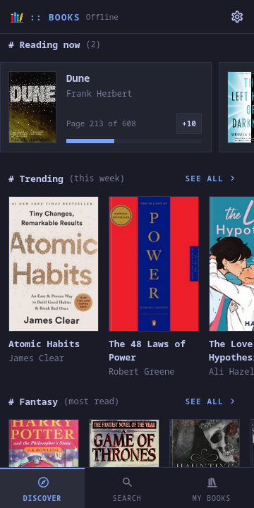
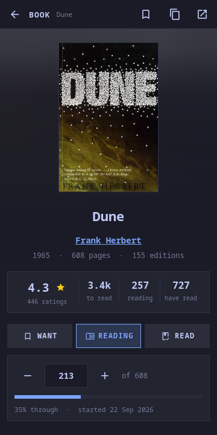
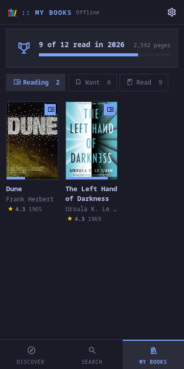
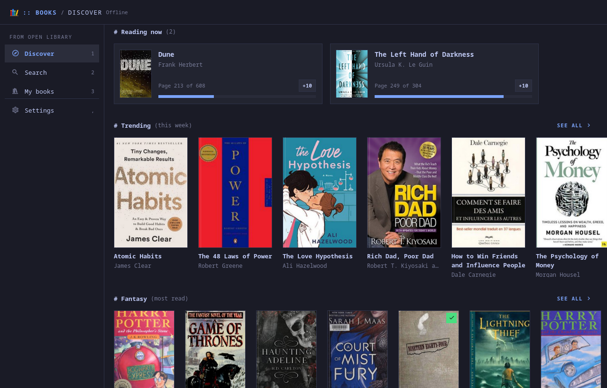
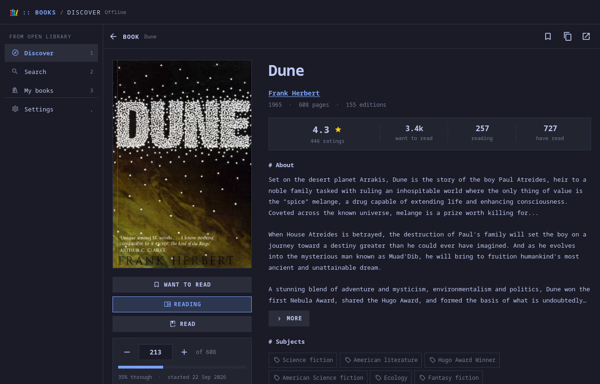
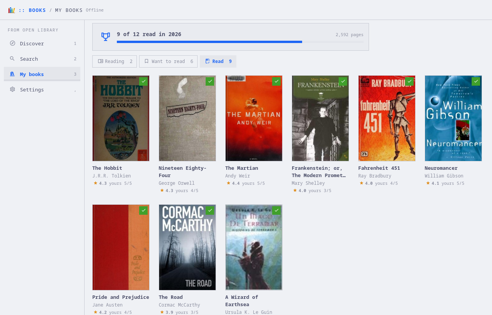

# moarchy-books

Open Library's catalogue and a reading list of your own: what its readers are
opening this week, the most-read books in fifteen subjects, search by title,
author, subject or ISBN, a page for every book and every author, and three
shelves -- want to read, reading (with the page you are on), read (with your
stars) -- counted against a goal for the year. No account, and nothing sent
anywhere but the questions.

<p align="center">
  
  
  
  
</p>
<p align="center">
  
</p>
<p align="center">
  
  
</p>

<p align="center"><em>360×720, and a desktop window. One app: below 720 px it
lays out as a phone app with the tabs at the bottom and three covers to a row;
wider, the tabs are a rail and the covers fill the width. The colours are the
active Omarchy theme's. The shots are taken offline, on answers
<code>dev/capture.py</code> recorded from Open Library, so what is on them is
what was trending that day.</em></p>

A Quickshell app. Inside the Omarchy shell it is a panel the shell keeps
loaded, so opening it is showing a window rather than starting a process; on
any other Quickshell desktop `moarchy-books` runs it as its own.

## What it does

Three tabs. On a phone they are along the bottom; on a desktop they are the
rail, and `1` to `3`.

**Discover** — what you are reading first, if anything: each book with a bar
for how far through you are and a `+10` for the pages you read on the bus.
Then shelves that scroll sideways: Trending, which is what Open Library's
readers opened this week, and the most-read books in Fantasy, Science
fiction, Mystery, Historical fiction, Classics, Horror, Romance, Young adult,
Biography, History, Science, Philosophy, Psychology, Poetry and Cooking.
"See all" is the whole shelf as a grid, a page at a time. A shelf asks for
its books when it scrolls near the screen, and they are kept, so the app
opens on books with no signal.

**Search** — Open Library's own index, as you type: books by title, author or
anything in them, or authors by name. An ISBN (from the back of the book, with
or without its dashes), an openlibrary.org link or an `OL…W` opens the book
it names. Before anything is typed, the subjects to browse.

**My books** — the three shelves, and over them the year so far: how many you
have read against the number you meant to (Settings sets it; zero hides it),
and how many pages that was.

A **book** is its cover, the title, its authors (each one a link), when it
was first published, how many pages and editions, how Open Library's readers
rated it and how many have it on a shelf; then your shelf for it -- **Want to
read**, **Reading**, **Read**; the shelf it is on, tapped again, takes it off
-- and, reading it, the page you are on, or, read, your stars. Then what it is
about, its first lines where somebody typed them in, the subjects it is filed
under (a tap is that subject's shelf), the spread of its ratings, and more by
the same author. On a phone the cover stands over a wash of its own colours
-- the smallest picture Open Library has of it, stretched, which is a blur
for nothing -- and everything runs down under it; on a desktop the cover and
your shelf are a column on the left and the book reads beside it.

An **author** is their photo, their years, their biography and every book of
theirs, most read first.

A book with no cover picture is bound in plain cloth, in one of the theme's
colours, with its title and author set on it, so a shelf on a slow connection
is a shelf of books rather than a row of grey boxes.

## Where things come from, and where they go

Open Library (the Internet Archive's open catalogue), without an account:

- `openlibrary.org/search.json` for search, a subject's shelf (sorted by how
  many people have it on a reading log) and an author's books;
  `search/authors.json` for authors; `trending/weekly.json`;
  `works/<id>.json`, with its `ratings.json` and `bookshelves.json`; and
  `authors/<id>.json`.
- `covers.openlibrary.org` for covers and photos, by number, which is not
  rate-limited.

Every request says it is Books, as Open Library asks, and there are at most
four at once. Nothing is asked while the window is closed.

Your reading list is `~/.local/share/moarchy-books/library.json`; Discover's
shelves as last seen are `discover.json` beside it. A list file that will not
parse is moved aside as `library.broken-<time>.json` rather than written over.

## Keys

| key | |
|---|---|
| `1` – `3` | Discover, Search, My books |
| `/` | Search |
| `←` `→` `↑` `↓` `Enter` | Move through a grid, open a book |
| `w` `c` `d` | On a book: want to read, currently reading, done |
| `+` `-` | Ten pages on or back, on a book you are reading |
| `o` | Open on openlibrary.org |
| `r` | Refresh |
| `,` | Settings |
| `Esc` | Back one step |

`moarchy-books <link or ISBN>` opens that book, in the running app if there is
one. From a script: `qs ipc -c <config> call books search dune`, `open
9780441013593`, `reading`, `shelf read`.

## Development

```sh
python3 apps/books/dev/capture.py     # the answers and covers the shots use
docker run --rm -v "$PWD:/src" -w /src moarchy-qml scripts/app-check.sh books
docker run --rm -v "$PWD:/src" -w /src moarchy-qml scripts/app-shot.sh books .shots/books
```

`OpenLibrary.js` is everything that reads somebody else's JSON or our own
file, and `tests/tst_books.qml` checks it with no display and no network.
