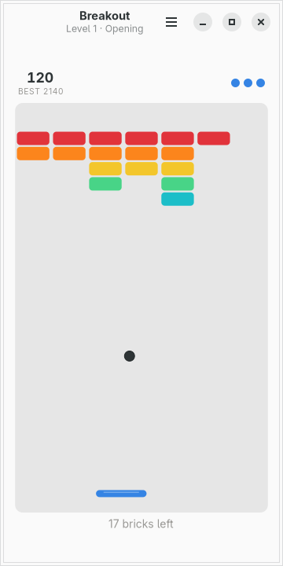
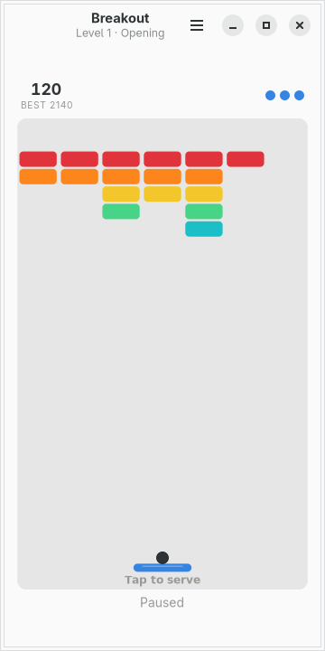
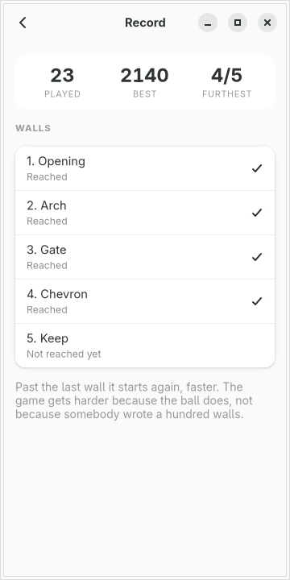

# moarchy-breakout

Breakout for a Linux phone: a bat that follows your thumb from anywhere on the
field, a wall in your theme's colours, and a frame loop that stops the moment
the window does.

<p align="center">
  
  
  
</p>

<p align="center"><em>360×720, the size of a PinePhone's screen under
mobileomarchy. The rows are the active Omarchy theme's eight hues in order, and
<code>omarchy-theme-set</code> repaints the wall mid-rally.</em></p>

Built for [mobileomarchy](https://github.com/SimonSchubert/mobileomarchy), but
nothing in it is specific to that: it is a GTK4/libadwaita app and runs on
Phosh, Plasma Mobile, postmarketOS or an ordinary desktop.

## The only app here with a clock in it

Every other game in this repository is a game of turns: nothing moves unless
somebody taps, and the hardest question is what a tap means. This one runs, and
three things follow.

**The loop stops when the window does.** A game that kept stepping while the
phone was in a pocket would be a game that lost three lives in a trouser leg,
and a tick callback that kept firing would be sixty wakeups a second for a
window nobody is looking at — which on a phone is a battery reading somebody
will blame on the wrong app. The loop is installed when this becomes the active
window and removed the moment it stops being one, and the status line says
**Paused** rather than leaving anybody to wonder.

**A frame is capped, and a frame is sliced.** The time between two frames is
whatever the compositor says it is, and after a phone wakes up it can say two
seconds — so the step is clamped at 50ms. And within that, the world cuts
whatever it is given into slices no longer than it takes the ball to travel its
own radius, because **a ball moving at a width a second crosses a brick in under
two frames.** A single step per frame tunnels straight through the wall at
exactly the moments that decide a game, and nothing about that is visible in a
screenshot, in a log, or from reading the code. It is checked by giving the
world a whole second in one call and asking whether the ball came out the other
side.

**The world is measured in widths, not pixels.** The field is one unit across
and 1.62 units tall, so every speed, size and radius is a fraction of the
screen: the game plays identically on a 360px phone and on the same window
dragged wider, and the widget's entire job is to work out one number and
multiply by it. A physics engine in pixels is a physics engine that is a
different game on every screen.

## The bat follows your thumb

Not a drag from on top of the bat, which is the desktop gesture. **A thumb
covers a 66px bat completely**, so the only playable arrangement is one where
the thumb is somewhere else — lower down, out of the way — and the bat goes
where it points. Touch anywhere on the field and the bat's middle is there;
slide and it follows.

The same press serves the ball, because a tap and the first frame of a drag are
the same gesture on a touch screen, and asking for two would mean tapping to
serve and then reaching for the bat.

There is a short pause before a ball can be served, so that the tap which ended
the last life does not launch the next one.

On a desktop the arrow keys move the bat and space serves.

## The wall

Five walls, written as art the way Peg Solitaire's figures are — a digit is a
brick and how many hits it takes, a dot is a gap:

```python
Level("chevron", "Chevron", """
3.....3
23...32
123.321
.12321.
..232..
...3...
""")
```

Past the last one it starts again, faster. That is the honest arcade answer: the
game gets harder because the ball does and because there is one more wall to
clear, not because somebody wrote a hundred walls.

**A row of bricks takes a hue each**, in the order every Omarchy theme names
them — red at the top where they are worth most, cool at the bottom. That is
what a Breakout wall has looked like since 1976 and it is the one place in this
repository where using the whole palette at once is the design rather than a
failure to choose.

Nothing is told apart by colour, though. A brick is a brick wherever it is, and
**how many hits one has left is drawn as a shape**: an inset groove inside a
brick that still needs another. Eight rows of eight hues cannot also carry
toughness without asking somebody to hold sixteen colours apart — the same rule
Five Letters follows with its corner marks and Peg Solitaire with its rings.

## The file

`~/.local/share/moarchy-breakout/breakout.json`, or `$MOARCHY_BREAKOUT_DIR`.

```json
{
 "schema": 1,
 "game": {"level": 0, "score": 120, "lives": 3, "speed": 1.02,
          "bricks": [0, 1, 1, 0, 1, 1, 1, "..."]},
 "stats": {"played": 23, "best": 2140, "furthest": 4, "cleared": 41}
}
```

**The ball is not in it.** A ball has a position and a velocity and both are
floats in the middle of a physics step; an app that saved them would come back
with a ball frozen three inches above the bat travelling left, which is not
where anybody left it and is not a state anybody can take over. So a game put
down and picked up again comes back with **the ball on the bat**. The wall is
exactly as it was, the score is exactly as it was, and the one thing given back
is the rally that was in the air — which is the only honest thing to do with
something nobody was holding.

A saved wall that does not fit the level it claims to be is thrown away and the
level dealt fresh, because the alternative is bricks on the screen that the
rules do not have.

Saving happens when something discrete happens — a life goes, a level is
cleared, the window stops being the active one — and at most once and a half
seconds during a rally. Not every frame, which would be sixty fsyncs a second.

## Running it

```sh
python3 -m moarchy_breakout
```

To see it mid-rally rather than at a full wall:

```sh
export MOARCHY_BREAKOUT_DIR=$(mktemp -d)
python3 demo.py          # a third of the wall down
python3 demo.py late     # deep into the second wall, one life gone
python3 -m moarchy_breakout
```

`demo.py` refuses to run without `MOARCHY_BREAKOUT_DIR` set. It plays a real
game with this app's own physics, because a real wall is eaten from the middle
outwards along the lines the ball has actually taken and an invented one is not.
The bat it plays with follows the ball with a lean that *changes* — two other
bats were tried and neither works. One that tracks the ball exactly sends it
straight up and down a single column forever; one that leans by a fixed amount
falls into a cycle and spends four hundred seconds missing the same four bricks.
A little noise is what a person is.

## Checks

```sh
scripts/check.sh breakout
```

ruff, then the world and the file, then the widgets on a virtual screen, then a
real run that fails on any GTK warning.

The world tests are the ones that matter, and two of them are worth naming.
**The ball never passes through the wall** is checked by aiming it at every
brick in a level and giving it a whole second in one call. And **every level can
be cleared** is checked by actually playing all five through with a bat that
follows the ball — not a claim about difficulty, but about the art: a level
nobody can finish is a level with a brick somewhere the ball cannot reach, which
is a typo in a string rather than a hard wall.

| variable | what it does |
|---|---|
| `MOARCHY_BREAKOUT_DIR` | where the game lives |
| `MOARCHY_BREAKOUT_QUIT_AFTER` | quit after N seconds, for headless runs |
| `MOARCHY_BREAKOUT_PAGE` | open straight into `record`, for the screenshots |
| `MOARCHY_BREAKOUT_SERVED` | serve, play half a second and freeze, for the screenshots |

## Licence

MIT.
