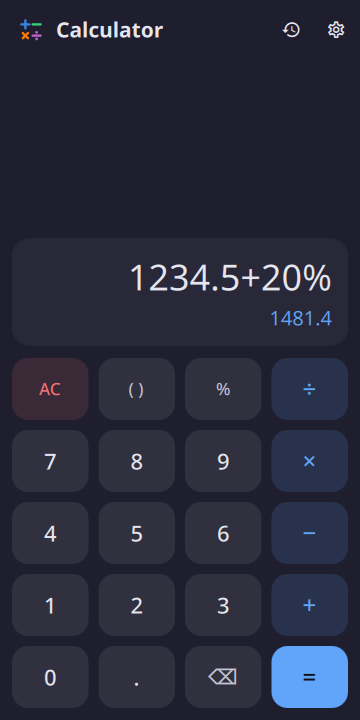
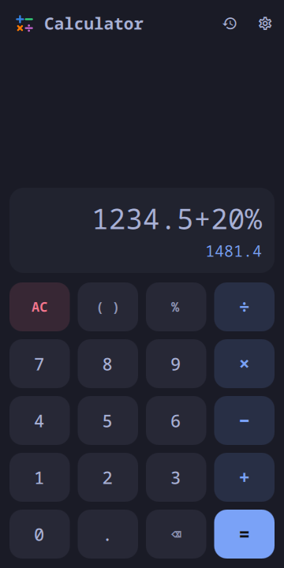
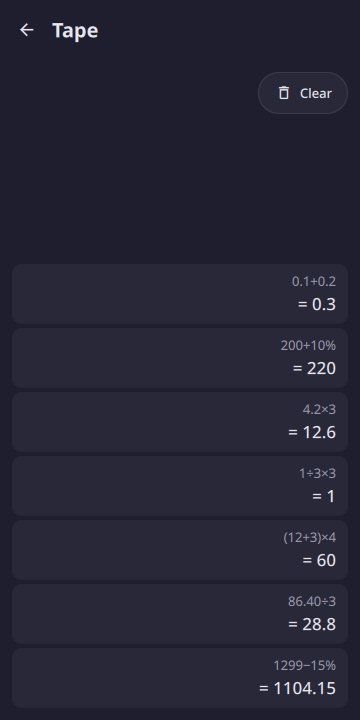
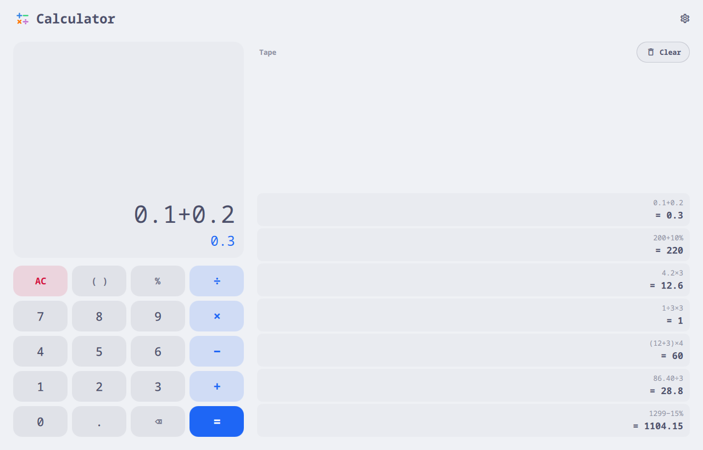

# moarchy-calculator

The four operations, a tape you can tap, and arithmetic that counts in tens.

<p align="center">
  
  
  
</p>
<p align="center">
  
</p>

<p align="center"><em>360×720, and a desktop window. One app: below 720 px
the keypad is the bottom half of a phone, above it the tape sits beside the
keys and the whole keyboard types. Every colour is the active Omarchy
theme's.</em></p>

A Quickshell app. Inside the Omarchy shell it is a panel the shell keeps
loaded, so opening it is a window becoming visible rather than a process
starting; on any other Quickshell desktop `moarchy-calculator` runs it as its
own. 0.2.0 is its first package: 0.1.0 was a shell plugin only, copied onto a
phone by hand, and this reads the file that plugin wrote.

There is no GTK calculator in this repository and there is not going to be
one. A calculator is the app the plugin argument is *about* — it is opened for
eleven seconds, several times a day, usually while somebody is holding
something else in their other hand.

## This one is not a gap either

Every app in this repository that answers a row in moarchy-store's
`docs/android-gaps.md` says so. This is not one, and the honest version is
shorter than most: GNOME has shipped a calculator for twenty-five years, it is
`gnome-calculator` in `extra`, it is adaptive, and it is better at mathematics
than this will ever be — it does bases, currencies, matrices and a hundred
functions this has no key for.

What it is not is a *phone* calculator, and two things here are:

- **The keys are 62px.** A keypad is the one surface on a phone where a slip
  costs a wrong number rather than a wrong screen, and the usual thumb floor of
  44 is a floor rather than a target. Five rows of 62 still leave a third of the
  window for the sum.
- **It starts instantly**, because it is already running. See above.

There is no scientific mode, no memory and no second page of keys behind a
toggle. Each of those is a row answering a question somebody standing at a till
does not have, and there is a `gnome-calculator` for anybody who does. Twenty
keys and one screen.

The one thing past the keypad is **the tape**: every sum `=` has answered, as
the sum and the answer, newest at the bottom the way a till roll reads. Tap a
line and its answer is back on the display to carry on from. It is the price
from ten minutes ago, which is the thing a phone calculator is most often
reopened to find. On a phone it is a page behind the button in the header; on
a desktop it is beside the keys.

## The bottom of the screen

Omarchy Mobile draws its gesture bar over the bottom of every app, and a keypad
cannot lose the middle of `=` to it. The kit knows when the phone's gesture bar
is installed and keeps its 20 px clear under the keys.

## It counts in tens

`0.1 + 0.2` in JavaScript is 0.30000000000000004, and every language with IEEE
doubles says the same thing for the same good reason. A calculator is the one
app on a phone where that is not a rounding detail to be tidied up on the way to
a label: it is a wrong answer, on the screen, in the program whose entire
product is being right about arithmetic. Rounding the display does not save it,
either — `0.1+0.2-0.3` would still come out a millionth of a millionth instead
of nought, and that is the sum people actually try.

Python's half of this repository would reach for `decimal` and the question
would not arise. QML has no decimal, so `Decimal.js` is one: a number is a sign,
a string of digits and a power of ten, and the four operations are the ones
taught at school, on strings. Add and subtract align the exponents and work
right to left with a carry; multiply accumulates partial products into a column
each and normalises once at the end; divide takes one digit at a time by
repeated subtraction. Thirty digits at a time makes all four instant — the
longest of them is nine hundred digit products, which a phone does between two
frames several thousand times over.

Thirty carried, twelve shown. The eighteen in between are guard digits, and they
are why `1 ÷ 3 × 3` comes back as 1.

## The percentages

The one piece of arithmetic every calculator is expected to get right and a good
half get wrong, because there are four answers depending on what is in front of
it:

| typed | means | answer |
|---|---|---|
| `200+10%` | ten per cent **of the 200**, added | 220 |
| `200−10%` | ten per cent of the 200, taken away | 180 |
| `200×10%` | an ordinary tenth | 20 |
| `200÷10%` | divided by a tenth | 2000 |

A percentage added to or taken from something is a percentage *of* that
something; multiplied or divided it is just a hundredth. The rule is four lines
in `Calc.js` and it deliberately does not reach one step further out —
`200+2×10%` is 200.2, because the thing being added is no longer a bare
percentage.

## The whole sum, then the answer

This is formula entry: you build `12+3×4` and the app tells you it is 24. The
four-function chain calculator would answer 60, because it applies each operator
as it is typed — which is the right design for a device with an eight-digit
display and nowhere to show what you typed, and the wrong one for a phone, which
has room. So the expression stays on the screen, × and ÷ bind tighter than + and
−, and **the running answer sits under it before `=` is ever pressed**. Most
sessions never press it.

It appears only once the sum has an operator in it: `12` under `12` is a line of
the display spent saying that twelve is twelve, and a preview that is always
there stops being read.

`=` replaces the sum with its answer, and keeps the answer to the digit rather
than to the twelve the display shows — so carrying on from it carries on from
what the arithmetic had, not from what was legible.

## A key that cannot be pressed does something instead of nothing

Typing `+` twice is not an error to reject, it is somebody changing their mind,
so the second replaces the first. A digit after `)` inserts the multiplication
that was meant. A minus straight after `×` is a sign rather than a second
operator, so `6×−2` is a sum you can type. One bracket key opens or closes by
where the sum has got to — after an operator only an open bracket can follow,
after a number only a close one can, and there is nothing in between. Pressing
`=` on `12+3×` answers 15 rather than counting brackets at you.

All of that is in `Calc.js`, and it is there so that **nothing else in the app
has to ask whether the expression is valid**. It cannot be made invalid from the
keypad, which is what lets the answer be recomputed on every keystroke.

## The file

`~/.local/share/moarchy-calculator/calculator.json`, or
`$MOARCHY_CALCULATOR_DIR`. The sum, whether it is an answer, and the tape.

```json
{
 "schema": 1,
 "entry": "1234.5+20%",
 "answered": false,
 "tape": [{"sum": "0.1+0.2", "answer": "0.3"}]
}
```

A desktop calculator is a window you leave open; a phone calculator is a thing
you are holding when somebody rings, and what happens next is that the
compositor reclaims the app without asking. Coming back to a blank screen is
what makes a phone calculator annoying, so the sum is written down — not per
keystroke, which is a write per digit onto a phone's flash, but on `=` and when
the window goes away.

`answered` is there because it cannot be worked out from the rest. The entry
comes back either from `=`, in which case it is an answer and the next digit
starts a new sum, or from the window going away mid-sum, in which case it is a
number being typed and the next digit belongs on the end of it. Both look like
`1428` in a file.

`tape` is new in 0.2.0: fifty lines at most, and the same sum answered twice in
a row is one line. A file the plugin wrote has none, and reads as an empty
tape; the plugin ignores the key.

**The file is read exactly once, at startup.** That guard is not an
optimisation. A save fires the watch on the file, and the reload hands back
what was saved — so without it, pressing `=` and carrying on typing puts the
answer back on the display a moment later and takes the new sum away with it.
It was found in a screenshot, not in a test.

A file that will not parse is moved aside as `calculator.broken-<time>.json`
before anything is written over it.

## The keyboard

On a desktop the whole keyboard types: digits, `.` or `,`, `+ - * / %`, `x`
for times, brackets, Enter or `=` to answer, Backspace to take back a key,
Delete to clear. Escape clears the sum, and a second Escape closes the window.
Ctrl+C copies the running answer, plain digits with no separators; Ctrl+V
types a pasted number through the keys, so a paste can only make a sum the
keypad could have.

The phone's back gesture does not clear the sum. It is what the app is kept
for, and a swipe that threw it away would be the annoying calculator this is
not.

## Running it

```sh
quickshell -p apps/calculator/shell.qml
MOARCHY_CALCULATOR_TYPED=1234.5+20% quickshell -p apps/calculator/shell.qml
```

## Checks

```sh
docker run --rm -v "$PWD:/src" -w /src moarchy-qml scripts/app-check.sh calculator
docker run --rm -v "$PWD:/src" -w /src moarchy-qml scripts/app-shot.sh calculator
```

The first is qmllint with every warning fatal, the three test files, and a real
run that fails on any QML diagnostic. The second photographs `dev/shots` at a
phone's size and a desktop's.

The tests are worth more here than in most apps, because the thing being tested
has a right answer that predates the app. `tst_decimal.qml` is the arithmetic
against sums a person would write down; `tst_calc.qml` is the four percentage
readings and every key that has to do something sensible with a keypress that
makes no sense; `tst_store.qml` is a file that has been edited by hand, and the
tape.

| variable | what it does |
|---|---|
| `MOARCHY_CALCULATOR_DIR` | where the sum and the tape are kept |
| `MOARCHY_CALCULATOR_TYPED` | keys to press on arrival, for the screenshots |
| `MOARCHY_CALCULATOR_PAGE` | `tape`: open on the tape, on a phone |
| `MOARCHY_QUIT_AFTER` | quit after N seconds, for headless runs |

The IPC handler (`quickshell ipc call calculator key|keys|sum|answer`) drives
the app through the keys, the way a thumb does.

## Licence

MIT.
