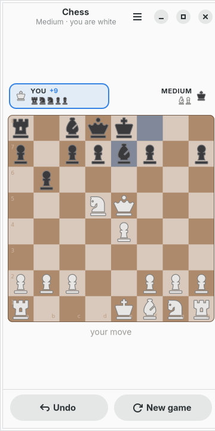
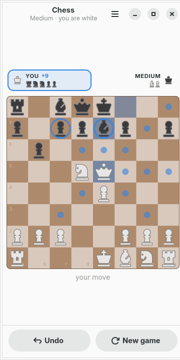
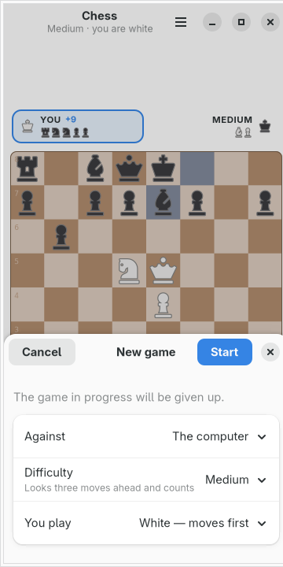
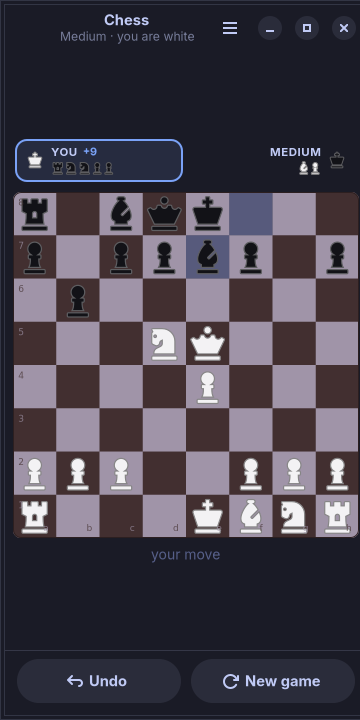
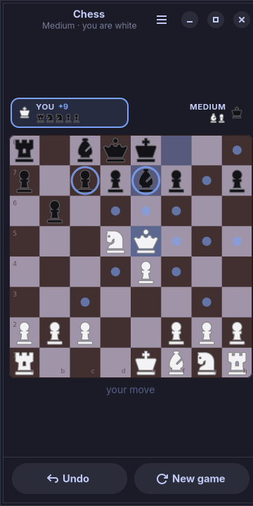

# moarchy-chess

Chess for a Linux phone: a board that fits a 360px screen, an opponent that
lives in the app and answers on a clock, and a game that survives being killed.

<p align="center">
  
  
  
</p>

<p align="center"><em>360×720, the size of a PinePhone's screen under
mobileomarchy. The board is not the app's own brown — it is the active Omarchy
theme's, and <code>omarchy-theme-set</code> repaints it while the game is on the
screen.</em></p>

Built for [mobileomarchy](https://github.com/SimonSchubert/mobileomarchy), but
nothing in it is specific to that: it is a GTK4/libadwaita app and runs on
Phosh, Plasma Mobile, postmarketOS or an ordinary desktop.

## This one is not a gap either

Every app in this repo except Reversi answers a row in moarchy-store's
`docs/android-gaps.md` — something with a good implementation on F-Droid and no
Linux answer anywhere. Chess is not one of those. GNOME has shipped Chess for
twenty years and it is `gnome-chess` in `extra`.

What it is not is a phone app, and the gap this fills is that one:

- **It is drawn for 360px.** Eight squares of 43px across the short edge, with
  the board, the two players and the status as one block, and every control
  that belongs to the game in a bar along the bottom where a thumb already is.
- **The opponent is in the app.** `pacman -Si gnome-chess` lists `gnuchess` as
  an *optional* dependency — "Play against computer" — so the board you install
  has nobody in it until you install a second package and find the menu that
  points at it. The search here is two hundred lines of Python in the same
  process; there is one package, and it plays.
- **The opponent is on a clock, not on a depth.** On a phone the question is
  never "how deep" but "how long", and those are the same question only on the
  machine you tuned it on.
- **A move is two taps, not a drag.** Dragging a 43px square with a thumb over
  it is a gesture that ends where the finger was and not where the eye was.
- **It expects to be killed.** Phones do not close apps, they reclaim them. The
  game is written to the file on every move and picked up mid-search on the way
  back in.
- **It is the phone's colours.** Both squares are the theme's brown, and a
  theme change repaints them in place.

Whether GNOME Chess is usable at 360px is a question for moarchy-store's sweep,
which scores packages on exactly that and is the right place for the answer.
This is not an argument that it is not — it is an app written to a different
brief.

## What it does

- **Tap a piece, then tap a square.** The squares it may go to are dotted and
  the pieces it may take are ringed, because a touch screen is not a place to
  find out by being refused
- **Everything is in there**: castling both sides, en passant, promotion to any
  of four pieces, stalemate, the fifty-move rule, threefold repetition and the
  three draws by insufficient material
- **Check is said twice** — the king's square goes red and the line under the
  board says so — because one of those is read at arm's length and the other is
  not
- **Three levels**, and the easy one genuinely errs rather than being a strong
  opponent with less to think with
- **Two players on one phone**, passing it across a table, with no computer and
  nothing recorded
- **Undo gives you your turn back** — the computer's reply and your move, not
  one ply — because the misplaced tap is the ordinary case on a bus
- **The board turns round** when you play Black, because every pattern anybody
  has ever learned is mirrored on a board seen from the wrong end
- **What each side has taken** sits above the board, with the material lead, so
  "am I winning" is answered by looking
- **A record** of games against the computer, by difficulty
- **Everything local.** One JSON file, no account, no network code in the app

## The phone's colours

<p align="center">
  
  
</p>

The same game under `tokyo-night`. A chessboard is one hue in two strengths, so
both squares are the theme's brown — the dark one laid into the theme's
background and the light one into its foreground, which is what keeps the pair
apart from each other and moves them together when the theme flips. The dots,
the rings and the last move are the theme's accent, and the king in check is its
red. So `omarchy-theme-set` repaints the board while the game is on the screen,
the way it repaints the bar and the keyboard.

The pieces are the one thing that does not become a hue of the theme. Two
theme colours is the kind of theming that looks good in a screenshot and fails
in daylight, for the eight percent of men who cannot tell the popular pair
apart, and at 43px. Dark against light survives all three, so the pieces take a
tint from the theme and keep their contrast.

## The pieces

They are Font Awesome Free's chess icons — CC BY 4.0 — which is where the
`ic_chess_*.xml` drawables in [Braincup](https://github.com/SimonSchubert/Braincup)
come from too, so the phone and the Android app draw the same six shapes.

What is in `pieces.py` is the single SVG path out of each of those files and a
small reader that turns it into move/line/curve instructions, with elliptical
arcs converted to Béziers on the way past. That is a hundred and fifty lines
written rather than avoided, and the reason is what "load an SVG" means on this
stack: librsvg, through a gdk-pixbuf loader that may or may not be installed, to
produce a texture that then has to be recoloured per side and rescaled per
screen — a runtime dependency, and a failure mode that draws a broken-image
glyph rather than raising. The board is already a cairo drawing area for
Reversi's reasons. A path it can fill is the thing it actually wants.

The conversion is checked rather than trusted: `tests/test_pieces.py` asserts
that all six parse, that each lands inside the box the board scales it by, and
that the reader handles the awkward corners of the format — smooth curves,
implied linetos, and arc flags packed against the coordinate that follows them.

## The opponent

Alpha-beta with a quiescence search, and the evaluation is a port of
[Braincup](https://github.com/SimonSchubert/Braincup)'s `NormalChessAi`: the
same piece values, the same piece-square tables, the same MVV/LVA move ordering,
and the same deliberate beginner's blunder that makes Easy easy. What is
different is everything about when it stops, and that difference is the phone.

**The depth is not decided in advance.** Braincup names a depth per difficulty,
which is the right answer on a machine you can measure. Here the machine is a
PinePhone or a laptop and they are two orders of magnitude apart, so every level
names a number of *seconds* and a ceiling, and the search deepens a ply at a
time until one of them runs out. The same "Hard" is a five-ply opponent on a
laptop and a three-ply one on a PinePhone, and neither leaves somebody holding a
phone that has stopped answering.

**Nothing builds a board.** The search plays moves into the one position it was
given and takes them back out, and carries its evaluation along as an integer it
adjusts by the move it just played rather than recomputing over sixty-four
squares at every leaf. Copying an 8×8 board per node — which is the obvious
implementation, and Braincup's — costs a list allocation and sixty-four writes,
and on an A53 that copying alone is the whole time budget.

**Easy is easy on purpose.** It searches shallowly, it does not follow capture
chains past the horizon — so it does not see the recapture and trades away
pieces it should not — and about one move in five it plays something at random
instead of what it found. Never while in check, where a random move reads as
broken rather than as casual. Searching less deeply on its own does not make an
opponent *weaker* so much as differently blind: a one-ply engine still takes
every free piece and never leaves one hanging, which is not how a beginner plays
and not what anybody wants out of Easy.

**It can finish.** Below six pieces the middlegame king table is taken back off
and replaced with the two numbers that are king-and-rook technique — push their
king towards a corner, walk ours up to it. Without that, a won rook ending is
shuffled into the fifty-move rule, which is the most visible thing a weak engine
does; `tests/test_ai.py` plays both endings out and fails if either stops
mating.

**Nothing is searched while anything is moving.** The order after a tap is

```
tap -> pick up -> tap -> play -> animate -> settled -> think -> play -> ...
```

and the search does not start until the piece has stopped. That is not
politeness, it is CPython: the search is a Python thread and holds the GIL, so a
search running under an animation turns a 190ms slide into a slideshow. It costs
a fifth of a second that is being spent watching the slide anyway.

All of it lives in `chess.py` and `ai.py`, which import no GTK, so the rules and
the opponent are covered by tests rather than by a screenshot.

## The file

`~/.local/share/moarchy-chess/chess.json`, or `$MOARCHY_CHESS_DIR` if set.

What is stored is the **move list**, not the board, written the way people write
moves:

```json
{
 "schema": 1,
 "game": {"mode": "solo", "level": "medium", "human": "white",
          "finished": false,
          "moves": ["e2e4", "e7e5", "g1f3", "b8c6", "f1b5"]},
 "stats": {"medium": {"played": 11, "won": 4, "lost": 6, "drawn": 0,
                      "quickest": 28}}
}
```

Sixty small strings replay to exactly one position in microseconds, and that has
a property a stored board cannot have: **a file that has been truncated, edited
or half-written cannot describe a board that legal play could not reach, because
loading it is playing it.** A move that will not parse, or will not play, is
where the file stops being a game, and the rest of it goes. Writing them as
`e2e4` rather than as packed integers costs four bytes a move and buys a file
anybody can read, and a game that can be pasted into any other chess program.

Writes go through a temp file, an fsync and a rename, and they happen on every
move rather than on a timer. Habits debounces because a thumb can tick five
marks in a row; a move here is seconds of thinking apart at the very least, and
on a phone the app is not closed, it is killed.

## Running it

```sh
python3 -m moarchy_chess
```

To see it with a game in progress rather than an opening:

```sh
export MOARCHY_CHESS_DIR=$(mktemp -d)
python3 demo.py
python3 -m moarchy_chess
```

`demo.py` refuses to run without `MOARCHY_CHESS_DIR` set, so it cannot overwrite
a real game. It plays a real one with the search this app ships rather than
arranging pieces, because a hand-placed board is the app telling a lie about its
own rules — and far more people will look at a picture of a chessboard and know.

## Checks

```sh
scripts/check.sh chess
```

ruff, then the rules, the pieces, the search and the file, then the widgets on a
virtual screen, then a real run that fails on any GTK warning.

The rules are checked by **perft**: play every legal move to a fixed depth and
count the leaves, against the positions the chess programming community keeps
for exactly this. From the opening that is 197,281 positions at four ply, and
the other five are chosen to be awkward — one dense with castling and pins, one
whose en passant captures are illegal because of a discovered check along the
rank, one full of promotions. A single wrong number there is a rule that is
wrong somewhere, and no ordinary test finds the ones nobody thought of.

The real run is the other one that matters: a layout error is not an exception —
the app starts, the window appears, and one widget is the wrong size, with a
single line on stderr as the only sign. The screenshots are the rest of it, and
are what caught the rank numbers down the left edge being drawn in the colour of
the square they were standing on.

`scripts/icon-lint.py` runs over every app's icon, and exists because neither of
the two things it checks is visible from here. An icon has to be well-formed XML
— Reversi's was not, and librsvg had been refusing to draw it — and it cannot
use a clip path, because the drawer renders with QtSvg, which ignores
`clip-path` and *paints* a `<clipPath>` declared outside `<defs>`. The first
version of this app's icon did both, and drew as a black square with a knight on
it on any phone whose image does not carry omarchy-mobile's repair hook.

| variable | what it does |
|---|---|
| `MOARCHY_CHESS_DIR` | where the game lives |
| `MOARCHY_CHESS_QUIT_AFTER` | quit after N seconds, for headless runs |
| `MOARCHY_CHESS_PAGE` | open straight into `record`, for the screenshots |
| `MOARCHY_CHESS_NEW` | open with the new-game sheet up |
| `MOARCHY_CHESS_SELECT` | open with a piece picked up: a square, or `auto` |

## Licence

MIT, except the six piece outlines in `moarchy_chess/pieces.py`, which are Font
Awesome Free's and are [CC BY 4.0](https://fontawesome.com/license/free).
