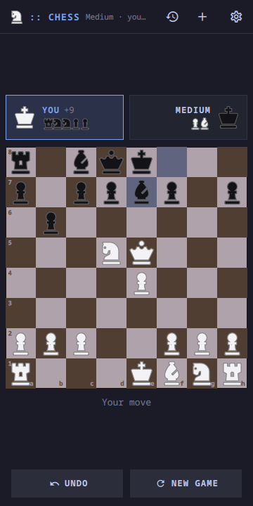
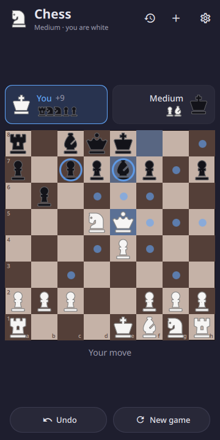
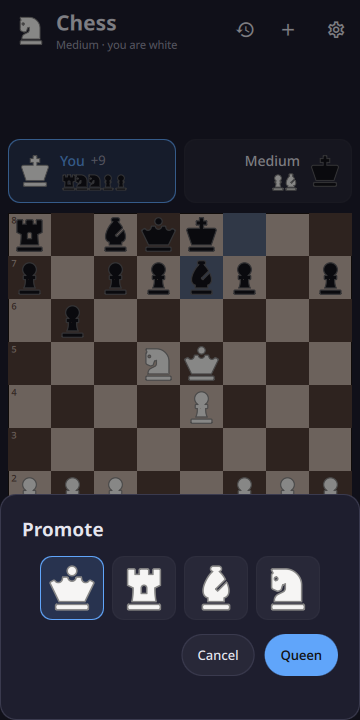
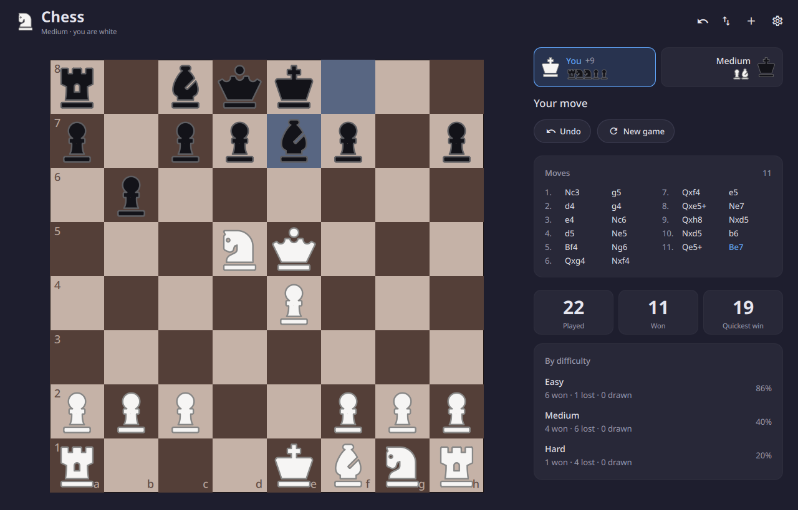

# moarchy-chess

Chess for a phone and a desktop: a board that fits a 360px screen, an opponent
that lives in the app and answers on a clock, and a game that survives being
killed.

<p align="center">
  
  
  
</p>
<p align="center">
  
</p>

<p align="center"><em>360×720, and a desktop window. One app: below 720 px it
lays out as a phone app, above it the moves and the record sit beside the
board. The squares are the active Omarchy theme's, and a theme switch repaints
them while the game is on the screen.</em></p>

A Quickshell app. Inside the Omarchy shell it is a panel the shell keeps
loaded, so opening it is showing a window rather than starting a process; on
any other Quickshell desktop `moarchy-chess` runs it as its own. 0.1.0 was a
GTK4/libadwaita app, and a game left in it is the game found here: the file is
the same.

## This one is not a gap either

Every app in this repo except Reversi answers a row in moarchy-store's
`docs/android-gaps.md` — something with a good implementation on F-Droid and no
Linux answer anywhere. Chess is not one of those. GNOME has shipped Chess for
twenty years and it is `gnome-chess` in `extra`.

What it is not is a phone app, and the gap this fills is that one:

- **It is drawn for 360px.** Eight squares of 43px across the short edge, with
  the board, the two players and the status as one block, and every control
  that belongs to the game along the bottom where a thumb already is.
- **The opponent is in the app.** `pacman -Si gnome-chess` lists `gnuchess` as
  an *optional* dependency — "Play against computer" — so the board you install
  has nobody in it until you install a second package. The search here is a few
  hundred lines of JavaScript on a worker thread of the same process; there is
  one package, and it plays.
- **The opponent is on a clock, not on a depth.** On a phone the question is
  never "how deep" but "how long".
- **A move is two taps, not a drag.** Dragging a 43px square with a thumb over
  it is a gesture that ends where the finger was and not where the eye was.
- **It expects to be killed.** The game is written to the file on every move and
  picked up mid-search on the way back in.
- **It is the theme's colours.** Both squares are the theme's brown, and a
  theme change repaints them in place.

## What it does

- **Tap a piece, then tap a square.** The squares it may go to are dotted and
  the pieces it may take are ringed, because a touch screen is not a place to
  find out by being refused. Tapping the piece in hand puts it down, and so
  does Back
- **Everything is in there**: castling both sides, en passant, promotion to any
  of four pieces, stalemate, the fifty-move rule, threefold repetition and the
  three draws by insufficient material
- **Check is said twice** — the king's square goes red and the line under the
  board says so
- **Three levels**, and the easy one genuinely errs rather than being a strong
  opponent with less to think with
- **Two players on one phone**, passing it across a table, with nothing recorded
- **Undo gives you your turn back** — the computer's reply and your move, not
  one ply — because the misplaced tap is the ordinary case on a bus
- **The board turns round** when you play Black, and by hand with `f` or the
  button on a desktop
- **What each side has taken** sits beside each player, with the material lead
- **On a desktop, the moves written down** — `Nf3`, `exd5`, `O-O`, `Qxf7#` — and
  the keyboard: arrows move over the board, Enter picks up and puts down, `u`
  undoes, `n` starts a new game
- **A record** of games against the computer, by difficulty, and the quickest win
- **Everything local.** One JSON file, no account, no network code in the app

## The theme's colours

A chessboard is one hue in two strengths, so both squares are the theme's brown
(GNOME's where the theme names none) laid over the palest colour the theme has
— its text on a dark theme, its background on a light one — which keeps the
pair apart and never turns the board into a negative of itself. The dots, the
rings and the last move are the theme's accent, and the king in check is its
red.

The pieces are the one thing that does not become a hue of the theme. Two theme
colours is the kind of theming that looks good in a screenshot and fails in
daylight, for the eight percent of men who cannot tell the popular pair apart,
and at 43px. Dark against light survives all three, so the pieces take a tint
from the theme and keep their contrast.

## The pieces

They are Font Awesome Free's chess icons — CC BY 4.0 — which is where the
`ic_chess_*.xml` drawables in [Braincup](https://github.com/SimonSchubert/Braincup)
come from too, so the phone and the Android app draw the same six shapes.
`Pieces.js` is the single SVG path out of each of those files, and Qt's
`PathSvg` draws it — filled, and rimmed, because a white piece on a light
square is a shape of nearly the board's own colour and at 43px the outline is
most of what separates them. 0.1.0 carried a hundred and fifty lines of SVG
path reader for cairo; that reader, and its tests, went with it.

## The opponent

Alpha-beta with a quiescence search, and the evaluation is a port of
[Braincup](https://github.com/SimonSchubert/Braincup)'s `NormalChessAi`: the
same piece values, the same piece-square tables, the same MVV/LVA move ordering,
and the same deliberate beginner's blunder that makes Easy easy. `Ai.js` is
0.1.0's `ai.py`, line for line.

**The depth is not decided in advance.** Every level names a number of
*seconds* and a ceiling, and the search deepens a ply at a time until one of
them runs out. The same "Hard" is a five-ply opponent on a laptop and a
three-ply one on a PinePhone, and neither leaves somebody holding a phone that
has stopped answering.

**Nothing builds a board.** The search plays moves into the one position it was
given and takes them back out, and carries its evaluation along as an integer it
adjusts by the move it just played rather than recomputing over sixty-four
squares at every leaf.

**Easy is easy on purpose.** It searches shallowly, it does not follow capture
chains past the horizon, and about one move in five it plays something at random
instead of what it found. Never while in check, where a random move reads as
broken rather than as casual.

**It can finish.** Below six pieces the middlegame king table is taken back off
and replaced with king-and-rook technique — push their king towards a corner,
walk ours up to it. `tests/tst_ai.qml` plays both endings out and fails if
either stops mating.

**It runs off the UI thread.** The search is a `WorkerScript` (`search.js`), so
the board keeps sliding while the computer thinks. A worker cannot be
interrupted, so an answer carries the generation it was asked under, and one for
a board that has since been taken back or restarted is dropped. Nothing thinks
with the window shut.

## The file

`~/.local/share/moarchy-chess/chess.json`, or `$MOARCHY_CHESS_DIR` if set.

What is stored is the **move list**, not the board, written the way people write
moves:

```json
{
 "schema": 1,
 "game": {"mode": "solo", "level": "medium", "human": "white",
          "finished": false,
          "moves": ["e2e4", "e7e5", "g1f3", "b8c6", "f1b5"]},
 "stats": {"medium": {"played": 11, "won": 4, "lost": 6, "drawn": 0,
                      "quickest": 28}}
}
```

**A file that has been truncated, edited or half-written cannot describe a board
that legal play could not reach, because loading it is playing it.** A move that
will not parse, or will not play, is where the file stops being a game, and the
rest of it goes. Writing them as `e2e4` buys a file anybody can read, and a game
that can be pasted into any other chess program.

It is written on every move, through a temp file and a rename. A file that will
not parse is moved aside as `chess.broken-<time>.json` before anything is
written over it.

## Running it

```sh
quickshell -p apps/chess/shell.qml
```

With a game in progress rather than an opening:

```sh
export MOARCHY_CHESS_DIR=$(mktemp -d)
python3 apps/chess/dev/demo.py          # the game in progress, White to move
python3 apps/chess/dev/demo.py mate     # ...or a short one you have won
quickshell -p apps/chess/shell.qml
```

`demo.py` refuses to run without `MOARCHY_CHESS_DIR` set. The game in it was
played by 0.1.0's own opponent rather than arranged, because a hand-placed board
is the app telling a lie about its own rules.

## Checks

```sh
docker run --rm -v "$PWD:/src" -w /src moarchy-qml scripts/app-check.sh chess
docker run --rm -v "$PWD:/src" -w /src moarchy-qml scripts/app-shot.sh chess
```

The first is qmllint, the rules, the opponent and the file — 0.1.0's Python
tests, case for case, in `tests/` — and a real run that fails on any QML
warning. The second photographs `dev/shots` at a phone's size and a desktop's.

The rules are checked by **perft**: play every legal move to a fixed depth and
count the leaves, against the positions the chess programming community keeps
for exactly this. From the opening that is 197,281 positions at four ply, and
the other four are chosen to be awkward — one dense with castling and pins, one
whose en passant captures are illegal because of a discovered check along the
rank, one full of promotions. A single wrong number there is a rule that is
wrong somewhere, and no ordinary test finds the ones nobody thought of.

| variable | what it does |
|---|---|
| `MOARCHY_CHESS_DIR` | where the game lives |
| `MOARCHY_QUIT_AFTER` | quit after N seconds, for headless runs |
| `MOARCHY_CHESS_PAGE` | open straight into `record`, for the screenshots |
| `MOARCHY_CHESS_NEW` | open with the new-game sheet up |
| `MOARCHY_CHESS_PROMOTE` | open with the promotion sheet up |
| `MOARCHY_CHESS_SELECT` | open with a piece picked up: a square, or `auto` |
| `MOARCHY_CHESS_SETTINGS` | open on Settings |

## Licence

MIT.
