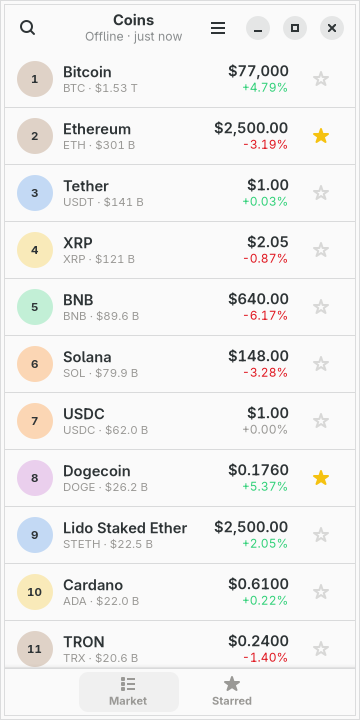
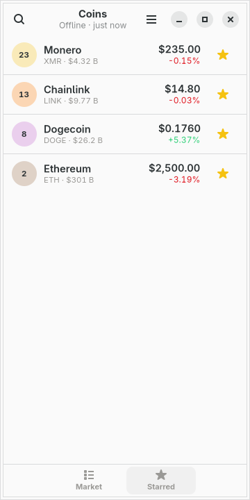
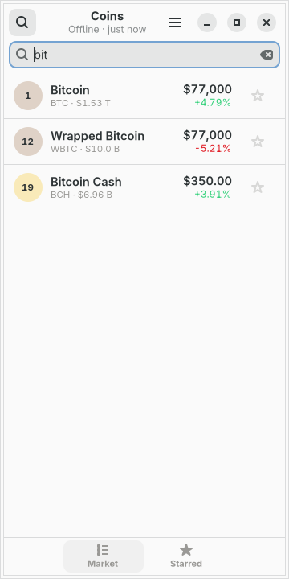

# moarchy-coins

A coin tracker for a Linux phone: the top hundred by market capitalisation, the
few you star kept on their own page, and a price column that is readable whether
the coin costs seventy-seven thousand dollars or a hundredth of a cent.

<p align="center">
  
  
  
</p>

<p align="center"><em>360×720, the size of a PinePhone's screen under
mobileomarchy. The colours are not the app's own — they are the active Omarchy
theme's, and <code>omarchy-theme-set</code> repaints the list while it is on the
screen. The prices in these pictures are invented: the shots are taken offline
against <code>demo.py</code>, which is the only reason two of them agree.</em></p>

Built for [mobileomarchy](https://github.com/SimonSchubert/mobileomarchy), but
nothing in it is specific to that: it is a GTK4/libadwaita app that makes one
HTTPS request, and it runs on Phosh, Plasma Mobile, postmarketOS or an ordinary
desktop.

## This one is not on the list

Every app in this repo either answers a row in moarchy-store's
`docs/android-gaps.md` or says plainly that it does not. This one does not —
that list is drawn from F-Droid's catalogue filtered by translation count,
screenshots and release history, and no coin tracker survived the filter.

What is true is that the probe the list describes comes back empty when it is
pointed at this job. Run by hand on 2026-09-13 against the same three sets:

- **the Arch repos** (which the aarch64 ones track): nothing. The nearest thing
  is `tickrs`, *"realtime ticker data in your terminal"* — which is the same
  answer the catalogue gives for system monitors, and the same problem: on a
  phone it means opening a terminal on a keyboard that covers half the screen.
- **the AUR**: `cryptowatch-desktop-bin` (10 votes), a desktop charting and
  trading terminal, and `cryptofetch` (0 votes), which prints prices the way
  neofetch prints a logo. An AUR package is in no sync database, so the store's
  helper cannot install either of them at all.
- **Flathub**: wallets. Exodus, Electrum, Bitcoin-Safe, a Monero miner. Every
  one of them is somewhere to *keep* coins, which is a different and much more
  dangerous thing than somewhere to look at what they cost.

So the gap this fills is narrow and worth stating as narrowly as it is: a
glanceable list at 360px, a watchlist a thumb can reach without scrolling past a
hundred rows, the phone's own colours, and nothing installed beyond the GUI
stack that is already there.

## What it does

Two pages, and the switcher is along the bottom where a thumb already is.

**Market** — the top hundred coins by market capitalisation:

- rank, name, symbol and market cap, the price, and the day as a signed
  percentage in the theme's green or red
- a **price column that adapts**: `$77,000` has no cents worth reading and
  `$0.00001190` is four significant figures that all sit past the fourth decimal
  place. A fixed two decimals draws every meme coin as `$0.00`
- search by name or symbol, from the front — so `bit` finds Bitcoin rather than
  putting Wrapped Bitcoin above it

**Starred** — the same rows, for the coins you tapped a star on:

- in **the order you starred them**, not by rank. A watchlist sorted by market
  cap reorders itself under a thumb that is halfway down it, and the ordering a
  person can actually control — without a drag handle this app has no room for —
  is when they added each one
- a star is written to disk before the tap is over, because the next thing that
  happens to a phone app is usually being killed
- a starred coin that falls out of the top hundred is asked for **by name** on
  the next refresh, so a watchlist never quietly shows last week's price

## Where the numbers come from

[CoinGecko](https://www.coingecko.com)'s public API, one `GET` of
`/coins/markets` a minute at most, on a thread. That is the whole of the
network in this app, and every number on screen comes out of that one answer.

- **No account and no key.** The keyless tier is rate-limited per address at
  somewhere around five to fifteen calls a minute, shared with everybody behind
  the same carrier NAT, so a 429 is an ordinary answer rather than an error: the
  app waits as long as the answer asked it to, or two minutes if it did not say.
  `MOARCHY_COINS_KEY` sends a demo key for anybody who has registered one.
- **A failure leaves the prices alone.** Prices from four minutes ago are worth
  something and a blank page is worth nothing, so a refresh that fails keeps the
  list, says `Not updating · 4 min ago` in the header, and backs off — one
  minute, then two and a half, then five, then ten. The only screen that says
  nothing is the one that has never had anything to say.
- **The clock stops when the window leaves the screen.** An app that keeps
  pulling prices after the phone is in a pocket is a battery bug and a data bill
  wearing a feature's clothes, and on a phone the app is not closed, it is
  hidden.
- **It opens on prices.** The last answer is cached, so a launch on a train with
  no signal shows the market as of whenever it last had one, with its age in the
  header rather than a spinner.

## What leaves the phone

One HTTPS request, to one host, with no cookie, no account and nothing in it but
the currency and how many coins to send back.

The exception is worth saying out loud: when a coin you have starred has fallen
out of the top hundred, its id is sent in a second request, because there is no
other way to ask what it costs. That is the only circumstance in which anything
about *your* list leaves the device, and it is why the app does not fetch coin
logos — a hundred images from a CDN would tell that CDN which coins you watch,
every minute, for pictures 24 pixels wide. The rank sits in a coloured disc
instead, and the colour comes from the coin's id.

There is no wallet, no portfolio, no amount and no address. The app knows which
coins you watch and nothing whatever about what you hold, which is a deliberate
limit rather than a missing feature — see below.

## The phone's colours

Up is the theme's green and down is its red, and neither is ever alone: every
figure drawn in them carries its own sign, because roughly one man in twelve
cannot tell those two colours apart. The colour is what makes a hundred rows
scannable; the sign is what makes them readable. A day that rounds to `+0.00%`
is drawn in neither — a plus sign in green over a number that has not moved is a
claim the figure beside it does not make.

Nothing in this app is drawn with cairo. No graph, no sparkline, no logo, so
every figure on screen is a label — which means it scales with the phone's font
size, ellipsizes when a name is too long, and is read out by a screen reader.
That is also why the package does not depend on `python-cairo` the way Vitals
does.

## What is deliberately not in it

- **A portfolio.** "How much is my Bitcoin worth" needs an amount, which is the
  step that turns a thing you glance at into a thing you keep records in, on a
  phone, in a plain file. If it is ever added it needs to be a decision rather
  than a drift.
- **A seven-day chart.** The sparkline is 168 hourly prices *per coin* — seven
  times the size of everything else in the answer put together — on a connection
  that is metered. A detail page that asks for one coin's history when you open
  that coin would be the honest way to do it, and is the obvious next thing.
- **Coin logos.** See above: a hundred CDN requests a minute that describe your
  watchlist.
- **A currency picker.** The app prices everything in US dollars unless
  `MOARCHY_COINS_CURRENCY` says otherwise; every formatter takes the code rather
  than assuming the dollar, so the picker is a menu and a saved setting, not a
  rewrite.
- **Alerts.** A price notification is a background service, and this app has no
  process when it is not on screen. That is the property that keeps it free.

## Working on it

```sh
scripts/check.sh coins                  # ruff, the tests, and a real run at 360x720
scripts/screenshot.sh coins             # the pictures above

# Does the search box raise the phone's keyboard? The probe has to be told how
# to open something typable, and in this app that is the search bar:
PROBE_ENV=MOARCHY_COINS_SEARCH= scripts/text-input-check.sh coins
```

That last one is worth a caveat: in the dev container the harness's own control
— a window whose entire content is a `Gtk.TextView` — reports no `enable` either,
which by the script's own rule means the harness rather than the app. Coins
behaves exactly as the control does there, and opening the search bar puts the
cursor in it, which is the half that is this app's to get right.

No test here opens a socket, and neither does a check run. `market.py` and
`store.py` import no GTK at all, so parsing somebody else's JSON and formatting
a price are tested on any machine with a Python; the window is handed a source
object rather than making one, so the UI tests hand it a stand-in; and
`demo.py` writes a cache seconds old, which is why the real run has nothing to
fetch.

| variable | what it does |
|---|---|
| `MOARCHY_COINS_DIR` | where the stars and the cached prices live |
| `MOARCHY_COINS_CURRENCY` | what to price them in; `usd` unless said otherwise |
| `MOARCHY_COINS_KEY` | a CoinGecko demo key, sent as `x-cg-demo-api-key` |
| `MOARCHY_COINS_OFFLINE` | never touch the network; show what is cached |
| `MOARCHY_COINS_PAGE` | open on `market` or `favourites` |
| `MOARCHY_COINS_SEARCH` | open with the search box up, and this in it |
| `MOARCHY_COINS_QUIT_AFTER` | quit after N seconds, for the headless checks |

## Where to get it

Three channels, the same as every app here, and `docs/publishing.md` is the
table of which one this has actually reached — `git grep` cannot tell you that.

```sh
# the phone, through the signed repo the store's helper can install from
sudo pacman -S moarchy-coins

# anyone else on Arch or Arch Linux ARM
paru -S moarchy-coins
```

0.1.1 is the first version worth installing. 0.1.0 drew the rank column
straight from CoinGecko's `market_cap_rank`, which on 2026-09-14 came back with
Figure Heloc and Zcash both at 9 — correctly ordered by capitalisation, and
numbered 8, 9, 9, 10 on screen, which reads as a broken app rather than as a
quirk of somebody else's field. The list is ordered by market cap because this
app asked for it that way, so the position in it is now the rank: it cannot
repeat and it cannot skip. A coin fetched by name, which has no position, still
draws the rank it reports.

## Licence

MIT. Market data from CoinGecko, whose terms are their own.
