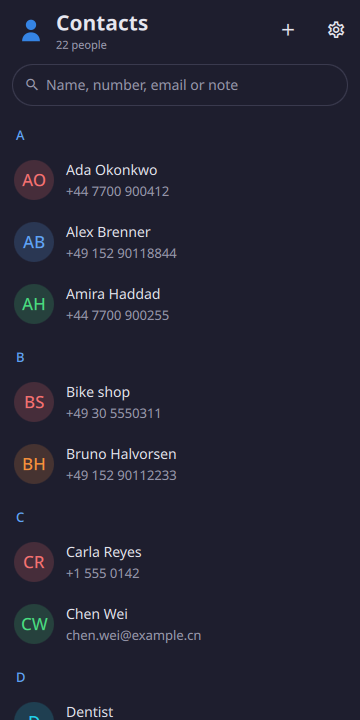
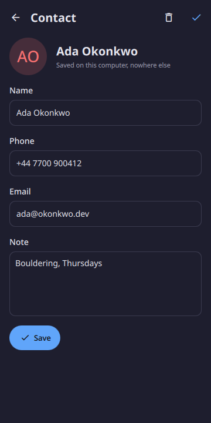
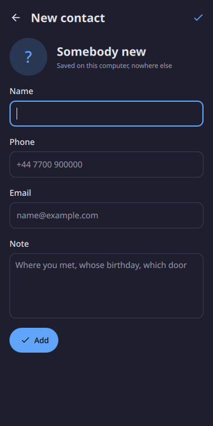
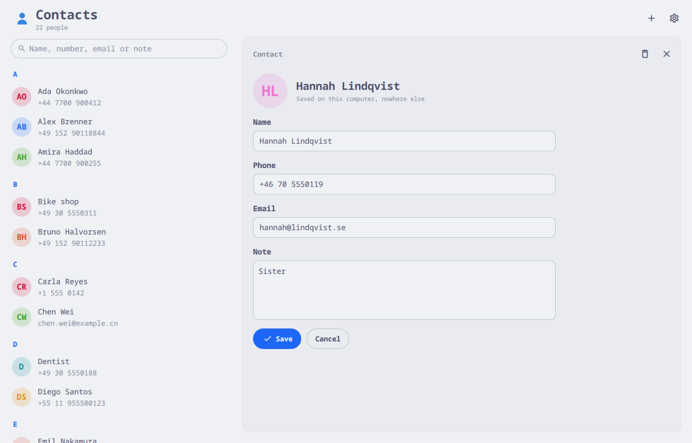

# moarchy-contacts

A name, a number, an email, and a note. One file. No accounts.

<p align="center">
  
  
  
  
</p>
<p align="center">
  
</p>

This one is not a port. Calendar in this repository already says why
Evolution's data server is the price of contacts-with-accounts; this is the
other half of that argument — an address book small enough to be a panel the
Omarchy shell already holds, so opening it is showing a window rather than
starting a process. An address book is opened for eleven seconds to find a
number, and that is what it is for.

A Quickshell app. Inside the Omarchy shell it is a panel the shell keeps
loaded; on any other Quickshell desktop `moarchy-contacts` runs it as its own
process. 0.1.0 was the shell plugin, copied onto a phone by a script; 0.2.0 is
the first package, and reads the same file.

## Two things, and no more

**The book**: everybody, searchable by any of the four fields, filed under the
letter of the name. A contact with only a number is filed under `#` by that
number rather than under an empty name, because a row buried under the blanks
is a number that gets lost.

**The person**: a form. Four fields, Save, and Delete — which asks first, and
then offers Undo. There is no read-only card in front of the form, because
there is nothing on a contact to read that is not one of its four fields.

Below 720 px the person is a page over the book, with a back arrow. Above it
the person is a pane beside the book, and the book stays where it was.

## The file

`~/.local/share/moarchy-contacts/contacts.json`, or `$MOARCHY_CONTACTS_DIR`:

```json
{
 "schema": 1,
 "contacts": [
  {"id": "c-demo-01", "name": "Ada Okonkwo", "phone": "+44 7700 900412",
   "email": "ada@okonkwo.dev", "note": "Bouldering, Thursdays"}
 ]
}
```

Written in name order, with empty fields left out, because the file is meant
to be legible to the person whose book it is. Mail reads it for the addresses
it suggests in To:, so its shape is a contract rather than a detail.

A row this app cannot draw — one with nothing on it, or a field it has never
heard of and nothing else — is kept exactly as it was found and written back
after the rest. A file that will not parse is moved aside as
`contacts.broken-<time>.json` before anything is written over it.

## What it does not do

- No sync, no CardDAV, no Google, no vCard import.
- No photos, no groups, no favourites.
- Nobody is dialled from here — it is a book, not a phone.

Each of those is a row that would need a screen.

## Running it

```sh
quickshell -p apps/contacts/shell.qml
```

With a book in it:

```sh
export MOARCHY_CONTACTS_DIR=$(mktemp -d)
python3 apps/contacts/dev/demo.py
quickshell -p apps/contacts/shell.qml
```

## Checks

```sh
docker run --rm -v "$PWD:/src" -w /src moarchy-qml scripts/app-check.sh contacts
docker run --rm -v "$PWD:/src" -w /src moarchy-qml scripts/app-shot.sh contacts
```

The first is qmllint, the book and the file (`tests/`), and a real run that
fails on any QML warning. The second photographs `dev/shots` at a phone's size
and a desktop's.

On a desktop: `/` searches, ↑ ↓ and Enter move through the book and open a
contact, `n` starts a new one, `e` edits the one in the pane, Enter in a field
saves, and Delete deletes after asking.

Over IPC, for scripts: `quickshell ipc call contacts add '{"name": …}'`,
`remove <id>` and `count`.

| variable | what it does |
|---|---|
| `MOARCHY_CONTACTS_DIR` | where the book lives |
| `MOARCHY_QUIT_AFTER` | quit after N seconds, for headless runs |
| `MOARCHY_CONTACTS_PAGE=editor` / `MOARCHY_CONTACTS_NEW` | open on a new contact |
| `MOARCHY_CONTACTS_EDIT` | open on this person, by name or id |
| `MOARCHY_CONTACTS_SEARCH` | open with this in the search box |

## Licence

MIT.
