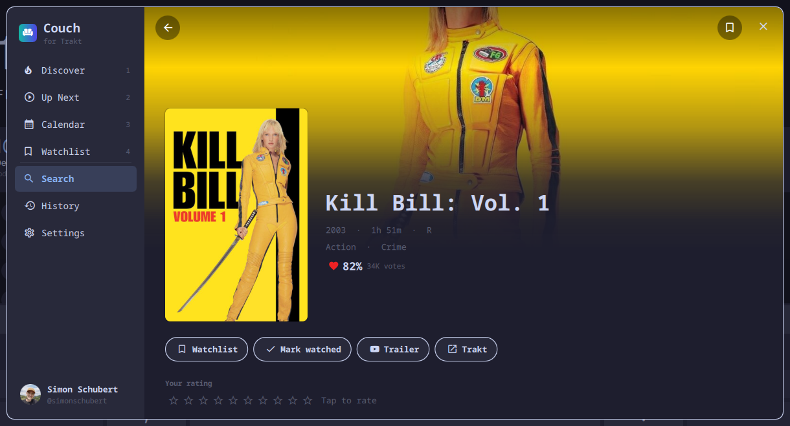
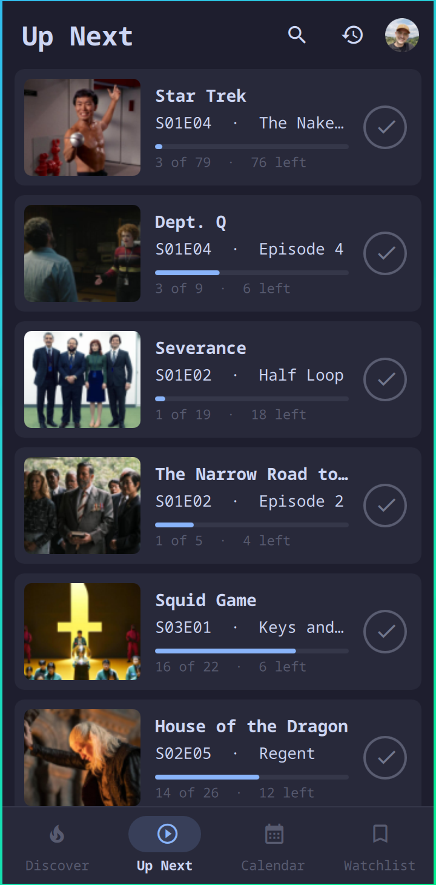

# Couch for Trakt

A movie and TV tracker for Quickshell desktops, built on [Trakt](https://trakt.tv): what
everyone is watching, what airs next, and your own watchlist and progress, in
an app window that lays itself out for the desktop and for the phone.

Couch is an independent app. It is not affiliated with or endorsed by Trakt.





## What it does

- **Discover**: trending, popular, anticipated and streaming movies and shows,
  plus the US box office. The top titles are shown as large backdrops, and the
  rest as a poster grid that loads more as you scroll.
- **Movie and show pages**:
  - the backdrop, poster, runtime, certification, genres and Trakt rating
  - the tagline, the story, and who directed, wrote or created it
  - the cast, facts such as release date, network and air time, and similar
    titles
  - the trailer and the page on trakt.tv
- **Seasons and episodes**: every season with each episode's still, air date,
  rating and story.
- **Search**: any movie or show on Trakt.

Once you sign in:

- **Up Next**: the next episode of every show you are watching, with your
  progress, and a tick to mark it watched.
- **Calendar**: when your shows air and your movies come out, grouped by day.
  Season premieres and new shows are there too, even without signing in.
- **Watchlist**: add anything with one tap. It can be sorted by date added,
  newest, rating or title.
- **Watched**: mark movies, single episodes or whole seasons as watched.
- **Ratings**: rate movies and shows from 1 to 10.
- **History**: everything you have watched, newest first.
- **Spoiler hiding**: hides the titles, stills and stories of episodes you
  haven't seen yet.

Every change shows at once and is sent to Trakt in the background. If Trakt
refuses it, it is put back and you are told. The app opens instantly, even
offline, with the lists it saw last. It fetches lists only while it is open.

## Install

On Arch Linux or Arch Linux ARM, with a Wayland desktop, from the AUR:

```sh
yay -S couch-for-trakt      # or any AUR helper
```

That installs Quickshell too if it is not there yet, and gives you a
`couch-for-trakt` command and an app menu entry. The app opens in a window of
its own; closing the window ends it. Under Omarchy it takes the Omarchy theme
when its shell has the plugin installed, and opens inside that shell.

To open it with a key on Hyprland:

```
bind = SUPER SHIFT, T, exec, couch-for-trakt
```

## Signing in

You need a free [Trakt](https://trakt.tv) account. Open **Settings** and
choose **Sign in**. The app shows a short code. On any
phone or computer, go to [trakt.tv/activate](https://trakt.tv/activate) and
enter it. There is no password to type into the app. The app notices the
approval by itself and fills in your lists.

**Sign out** in Settings revokes the token with Trakt and forgets your lists
on this computer.

## Remove

```sh
sudo pacman -Rns couch-for-trakt
```

Your settings and your sign-in stay in `~/.local/state/couch/`, and the saved
lists and pictures in `~/.cache/couch/`. To remove those as well:

```sh
rm -rf ~/.local/state/couch ~/.cache/couch
```

Signing out in Settings first also revokes the token with Trakt.

## Requirements

Quickshell (the package depends on it, along with the JetBrains Mono Nerd Font
the icons are drawn in), and network access to `api.trakt.tv` and Trakt's
image host `media.trakt.tv`. Omarchy is optional: without it the app runs as
its own Quickshell window, in a plain light or dark palette that follows the
desktop's preference. It reads and writes only its own files, listed below.

## Keys (desktop)

Couch opens as a normal window, so Hyprland tiles, focuses and closes it like
any other app.

| Key | Action |
| --- | --- |
| `1`–`4` | Discover, Up Next, Calendar, Watchlist |
| `/` | Search |
| `←` `↑` `→` `↓` `Enter` | Move through a grid, open a title |
| `↑` `↓` `PgUp` `PgDn` | Scroll a movie or show page |
| `w` | Add the selected title to your watchlist, or take it off |
| `r` | Refresh |
| `Esc` | Back one step (close the window with your usual close key) |

## Your own Trakt app

Couch signs in as its own registered Trakt app. If you would rather use
one of your own, create it at
[trakt.tv/oauth/applications](https://trakt.tv/oauth/applications), with the
redirect URI `urn:ietf:wg:oauth:2.0:oob`. Then paste its client ID and secret
into **Settings → Trakt app**.

## Privacy and security

- **Network.** The only network access is HTTPS requests from QML to
  `api.trakt.tv`, and pictures from Trakt's own image hosts (`*.trakt.tv`).
  The one exception is your avatar, which may be on Gravatar
  (`gravatar.com`). Anything else in a response is not loaded.
- **Size limits.** Every answer is capped while it downloads: 8 MB for an API
  answer, 2 MB for a picture, 256 KB for a sign-in or a change. Anything
  larger is dropped mid-download and never parsed.
- **Processes.** It runs no shell commands. At startup it runs
  `install -d -m 700` on its own state and cache folders, and `chmod 600` on
  its two data files, so your sign-in is readable only by you. It runs no
  other processes. If either step fails, it saves nothing and says so on
  screen.
- **Files.** It writes only these files:
  - `~/.local/state/couch/prefs.json`: settings and the Trakt access and
    refresh tokens
  - `~/.cache/couch/`: the last lists, for opening offline, and the pictures
- **Your data.** Tokens are sent only to Trakt. Descriptions are shown as
  plain text. Links open in your browser, and only `https:` links are opened.

## Credits

Movie and show data and images from [Trakt](https://trakt.tv), used through
the Trakt API. Couch is not affiliated with or endorsed by Trakt, Omarchy or Quickshell.

MIT licensed.
