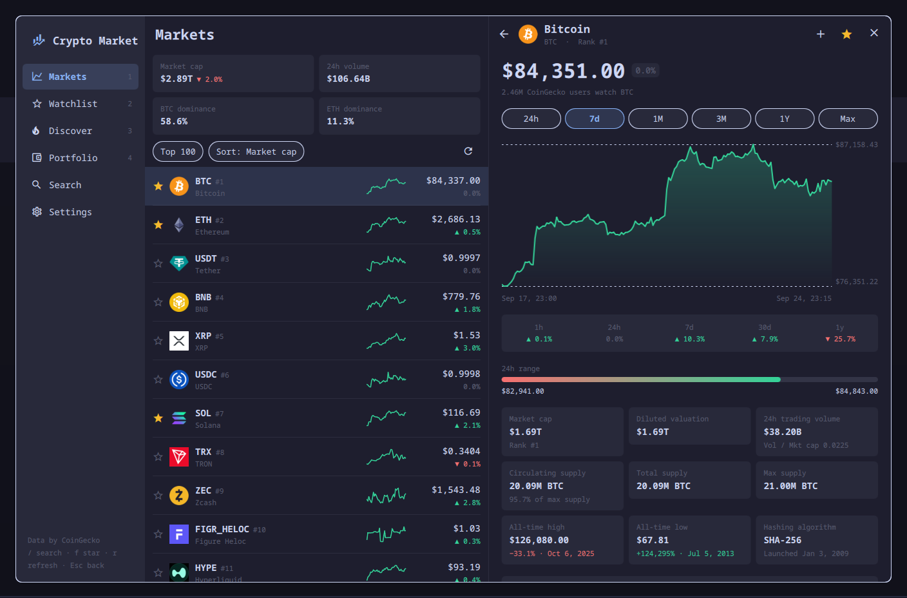
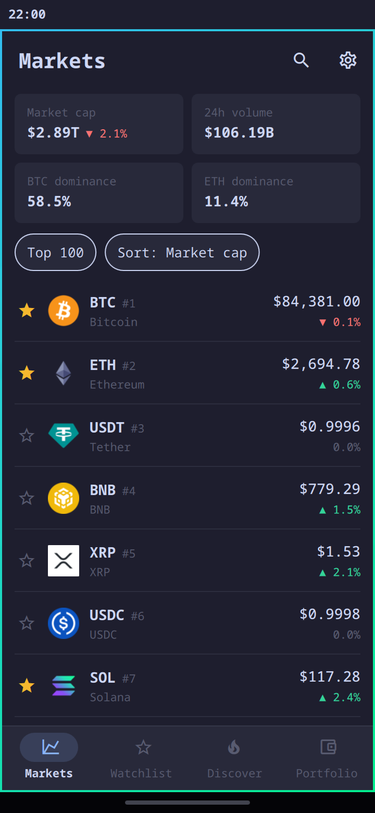

# Crypto Market

CoinGecko as a Quickshell app: live prices, coin pages, a watchlist and a
portfolio, in an app window that lays itself out for the desktop and for the phone.





## What it does

- **Markets**: the top 100, 250, 500 or 1,000 coins by market cap, with price,
  1h/24h/7d change, volume, market cap and a 7-day sparkline. Sort by any
  column. Above the list: total market cap, 24h volume, and BTC and ETH dominance.
- **Coin pages**:
  - a price chart for 24h, 7d, 1M, 3M, 1Y or Max, with a crosshair
  - the change over 1h, 24h, 7d, 30d and 1y
  - the 24h range
  - market cap, fully diluted valuation, volume, and circulating, total and max supply
  - all-time high and low, with dates
  - the project's description, categories and links
- **Watchlist**: star any coin to follow it.
- **Discover**:
  - trending coins on CoinGecko
  - the day's biggest gainers and losers among the top 250 (anything under
    $50K of volume is left out)
  - every category by market cap
- **Search**: find any coin CoinGecko lists.
- **Converter**: coin to currency and back, on every coin page.
- **Portfolio**: record buys and sells to see today's value, the 24h change,
  profit and loss per coin, and an allocation bar.
- **15 currencies**, including BTC, ETH and sats.

It opens instantly and offline with the last prices it saw, and it refreshes
only while it is open.

## Install

On Arch Linux or Arch Linux ARM, with a Wayland desktop, from the AUR:

```sh
yay -S crypto-market      # or any AUR helper
```

That installs Quickshell too if it is not there yet, and gives you a
`crypto-market` command and an app menu entry. The app opens in a window of
its own; closing the window ends it. `crypto-market bitcoin` opens straight on
a coin page. Under Omarchy it takes the Omarchy theme when its shell has the
plugin installed, and opens inside that shell.

To open it with a key on Hyprland:

```
bind = SUPER SHIFT, C, exec, crypto-market
```

## Update

With the rest of the system, e.g. `yay -Syu`.

## Remove

```sh
sudo pacman -Rns crypto-market
```

Your settings, watchlist and portfolio stay in `~/.local/state/crypto-market/`,
and the saved prices and logos in `~/.cache/crypto-market/`. To remove those as
well:

```sh
rm -rf ~/.local/state/crypto-market ~/.cache/crypto-market
```

## Requirements

Quickshell (the package depends on it, along with the JetBrains Mono Nerd Font
the icons are drawn in), and network access to `api.coingecko.com`. Omarchy
is optional: without it the app runs as its own Quickshell window, in a plain
light or dark palette that follows the desktop's preference.
It installs no packages and changes no Omarchy configuration. It reads and
writes only its own files, listed below.

## Keys (desktop)

Crypto Market opens as a normal window, so Hyprland tiles, focuses and closes
it like any other app. The keybinding above toggles it.

| Key | Action |
| --- | --- |
| `1`–`4` | Markets, Watchlist, Discover, Portfolio |
| `/` | Search |
| `↑` `↓` `Enter` | Move through a list, open a coin |
| `←` `→` | Chart range on a coin page |
| `f` | Star or unstar the selected coin |
| `r` | Refresh |
| `Esc` | Back one step (close the window with your usual close key) |

## Rate limits and the API key

CoinGecko's free public API answers only a few requests a minute. The app
spaces its requests out and caches every answer. When CoinGecko asks it to
slow down, it keeps showing the prices it has and retries by itself.

For more headroom, create a free **Demo** key at
[coingecko.com/en/developers/dashboard](https://www.coingecko.com/en/developers/dashboard)
and paste it into Settings. The key is stored in
`~/.local/state/crypto-market/prefs.json` and is sent only to CoinGecko.

## Privacy and security

- The only network access is HTTPS requests from QML to `api.coingecko.com`,
  plus coin logos from CoinGecko's own image hosts (`coin-images.coingecko.com`,
  `assets.coingecko.com`); a logo address anywhere else is ignored.
- Every answer is capped while it downloads: 8 MB for API answers, 300 KB for
  a logo. An answer that declares more, or grows past that, is dropped before
  it is held in full.
- It runs no shell commands. At startup it runs `install -d -m 700` on its
  own state and cache folders, and `chmod 600` on its two data files, so
  your API key and portfolio are readable only by you. It runs no other
  processes. If either step fails, it saves nothing and says so on screen.
- It writes only these files:
  - `~/.local/state/crypto-market/prefs.json`: settings, watchlist, portfolio
    and the optional API key
  - `~/.cache/crypto-market/`: the last prices, for opening offline, and the
    coin logos
  - `~/.local/share/applications/omarchy-plugin-io.github.simonschubert.crypto-market.desktop`:
    its app menu entry, created once and never over an existing file
- Project descriptions are shown as plain text. Links open in your browser,
  and only `https:` links are opened.

## Credits

Market data by [CoinGecko](https://www.coingecko.com). This is not financial advice.

Crypto Market is an independent project. It is not affiliated with or endorsed
by Omarchy, 37signals, Quickshell or CoinGecko.

MIT licensed.
