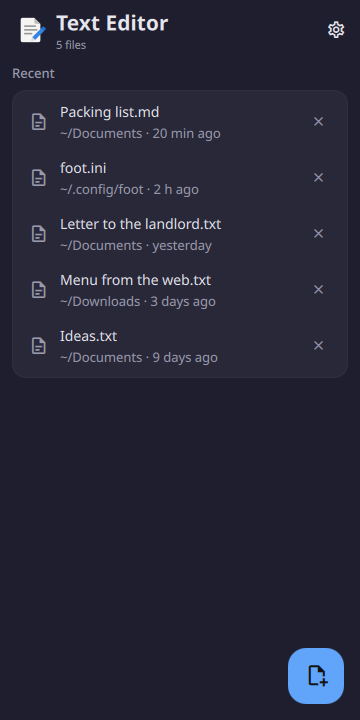
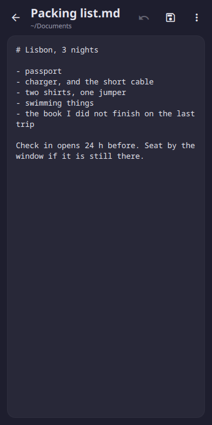
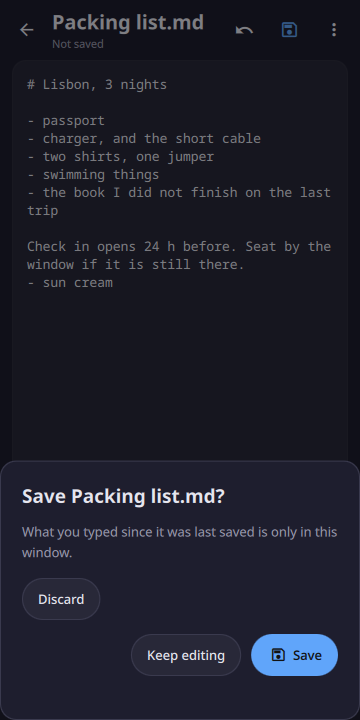
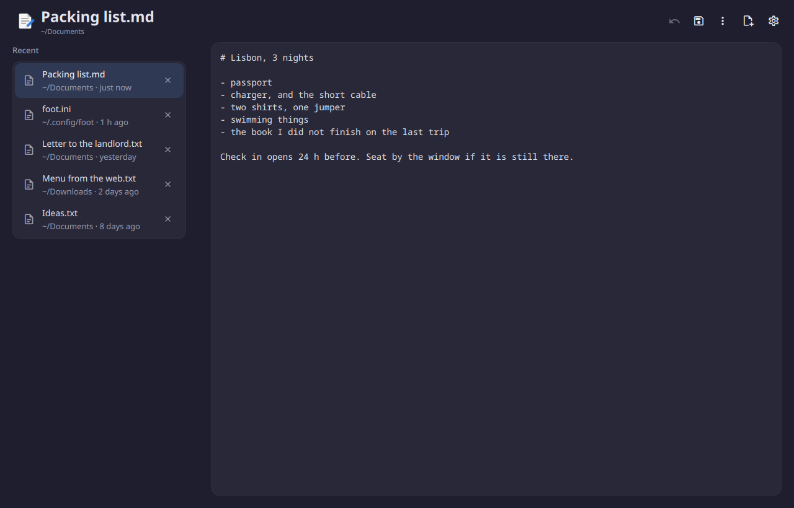

# Text Editor

One text file at a time, with undo and save where a thumb can reach them, and
an `$EDITOR` that waits.

<p align="center">
  
  
  
</p>
<p align="center">
  
</p>

<p align="center"><em>360×720, and a desktop window. One app: below 720 px
the list and the file are two screens, above it they sit side by side. Every
colour is the active Omarchy theme's.</em></p>

A Quickshell app. Inside the Omarchy shell it is a panel the shell keeps
loaded, so opening a file is showing a window rather than starting a process;
on any other Quickshell desktop `moarchy-editor` runs it as its own. 0.1.0 was
a shell plugin copied onto the phone by hand, and this reads the same
`state.json` it kept.

On a phone, two screens. **The list** is the files this has opened, newest
first. **The file** is the text in a box, with undo and save in the bar above
it — because the phone's keyboard has no Ctrl key, and an editor whose undo is
Ctrl+Z is an editor with no undo. On a desktop the list is a column beside the
text, a drag selects, and Ctrl+S, Ctrl+Shift+S, Ctrl+N and Ctrl+W save, save
as, start a file and close it.

It replaces `gnome-text-editor` as the phone's editor, which means two jobs and
not one: what opens when a text file is tapped in Files, and what `git commit`
runs as `$EDITOR`. The second is the one that shaped it.

## It is not a gap

GNOME Text Editor is good, it is adaptive, and it does a great deal this does
not: tabs, search and replace, syntax highlighting, spell checking, sessions it
restores after a crash. In the container these checks run in — Qt and
Quickshell and no GTK — `pacman -S gnome-text-editor` wants 70 packages and
55.5 MB. On the phone most of that is already there for Loupe and Papers, so
that number is not a saving; it is the cost of the argument the other plugins
here make, which is that summoning an app should be a window becoming visible
rather than a process starting.

What this has instead is what a phone uses an editor for: a note, a config file
somebody told you to change, and a commit message.

## Being $EDITOR

Opening a file in something the shell already holds returns at once. That is
right for a tap in Files and wrong for `git commit`, which reads the message
back the moment its editor exits — so an editor that exits at once is a commit
with no message.

`moarchy-editor --wait FILE` is the process that waits, and there are three
places it can find the editor:

- **In the shell**, when it has the plugin. The launcher names a marker file in
  the summon, and the editor touches it at the moments a separate editor would
  have exited: the file is closed, another file replaces it, or the window goes
  away. Waiting forks nothing — it is a bash `read -t` on a descriptor that
  never has anything on it. Every twenty seconds it asks whether the marker is
  still held, so a shell that restarted in the middle ends the wait rather than
  hanging the terminal; three unanswered asks end it too.
- **Already running on its own**: the same marker, over `quickshell ipc`.
- **Nowhere**: the launcher runs the editor itself, in the foreground, and
  returns when it quits. Closing a file opened this way closes the window, and
  closing the window ends the process.

So `EDITOR='moarchy-editor --wait'` works the same with the shell or without
it. Back from a file that was opened this way closes the window as well, and
the bar says *Go back when you are done* while a caller is waiting, because
nothing else on the screen would.

## What it will not write

Qt's text control does not hand text back exactly as it was given. Measured
against the phone's Qt: a no-break space comes back as a space, U+2028 and
U+2029 come back as newlines, a lone carriage return comes back as a newline,
and CRLF comes back as LF. An editor that saved those files would change
characters nobody touched, and nothing would say so.

So:

- **CRLF throughout** is folded to LF for editing and put back on save, which
  is exact.
- **A no-break space, a Unicode line separator, or mixed line endings** opens
  read only, with a box above the text that says why.
- **A NUL** is not a text file, and **U+FFFD** means the file was not UTF-8 and
  the bytes that were not are already gone from what was read. Both open read
  only.
- **A file without write permission** opens read only too, and Save offers to
  save a copy somewhere else.

Nothing is read before one `stat` has said what it is. FileView reads a file
whole into the shell's own process, and the shell is the phone's UI, so a
folder, a file you cannot read, and anything over 256 KB are refused before a
byte of them is loaded. The 256 KB is a guess rather than a measurement: one
TextEdit lays the whole file out on a Cortex-A53, and the number is low enough
that a mistaken tap on a log costs a second and not the shell.

Saving goes through FileView, which writes atomically, through a symlink to its
target, keeps the file's mode, and makes missing folders. Each of those was
measured in the container before anything here relied on it.

## Unsaved edits

Opening another file, starting a new one and closing this one all go through
one question: *Save*, *Discard*, or *Keep editing*, which a tap outside also
means. Inside the shell, hiding the window does not ask: what is typed stays in
the window and is there the next time it is summoned, which is how a phone app
is left rather than closed — but it is not on disk, and anything waiting on the
file is let go with the file as it is on disk. Run on its own, closing the
window would end the process and the text with it, so there it asks first.

## Run it

```sh
quickshell -p apps/editor/shell.qml
MOARCHY_PAYLOAD='{"path":"/etc/hostname"}' quickshell -p apps/editor/shell.qml
MOARCHY_EDITOR_APPDIR=$PWD/apps/editor apps/editor/bin/moarchy-editor --wait notes.md
```

The list of files and the wrap setting live in
`~/.local/share/moarchy-editor/state.json`, or `$MOARCHY_EDITOR_DIR` if set;
the look and the monospace choice in `~/.local/state/moarchy-editor/prefs.json`.

## Checks

```sh
docker run --rm -v "$PWD:/src" -w /src moarchy-qml scripts/app-check.sh editor
docker run --rm -v "$PWD:/src" -w /src moarchy-qml scripts/app-shot.sh editor
```

The first is qmllint, the rules in `Doc.js` and `Store.js`, and a real run that
fails on any QML warning. The second photographs `dev/shots`, which
`dev/demo.py` fills with five files and the list of them.

| variable | what it does |
|---|---|
| `MOARCHY_EDITOR_DIR` | where the list of files lives |
| `MOARCHY_EDITOR_APPDIR` | where the launcher finds `shell.qml` |
| `MOARCHY_PAYLOAD` | what a standalone run opens: `{"path": ...}` |
| `MOARCHY_EDITOR_OPEN` | `new`, `recent`, `recent:N` or a path, for the screenshots |
| `MOARCHY_EDITOR_TYPE`, `_MENU`, `_DIALOG`, `_SETTINGS` | text typed, the menu up, `unsaved` or `saveas` asked, Settings open |
| `MOARCHY_QUIT_AFTER` | quit after N seconds, for headless runs |

## Two desktop entries

`org.moarchy.Editor.desktop` is the app menu's, and opens the editor on its
list. `org.moarchy.Editor.open.desktop` is hidden from the menu and is what
xdg-open runs for a text file: `moarchy-editor %f`, which opens it in the shell
when the plugin is there and on its own when it is not.

## What it does not do

- No tabs: one file at a time, and the list is how you get to the others.
- No search, no replace, no syntax highlighting, no spell check.
- No way to pick a file from inside it. Files does that, and tapping a text
  file there opens it here.
- No selecting part of the text on a phone. On a 360px screen a drag has to
  scroll, or a long file cannot be moved through at all — so the menu has
  *Copy all* and *Paste*, which are the two a phone needs. A desktop, with a
  wheel to scroll by, selects with a drag as any editor does.
