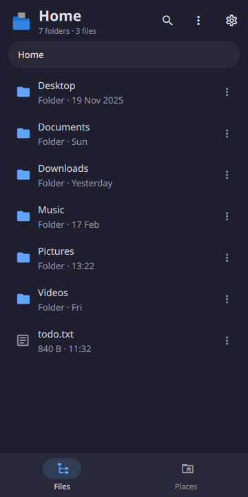
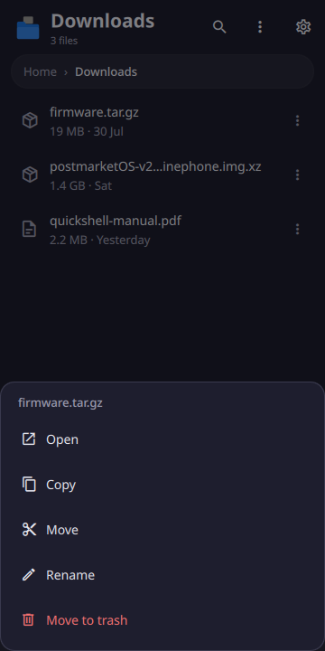
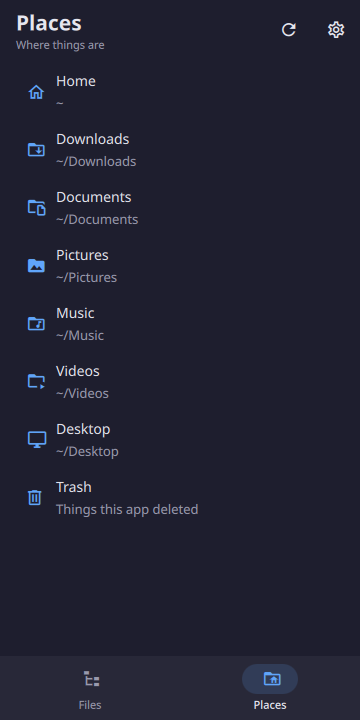
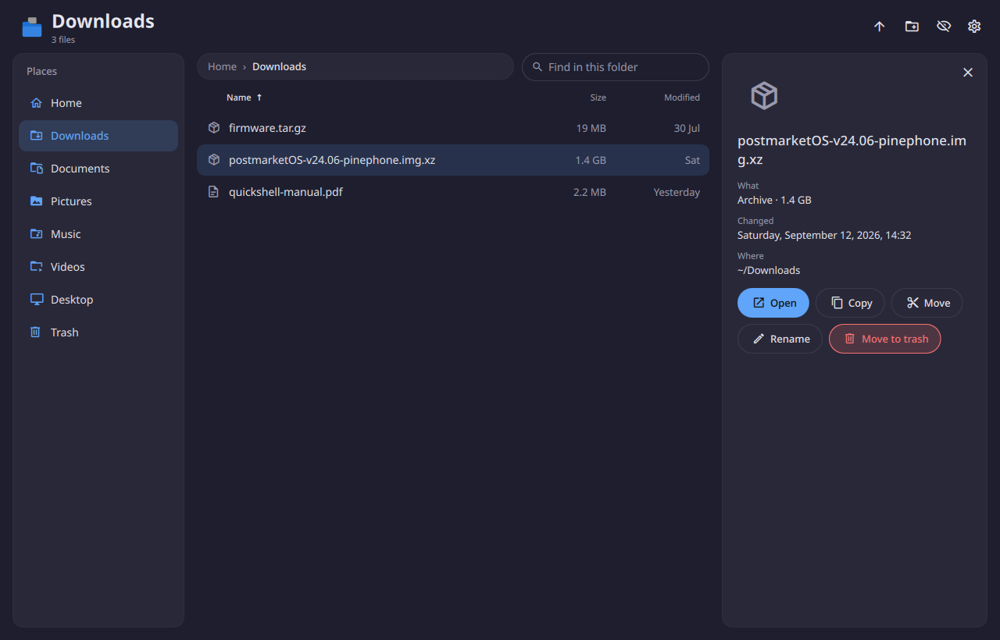

# moarchy-files

A file manager for Quickshell: one folder at a time, with a thumb on a phone
and a keyboard on a desktop, and a delete that goes to the trash every other
app on the machine can read.

<p align="center">
  
  
  
</p>
<p align="center">
  
</p>

<p align="center"><em>360×720, and a desktop window. One app: below 720 px the
places are a tab and each row has a menu, above it the places sit beside the
list and the picked file has a pane of its own.</em></p>

Inside the Omarchy shell it is a panel the shell keeps loaded, so opening it
is showing a window rather than starting a process, and the folder somebody
was last in is already there. On any other Quickshell desktop `moarchy-files`
runs it as its own. `moarchy-files ~/Music` opens a folder; a file opens the
folder it is in. Before 0.2.0 it was a phone-only shell plugin copied on by
hand, and it reads the same `view.json` that did.

## What it does

- **One folder.** Folders first, then the order you picked: names up, sizes
  and dates down, because nobody opens a file manager to find the smallest
  file. Hidden files on request. A filter that finds names in *this* folder
  and says so -- nothing here walks a tree.
- **Places.** Home, the XDG folders that exist (in the language
  `user-dirs.dirs` names them in, followed if it changes), the trash, and
  every mounted volume with how full it is.
- **Copy and move** are one thing held at a time: copy, walk somewhere,
  paste. A phone has no shift-click, and a clipboard of six files is a thing
  to manage and get wrong. A folder cannot be pasted inside itself; a name
  that is taken gets " (2)".
- **Delete is the trash** -- the freedesktop one, `~/.local/share/Trash`, or
  the volume's own `.Trash-$uid` for a file on a card, with the `.trashinfo`
  every file manager reads. Inside the trash, delete means gone, and that is
  the one thing here that asks first.
- **Open** is `xdg-open`, so a text file goes to whatever edits text here.

## Two layouts

Below 720 px it is a phone app: the crumb strip, the list, and a menu behind
the dots on each row (or a hold). Places are the second tab. Back steps out
of a search, then up a folder, then to home.

Above it, the places are a column on the left, the list has size and date
columns whose headings are the sort, and a click picks a file into a pane on
the right with every action as a button. A double click or Enter opens.

| key | |
|---|---|
| ↑ ↓ PgUp PgDn Home End | pick a row |
| Enter | open it |
| Backspace, Alt+← | up one folder |
| F2 | rename |
| Delete | to the trash (asks, in the trash) |
| Ctrl+C, Ctrl+X, Ctrl+V | copy, move, paste here |
| / | find in this folder |
| h, Ctrl+H | hidden files |
| n | new folder |
| ~ | home |
| F5 | read the folder again |

## How it is built

Everything that touches the disk is a short `sh` script with the paths passed
as arguments, never pasted into the text, so a file named `; rm -rf ~` is a
file named `; rm -rf ~`. `Listing.js` reads a directory with one `find`,
`Ops.js` changes one, `Places.js` finds the places worth a tap. The decisions
-- which trash a file goes to, whether a folder may be pasted into itself,
what a usable name is -- are functions with tests (`tests/`), because those
are the three ways a file manager loses somebody's afternoon.

Nothing runs until the window is on the screen. The shell builds this panel
during its own startup, so no directory is read before it is opened and the
list has no model while the window is shut.

## The file

`~/.local/share/moarchy-files/view.json`: the order, whether hidden files
show, and the folder that was open, written when the window goes. The files
are the data, and they are on the disk already.

## Running it

```sh
quickshell -p apps/files/shell.qml
MOARCHY_FILES_HOME=$(mktemp -d) python3 apps/files/dev/demo.py   # a made-up home
```

## Checks

```sh
docker run --rm -v "$PWD:/src" -w /src moarchy-qml scripts/app-check.sh files
docker run --rm -v "$PWD:/src" -w /src moarchy-qml scripts/app-shot.sh files
```

| variable | what it does |
|---|---|
| `MOARCHY_FILES_HOME` | the home to browse instead of `$HOME` (the trash stays the real one) |
| `MOARCHY_FILES_DIR` | where `view.json` lives |
| `MOARCHY_FILES_NOW` | the clock "Yesterday" is read against, for the screenshots |
| `MOARCHY_FILES_PATH` | open on this folder |
| `MOARCHY_FILES_PAGE` | `places`, to open on the places |
| `MOARCHY_FILES_MENU` | a row's name to open its menu, or `view` |
| `MOARCHY_FILES_HOLDING` | a row's name to hold as a copy |
| `MOARCHY_FILES_PICK` | a row's name to pick, on a desktop |
| `MOARCHY_QUIT_AFTER` | quit after N seconds, for headless runs |

## Licence

MIT.
