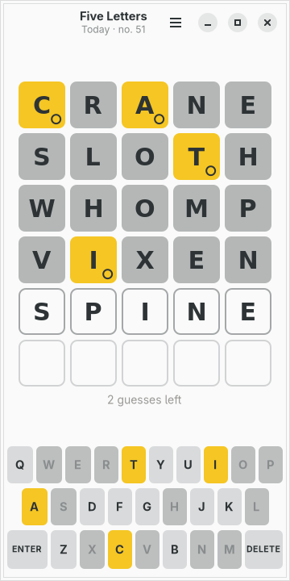
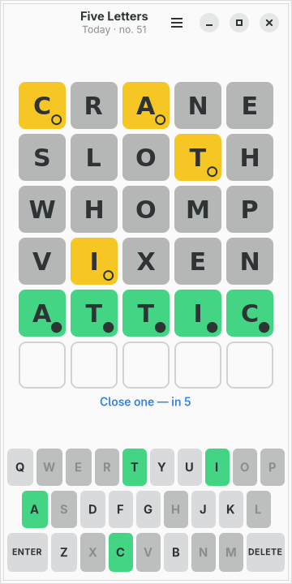
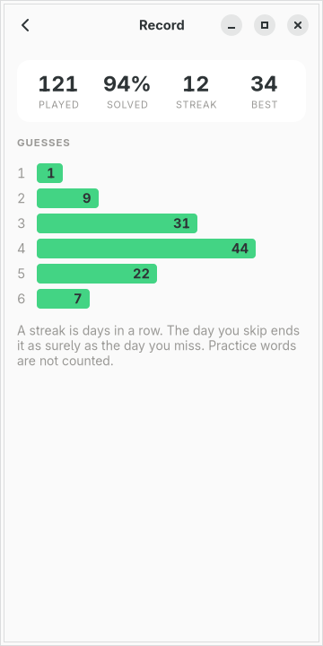

# moarchy-fiveletters

A five-letter word a day, for a Linux phone: a keyboard of its own so the board
is never covered, a mark on every tile as well as a colour, and English only,
which it says rather than pretending otherwise.

<p align="center">
  
  
  
</p>

<p align="center"><em>360×720, the size of a PinePhone's screen under
mobileomarchy. The green and the yellow are the active Omarchy theme's own, and
<code>omarchy-theme-set</code> repaints them while the board is on the
screen.</em></p>

Built for [mobileomarchy](https://github.com/SimonSchubert/mobileomarchy), but
nothing in it is specific to that: it is a GTK4/libadwaita app and runs on
Phosh, Plasma Mobile, postmarketOS or an ordinary desktop.

## The name

It is the game everybody means by Wordle. It is not called that, for the same
reason the board game in this repository is called Reversi and not Othello: the
famous name belongs to somebody — a newspaper in one case and a Japanese
trademark in the other — and the generic one describes the thing perfectly well.

## Its own keyboard

The phone has one already, and using it would mean the on-screen keyboard
sliding up over the bottom two rows of a board that *is the entire game*, plus
autocorrect, a space bar, a number row and a comma, none of which this game has
any use for.

So the app draws twenty-eight keys, and gets three things for it:

- **the board is never covered**, because the keyboard is part of the window
  rather than something that arrives over it;
- **the keys are coloured by what is known about each letter**, which is half of
  how anybody plays this game and is not something a system keyboard can do;
- **there is nothing to type that is not a move.**

It still takes a physical keyboard — letters, Return and Backspace — because
this runs on a desktop too and somebody with one will try.

The keyboard is twenty-eight real GTK buttons on a twenty-column grid, and the
board is one drawing area. The split is not arbitrary: a tile has to **flip**,
which is a transform on a shape, and a key has to look **pressed**, which GTK
already does better on a touch screen than a draw function would. Twenty columns
because the rows do not divide evenly — ten keys, then nine indented by half a
key, then seven between an enter and a backspace worth a key and a half each.
Two grid columns to a letter makes every one of those a whole number.

## A mark as well as a colour

**The colours are the rules in this game**, and always have been: green means
the letter is in that place, yellow means it is in the word somewhere else, grey
means it is not there. That is exactly the thing Reversi refuses to do with its
discs — and it is allowed here because every version of this game anybody has
played works this way, and a person who cannot separate green from yellow is not
going to be helped by a fourth colour.

What this app does instead is what a tile can carry without becoming a different
game: **a mark of its own in the corner.** A filled dot for a letter in the
right place, an open ring for one in the wrong place, nothing at all for one
that is not in the word. One arc per tile, in the bottom-right corner where a
capital letter never reaches, and the board says which of the three states it is
in by shape as well as by hue.

The green and the yellow are the theme's own rather than the newspaper's, and
the app checks that they are far enough apart to sit next to each other — if a
theme ships a green and a yellow that are nearly the same colour, the yellow
moves to that theme's orange, because side by side is the only way this game
ever uses them. The letter on a tile is whichever of the theme's two extremes is
further from the tile, which is the fix for the first cut of this file: white on
a theme's yellow is a tile nobody can read.

## Two lists, not one

`data/answers.txt` has 1,510 words that can be the secret. `data/guesses.txt`
has 12,167 that the app will accept as a guess. They answer two different
questions, and a game that used one list for both gets one of them wrong:

- A five-letter string that appears in a dictionary is not the same thing as a
  word a person would guess, and a game whose secret is AALII is a game somebody
  loses for no reason.
- Being told "not a word this app knows" for a real word is the most annoying
  thing this kind of game does, so the guess list is wide.

Both come from [Braincup](https://github.com/SimonSchubert/Braincup), where they
were assembled for the same game — the sources are in `data/NOTICE.md` — and
they are carried here verbatim so that the two apps stay wrong in the same
places if they are wrong at all. The rules module is written the same way for
the same reason.

**English only**, and the app says so rather than offering a language picker
with nothing behind it. A word list cannot be translated: every language needs
its own curated words, its own alphabet and its own accent policy, all authored
together.

## Duplicate letters

This is the one rule implementations get wrong, and it is worth the paragraph.

The colouring is two passes. The first marks every letter that is in the right
place and **consumes** that letter from the secret; the second marks a letter
present only while an unconsumed instance of it remains, and absent otherwise.

Guess ALLOY against LOYAL and all five light up, because they are the same five
letters. Guess SPEED against ERASE and only two of the three E-shaped things can
— the secret has two Es. A single pass that asked "is this letter in the word"
would light all three and tell the player something untrue about a word they are
about to spend a guess on.

## One a day

The day's word is a function of the date: the same word for everybody, no
network, no server, nothing to be offline from. It is a multiply-and-add into
the answer list rather than the day number itself, because the list is sorted
and `days % len` would give a week of secrets beginning A, A, A, B, B — a
pattern somebody notices on the fourth day and never unsees.

**The day is checked every time the game is loaded.** A phone left open
overnight comes back to yesterday's board, and yesterday's board with today's
word on it is a board claiming three letters are green and meaning nothing by it.

When the day's word is done there is **a practice word**, which is never
counted. A streak is a statement about days, and counting practice would turn it
into a statement about how many goes somebody had.

**Copy result** puts the board on the clipboard as coloured squares. It is the
one thing this game is famous for outside itself, the only clipboard write in
this repository, and spoiler-free by construction: squares say how a word went
and nothing about what it was.

## The file

`~/.local/share/moarchy-fiveletters/fiveletters.json`, or
`$MOARCHY_FIVELETTERS_DIR`.

```json
{
 "schema": 1,
 "mode": "daily",
 "daily": {"day": "2026-09-12", "guesses": ["CRANE", "SLOTH", "WHOMP", "VIXEN"]},
 "practice": {"seed": 1174338921, "guesses": []},
 "stats": {"played": 121, "won": 114, "streak": 12, "best": 34,
           "spread": [1, 9, 31, 44, 22, 7], "last": "2026-09-11"}
}
```

**Neither secret is in the file.** The day's word is a function of the date and
a practice word is a function of a seed, so both come back from four bytes and
neither is sitting in a text file in somebody's home directory waiting to be
read at two in the morning. It is the same argument Minesweeper's seed makes and
a stronger one here: a minefield is hard to read off a list of taps, and a
five-letter word is not hard to read off anything.

What is stored is the guesses, not the board — so a file that has been
truncated, edited or half-written cannot describe a board that play could not
reach, because loading it is playing it. A word that is not five letters, or is
not in the guess list, is where the file stops being a game.

`last` is a date rather than a counter because of what a streak is: the day you
**skip** ends it as surely as the day you miss, and a counter cannot tell those
apart from simply not having played yet.

## Running it

```sh
python3 -m moarchy_fiveletters
```

To see it part-played:

```sh
export MOARCHY_FIVELETTERS_DIR=$(mktemp -d)
python3 demo.py          # four guesses in
python3 demo.py solved   # ...or the same word, got on the fifth
python3 -m moarchy_fiveletters
```

`demo.py` refuses to run without `MOARCHY_FIVELETTERS_DIR` set. It plays real
guesses — openers a person actually uses, then words that are still possible
given everything seen — because the tiles in a screenshot have to say what the
rules say, and duplicate letters are exactly where somebody who knows the game
will look.

## Checks

```sh
scripts/check.sh fiveletters
```

ruff, then the word lists, the rules and the file, then the widgets on a virtual
screen, then a real run that fails on any GTK warning.

The word-list test is the one that runs in the build chroot and the one that
matters most: the lists are data, produced by a script in another repository,
and one blank line or one four-letter word among thirteen thousand is a guess
nobody can type or a secret nobody can reach. It checks that every word is five
letters of the alphabet, that every answer is also a legal guess, and that the
answers are the smaller and stricter of the two lists.

| variable | what it does |
|---|---|
| `MOARCHY_FIVELETTERS_DIR` | where the game lives |
| `MOARCHY_FIVELETTERS_WORDS` | where to look for the word lists first |
| `MOARCHY_FIVELETTERS_TODAY` | pin the day, so a screenshot is the same word every time |
| `MOARCHY_FIVELETTERS_QUIT_AFTER` | quit after N seconds, for headless runs |
| `MOARCHY_FIVELETTERS_PAGE` | open straight into `record`, for the screenshots |
| `MOARCHY_FIVELETTERS_TYPED` | open with a word half typed, for the screenshots |

## Licence

MIT, for the code. The word lists come from Braincup and carry their own
attribution in `data/NOTICE.md`.
