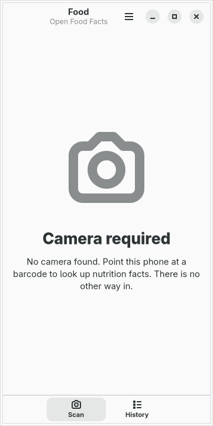
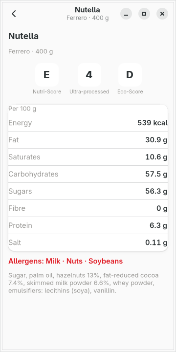
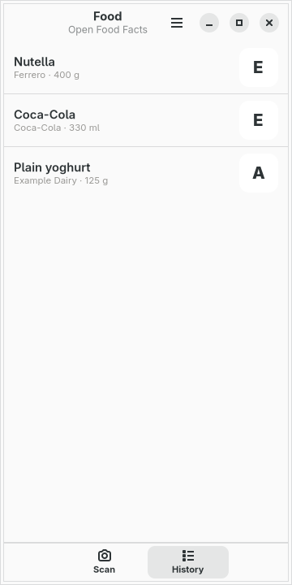

# moarchy-food

Nutrition facts for a Linux phone: point the camera at a barcode, and Open Food
Facts answers with the name, the Nutri-Score, the table and the allergens.

<p align="center">
  
  
  
</p>

<p align="center"><em>360×720, the size of a PinePhone's screen under
mobileomarchy. The colours are not the app's own — every badge is derived
from the active Omarchy theme. The products in these pictures are cached:
the shots are taken offline against <code>demo.py</code>, which is the only
reason two of them agree.</em></p>

Built for [mobileomarchy](https://github.com/SimonSchubert/mobileomarchy), but
nothing in it is specific to that: it is a GTK4/libadwaita app that makes one
HTTPS request per scan, and it runs on Phosh, Plasma Mobile, postmarketOS or
an ordinary desktop. It does need a camera.

## This one is on the list

`docs/android-gaps.md` in moarchy-store names Open Food Facts as a Tier 1 gap:
barcode to nutrition, and Linux has nothing. `qrca` and `decoder` are already
catalogued and they read a code; they do not say what the packet is. This app
is the other half of that.

## What it does

Two pages, and the switcher is along the bottom where a thumb already is.

**Scan** — the camera, full screen, a reticle, and nothing else:

- a barcode in frame is looked up the moment zbar reads it
- EAN-13, EAN-8 and UPC only. A QR code is a URL and this app has no browser
- a code whose check digit is wrong is dropped, not requested: the camera
  misread it, and a 404 for a number that never existed is a worse sentence
  than scanning again

**History** — the packets you have already pointed at, newest first. A tap
opens the cached product, so a shop with no signal still has yesterday's
scan.

There is **no typed barcode**. A camera the phone does not have is an empty
state that says so, not a text field that pretends the lens was optional.

## Where the numbers come from

[Open Food Facts](https://world.openfoodfacts.org)' public API, one `GET` of
`/api/v2/product/{code}` per scan, on a thread. That is the whole of the
network in this app, and every fact on screen comes out of that one answer.

- **No account and no key.** The project asks that the User-Agent name the
  app, so a flood can be recognised as one client. A 429 is an ordinary
  answer rather than an error: the app waits as long as the answer asked it
  to, or a minute if it did not say.
- **A failure leaves the history alone.** A product from this morning is
  worth something and a blank page is worth nothing. The only screen that
  says nothing is the one that has never had anything to say.
- **The camera stops when the window leaves the screen.** An app that keeps
  the sensor running after the phone is in a pocket is a battery bug wearing
  a feature's clothes, and on a phone the app is not closed, it is hidden.

The Nutri-Score letters are the theme's own green through red, not the
official traffic-light palette. The letter is on the badge because roughly
one man in twelve cannot tell those two colours apart; the colour is what
makes three badges scannable from the other end of an aisle.

## What leaves the phone

One HTTPS request, to one host, with no cookie, no account and nothing in it
but the barcode the camera just read. A front-of-pack thumbnail is a second
request, to the same project's image host, and only for the product on
screen.

The history is a list of barcodes plus the last answer for each, on the
device, unencrypted, because every byte of it is public data.

## What is deliberately not in it

- **A typed barcode.** The user of this app has a camera. A field you can
  type a number into is a second, worse scanner, and it is how an app that
  required a camera stops requiring one.
- **A diary, a portion, a calorie goal.** "What did I eat" needs an amount,
  which is the step that turns a glance at a packet into a record on a
  phone. If it is ever added it needs to be a decision rather than a drift.
- **Search by name.** Open Food Facts has that endpoint. This app does not
  have a keyboard for a reason.

## Working on it

```sh
scripts/check.sh food                   # ruff, the tests, and a real run at 360x720
scripts/screenshot.sh food              # the pictures above
```

No test here opens a socket, and neither does a check run. `facts.py` and
`store.py` import no GTK at all, so parsing somebody else's JSON and checking
a barcode are tested on any machine with a Python; the window is handed a
source object and a camera object rather than making either, so the UI tests
hand it stand-ins; and `demo.py` writes a cache, which is why the real run
has nothing to fetch.

| variable | what it does |
|---|---|
| `MOARCHY_FOOD_DIR` | where the history and the cached products live |
| `MOARCHY_FOOD_OFFLINE` | never touch the network; show what is cached |
| `MOARCHY_FOOD_PAGE` | open on `scan`, `history`, `product` or `missing` |
| `MOARCHY_FOOD_CODE` | which cached product the product page opens |
| `MOARCHY_FOOD_CAMERA` | `0` refuses to open a device, even if one exists |
| `MOARCHY_FOOD_PREVIEW` | a PNG of a barcode, used as the camera |
| `MOARCHY_FOOD_SCAN_ONLY` | decode but do not look up, for a scanner screenshot |
| `MOARCHY_FOOD_QUIT_AFTER` | quit after N seconds, for the headless checks |

The PinePhone's own camera is not a solved problem — moarchy-store's Camera
entry already says so. This app still requires one: that is the job. On a
phone whose sensor works, it is a scanner. On one whose sensor does not, it
is an empty state, and that is honest.

## Where to get it

Three channels, the same as every app here, and `docs/publishing.md` is the
table of which one this has actually reached — `git grep` cannot tell you that.

```sh
# the phone, through the signed repo the store's helper can install from
sudo pacman -S moarchy-food

# anyone else on Arch or Arch Linux ARM
paru -S moarchy-food
```

## Licence

MIT. Product data from [Open Food Facts](https://world.openfoodfacts.org),
which is open data under the ODbL; the facts on screen are theirs, and a
scan is a contribution they already have.
