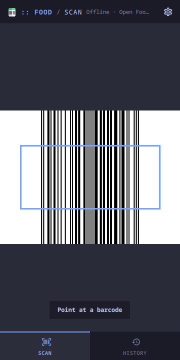
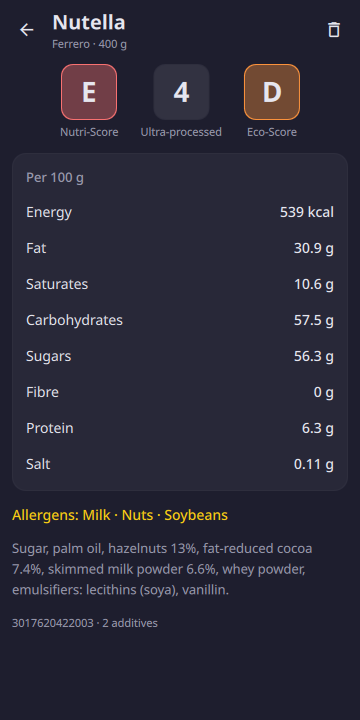
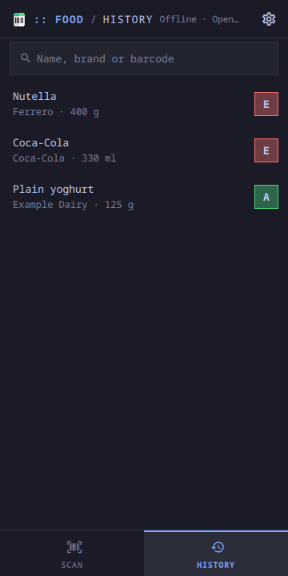
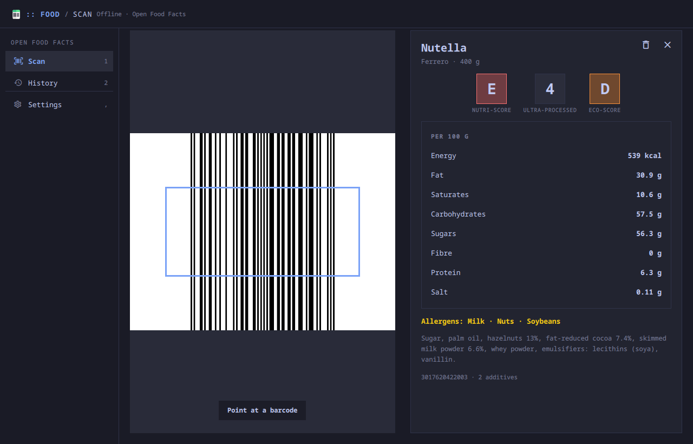

# moarchy-food

Nutrition facts for a Linux phone: point the camera at a barcode, and Open Food
Facts answers with the name, the Nutri-Score, the table and the allergens.

<p align="center">
  
  
  
</p>
<p align="center">
  
</p>

<p align="center"><em>360×720, and a desktop window. One app: below 720 px the
scanner and the history are tabs and a product is a page over them; above it,
the product sits beside the camera or the list. The badges are the active
Omarchy theme's colours. The pictures are taken offline against
<code>dev/demo.py</code>'s cache, with a still of a barcode in front of a fake
camera.</em></p>

A Quickshell app. Inside the Omarchy shell it is a panel the shell keeps
loaded; on any other Quickshell desktop `moarchy-food` runs it as its own
process. 0.1.0 was a GTK4/libadwaita app, and its history is the history
found here: the two files are the same. It does need a camera.

## This one is on the list

`docs/android-gaps.md` in moarchy-store names Open Food Facts as a Tier 1 gap:
barcode to nutrition, and Linux has nothing. `qrca` and `decoder` are already
catalogued and they read a code; they do not say what the packet is. This app
is the other half of that.

## What it does

Two pages, and the switcher is along the bottom where a thumb already is.

**Scan** — the camera, a reticle, and nothing else:

- a barcode in frame is looked up the moment zbar reads it
- EAN-13, EAN-8 and UPC only. A QR code is a URL and this app has no browser
- a code whose check digit is wrong is dropped, not requested: the camera
  misread it, and a 404 for a number that never existed is a worse sentence
  than scanning again

**History** — the packets you have already pointed at, newest first. A tap
opens the cached product, so a shop with no signal still has yesterday's
scan. It can be searched by name, brand or barcode, and a product can be
taken out of it -- the only two things new since 0.1.0, and neither is a
way to type a barcode in.

There is **no typed barcode**. A camera the phone does not have is an empty
state that says so, not a text field that pretends the lens was optional.

## Where the numbers come from

[Open Food Facts](https://world.openfoodfacts.org)' public API, one `GET` of
`/api/v2/product/{code}` per scan, through curl, with a twelve-second timeout
and a four-megabyte cap. That is the whole of the
network in this app, and every fact on screen comes out of that one answer.

- **No account and no key.** The project asks that the User-Agent name the
  app, so a flood can be recognised as one client. A 429 is an ordinary
  answer rather than an error: the app waits as long as the answer asked it
  to, or a minute if it did not say.
- **A failure leaves the history alone.** A product from this morning is
  worth something and a blank page is worth nothing: a scan that cannot be
  looked up opens the last answer for that barcode, if there is one, and says
  so. The only screen that
  says nothing is the one that has never had anything to say.
- **The camera stops when the window leaves the screen.** An app that keeps
  the sensor running after the phone is in a pocket is a battery bug wearing
  a feature's clothes, and on a phone the app is not closed, it is hidden.

The Nutri-Score letters are the theme's own green through red, not the
official traffic-light palette. The letter is on the badge because roughly
one man in twelve cannot tell those two colours apart; the colour is what
makes three badges scannable from the other end of an aisle.

## What leaves the phone

One HTTPS request, to one host, with no cookie, no account and nothing in it
but the barcode the camera just read. A front-of-pack thumbnail is a second
request, to the same project's image host, and only for the product on
screen.

The history is a list of barcodes plus the last answer for each, on the
device, unencrypted, because every byte of it is public data.

## What is deliberately not in it

- **A typed barcode.** The user of this app has a camera. A field you can
  type a number into is a second, worse scanner, and it is how an app that
  required a camera stops requiring one.
- **A diary, a portion, a calorie goal.** "What did I eat" needs an amount,
  which is the step that turns a glance at a packet into a record on a
  phone. If it is ever added it needs to be a decision rather than a drift.
- **Search by name.** Open Food Facts has that endpoint. This app does not
  have a keyboard for a reason.

## The camera

The window is QML, and QML has no camera it can trust on this phone and no
barcode decoder at all. GStreamer has both, so the scanning is a process of
its own: `libexec/moarchy-food-scan` (installed as
`/usr/lib/moarchy-food/moarchy-food-scan`), Python and GStreamer, `v4l2src`
and `zbar` -- 0.1.0's pipeline without GTK. The app starts it when the scan
page is on screen and ends it when the page goes: a product opened over it,
the History tab, the window closing. It also ends if its stdin closes, which
is the app having gone without saying so. A phone in a pocket has no sensor
running.

It speaks one JSON line an event -- `ready`, `code` with zbar's kind and
symbol, `frame`, `error` with a sentence -- and decides nothing. Which kinds
are products (EAN and UPC; a QR is a URL, and this app has no browser), the
check digit, and the debounce that stops one packet being looked up a dozen
times a second are the app's, in `Facts.js`, where the tests are.

**The preview is a still, four times a second**: a 480-pixel JPEG the helper
renames into place in `$XDG_RUNTIME_DIR` and announces, which the window
loads again. It was that or no preview at all. A live video sink cannot be
embedded in a Quickshell window without a GStreamer QML plugin this phone
does not ship, and a scanner you cannot aim is a scanner you wave at a
packet until something happens. Four small JPEGs a second is a cost a
PinePhone carries while the page is open and not otherwise;
`MOARCHY_FOOD_SCAN_PREVIEW=0` turns it off, and the reticle and "Point at a
barcode" stay either way.

Only `/dev/video*` nodes that advertise capture are opened. On a PinePhone
most of them are a rotator, a decoder and a deinterlacer, and opening one as
the camera is seconds in PLAYING on something that will never frame.

What is verified and what is not: the helper's pipeline, run on a still of a
barcode in a container with GStreamer and zbar, decodes the code and writes
the preview JPEGs (`tests/test_scan.py`, `MOARCHY_FOOD_GST=1`), and the app,
driven by the helper's fake, takes a code to a page and into
`history.json`. No PinePhone sensor has been in front of it: the PinePhone's
own camera is not a solved problem -- moarchy-store's Camera entry already
says so -- and this app, like 0.1.0, is a scanner on a phone whose sensor
works and an honest empty state on one whose does not.

## Working on it

```sh
docker run --rm -v "$PWD:/src" -w /src moarchy-qml scripts/app-check.sh food
docker run --rm -v "$PWD:/src" -w /src moarchy-qml scripts/app-shot.sh food
python3 -m unittest discover -s apps/food/tests -p 'test_*.py'
```

The first is qmllint, the parsing, barcode and file tests (`tests/tst_*.qml`,
0.1.0's cases) and a real run that fails on any QML warning. The second
photographs `dev/shots` at a phone's size and a desktop's. The third is the
scanner: its protocol through the fake on any machine, and the real pipeline
where GStreamer and zbar are installed and `MOARCHY_FOOD_GST=1`. Nothing
here opens a socket: a lookup is what curl printed, handed to
`Facts.answer()`.

On a desktop: `1` and `2` pick Scan and History, `s` scans, `/` searches the
history, the arrows and Enter open a product, Delete takes it out.

| variable | what it does |
|---|---|
| `MOARCHY_FOOD_DIR` | where the history and the cached products live |
| `MOARCHY_FOOD_OFFLINE` | never touch the network; show what is cached |
| `MOARCHY_FOOD_PAGE` | open on `scan`, `history`, `product` or `missing` |
| `MOARCHY_FOOD_CODE` | which cached product the product page opens |
| `MOARCHY_FOOD_CAMERA` | `0` refuses to open a device, even if one exists |
| `MOARCHY_FOOD_PREVIEW` | a PNG of a barcode, used as the camera |
| `MOARCHY_FOOD_SCAN_FAKE` | a file of codes the fake scanner "sees", one a line |
| `MOARCHY_FOOD_SCAN_PREVIEW` | `0` turns the preview frames off |
| `MOARCHY_FOOD_SCAN_ONLY` | decode but do not look up |
| `MOARCHY_FOOD_SCANNER` | another scanner helper to run |
| `MOARCHY_QUIT_AFTER` | quit after N seconds, for headless runs |

## Where to get it

On Omarchy Mobile it is in `[market-apps]`, the signed repo the Market installs
from with the phone's PIN -- but App Finder does not list it yet: it shows the
recommended apps, and Food is not one of them (`docs/publishing.md`). On any
other Arch or Arch Linux ARM machine, from the AUR:

```sh
paru -S moarchy-food
```

`docs/publishing.md` says which channel has which version.

## Licence

MIT. Product data from [Open Food Facts](https://world.openfoodfacts.org),
which is open data under the ODbL; the facts on screen are theirs, and a
scan is a contribution they already have.
