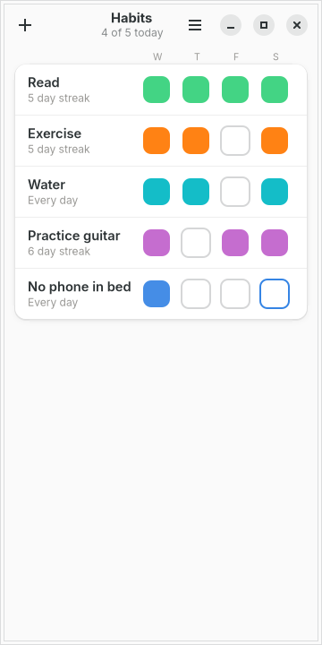
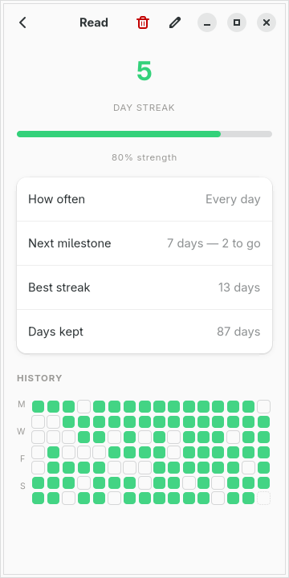
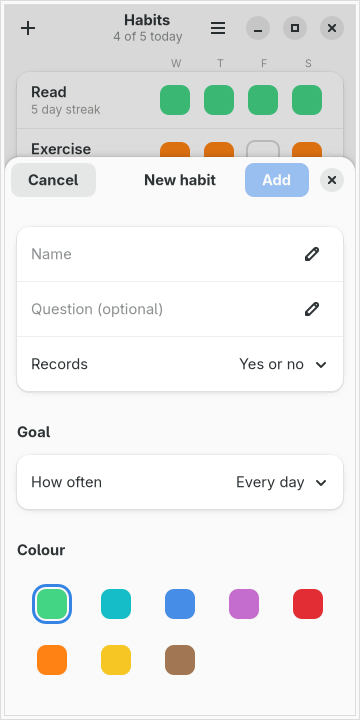

# moarchy-habits

Habit tracking for a Linux phone: a row of days per habit, a tap to mark one
kept, and a history that shows whether it is actually sticking.

<p align="center">
  
  
  
</p>

<p align="center"><em>360×720, the size of a PinePhone's screen under
mobileomarchy. The colours are not the app's own — every one of them is derived
from the active Omarchy theme.</em></p>

Built for [mobileomarchy](https://github.com/SimonSchubert/mobileomarchy), but
nothing in it is specific to that: it is a GTK4/libadwaita app and runs on
Phosh, Plasma Mobile, postmarketOS or an ordinary desktop.

Android has had good habit trackers for a decade — Loop has been translated into
seventy-two languages. Linux has had none: not in the Arch repos, not on
Flathub, not in the AUR. The nearest thing in moarchy-store's catalogue is
`francis`, and `francis` is a pomodoro timer.

## What it does

- **A row of five days per habit**, today on the right, a tap to mark one kept
- **Yes-or-no habits and counted ones.** "Did you read?" and "eight glasses of
  water" are both habits, and a counted one fills in as it goes
- **Goals that are not daily.** "Three times a week" is on track on any day the
  trailing week holds three, which is the whole point of saying three times a
  week rather than naming which three
- **A strength score**, not just a streak. A streak is binary and cruel: it says
  nothing between 42 and 0. Strength drops a little for a missed day and
  recovers as fast as it fell
- **Sixteen weeks of history** in the shape everyone already reads from
  contribution graphs
- **A tick that answers back.** The mark haloes and pops under the thumb, the
  header counts *4 of 5 today*, and finishing the day says so
- **Milestones at 7, 30, 100 and 365 days**, with the next one always named on
  the habit's page — *7 days — 2 to go*
- **Everything local.** One JSON file, no account, no network code in the app
- **The phone's colours.** A habit picks a *role* — the theme's green, its blue —
  and `omarchy-theme-set` recolours every mark in place

## Rewards, and what is deliberately not here

There are no points, no coins, no levels and no avatar. Extrinsic currency is
the thing most likely to crowd out the reason someone started, and it would
fight the strength score below, which exists precisely so the app is not a
casino that pays out on streaks.

What is here is acknowledgement, at the two moments that are actually worth
marking:

- **The tick.** A halo expands out of the mark and it pops, once, for 320ms.
  This is the whole reward loop of a habit tracker and it was silent — the
  square changed colour in the same frame with nothing to tell a thumb it had
  landed. It respects `prefers-reduced-motion`: the halo stays, the motion goes.
- **Crossing something.** A toast at 7, 30, 100 and 365 days, and one when the
  last habit of the day is ticked. Only on *crossing* — re-ticking a day inside
  a 40-day streak does not re-announce the 30, and unticking never celebrates.

A tracker that congratulates every tap is a tracker people mute.

## Why a streak is not enough

A streak counts consecutive days and resets to zero on the first miss, which
makes it a bad measure of a habit and a worse motivator: the day after a lapse,
someone doing well for a month and someone who has never started look identical.

The strength score is an exponential moving average of on-track days with a
thirty-day half life. Thirty days of keeping a habit puts it near the top;
thirty days of ignoring it puts it near the bottom; one missed Tuesday costs a
percent or two. It is the number worth looking at, so it is the one under the
progress bar — and the streak is still there, because a streak is fun.

Both are computed in `habits.py`, which imports no GTK. That is what makes them
testable: `tests/test_habits.py` runs anywhere there is a Python, and covers the
rolling window, the forgiving treatment of today, and the decay.

## Today is forgiving, yesterday is not

A habit not yet done *today* does not break its streak, because the day is not
over. A gap yesterday does. Getting this wrong is the classic habit-tracker bug:
open the app at breakfast and be told the streak you have kept for six weeks is
gone.

## The file

`~/.local/share/moarchy-habits/habits.json`, or `$MOARCHY_HABITS_DIR` if set.

No database. A person tracks a dozen habits, not a million rows, and a single
JSON file can be read by anything, diffed, synced with rsync or git, and
repaired by hand. `sqlite3 habits.db .dump` is not a thing you can do on a device
with no keyboard.

A tick is stored against a **date**, never a timestamp: the question is "did I do
it today", and today is a calendar day where the person is standing. Writes go
through a temp file, an fsync and a rename, because on a phone "killed while
saving" is the ordinary case.

```json
{
 "schema": 1,
 "habits": [
  {"id": "…", "name": "Read", "kind": "boolean", "colour": "green",
   "freq_num": 1, "freq_den": 1,
   "entries": {"2026-09-10": 1, "2026-09-11": 1, "2026-09-12": 1}}
 ]
}
```

## Running it

```sh
python3 -m moarchy_habits
```

To see it with a history rather than an empty list:

```sh
export MOARCHY_HABITS_DIR=$(mktemp -d)
python3 scripts/demo-habits.py
python3 -m moarchy_habits
```

`scripts/demo-habits.py` refuses to run without `MOARCHY_HABITS_DIR` set, so it
cannot overwrite real habits.

## Checks

```sh
scripts/check.sh
```

ruff, then the storage tests, then a real run on a virtual screen that fails on
any GTK warning. That last one is the one that matters: a layout error is not an
exception — the app starts, the window appears, and one widget is the wrong size,
with a single line on stderr as the only sign.

| variable | what it does |
|---|---|
| `MOARCHY_HABITS_DIR` | where habits live |
| `MOARCHY_HABITS_TODAY` | override today, so a test does not depend on the day it runs |
| `MOARCHY_HABITS_QUIT_AFTER` | quit after N seconds, for headless runs |

## Licence

MIT.
