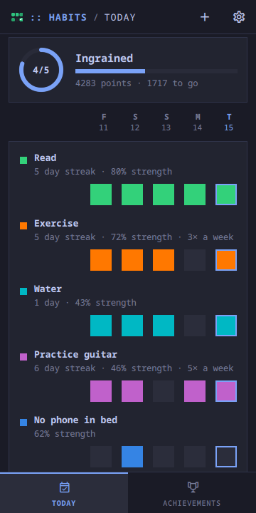
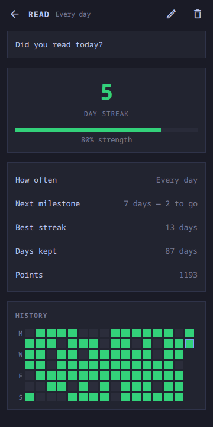
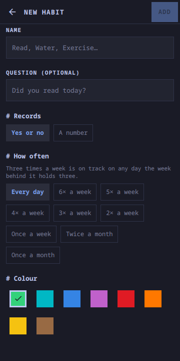
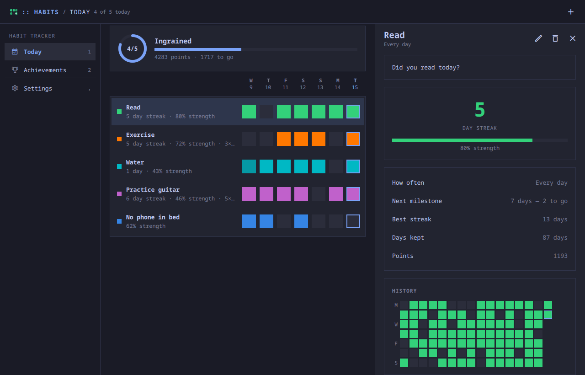

# moarchy-habits

Habit tracking for a Linux phone: a row of days per habit, a tap to mark one
kept, and a history that shows whether it is actually sticking.

<p align="center">
  
  
  
</p>
<p align="center">
  
</p>

<p align="center"><em>360×720, and a desktop window. One app: below 720 px
it lays out as a phone app, above it the habit you pick opens beside the list.
The colours are not the app's own — a habit picks a role, the theme's green or
its blue, and every mark follows the active Omarchy theme.</em></p>

A Quickshell app. Inside the Omarchy shell it is a panel the shell keeps
loaded, so opening it is showing a window rather than starting a process; on
any other Quickshell desktop `moarchy-habits` runs it as its own. 0.1.2 was a
GTK4/libadwaita app, and a day ticked in it is ticked here: the file is the
same.

Android has had good habit trackers for a decade — Loop has been translated into
seventy-two languages. Linux has had none: not in the Arch repos, not on
Flathub, not in the AUR. The nearest thing in moarchy-store's catalogue is
`francis`, and `francis` is a pomodoro timer.

## What it does

- **A row of days per habit** — five on a phone, a week on a desktop — today on
  the right, a tap to mark one kept
- **Yes-or-no habits and counted ones.** "Did you read?" and "eight glasses of
  water" are both habits, and a counted one fills in as it goes
- **Goals that are not daily.** "Three times a week" is on track on any day the
  trailing week holds three, which is the whole point of saying three times a
  week rather than naming which three
- **A strength score**, not just a streak. A streak is binary and cruel: it says
  nothing between 42 and 0. Strength drops a little for a missed day and
  recovers as fast as it fell
- **Sixteen weeks of history** in the shape everyone already reads from
  contribution graphs
- **A tick that answers back.** The mark haloes under the thumb, the header
  counts *4 of 5 today*, and finishing the day says so
- **Milestones at 7, 30, 100 and 365 days**, with the next one always named on
  the habit's page — *7 days — 2 to go*
- **Points, seven levels and ten achievements**, none of which can be lost
- **Everything local.** One JSON file, no account, no network code in the app
- **The phone's colours.** A habit picks a *role* — the theme's green, its blue —
  and `omarchy-theme-set` recolours every mark in place

## Rewards

A scoreboard, not a currency. There is nothing to spend points on, nothing to
buy, and no way to earn one except by keeping a day — so the app can never ask
you to come back for a reward that is not the habit itself.

| | |
|---|---|
| A kept day | 10 points, plus 1 per day of the streak it belongs to |
| Streak bonus | capped at 10, so a long streak never makes a new habit feel pointless to start |
| Levels | seven, at 0 · 100 · 300 · 700 · 1500 · 3000 · 6000 — *Day one* to *Second nature* |
| Achievements | ten, earned once and never lost |

**Nothing subtracts.** A tracker that can punish you is one you stop opening on
the days it matters most, which is the opposite of the job. There is no streak
insurance to buy back a missed day either — the strength score already exists so
that a lapse costs a percent instead of everything, and a currency you could
lose or repurchase would undo it.

Achievements are questions about *history*, not about the last tap, so they are
answered when the file is read as well as when a day is ticked. Import a year of
habits and the badges you already earned are there. The rules all live in
`Game.js`, which has no QML in it, so they are covered by tests rather than by a
screenshot.

And acknowledgement, at the moments actually worth marking:

- **The tick.** A halo expands out of the mark, once, for 320ms. This is the
  whole reward loop of a habit tracker, and a square that changes colour in the
  same frame with nothing else tells a thumb nothing about whether it landed.
- **Crossing something.** A toast for a new achievement, for 7, 30, 100 and 365
  days, and for the last habit of the day — at most one per tap, rarest first.
  Only on *crossing*: re-ticking a day inside a 40-day streak does not
  re-announce the 30, and unticking never celebrates.

A tracker that congratulates every tap is a tracker people mute.

## Why a streak is not enough

A streak counts consecutive days and resets to zero on the first miss, which
makes it a bad measure of a habit and a worse motivator: the day after a lapse,
someone doing well for a month and someone who has never started look identical.

The strength score is an exponential moving average of on-track days with a
thirty-day half life. Thirty days of keeping a habit puts it near the top;
thirty days of ignoring it puts it near the bottom; one missed Tuesday costs a
percent or two. It is the number worth looking at, so it is the one under the
progress bar — and the streak is still there, because a streak is fun.

Both are computed in `Habits.js`, which has no QML in it. That is what makes
them testable: `tests/tst_habits.qml` runs with no display, and covers the
rolling window, the forgiving treatment of today, and the decay -- against the
numbers 0.1.2's Python produced.

## Today is forgiving, yesterday is not

A habit not yet done *today* does not break its streak, because the day is not
over. A gap yesterday does. Getting this wrong is the classic habit-tracker bug:
open the app at breakfast and be told the streak you have kept for six weeks is
gone.

## The file

`~/.local/share/moarchy-habits/habits.json`, or `$MOARCHY_HABITS_DIR` if set.

No database. A person tracks a dozen habits, not a million rows, and a single
JSON file can be read by anything, diffed, synced with rsync or git, and
repaired by hand. `sqlite3 habits.db .dump` is not a thing you can do on a device
with no keyboard.

A tick is stored against a **date**, never a timestamp: the question is "did I do
it today", and today is a calendar day where the person is standing. Writes go
through a temp file and a rename, because on a phone "killed while saving" is
the ordinary case. A file that will not parse is moved aside as
`habits.broken-<time>.json` before anything is written over it.

```json
{
 "schema": 2,
 "habits": [
  {"id": "…", "name": "Read", "kind": "boolean", "colour": "green",
   "freq_num": 1, "freq_den": 1,
   "entries": {"2026-09-10": 1, "2026-09-11": 1, "2026-09-12": 1}}
 ],
 "meta": {"achievements": {"first": "2026-09-10"}}
}
```

## Running it

```sh
quickshell -p apps/habits/shell.qml
```

To see it with a history rather than an empty list:

```sh
export MOARCHY_HABITS_DIR=$(mktemp -d)
python3 apps/habits/dev/demo.py
quickshell -p apps/habits/shell.qml
```

`dev/demo.py` refuses to run without `MOARCHY_HABITS_DIR` set, so it cannot
overwrite real habits.

## Checks

```sh
docker run --rm -v "$PWD:/src" -w /src moarchy-qml scripts/app-check.sh habits
docker run --rm -v "$PWD:/src" -w /src moarchy-qml scripts/app-shot.sh habits
```

The first is qmllint, the streaks, scores, points and achievements (`tests/`,
the cases 0.1.2's Python tests had), and a real run that fails on any QML
warning. The second photographs `dev/shots` at a phone's size and a desktop's.

On a desktop: `1` and `2` are Today and Achievements, `n` adds a habit, the
arrows move through them, Space ticks today, Enter opens one, `e` edits it and
Delete deletes it.

| variable | what it does |
|---|---|
| `MOARCHY_HABITS_DIR` | where habits live |
| `MOARCHY_HABITS_TODAY` | override today, so a test does not depend on the day it runs |
| `MOARCHY_QUIT_AFTER` | quit after N seconds, for headless runs |
| `MOARCHY_HABITS_OPEN` | open a habit by name, for the screenshots |
| `MOARCHY_HABITS_PAGE` | open on `achievements` or `settings` |
| `MOARCHY_HABITS_NEW` | open with the new-habit page up |

## Licence

MIT.
