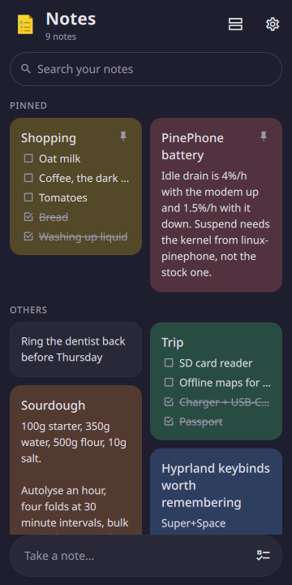
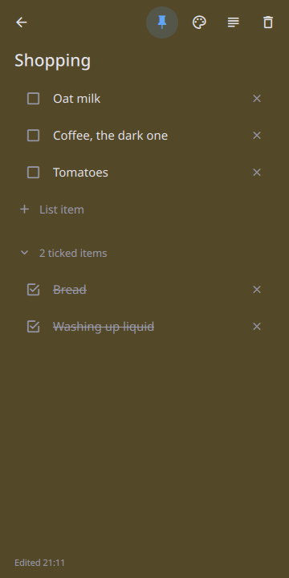
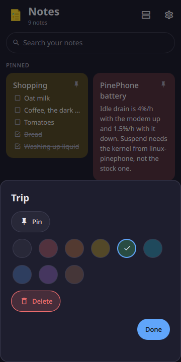
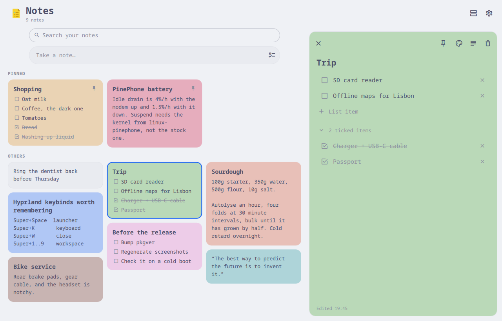

# moarchy-keep

Notes and checklists in the shape of Google Keep: a masonry grid of coloured
cards, a note that opens when you tap it, and nothing between typing and it
being saved.

<p align="center">
  
  
  
</p>
<p align="center">
  
</p>

<p align="center"><em>360×720, and a desktop window. One app: below 720 px it
is two columns with the note opening over the grid; above it, as many columns
as fit and the note in a pane beside them. Every colour is the active Omarchy
theme's.</em></p>

A Quickshell app. Inside the Omarchy shell it is a panel the shell keeps
loaded, so opening it is showing a window rather than starting a process; on
any other Quickshell desktop `moarchy-keep` runs it as its own. 0.1.1 was a
GTK4/libadwaita app, and every note typed in it is here: the file is the same.

## What it does

- **Text notes and checklists**, and either can become the other
- **A masonry grid**, so a two-word note takes two words of space, and a
  single-column view
- **Nine colours**, pinning, search, and delete with an undo
- **Everything local.** One JSON file, no account, no network code

## Two kinds of note, one card

A note is prose or it is a list of tick boxes, and the tick-box button turns
one into the other without losing anything — converting a list to text keeps
each ticked item as a `✓`, converting back splits on lines and ticks those
again. Ticked items drop to the bottom of the list under a heading that
collapses them, which is what stops a shopping list from being mostly things
you have already bought.

Typing is the whole interaction. Enter at the end of a list item makes the next
one, backspace in an empty one removes it, and a note you open and back out of
without typing is discarded rather than left as a blank card. A long press on a
card, or a right click, pins it, recolours it or deletes it without opening it.

## The colours come from your theme

Keep's identity is coloured notes. Omarchy's is that one `omarchy-theme-set`
recolours everything at once. So the nine note colours are *derived*: each is a
hue from the active theme — its red, its orange, its green — washed a short way
into the theme's own background. Deep and desaturated on a dark theme, pastel
on a light one, and repainted in place when the theme changes. Without an
Omarchy theme it follows the desktop's light or dark, and Settings can pin
either.

## Where the notes live

`~/.local/share/moarchy-keep/notes.json`, and that is the whole storage layer.
A phone holding a few hundred notes does not need a database, and a plain file
can be read by anything, diffed, synced with rsync or git, and repaired by
hand.

Writes go to a temporary file and a rename, so an interrupted save leaves the
previous file rather than half of the new one. Typing is written out half a
second after you stop, and again when the note closes.

If the file cannot be parsed — or is JSON that is not a notes file — it is
**kept, not overwritten**: it is moved to `notes.broken-<timestamp>.json`, and
the app starts empty and says so.

## Running it

```sh
quickshell -p apps/keep/shell.qml
```

With notes in it rather than an empty grid:

```sh
export MOARCHY_KEEP_DIR=$(mktemp -d)
python3 apps/keep/dev/demo.py
quickshell -p apps/keep/shell.qml
```

On a desktop: `n` is a new note, `l` a new list, `/` searches, `g` switches
between the grid and one column, and Escape closes the note or clears the
search.

## Checks

```sh
docker run --rm -v "$PWD:/src" -w /src moarchy-qml scripts/app-check.sh keep
docker run --rm -v "$PWD:/src" -w /src moarchy-qml scripts/app-shot.sh keep
```

The first is qmllint, the notes and their file (`tests/`, the cases 0.1.1's
Python tests had), and a real run that fails on any QML warning. The second
photographs `dev/shots` at a phone's size and a desktop's.

| variable | what it does |
|---|---|
| `MOARCHY_KEEP_DIR` | where the notes live |
| `MOARCHY_QUIT_AFTER` | quit after N seconds, for headless runs |
| `MOARCHY_KEEP_OPEN` | open a note by id or part of its title |
| `MOARCHY_KEEP_NEW` | start a new `text` or `list` note |
| `MOARCHY_KEEP_MENU` | open a card's menu by part of its title |
| `MOARCHY_KEEP_QUERY` | start with a search |
| `MOARCHY_KEEP_SETTINGS` | open on Settings |

## Not in this version

Labels, archive, reminders, images, drawing, voice notes, sharing and sync. Keep
has all of them; this has notes, lists and colours, which is the part that is
used every day. The storage format has room for the rest — every note carries an
id and timestamps — but nothing here is waiting on them.

## Licence

MIT.
