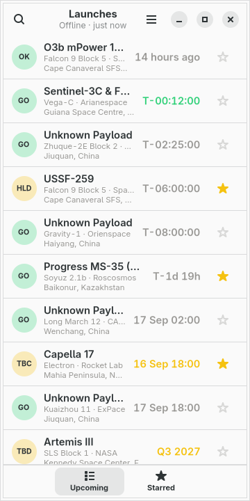
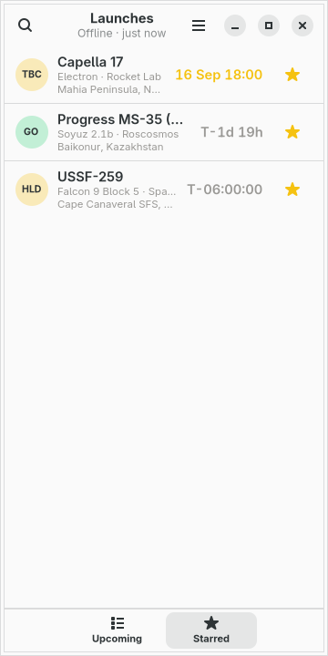
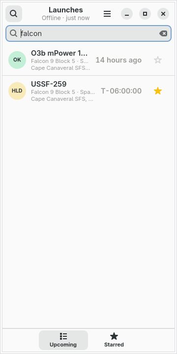
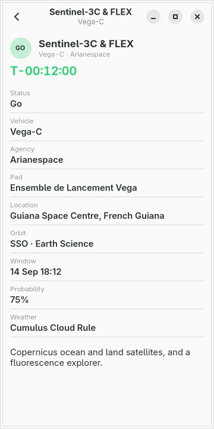

# moarchy-launches

A launch tracker for a Linux phone: the next twenty by NET, the few you star
kept on their own page, and a countdown that is honest about how well the
time is actually known.

<p align="center">
  
  
  
  
</p>

<p align="center"><em>360×720, the size of a PinePhone's screen under
mobileomarchy. The colours are not the app's own — they are the active Omarchy
theme's, and <code>omarchy-theme-set</code> repaints the list while it is on the
screen. The times in these pictures are invented: the shots are taken offline
against <code>demo.py</code>, which is the only reason two of them agree.</em></p>

Built for [mobileomarchy](https://github.com/SimonSchubert/mobileomarchy), but
nothing in it is specific to that: it is a GTK4/libadwaita app that makes one
HTTPS request, and it runs on Phosh, Plasma Mobile, postmarketOS or an ordinary
desktop.

## This one is not on the list

Every app in this repo either answers a row in moarchy-store's
`docs/android-gaps.md` or says plainly that it does not. This one does not —
that list is drawn from F-Droid's catalogue filtered by translation count,
screenshots and release history, and Space Launch Now never made the cut.

What is true is that the probe the list describes comes back empty when it is
pointed at this job. Run by hand on 2026-09-14 against the same three sets:

- **the Arch repos** (which the aarch64 ones track): nothing. The nearest
  thing is a terminal satellite tracker on the AUR, which is orbits, not
  pads, and which on a phone means opening a keyboard over the well.
- **the AUR**: satellite tracking, game launchers, nothing that counts down
  to a Falcon 9.
- **Flathub**: planetaria and desktop dashboards. Somewhere to *watch* a
  launch is a livestream, which is a different and much heavier thing than
  somewhere to see when it is.

So the gap this fills is narrow and worth stating as narrowly as it is: a
glanceable list at 360px, a watchlist a thumb can reach without scrolling
past twenty rows, a countdown that stops lying when the NET is a quarter,
the phone's own colours, and nothing installed beyond the GUI stack that is
already there.

## What it does

Two pages, and the switcher is along the bottom where a thumb already is.

**Upcoming** — the next twenty launches by NET:

- status as a short mark in a coloured disc, the mission, the vehicle and
  the agency, the pad, and a countdown or a date
- a **countdown that knows how well the time is known**: a NET to the
  second ticks `T-04:21:07`; a NET to the quarter is `Q3 2026`; TBD and TBC
  are a date, never a fake clock
- search by mission, vehicle, agency or pad, from the front — so `falcon`
  finds Falcon 9 rather than putting Surface Electric Fields above it
- a tap opens the same launch: window, orbit, probability, weather, hold,
  description. No second request, and no map

**Starred** — the same rows, for the launches you tapped a star on:

- in **the order you starred them**, not by NET. A watchlist sorted by
  countdown reorders itself under a thumb that is halfway down it
- a star is written to disk before the tap is over, because the next thing
  that happens to a phone app is usually being killed
- a starred launch that has flown off the next twenty simply leaves the
  page. There is no second request for it: fifteen calls an hour cannot
  afford one

## Where the numbers come from

[Launch Library 2](https://thespacedevs.com/llapi) by The Space Devs, one
`GET` of `/2.2.0/launch/upcoming/?limit=20` on a thread. That is the whole
of the network in this app, and every fact on screen comes out of that one
answer.

- **No account and no key.** The keyless tier is fifteen calls an hour per
  address, shared with everybody behind the same carrier NAT, so a 429 is
  an ordinary answer rather than an error: the app waits as long as the
  answer asked it to, or four minutes if it did not say.
  `MOARCHY_LAUNCHES_KEY` sends a token for anybody who has registered one.
- **The clock is local; the fetch is not.** Countdown ticks once a second
  from the NET that was already in memory. The pad is asked again at most
  four times an hour while the window is on screen, and more often only
  when something is actually about to fly — every five minutes inside an
  hour, every two inside ten — which is Launch Library's own advice, and
  which still fits the anonymous ceiling.
- **A failure leaves the launches alone.** A NET from four minutes ago is
  worth something and a blank page is worth nothing, so a refresh that
  fails keeps the list, says `Not updating · 4 min ago` in the header, and
  backs off. The only screen that says nothing is the one that has never
  had anything to say.
- **The clock stops when the window leaves the screen.** An app that keeps
  pulling the pad after the phone is in a pocket is a battery bug and a
  data bill wearing a feature's clothes, and on a phone the app is not
  closed, it is hidden.
- **It opens on launches.** The last answer is cached, so a launch on a
  train with no signal shows the pad as of whenever it last had one, with
  its age in the header rather than a spinner.
- **Flown launches stay for a day.** Launch Library leaves them on
  `upcoming` so the outcome arrives without a second call. A Success row
  that says `14 hours ago` is the truthful end of a countdown you were
  watching, not a bug.

## What leaves the phone

One HTTPS request, to one host, with no cookie, no account and nothing in
it but how many launches to send back. The stars never leave the device.

The app does not fetch rocket photographs. Twenty images from a CDN would
tell that CDN which launches you watch, for pictures this screen has no
room for. The status sits in a coloured disc instead, and the colour comes
from the status, not from a hash of the id.

## The phone's colours

Go is the theme's green and Failure is its red, and neither is ever alone:
every badge carries letters as well as a hue, because roughly one man in
twelve cannot tell those two colours apart. The colour is what makes twenty
rows scannable; the mark is what makes them readable.

A Go inside an hour is drawn in that green on the countdown too; a Go that
has passed T-0 without flipping to Success is drawn in the red, as `T+`.
TBD and TBC are the theme's yellow and a date.

Nothing in this app is drawn with cairo. No rocket, no map, no patch, so
every figure on screen is a label — which means it scales with the phone's
font size, ellipsizes when a name is too long, and is read out by a screen
reader. That is also why the package does not depend on `python-cairo` the
way Vitals does.

## What is deliberately not in it

- **A livestream.** Upcoming answers have a `webcast_live` flag and no URL;
  the URL lives behind `mode=detailed`, which is a second request this app
  will not spend. Opening a browser is a later app.
- **Rocket photographs.** See above.
- **An agency watchlist.** Starring SpaceX would turn Starred into a copy
  of Upcoming. Star the launch; filter by agency with the search box.
- **A previous-launches archive.** The 24-hour tail is the outcome of what
  you were watching, not a history.
- **Notifications.** A T-10 ping is a background service, and this app has
  no process when it is not on screen. That is the property that keeps it
  free.
- **A map.** The pad coordinates Launch Library sends point at Google.

## Working on it

```sh
scripts/check.sh launches               # ruff, the tests, and a real run at 360x720
scripts/screenshot.sh launches          # the pictures above

# Does the search box raise the phone's keyboard? The probe has to be told how
# to open something typable, and in this app that is the search bar:
PROBE_ENV=MOARCHY_LAUNCHES_SEARCH= scripts/text-input-check.sh launches
```

No test here opens a socket, and neither does a check run. `launches.py` and
`store.py` import no GTK at all, so parsing somebody else's JSON and formatting
a countdown are tested on any machine with a Python; the window is handed a
source object rather than making one, so the UI tests hand it a stand-in; and
`demo.py` writes a cache seconds old, which is why the real run has nothing to
fetch.

| variable | what it does |
|---|---|
| `MOARCHY_LAUNCHES_DIR` | where the stars and the cached launches live |
| `MOARCHY_LAUNCHES_KEY` | a Launch Library token, sent as `Authorization: Token …` |
| `MOARCHY_LAUNCHES_OFFLINE` | never touch the network; show what is cached |
| `MOARCHY_LAUNCHES_NOW` | freeze 'now' so a countdown does not move |
| `MOARCHY_LAUNCHES_PAGE` | open on `upcoming`, `favourites` or `detail` |
| `MOARCHY_LAUNCHES_OPEN` | which cached launch the detail page opens |
| `MOARCHY_LAUNCHES_SEARCH` | open with the search box up, and this in it |
| `MOARCHY_LAUNCHES_QUIT_AFTER` | quit after N seconds, for the headless checks |

## Where to get it

Not published yet. The package builds with `scripts/package.sh launches` and
installs on a phone with `scripts/device.sh install launches`. AUR,
`[moarchy-apps]` and the store catalogue wait.

## Licence

MIT. Launch data from [Launch Library 2](https://thespacedevs.com/llapi) by
The Space Devs, whose terms are their own.
