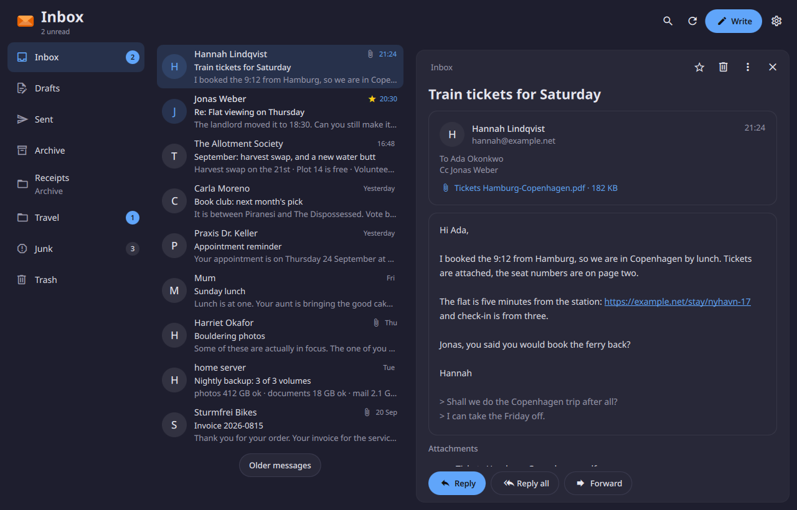
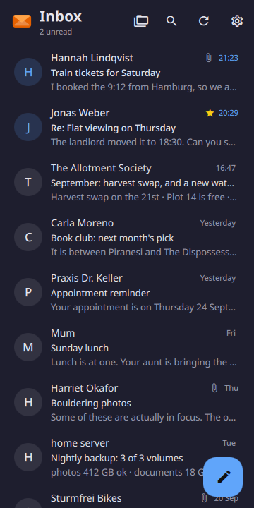
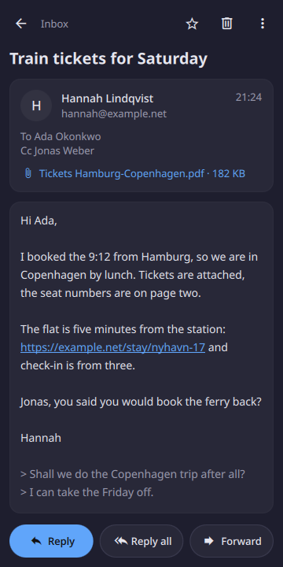
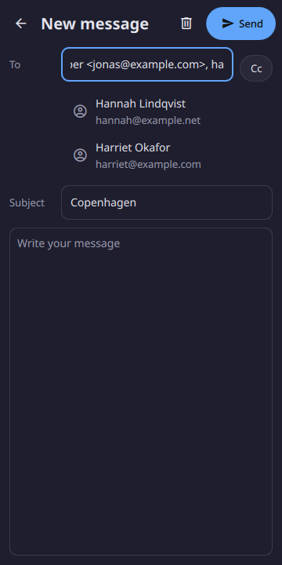
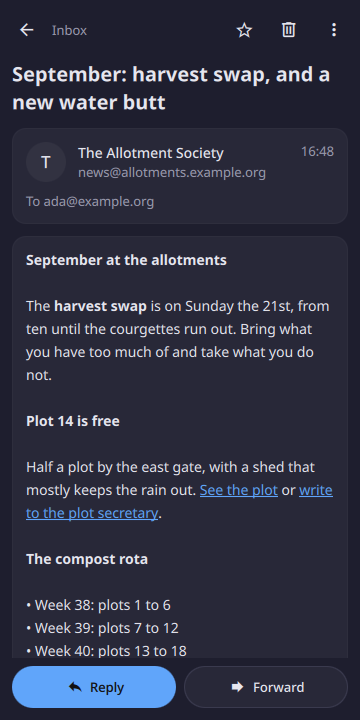
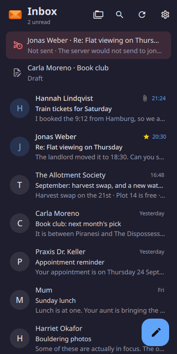
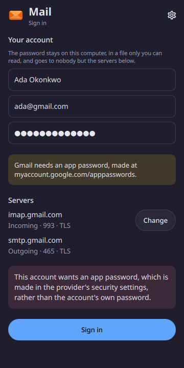

# Mail

One email account: its folders, reading, replying, and new mail in the Inbox
noticed with the window closed.

<p align="center">
  
</p>
<p align="center">
  
  
  
</p>
<p align="center">
  
  
  
</p>

<p align="center"><em>A desktop window, and 360×720. One app: below 720 px
it is one screen at a time, above it the folders, the folder and the message
side by side. Every colour is the active Omarchy theme's.</em></p>

A Quickshell app. Inside the Omarchy shell it is a panel the shell keeps
loaded, so opening it is showing a window, and the shell's copy is the one
that looks for new mail with the window closed; on any other Quickshell
desktop `moarchy-mail` runs it as its own process. 0.1.0 was a phone-only
shell plugin, copied on by a script; 0.2.0 is the first package, and reads
the same `~/.local/share/moarchy-mail`.

It replaced Geary on the phone. Geary is a good mail client, but
moarchy-store's sweep rejected it for a phone screen — *"desktop-shaped
three-pane mail client. Also wants an unlocked keyring"* — and where no
keyring is unlocked, the prompt for one maps behind Geary's own window.

## How it reaches a server

QML cannot open a TLS socket, so the app never talks to a server itself.
`libexec/moarchy-mail` does, one run per request — a verb, the request as JSON
on stdin, one JSON object on stdout — and exits. It is Python with nothing but
the standard library: `imaplib`, `smtplib` and `email`, which is where the
years of charset and MIME handling already are. It imports each of them only
in the run that needs it: on a PinePhone the imports were 1.1 of the 1.5
seconds a run took before it said a word to a server.

| the app wants | moarchy-mail does |
| --- | --- |
| a folder | `STATUS`, `EXAMINE`, the UIDs and flags from the oldest message the app already has, and headers plus the first 3 KB of body only for the ones it does not |
| older messages | `UID SEARCH` below the oldest, the next fifty |
| a message | `UID FETCH BODY.PEEK[]`, kept as `.eml`, parsed into text and links |
| read, starred | `UID STORE`, drawn at once and held until the server has said yes |
| delete | `UID MOVE` to Trash (or `COPY` and `EXPUNGE`); in Trash, gone, after asking |
| send | SMTP, then `APPEND` to Sent unless the provider files it there itself, and `\Answered` or `$Forwarded` on the original |
| what is new | `STATUS INBOX` and `UID SEARCH UNSEEN` above the last UID seen, every fifteen minutes |

Between refreshes the app draws from its own files, so a folder opens at once
and a message read before opens without the network.

Packaged, the helper is `/usr/lib/moarchy-mail/moarchy-mail` and is not on
`PATH`: `/usr/bin/moarchy-mail` is the launcher. A phone that had 0.1.0
installed by its script has the old helper at `~/.local/bin/moarchy-mail`,
which shadows the launcher on most `PATH`s — delete it.

## No HTML is drawn

The helper turns an HTML message into text, bold and links, and the app draws
the result as StyledText. Every tag in that string was written by the helper:
there is no ``, so nothing in a message can make the computer fetch a
picture — which is how a sender learns that, when and where a message was
read — and a link's `href` is only an index. Clicking a link shows where it
goes before opening it, because in mail the words of a link and its address
are two different claims.

What is lost is layout. A newsletter comes out as its headings, paragraphs,
lists and links, and says how many pictures it had.

## The password

It is in `~/.local/share/moarchy-mail/password`, mode 0600, in a 0700
directory, and nowhere else: not in `account.json`, not on a command line, and
not in the app, which hands it to the helper once on stdin when the form is
sent. That is how aerc, neomutt and msmtp keep one. It is not in the keyring
because that is the thing Geary was waiting on.

Anybody who can read your home directory can read it.

## New mail

Inside the Omarchy shell the plugin is kept loaded. Ninety seconds after the
shell starts, and every fifteen minutes after that, it runs `moarchy-mail
peek`: one login, one `STATUS`, and headers only if there is something new.
New mail rings feedbackd's `message-new-email` where there is feedbackd, and
sends a notification. It is not IMAP IDLE, which would be a process holding a
connection open all day for a message that can wait a quarter of an hour.

With the window closed those two timers are all there is, and every screen
but the folder is built only while it is on screen. Run on its own, Mail looks
only while its window is open: closing it ends the process.

## Phone and desktop

Below 720 px: a folder, with the pencil in the corner; the folders, a message
and writing are each a screen of their own, and back leaves them. A message
held, or right-clicked, offers read, star, archive, junk and delete.

Above it: the folders in a column, the folder beside them, and the message —
or the one being written — in a pane on the right. On a keyboard:

| key | |
| --- | --- |
| `j` `k`, `↑` `↓` | the next or the previous message, opened in the pane |
| `c` | write a message |
| `r` `a` `f` | reply, reply all, forward |
| `s` `u` | star; mark read or unread |
| `Delete` | move to Trash |
| `/` | search the messages on this computer |
| `Ctrl+Enter` | send, while writing |
| `Esc` | back one step |

Search looks through the messages already fetched — sender, subject and
first line — not the server's.

## Running it

```sh
quickshell -p apps/mail/shell.qml
```

With a week of mail rather than a sign-in screen:

```sh
export MOARCHY_MAIL_DIR=$(mktemp -d)/moarchy-mail MOARCHY_MAIL_OFFLINE=1
python3 apps/mail/dev/demo.py
quickshell -p apps/mail/shell.qml
```

And from a shell, while it runs:

```sh
quickshell ipc -p apps/mail/shell.qml call mail compose "ada@example.org"
quickshell ipc -p apps/mail/shell.qml call mail check
```

## Checks

```sh
docker run --rm -v "$PWD:/src" -w /src moarchy-qml scripts/app-check.sh mail
docker run --rm -v "$PWD:/src" -w /src moarchy-qml apps/mail/tests/e2e.sh
docker run --rm -v "$PWD:/src" -w /src moarchy-qml scripts/app-shot.sh mail
```

The first is every app's: lint, the folder, address and message logic, and a
real run that fails on any QML warning. The second is the helper against a
real server — Dovecot, installed into the container for the run, plain and
over TLS with a certificate from a CA made on the spot — and an SMTP server in
the test that keeps what it is sent. It signs in with a wrong password and a
closed port, lists folders with a name in UTF-7, pages back through a folder,
fetches a body and an attachment, marks, moves, deletes, finds new mail, and
forwards a message with its PDF, then looks for the copy in Sent. The third
photographs `dev/shots`.

| variable | what it does |
|---|---|
| `MOARCHY_MAIL_DIR` | where the account and the mail live |
| `MOARCHY_MAIL_HELPER` | a helper other than the one beside the app |
| `MOARCHY_MAIL_OFFLINE` | never run the helper: the files only |
| `MOARCHY_MAIL_PAGE` | `folders`, `setup`, `compose`, `search` or `settings`, for the screenshots |
| `MOARCHY_MAIL_OPEN` | open the message with this UID |
| `MOARCHY_QUIT_AFTER` | quit after N seconds, for headless runs |

## What it does not do

- One account.
- No OAuth. Gmail, Yahoo and iCloud need an app password instead of the
  account's own; Microsoft accounts no longer take a password over IMAP at
  all. The sign-in screen says which, before the password is typed. None of
  the four has been signed in to from here yet — only Dovecot has.
- No conversations: each message is its own row.
- No server-side search.
- No pictures, and no HTML layout — see above.
- No attaching files to a new message. A forward carries the original's
  attachments; there is no file picker to choose one from.
- No signature, no rules, no push. New mail is noticed within fifteen minutes.
- Drafts stay on this computer rather than in the server's Drafts folder.
