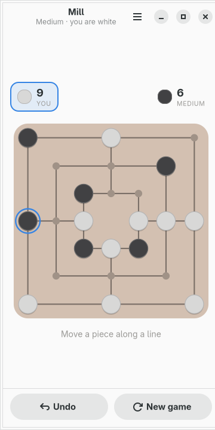
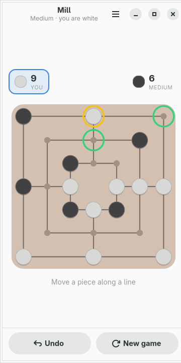
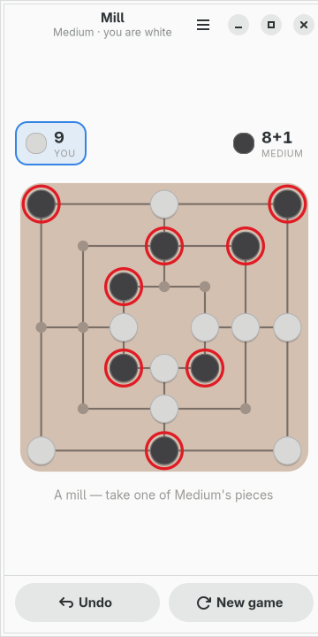
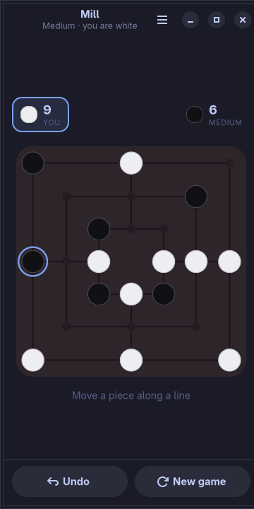

# moarchy-mill

Nine Men's Morris for a Linux phone: three squares drawn for 360px, an opponent
that thinks on a clock, and the rule everybody forgets implemented properly.

<p align="center">
  
  
  
</p>

<p align="center"><em>360×720, the size of a PinePhone's screen under
mobileomarchy. The board is not the app's own brown — it is the active Omarchy
theme's, and <code>omarchy-theme-set</code> repaints it while the game is on the
screen.</em></p>

Built for [mobileomarchy](https://github.com/SimonSchubert/mobileomarchy), but
nothing in it is specific to that: it is a GTK4/libadwaita app and runs on
Phosh, Plasma Mobile, postmarketOS or an ordinary desktop.

## This one might actually be a gap

Reversi and Chess in this repo both open by saying they are not gaps, because
GNOME has shipped Iagno and Chess for twenty years. Morris does not have that
answer. `pacman -Ss morris` and `pacman -Ss merels` come back with nothing in
`extra`, and the game is three thousand years old and still played across most
of Europe — so this may be the first app here that is a gap without being on
moarchy-store's list, which measures what F-Droid has that Linux does not.

Either way the brief is the same as everything else here: a board drawn for
360px, an opponent that answers on a clock rather than at a depth chosen on a
laptop, and a game written to disk on every move because phones reclaim apps
rather than closing them.

## One tap, then two

> **One tap while there is a piece in your hand, two once there is not.**

That is not a compromise between the schemes the other apps here use. It is the
difference between the two halves of this game:

- **Placing.** There is nothing to pick up, so a tap on an empty point is the
  whole move.
- **Moving.** The piece matters as much as the point, so a tap picks one up,
  rings it in the theme's yellow, rings every point it may reach in the theme's
  green, and waits. Tapping it again puts it back down.

Auto-moving a piece that has only one empty neighbour would be consistent with
Solitaire two directories over, and would be wrong here. A misplaced move in
Morris costs the game; a card put back does not.

**Taking a piece is one tap on one of the pieces ringed in red**, and which
those are is the rule everybody forgets:

> Not a piece that is in a mill — unless every one of them is.

Without the second half, a side that has walled itself into mills can never be
touched again, and the game stops being the game. It decides real endgames and
it is four lines.

## The board is not a grid

It is three squares and four spokes. The points are at the corners and the
midpoints of those squares, and the gaps between them are not cells — they are
board with nothing on it.

So the board is one drawing area rather than twenty-four widgets, for Reversi's
reason and one more of its own: a grid of widgets would have to be a 7×7 with
twenty-five holes in it, laid out, measured and tappable, to describe a shape
that here is nine lines and twenty-four circles.

And a tap is answered by **the nearest point**, not by the cell it landed in.
The points are about 50px apart at 360 wide, so a finger anywhere within half
that is unambiguous — and the spaces between them mean nothing, so there is
nothing to be wrong about by snapping to the closest.

The whole numbering is `ring * 8 + place`, rings running outer to inner and
places running clockwise from the top-left corner. That is worth its sentence,
because it makes both halves of the adjacency arithmetic rather than a table
somebody has to check by eye: within a ring a point touches `place ± 1`;
between rings only the odd places connect, and they connect straight through.
The sixteen mills fall out the same way — four to a ring, four along the spokes.

## A turn is not always one move

Closing a mill earns a removal, and the removal is made by the same side. That
one fact reaches further into this app than anything else in it.

**In the rules**, the removal is a move of its own with `removing` set, so it
goes into the move list like anything else. Making it implicit would leave the
loader guessing which of nine pieces a recorded game had taken.

**In the search**, it means a child position can have the same player to move as
its parent — and negamax's flip-the-sign is wrong exactly there. Every recursion
in `ai.py` asks whose turn the child is before deciding whether to negate. A
search that gets this wrong plays well right up until it makes a mill and then
throws a piece away, which is easy to write and very hard to see, so
`tests/test_ai.py` tests it directly on a position where the difference is one
piece.

**In undo**, it means a turn is sometimes two entries, so taking a move back
keeps going until it is genuinely your turn again and you are not standing there
owing a piece for a mill you have just un-made.

## The opponent

Alpha-beta over the bitboards, with the depth decided by a clock rather than in
advance. Every level names a number of seconds and a ceiling, and the search
deepens a ply at a time until one of them runs out — so the same "Hard" is a
six-ply opponent on a laptop and a four-ply one on a PinePhone, and neither
leaves somebody holding a phone that has stopped answering.

The evaluation is deliberately flat: material, mills, half-mills, and how much
either side can move. Morris evaluations in the literature run to a dozen
weighted terms including double mills and three-piece configurations. Those are
worth having on a machine that can afford them, and on an A53 every term is
another few thousand positions a second not searched.

**Easy errs without giving pieces away.** When it plays casually it chooses from
every move within a piece of the best one rather than at random, because an
opponent that hands over a piece for nothing does not read as easy, it reads as
broken — and in this game handing over a piece is most of the way to handing
over the game.

Nothing is searched while anything is moving. The order after a tap is

```
tap -> play -> animate -> settled -> think -> play -> animate -> settled
```

and the search does not start until the board has stopped. That is not
politeness, it is CPython: the search is a Python thread and holds the GIL, so a
search running under an animation turns a 210ms slide into a slideshow.

## The pieces stay white and black

The same refusal Reversi makes about its discs, for the same reason: they are a
circle and a circle, so colour would be the only thing telling them apart, and
the popular pair fails for the eight percent of men who cannot separate red from
green. Light against dark survives daylight, a 31px piece and everybody's eyes.

<p align="center">
  
</p>

What does take a hue is the three things that are not pieces — the ring round a
piece you have picked up, the rings round where it can go, and the rings round
what a mill has earned you. Those are shapes in different places doing different
jobs, and none of them is telling you which side anything belongs to.

## The file

`~/.local/share/moarchy-mill/mill.json`, or `$MOARCHY_MILL_DIR` if set.

```json
{
 "schema": 1,
 "game": {"mode": "solo", "level": "medium", "human": "white",
          "finished": false, "recorded": false,
          "moves": [0, 8, 1, 9, 2, 8, 10]},
 "stats": {"medium": {"played": 14, "won": 6, "lost": 7, "drawn": 1, "best": 6}}
}
```

A move is one integer: a placement or a removal is the point itself, and a
movement is `24 + from * 24 + to`. The offset past the twenty-four points is the
whole encoding, and it is what makes both kinds of turn one list.

What is stored is the move list, not the board — so a file that has been
truncated, edited or half-written cannot describe a board that legal play could
not reach, because loading it is playing it. Note the tail of the list above: a
game truncated one entry earlier is a board where white owes a removal, which is
a legal state, replays exactly, and is the one this loader has to come back to.

`recorded` is not the same flag as `finished`. The move that ends a game is
written the instant it is played and counted a moment later, when the piece has
finished sliding — so a phone killed between the two comes back to a decided
board with a result still owed to it, and the app pays it on the way in.

## Running it

```sh
python3 -m moarchy_mill
```

To see it mid-game rather than empty:

```sh
export MOARCHY_MILL_DIR=$(mktemp -d)
python3 demo.py          # the middle game, pieces all placed, you to move
python3 demo.py take     # ...or a mill just closed, with the takeable ringed
python3 -m moarchy_mill
```

`demo.py` refuses to run without `MOARCHY_MILL_DIR` set, so it cannot overwrite
a real game. Both sides are played by the search this app ships, at levels a
shade apart with the clocks turned right down, so the position is one two
competent players could have reached — a hand-placed board is the app telling a
lie about its own rules, and in this game the lie is visible: a side with six
pieces and none in hand has had three taken, and a board that does not add up
says so.

## Checks

```sh
scripts/check.sh mill
```

ruff, then the rules, the search and the file, then the widgets on a virtual
screen, then a real run that fails on any GTK warning.

Three of the tests are the ones worth knowing about. One plays the search
against itself at two depths and fails if the deeper one does not win more. One
asserts that a mill and the removal it earns are worth about a piece *more* than
a quiet move, which is the sign test for the half-turn described above. And one
walks every point on the board at six widget sizes and fails if any piece would
be drawn outside it — because the first cut of this board put the outer ring at
89% of the half-width and photographed with the left and right columns of pieces
sliced off by the window.

| variable | what it does |
|---|---|
| `MOARCHY_MILL_DIR` | where the game lives |
| `MOARCHY_MILL_QUIT_AFTER` | quit after N seconds, for headless runs |
| `MOARCHY_MILL_PAGE` | open straight into `record`, for the screenshots |
| `MOARCHY_MILL_NEW` | open with the new-game sheet up |
| `MOARCHY_MILL_PICK` | open with a piece picked up, for the screenshots |

## Licence

MIT.
