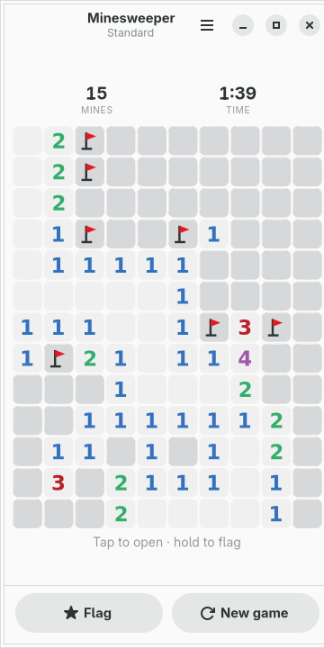
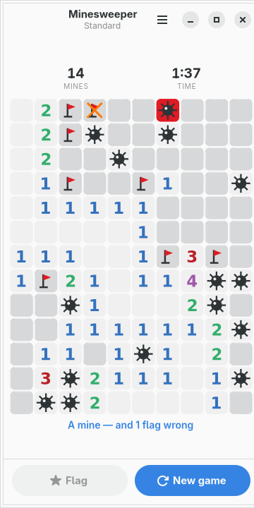
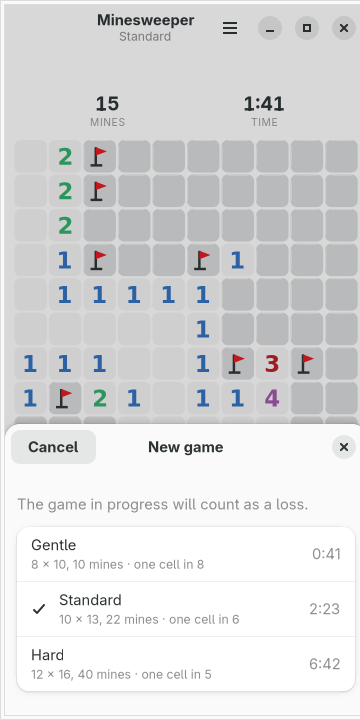

# moarchy-minesweeper

Minesweeper for a Linux phone: boards shaped for a portrait screen, a flag
button that latches, and a clock that stops when the app is not on screen.

<p align="center">
  
  
  
</p>

<p align="center"><em>360×720, the size of a PinePhone's screen under
mobileomarchy. The eight numbers are the eight hues the active Omarchy theme
names, and <code>omarchy-theme-set</code> repaints them while the game is on the
screen.</em></p>

Built for [mobileomarchy](https://github.com/SimonSchubert/mobileomarchy), but
nothing in it is specific to that: it is a GTK4/libadwaita app and runs on
Phosh, Plasma Mobile, postmarketOS or an ordinary desktop.

## This one is not a gap

Every app in this repo that answers a row in moarchy-store's
`docs/android-gaps.md` says so. This is not one: GNOME has shipped Mines for
twenty-five years and it is `gnome-mines` in `extra`.

What it is not is a phone app, and that is three specific things here:

- **The boards are portrait.** The classic three are 9×9, 16×16 and 30×16, and
  the last of those is twice as wide as a phone screen. These are taller than
  they are wide, with the column count chosen so a cell never falls below 28px
  across 360.
- **A hold flags and a button latches.** The dangerous action is never the one a
  slip makes, and the twenty flags a board asks for are twenty taps rather than
  twenty four-hundred-millisecond holds.
- **The clock stops when the window does.** See below; it is the only clock in
  this repository and it had to earn its place.

## The board is 28px and that is fine

Hard is twelve columns, which on 344px of board is a 28px cell — the smallest
tap target in this repository by some way, and well under the 44px a thumb is
usually given. Three things pay for it:

- **A hold flags rather than opens.** The action that can end the game is never
  the one a slipped finger performs.
- **A tap on an opened number chords** — opens everything left around it, once
  its flags are down. That is one tap on a cell which is *already open* and
  therefore cannot be a mine, doing the work of five aimed ones.
- **The flag button latches**, so a run of flags is a run of taps with no mode
  switching and no waiting.

And a chord opens nothing when the flags do not add up. That is not politeness:
it is the difference between a move and a gamble, and a gamble that ends the
game is not something a thumb should be able to do by resting on a number.

## The clock

This is the only clock in the repository, and Solitaire two directories over
refuses one outright on the grounds that **a phone game is one you are
interrupted in the middle of, and a timer that counts through the interruption
is measuring the interruption.**

That argument is right. Minesweeper cannot follow it, because a best time is
most of what this game's record has ever been. So the clock is kept and the
argument is answered instead:

> **It runs only while this is the active window.**

Put the phone down, take a message, switch to the browser — the second hand
stops and the reading goes dim to say so. What is stored is accumulated seconds
rather than a start time, because the thing being measured stops and starts, and
a start time would need correcting every time focus moved.

It is also written to disk once a minute rather than once a second. An fsync per
second for an hour is three and a half thousand writes to a phone's flash, and
the most a crash can cost is the minute it happened in.

## The first tap

It is never a mine, and never a number either.

Every mine is placed *after* the first tap, avoiding the cell tapped **and all
eight around it** — so the first tap always opens a space and floods. A first
tap that ends the game is the oldest complaint about this game and was fixed
decades ago; a first tap that opens a lone 4 in the middle of a blank board is
the same complaint wearing a hat, and the eight extra exclusions avoid both.

## Eight numbers, eight hues

Every Omarchy theme names red, orange, yellow, green, cyan, blue, magenta and
brown. This game has exactly eight numbers. The classic palette — 1 blue,
2 green, 3 red, 4 navy, 5 maroon, 6 teal — maps onto six of them almost exactly,
and the two nobody has ever seen take the last two.

The numbers are the one thing in this app carrying information in colour, and
that is not a choice worth arguing about: **a 3 is legible as a 3.** The colour
is there so the board reads as a shape — so the wall of 1s along an edge is one
thing and the 3 in the middle of it is another — and nothing is lost by not
seeing it. That is the test Reversi's two discs fail and these pass.

The covered and opened cells are mixes of the theme's *foreground* into its
background rather than of its surface, which is the fix for the first version of
this file: a card colour is nearly the window colour on a light theme, so the
covered cells came out invisible and the board photographed as a scatter of
numbers on nothing.

## Nothing animates

Every other board in this repository moves — discs flip, cards fly, a peg hops
— and this one does not, on purpose.

A tap in Minesweeper is a question with an immediate answer, and the answer is
very often half the board. An animation would mean a person waiting to find out
whether they had just lost. The one thing that would be worth animating is the
flood, and the flood is exactly the thing nobody wants slowed down.

It is also why the field is one drawing area rather than a hundred and ninety-two
buttons: a single tap on a Hard board can open a hundred and fifty cells, which
as widgets is a hundred and fifty style contexts to re-resolve and a hundred and
fifty render nodes to rebuild in one frame. Drawn, it is one repaint.

## The file

`~/.local/share/moarchy-minesweeper/minesweeper.json`, or
`$MOARCHY_MINESWEEPER_DIR`.

```json
{
 "schema": 1,
 "game": {"level": "standard", "seed": 1174338921, "seconds": 97,
          "finished": false, "recorded": false,
          "moves": [190, 3, 145, 22, 148]},
 "stats": {"standard": {"played": 31, "won": 18, "best": 143,
                        "streak": 2, "longest": 5}}
}
```

**The mines are not in the file.** What is saved is a seed and the taps made;
the same few lines in `minesweeper.py` put the same mines back from the seed and
the first tap. That is partly because it is smaller, and mostly because a file
holding the answer is a file somebody can read — this game is played on a device
where the save is a JSON file in the home directory, and a person who gets stuck
at two in the morning should have to want it rather badly.

The shuffle is written out by hand rather than taken from `random.sample`,
because reproducing a layout a month later means depending on an algorithm
promised not to change, and the one thing CPython promises not to change is the
stream out of `random.random()`.

A move is one small integer: `cell * 3 + action`, where the three actions are
open, flag and chord. A chord is a move in its own right rather than shorthand
for several opens, because replaying it has to re-derive what it opened — the
board it lands on may differ by a flag.

## What counts as a loss

A board you walk away from, once it has been started. Tapping nothing and
choosing another level is not a game anybody played; opening half a board and
leaving because it was going badly is. The new-game sheet says so before you
choose.

The record's headline is a **best time** and not a win percentage, because a win
percentage in this game is mostly a report on how often somebody guessed — every
board has positions where nothing can be deduced, and the only honest thing to
say about losing one of those is that it happened.

## Running it

```sh
python3 -m moarchy_minesweeper
```

To see it part-played rather than untouched:

```sh
export MOARCHY_MINESWEEPER_DIR=$(mktemp -d)
python3 demo.py          # a board two thirds opened, with flags on it
python3 demo.py lost     # ...the same board with a mine gone off
python3 demo.py won      # ...or cleared
python3 -m moarchy_minesweeper
```

`demo.py` refuses to run without `MOARCHY_MINESWEEPER_DIR` set, so it cannot
overwrite a real game. It opens cells it knows are safe because it can see the
mines, which is cheating in a way that shows up nowhere: the board in the picture
is one a good player could have reached, with the numbers the mines under it
actually produce. A hand-drawn field is the app telling a lie about its own
arithmetic, and anybody who counts will see it.

## Checks

```sh
scripts/check.sh minesweeper
```

ruff, then the rules and the file, then the widgets on a virtual screen, then a
real run that fails on any GTK warning.

Two of the rule tests carry the weight. **The same seed puts the same mines
back** is what the saved game rests on; if it stopped being true a person would
come back to a board whose numbers no longer described what was under it. **The
first tap is never a mine and never a number** is the rule an implementation
quietly gets half right — avoiding the tapped cell and not the eight around it —
and the half that is missed produces a first tap that opens a lone 4.

| variable | what it does |
|---|---|
| `MOARCHY_MINESWEEPER_DIR` | where the game lives |
| `MOARCHY_MINESWEEPER_QUIT_AFTER` | quit after N seconds, for headless runs |
| `MOARCHY_MINESWEEPER_PAGE` | open straight into `record`, for the screenshots |
| `MOARCHY_MINESWEEPER_NEW` | open with the new-game sheet up |
| `MOARCHY_MINESWEEPER_MARKING` | open with the flag button latched |

## Licence

MIT.
