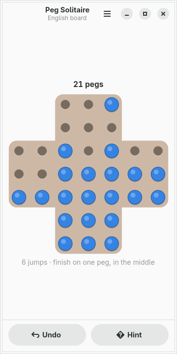
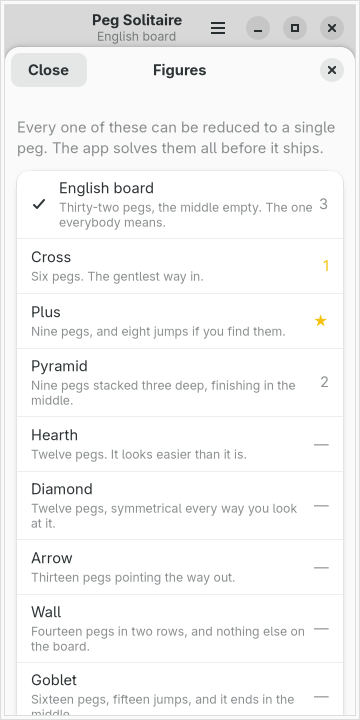

# moarchy-pegsolitaire

Peg solitaire for a Linux phone: a wooden cross drawn for 360px, nine figures
that can all be finished, and a hint that runs the solver — so it can tell you
that there is no way left.

<p align="center">
  
  
  
</p>

<p align="center"><em>360×720, the size of a PinePhone's screen under
mobileomarchy. The board is not the app's own brown — it is the active Omarchy
theme's, and <code>omarchy-theme-set</code> repaints it while the game is on the
screen.</em></p>

Built for [mobileomarchy](https://github.com/SimonSchubert/mobileomarchy), but
nothing in it is specific to that: it is a GTK4/libadwaita app and runs on
Phosh, Plasma Mobile, postmarketOS or an ordinary desktop.

## The one thing this app does that the others do not

Every other app in this repository answers a question the player could answer
themselves, more slowly. This one answers a question they cannot.

Peg solitaire has no material to count and no threat to see. **A board with
twenty pegs on it and no way to reach one looks exactly like a board with a
way.** So the ordinary experience of this game is spending ten minutes jumping
around a position that was decided eight moves ago, and finding out only when
nothing will move.

The **Hint** button runs a real search rather than a heuristic, and gives one of
three answers:

| | |
|---|---|
| **a jump** | there is a way from here, and this is the first step of one |
| **no way** | proved: every line from here ends with more than one peg |
| **no answer** | the clock ran out before either of those was established |

The third is not a failure, it is the honest shape of the thing. It runs **on a
clock, not on a node budget** — two seconds, on a thread — which is the argument
Reversi's search makes about depth, arriving in a different game. The same node
count is a proof on a laptop and a shrug on a PinePhone.

When it does find a line it keeps the whole thing, so following a hint makes the
next one free; playing anything else throws it away.

## Nine figures, and all of them can be finished

The whole English board is one puzzle. The same board with a dozen pegs in the
shape of an arrow is another, and it costs a string:

```python
Figure(
    key="goblet",
    label="Goblet",
    blurb="Sixteen pegs, fifteen jumps, and it ends in the middle.",
    centre=True,
    art="""
  ...
  ...
ooooooo
.ooooo.
..ooo..
  .o.
  ...
""",
)
```

`o` is a peg, `.` is an empty hole, anything else is off the board. It is
written as art because that is what it is: a person reading `pegs.py` should be
able to *see* the goblet, and a person adding a figure should be able to draw
one.

**Every figure here can be reduced to a single peg, and that is checked rather
than asserted.** `tests/test_solver.py` solves all nine on every run, in about
half a second, and replays the solutions through the rules afterwards — because
a solver that agreed with itself about an illegal jump would find a line for any
figure ever written. A puzzle app that ships a figure nobody can finish is a
puzzle app that is lying, and there is no way to notice by looking at a picture
of one.

The `centre` flag is checked the same way. Finishing with the last peg in the
middle is the classic extra condition, and it is not available on every figure:
the Cross can be reduced to one peg and that peg can never be the middle one. So
the flag is a claim, the test proves it, and a figure where it is false never
dangles the middle as a goal.

The 37-hole European board is not here. It is the other famous board, and
neither this app's solver nor its author could finish it from the standard
opening — so it is not shipped rather than shipped with an asterisk.

## One tap a jump

> **A tap jumps the peg when there is one jump it can make, and asks when there
> is more than one.**

The same rule Solitaire in this repository uses, for the same reason: on most
boards most pegs have exactly one thing they can do, and a two-tap protocol for
every one of those is a tap spent on ceremony. A peg with a choice is ringed in
the theme's yellow, the holes it can reach are ringed in the theme's green, and
tapping the peg again puts it back down.

A tap on a peg that cannot move is silent. It is a miss, and an app that scolds
you for a miss on a touch screen scolds you all day long.

## The board

It is drawn as **two overlapping rounded rectangles**, a tall one and a wide
one, filled with the same colour. The union of those is a cross whose outer
corners are rounded and whose inner ones are square, which is what a wooden
solitaire board looks like — and it is one path each rather than a twelve-
segment outline nobody could adjust afterwards.

One drawing area rather than thirty-three buttons, for the reason Reversi's
board gives and one more of its own: **this is not a grid.** The four missing
corners are not empty cells, they are places where there is no board, and a grid
of widgets would have to express that as invisible children that are still laid
out, still measured, and still there to be tapped by accident.

Four of the theme's hues are used and each one does a job — brown for the wood,
the accent for the pegs, yellow for the peg you picked up, green for where it
can go. That is more of the palette than any other app here spends. It is spent
because every one of those is a different *kind* of thing in a different place
in a different shape, rather than a different instance of the same one: nothing
is being told apart by colour alone, which is the whole of the argument Reversi
makes when it refuses two hues for its discs.

## The file

`~/.local/share/moarchy-pegsolitaire/pegsolitaire.json`, or
`$MOARCHY_PEGSOLITAIRE_DIR`.

```json
{
 "schema": 1,
 "game": {"figure": "english", "finished": false, "recorded": false,
          "moves": [38, 90, 130, 62]},
 "stats": {"english": {"played": 7, "best": 3, "solved": 0, "perfect": 0},
           "plus": {"played": 3, "best": 1, "solved": 2, "perfect": 2}}
}
```

A jump is **one small integer**: `cell * 4 + direction`, where the directions
are up, down, left and right. A jump is fully described by where it starts and
which way it goes, and recording the landing hole as well would be recording
something the rules already know — which is a second chance to disagree with
them.

What is stored is the jump list, not the board: a file that has been truncated,
edited or half-written cannot describe a board that legal play could not reach,
because loading it is playing it. That matters more here than it looks. There
are 187 million positions on the English board and only a fraction of them are
reachable, so a hand-edited board is very likely one that no game could produce.

A position is a **single 49-bit integer** in memory, and so is the board it sits
on. The board travelling with the pegs is what lets one set of rules serve every
figure without a second argument to get wrong.

## What is recorded

**The fewest pegs you have left**, per figure. Not a win column: peg solitaire
is a puzzle rather than a contest, and the thing somebody actually gets better
at is finishing with three instead of five. A win column would be zeroes for a
week and then a single one.

**Nothing is recorded for starting a figure over.** Backing out and trying a
different third jump is how this game is played, not a defeat, and an app that
counted it would be counting thinking. Only a board that will not move again
goes into the record.

## Running it

```sh
python3 -m moarchy_pegsolitaire
```

To see it part-played rather than at a starting position:

```sh
export MOARCHY_PEGSOLITAIRE_DIR=$(mktemp -d)
python3 demo.py          # the English board, eleven jumps into a winning line
python3 demo.py stuck    # ...or a figure played into a dead end
python3 -m moarchy_pegsolitaire
```

`demo.py` refuses to run without `MOARCHY_PEGSOLITAIRE_DIR` set, so it cannot
overwrite a real game. The part-played board is eleven jumps *down a solution*
rather than down a random walk — a board that is eleven jumps in and already
lost would photograph the app in a state its own hint button would call
hopeless.

## Checks

```sh
scripts/check.sh pegsolitaire
```

ruff, then the rules, the solver and the file, then the widgets on a virtual
screen, then a real run that fails on any GTK warning.

The solver tests are the ones that matter, and they are the app's content rather
than its plumbing: nine figures solved, nine claims about the middle checked
both ways, and one test that asks whether the whole English board still solves
inside the two seconds the Hint button allows — which is the worst case the
button will ever be given.

| variable | what it does |
|---|---|
| `MOARCHY_PEGSOLITAIRE_DIR` | where the game lives |
| `MOARCHY_PEGSOLITAIRE_QUIT_AFTER` | quit after N seconds, for headless runs |
| `MOARCHY_PEGSOLITAIRE_PAGE` | open straight into `record`, for the screenshots |
| `MOARCHY_PEGSOLITAIRE_FIGURES` | open with the figures sheet up |
| `MOARCHY_PEGSOLITAIRE_HINT` | open and ask for a hint at once |

## Licence

MIT.
