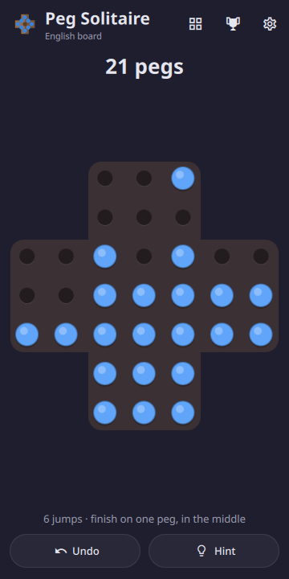
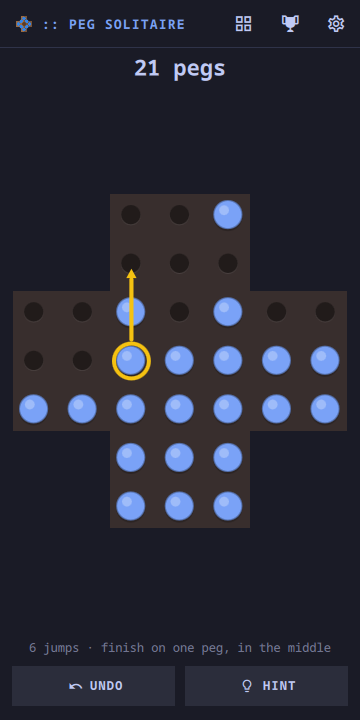
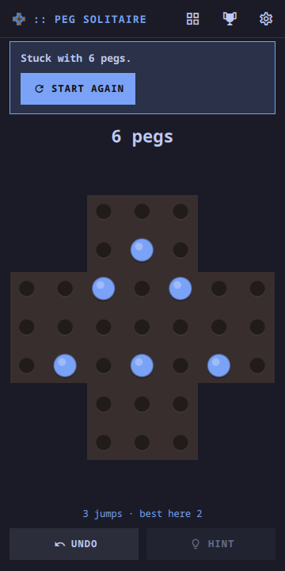
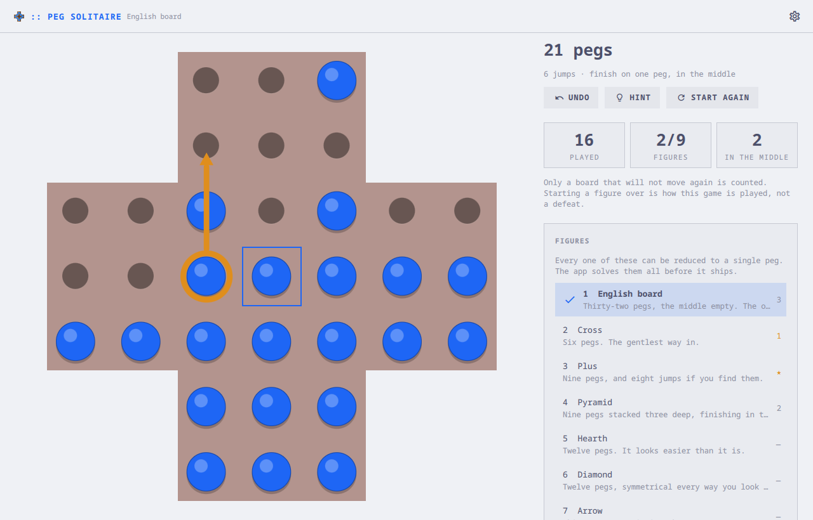

# moarchy-pegsolitaire

Peg solitaire: a wooden cross, nine figures that can all be finished, and a
hint that runs the solver — so it can tell you that there is no way left.

<p align="center">
  
  
  
</p>
<p align="center">
  
</p>

<p align="center"><em>360×720, and a desktop window. One app: below 720 px it
lays out as a phone app, above it the figures and the record sit beside the
board. The wood, the pegs and the rings are the active Omarchy theme's, and a
theme switch repaints them while the game is on the screen.</em></p>

A Quickshell app. Inside the Omarchy shell it is a panel the shell keeps
loaded, so opening it is showing a window rather than starting a process; on
any other Quickshell desktop `moarchy-pegsolitaire` runs it as its own. 0.1.0
was a GTK4/libadwaita app, and a game left in it is the game found here: the
file is the same.

## The one thing this app does that the others do not

Every other app in this repository answers a question the player could answer
themselves, more slowly. This one answers a question they cannot.

Peg solitaire has no material to count and no threat to see. **A board with
twenty pegs on it and no way to reach one looks exactly like a board with a
way.** So the ordinary experience of this game is spending ten minutes jumping
around a position that was decided eight moves ago, and finding out only when
nothing will move.

The **Hint** button runs a real search rather than a heuristic, and gives one of
three answers:

| | |
|---|---|
| **a jump** | there is a way from here, and this is the first step of one |
| **no way** | proved: every line from here ends with more than one peg |
| **no answer** | the clock ran out before either of those was established |

The third is not a failure, it is the honest shape of the thing. It runs **on a
clock, not on a node budget** — two seconds, on a worker thread, so the board
stays live while it looks — which is the argument Reversi's search makes about
depth, arriving in a different game. The same node count is a proof on a laptop
and a shrug on a PinePhone. A worker cannot be interrupted, so every answer
carries the board it was asked about, and one for a board that has since been
undone or restarted is dropped.

When it does find a line it keeps the whole thing, so following a hint makes the
next one free; playing anything else throws it away.

## Nine figures, and all of them can be finished

The whole English board is one puzzle. The same board with a dozen pegs in the
shape of an arrow is another, and it costs a picture in `Pegs.js`:

```js
{ key: "goblet", label: "Goblet", centre: true,
  blurb: "Sixteen pegs, fifteen jumps, and it ends in the middle.",
  art: "\n  ...\n  ...\nooooooo\n.ooooo.\n..ooo..\n  .o.\n  ...\n" }
```

`o` is a peg, `.` is an empty hole, anything else is off the board.

**Every figure here can be reduced to a single peg, and that is checked rather
than asserted.** `tests/tst_solver.qml` solves all nine on every run and replays
the solutions through the rules afterwards — because a solver that agreed with
itself about an illegal jump would find a line for any figure ever written. A
puzzle app that ships a figure nobody can finish is a puzzle app that is lying,
and there is no way to notice by looking at a picture of one.

The `centre` flag is checked the same way. Finishing with the last peg in the
middle is the classic extra condition, and it is not available on every figure:
the Cross can be reduced to one peg and that peg can never be the middle one. So
the flag is a claim, the test proves it, and a figure where it is false never
dangles the middle as a goal.

The 37-hole European board is not here. It is the other famous board, and
neither this app's solver nor its author could finish it from the standard
opening — so it is not shipped rather than shipped with an asterisk.

## One tap a jump

> **A tap jumps the peg when there is one jump it can make, and asks when there
> is more than one.**

On most boards most pegs have exactly one thing they can do, and a two-tap
protocol for every one of those is a tap spent on ceremony. A peg with a choice
is ringed in the theme's yellow, the holes it can reach are ringed in the
theme's green, and tapping the peg again — or Back — puts it back down.

A tap on a peg that cannot move is silent. It is a miss, and an app that scolds
you for a miss on a touch screen scolds you all day long.

On a desktop the arrow keys walk a ring round the board, skipping the cut-off
corners, and Enter taps the hole it is on; `h` asks for a hint, `u` undoes, `n`
starts the figure again and `1`–`9` start a figure.

## The board

It is drawn as **two overlapping rounded rectangles**, a tall one and a wide
one, filled with the same colour. The union of those is a cross whose outer
corners are rounded and whose inner ones are square, which is what a wooden
solitaire board looks like. A jump is a hop: the peg rises over the one it
takes, which shrinks out as it passes — the only thing on screen saying which
peg was taken.

Four of the theme's hues are used and each one does a job — brown for the wood,
the accent for the pegs, yellow for the peg you picked up, green for where it
can go. It is spent because every one of those is a different *kind* of thing
in a different place in a different shape: nothing is being told apart by
colour alone, which is the whole of the argument Reversi makes when it refuses
two hues for its discs. A theme without a brown gets the one 0.1.0 used.

## The file

`~/.local/share/moarchy-pegsolitaire/pegsolitaire.json`, or
`$MOARCHY_PEGSOLITAIRE_DIR`.

```json
{
 "schema": 1,
 "game": {"figure": "english", "finished": false, "recorded": false,
          "moves": [41, 63, 9, 18]},
 "stats": {"english": {"played": 7, "best": 3, "solved": 0, "perfect": 0},
           "plus": {"played": 3, "best": 1, "solved": 2, "perfect": 2}}
}
```

A jump is **one small integer**: `cell * 4 + direction`, where the directions
are up, down, left and right, and cell (row, column) is `row * 7 + column`. A
jump is fully described by where it starts and which way it goes, and recording
the landing hole as well would be a second chance to disagree with the rules.

What is stored is the jump list, not the board: a file that has been truncated,
edited or half-written cannot describe a board that legal play could not reach,
because loading it is playing it. A file that will not parse is moved aside as
`pegsolitaire.broken-<time>.json` before anything is written over it.

In memory a board is **a 49-bit mask** — one bit per hole of the 7×7 grid —
which is past the 32 bits JavaScript's bitwise operators reach and well inside
the 53 a double holds exactly, so the masks are plain numbers added and
subtracted by powers of two. The solver unpacks one into an array of booleans
and plays and unplays jumps in place, keeping the number beside it as the key
for the positions it has proved dead.

## What is recorded

**The fewest pegs you have left**, per figure. Not a win column: peg solitaire
is a puzzle rather than a contest, and the thing somebody actually gets better
at is finishing with three instead of five.

**Nothing is recorded for starting a figure over.** Backing out and trying a
different third jump is how this game is played, not a defeat. Only a board that
will not move again goes into the record.

## Running it

```sh
quickshell -p apps/pegsolitaire/shell.qml
```

Part-played rather than at a starting position:

```sh
export MOARCHY_PEGSOLITAIRE_DIR=$(mktemp -d)
python3 apps/pegsolitaire/dev/demo.py         # the English board, eleven jumps into a winning line
python3 apps/pegsolitaire/dev/demo.py stuck   # ...or the Pyramid played into a dead end
quickshell -p apps/pegsolitaire/shell.qml
```

`demo.py` refuses to run without `MOARCHY_PEGSOLITAIRE_DIR` set, so it cannot
overwrite a real game.

## Checks

```sh
docker run --rm -v "$PWD:/src" -w /src moarchy-qml scripts/app-check.sh pegsolitaire
docker run --rm -v "$PWD:/src" -w /src moarchy-qml scripts/app-shot.sh pegsolitaire
```

The first is qmllint, the tests in `tests/` — the cases 0.1.0's Python tests
had — and a real run that fails on any QML warning. The second photographs
`dev/shots` at a phone's size and a desktop's.

The solver tests are the ones that matter, and they are the app's content rather
than its plumbing: nine figures solved, nine claims about the middle checked
both ways, one test that the whole English board still solves inside the two
seconds Hint allows, and one that the first line found is the one 0.1.0's
solver found.

| variable | what it does |
|---|---|
| `MOARCHY_PEGSOLITAIRE_DIR` | where the game lives |
| `MOARCHY_QUIT_AFTER` | quit after N seconds, for headless runs |
| `MOARCHY_PEGSOLITAIRE_PAGE` | open straight into `record`, for the screenshots |
| `MOARCHY_PEGSOLITAIRE_FIGURES` | open on the figures |
| `MOARCHY_PEGSOLITAIRE_HINT` | open and ask for a hint at once |

## Licence

MIT.
