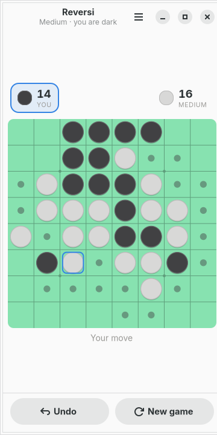
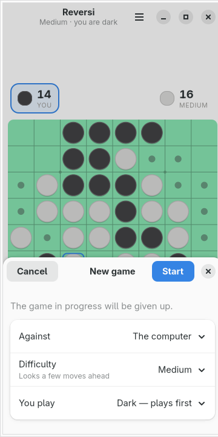
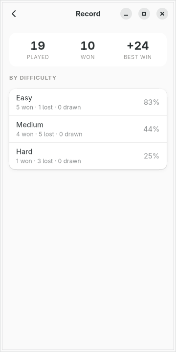
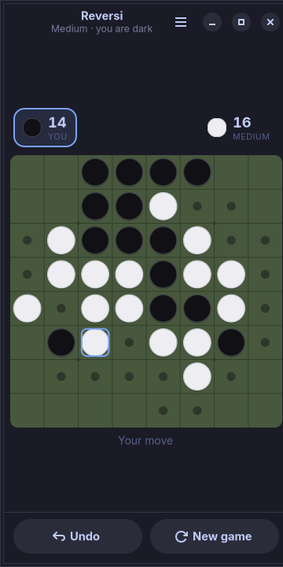

# moarchy-reversi

Reversi for a Linux phone: an eight by eight board that fits a 360px screen, an
opponent that answers inside a second on a slow CPU, and a game that survives
being killed.

<p align="center">
  
  
  
</p>

<p align="center"><em>360×720, the size of a PinePhone's screen under
mobileomarchy. The felt is not the app's own green — it is the active Omarchy
theme's, and <code>omarchy-theme-set</code> repaints it while the game is on the
screen.</em></p>

Built for [mobileomarchy](https://github.com/SimonSchubert/mobileomarchy), but
nothing in it is specific to that: it is a GTK4/libadwaita app and runs on
Phosh, Plasma Mobile, postmarketOS or an ordinary desktop.

## This one is not a gap

Every other app in this repo answers a row in moarchy-store's
`docs/android-gaps.md` — something with a good implementation on F-Droid and no
Linux answer anywhere. Reversi is not one of those. GNOME has shipped Iagno for
twenty years, it is `gnome-reversi` in `extra`, and it is a better-looking
program than this one.

What it is not is a phone app, and the gap this fills is that one:

- **It is drawn for 360px.** Eight squares of 43px across the short edge, with
  the board, the score and the status as one block, and every control that
  belongs to the game in a bar along the bottom where a thumb already is.
- **The opponent is on a clock, not on a depth.** On a phone the question is
  never "how deep" but "how long", and those are the same question only on the
  machine you tuned it on.
- **It expects to be killed.** Phones do not close apps, they reclaim them. The
  game is written to the file on every move and picked up mid-search on the way
  back in.
- **It is the phone's colours.** The board is the theme's green, and a theme
  change repaints it in place.

Whether Iagno is usable at 360px is a question for moarchy-store's sweep, which
scores packages on exactly that and is the right place for the answer. This is
not an argument that it is not — it is an app written to a different brief.

## What it does

- **Tap a square to play it.** The squares you may play are dotted, because a
  touch screen is not a place to find out by being refused
- **The discs turn over as a wave**, out from the one you played, edge-on at
  the halfway point like a real disc in a hand. It is the whole reward of the
  move and it costs arithmetic
- **Three levels**, and the easy one genuinely errs rather than being a strong
  opponent with less to think with
- **Two players on one phone**, passing it across a table, with no computer and
  nothing recorded
- **Undo gives you your turn back** — the computer's reply and your move, not
  one ply — because the misplaced tap is the ordinary case on a bus
- **A pass is handled and announced.** A side with no move does not get a board
  with no hints on it and a wait for a tap that cannot come
- **A record** of games against the computer, by difficulty
- **Everything local.** One JSON file, no account, no network code in the app

## The phone's colours

<p align="center">
  
</p>

The same game under `tokyo-night`. The felt is that theme's green mixed into
that theme's background, the grid is a darker shade of the felt, and the ring on
the last move is the theme's accent — so `omarchy-theme-set` repaints the board
while the game is on the screen, the way it repaints the bar and the keyboard.

The discs are the one thing that does not become a hue of the theme. Two
theme colours is the kind of theming that looks good in a screenshot and fails
in daylight, for the eight percent of men who cannot tell the popular pair
apart, and at 43px. Dark against light survives all three, so the discs take a
tint from the theme and keep their contrast.

## The opponent

It is alpha-beta over bitboards, and both halves of that are about the phone.

**A position is two 64-bit integers**, one bit per square per colour, so finding
every legal move is a handful of shifts and masks rather than a walk of 64
squares by 8 directions by 7 steps in interpreted bytecode. A search is worth as
many positions a second as the rules can be applied, and on an A53 that is the
difference between an opponent worth beating and one that is not.

**The depth is not decided in advance.** Every level names a number of seconds
and a ceiling, and the search deepens a ply at a time until one of them runs
out. The same "Hard" is a six-ply opponent on a laptop and a four-ply one on a
PinePhone, and neither leaves somebody holding a phone that has stopped
answering. A fixed depth would have to be chosen for the slowest device and
would then be the strength everywhere.

**The last dozen squares are played out exactly** rather than evaluated — but
only by Hard. An easy opponent that plays the endgame perfectly is easy right up
until the part of the game that decides it, which feels like being cheated
rather than beaten.

**Nothing is searched while anything is moving.** The order after a tap is

```
tap -> play -> animate -> settled -> think -> play -> animate -> settled
```

and the search does not start until the discs have stopped turning. That is not
politeness, it is CPython: the search is a Python thread and holds the GIL, so a
search running under an animation turns a 240ms flip into a slideshow. It costs
a quarter of a second that is being spent watching the flip anyway.

All of it lives in `reversi.py` and `ai.py`, which import no GTK, so the rules
and the opponent are covered by tests rather than by a screenshot —
`tests/test_ai.py` plays Hard against Easy from both sides on a shortened clock
and fails if the levels stop being ordered by strength.

## The file

`~/.local/share/moarchy-reversi/reversi.json`, or `$MOARCHY_REVERSI_DIR` if set.

What is stored is the **move list**, not the board:

```json
{
 "schema": 1,
 "game": {"mode": "solo", "level": "medium", "human": "dark",
          "finished": false, "moves": [19, 34, 45, 20, 26, 11]},
 "stats": {"medium": {"played": 9, "won": 4, "lost": 5, "drawn": 0, "best": 20}}
}
```

Sixty small integers replay to exactly one position in microseconds, and that
has a property a stored board cannot have: **a file that has been truncated,
edited or half-written cannot describe a board that legal play could not reach,
because loading it is playing it.** A move that will not play is where the file
stops being a game, and the rest of it goes.

Writes go through a temp file, an fsync and a rename, and they happen on every
move rather than on a timer. Habits debounces because a thumb can tick five
marks in a row; a move here is seconds of thinking apart at the very least, and
on a phone the app is not closed, it is killed.

## Running it

```sh
python3 -m moarchy_reversi
```

To see it with a game in progress rather than an opening:

```sh
export MOARCHY_REVERSI_DIR=$(mktemp -d)
python3 demo.py
python3 -m moarchy_reversi
```

`demo.py` refuses to run without `MOARCHY_REVERSI_DIR` set, so it cannot
overwrite a real game. It plays a real one with the search this app ships rather
than scattering discs, because a hand-placed board is the app telling a lie
about its own rules and anyone who knows the game will see it.

## Checks

```sh
scripts/check.sh reversi
```

ruff, then the rules, the search and the file, then the widgets on a virtual
screen, then a real run that fails on any GTK warning. That last one is the one
that matters: a layout error is not an exception — the app starts, the window
appears, and one widget is the wrong size, with a single line on stderr as the
only sign. It is what caught the board claiming eighty pixels of height it then
centred a square inside of.

| variable | what it does |
|---|---|
| `MOARCHY_REVERSI_DIR` | where the game lives |
| `MOARCHY_REVERSI_QUIT_AFTER` | quit after N seconds, for headless runs |
| `MOARCHY_REVERSI_PAGE` | open straight into `record`, for the screenshots |
| `MOARCHY_REVERSI_NEW` | open with the new-game sheet up |

## Licence

MIT.
