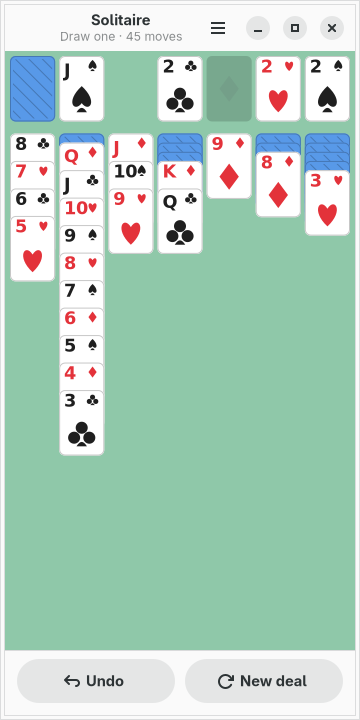
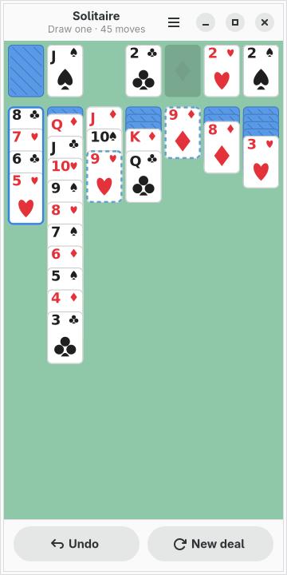
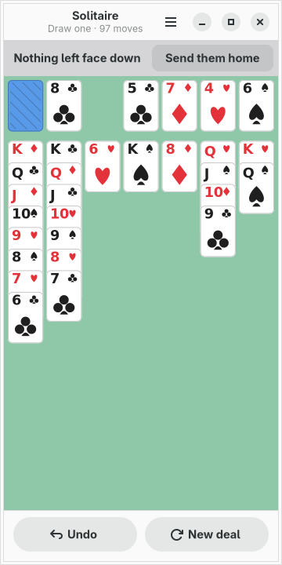

# moarchy-solitaire

Klondike for a Linux phone: seven columns that fit a 360px screen, one tap a
move, and an app that tells you when a deal has nothing left in it.

<p align="center">
  
  
  
</p>

<p align="center"><em>360×720, the size of a PinePhone's screen under
mobileomarchy. The baize, the card backs and the rings are the active Omarchy
theme's; the cards themselves are not, and the reason is below.</em></p>

Built for [mobileomarchy](https://github.com/SimonSchubert/mobileomarchy), but
nothing in it is specific to that: it is a GTK4/libadwaita app and runs on
Phosh, Plasma Mobile, postmarketOS or an ordinary desktop.

## This one is not a gap

Every app in this repo that answers a row in moarchy-store's
`docs/android-gaps.md` says so. This is not one: GNOME has shipped Aisleriot for
twenty-five years, it is `aisleriot` in `extra`, and it plays eighty games to
this one's one.

What it is not is a phone app. Aisleriot is a GTK3 program with a menu bar, a
toolbar and a card table drawn for a mouse that can drag. On 360 pixels the
brief is a different one:

- **It is drawn for 360px.** Seven columns of 46px cards, which is under the
  44px a thumb is usually given — so the hit area of a column is the full 50px
  stride including the gap, and there is no dead ground between two columns.
- **A tap is the whole interaction.** There is no drag, because dragging a 46px
  card with a finger that covers it is a gesture nobody can aim.
- **It expects to be killed.** Phones do not close apps, they reclaim them. The
  deck and every move are on disk after each tap.
- **It is the phone's colours** — the baize, the backs, the rings — and a theme
  change repaints them in place.

## One tap a move

> **A tap moves the card when there is one place for it to go, and asks when
> there is more than one.**

That is the whole rule. Roughly nine moves in ten have exactly one answer — this
red six goes on that black seven, this ace goes home — and for those a tap is
the move. For the rest, the tap picks the run up and rings it, rings everywhere
it may be put down, and waits. Tapping a ring plays it; tapping the run again
puts it back.

Two things are collapsed on purpose, and both are about what a person means
rather than what the rules permit:

- **An ace never goes to a column.** The rules allow it — a black ace does sit
  on a red two — and nobody has ever wanted it, so counting it would turn every
  ace into a question with an obviously wrong second answer.
- **Empty columns count once.** Three empty columns are three legal
  destinations for a king and one decision.

And a **whole column does not move to an empty one**. That is not a convenience,
it is load-bearing: it uncovers nothing and changes nothing, and allowing it
makes a lost game undetectable, because a king that can shuffle sideways forever
means there is always a move.

## The banner

Klondike has no rule that ends a lost game. The stock can always be turned over
again, so a person can cycle a pack for ten minutes looking for a move that is
not there, and nothing will ever say so. At the other end, a table with every
card face up is a game that is already won and needs a hundred taps to prove it.

The banner is the app noticing both on the player's behalf.

**"No moves left on this deal"** is worked out by turning the stock over for
you, as many times as it takes to come back round, and asking at each step
whether any move exists that is not itself turning the stock over. In the
ordinary case the first step answers, because in the ordinary case there is
something to play right now.

**"Nothing left face down"** offers to play it out. The moves are the rules',
not a shortcut round them: it sends home whatever will go and turns the stock
when nothing will, which is exactly what a person would do with the same table.
Every move goes into the move list, so the game that gets saved is the game that
was played and undo still walks back through it. A tap during the run plays the
rest at once — you have watched enough of a game that is already decided.

It is checked by *doing* it, too. "Every card face up" is sufficient on a table
that legal play produced, and the app runs the greedy pass and asks whether it
actually wins before offering the button, because a banner that offers to finish
a game and then does not is worse than no banner.

## No clock

There is no timer, and that is a decision rather than an omission. A phone game
is one you are interrupted in the middle of — the bus arrives, somebody messages
you, the compositor reclaims the app — and a clock that keeps counting through
all of that is measuring the interruption. The record counts **moves**, which is
a number the game owns.

## The cards

Everything on this screen is drawn in cairo. There is no card image, no SVG and
no font behind any of it:

- **The four suits are four cairo paths.** A pip from a font is a bet on the
  font stack of a device whose font stack is not the desktop's, and a suit that
  renders as an empty box is a card nobody can play. Thirty lines of curves is
  the same drawing at 8px and at 30.
- **The rank is the one piece of text**, and it is A, 2 to 10, J, Q, K — glyphs
  that exist in every font that exists.
- **The index lives in the top strip of a card and nowhere else.** What is
  visible of a covered card is 28 pixels at its top. A real card's second index,
  printed upside down in the far corner, would be under the card in front of it
  every single time.
- **The card nothing covers gets a big pip in the middle.** It is the one card
  in a pile a tap can pick up, and at this size a 30px symbol says which far
  faster than a 12px one in the corner.

**The cards stay cards.** The face is very nearly white on every theme and the
black suits are very nearly black — the same refusal Reversi makes about its
discs, for a sharper reason: at 46px across, a rank and a pip are five pixels of
ink, and a theme that tinted the face would be spending the only contrast this
app has on decoration. The red suits take the theme's red, because that is the
one colour on a playing card that was already a colour.

## The file

`~/.local/share/moarchy-solitaire/solitaire.json`, or `$MOARCHY_SOLITAIRE_DIR`.

```json
{
 "schema": 1,
 "game": {"draw": 1, "finished": false, "recorded": false,
          "deck": [37, 2, 50, "...", 19],
          "moves": [[0, 1, 1], [1, 9, 1], [11, 2, 1]]},
 "stats": {"draw1": {"played": 38, "won": 26, "best": 121,
                     "streak": 3, "longest": 7}}
}
```

What is stored is **the deck and the move list**, not the table. A move is three
small integers — from, to, how many — and the piles are numbered in the file: 0
is the stock, 1 the waste, 2 to 5 the foundations, 6 to 12 the columns.

Fifty-two integers and a few hundred triples replay to exactly one table in a
millisecond, and that has a property a stored table cannot have: **a file that
has been truncated, edited or half-written cannot describe a table that legal
play could not reach, because loading it is playing it.** A bad tail is dropped
and the game resumes at the last move that made sense — which for a card game
matters more than anywhere else, because the alternative is a table with two
aces of spades on it.

The deck is checked as a deck on the way in: fifty-two cards, each exactly once,
or it is not loaded at all. A card game that quietly deals a pack with a card
missing is a card game whose rules stop meaning anything twenty moves later,
with no error anywhere.

It also means the deal survives everything. **Deal this one again** in the menu
is `moves: []` and nothing else — the same fifty-two cards from the top, which
is the thing you want after losing one.

Writes go through a temp file, an fsync and a rename, and they happen on every
move.

## What counts as a loss

A deal you walk away from. A deal you look at and replace without playing does
not — dealing, disliking the look of it and dealing again is not a game anybody
played, and counting it would make the tally a measure of how fussy somebody is.

The new-deal sheet says so before you tap Deal, which is where a warning belongs.
It is also the honest half of keeping a win percentage at all: a tally that
quietly forgot every game somebody walked away from would be a tally of the
games that were going well.

Draw one and draw three are counted separately, because they are two different
games — one is winnable about four times in five with good play and the other is
not, so a single percentage across both would mostly report which setting was in
use that month.

No deal is filtered for winnability. A solver good enough to say whether a
Klondike deal can be won is a bigger program than this app, and the honest
alternative to shipping one is saying so.

## Running it

```sh
python3 -m moarchy_solitaire
```

To see it with a game in progress rather than a fresh deal:

```sh
export MOARCHY_SOLITAIRE_DIR=$(mktemp -d)
python3 demo.py          # a game partway through
python3 demo.py home     # ...or one with nothing left face down
python3 -m moarchy_solitaire
```

`demo.py` refuses to run without `MOARCHY_SOLITAIRE_DIR` set, so it cannot
overwrite a real game. It plays a real deal with the rules this app ships, using
the order of preference a book gives — turn a card over, take the free aces,
build from the waste, send home only what is safe — because a hand-dealt table
is the app telling a lie about its own rules, and everybody's grandmother knows
these rules.

## Checks

```sh
scripts/check.sh solitaire
```

ruff, then the rules and the file, then the widgets on a virtual screen, then a
real run that fails on any GTK warning.

Two of the rule tests are properties over a few thousand random moves rather
than examples, and they are the two that matter: **every card exists exactly
once**, and **the face-up part of a column is always a run**. The second is the
invariant the tap logic leans on — it is why a run can be picked up without
being validated — and the first is the thing a card game gets wrong in a way
nobody notices until there are two aces of spades on the table.

| variable | what it does |
|---|---|
| `MOARCHY_SOLITAIRE_DIR` | where the game lives |
| `MOARCHY_SOLITAIRE_QUIT_AFTER` | quit after N seconds, for headless runs |
| `MOARCHY_SOLITAIRE_PAGE` | open straight into `record`, for the screenshots |
| `MOARCHY_SOLITAIRE_NEW` | open with the new-deal sheet up |
| `MOARCHY_SOLITAIRE_PICK` | open with a run picked up, for the screenshots |

## Licence

MIT.
