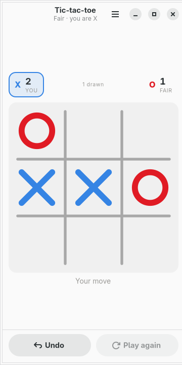
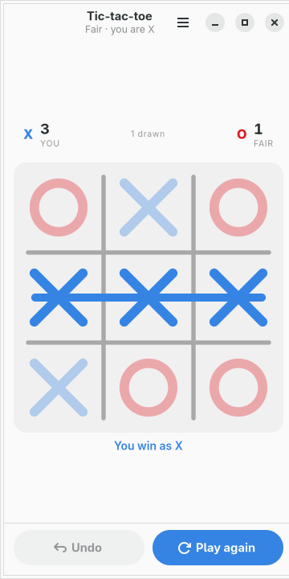
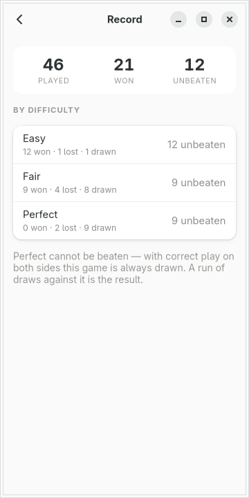
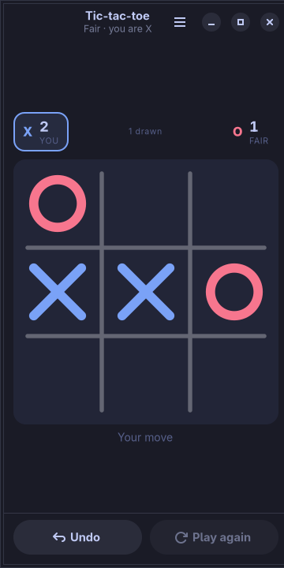

# moarchy-tictactoe

Noughts and crosses for a Linux phone: a hash drawn for 360px, an opponent that
has the whole game solved and is told to err anyway, and a score that keeps
count across the sitting rather than the game.

<p align="center">
  
  
  
</p>

<p align="center"><em>360×720, the size of a PinePhone's screen under
mobileomarchy. The marks are not the app's own blue and red — they are the
active Omarchy theme's, and <code>omarchy-theme-set</code> repaints them while
the game is on the screen.</em></p>

Built for [mobileomarchy](https://github.com/SimonSchubert/mobileomarchy), but
nothing in it is specific to that: it is a GTK4/libadwaita app and runs on
Phosh, Plasma Mobile, postmarketOS or an ordinary desktop.

## This one is not a gap

Every app in this repo that answers a row in moarchy-store's
`docs/android-gaps.md` says so. This is not one of them, and it is further from
being one than Reversi or Chess are: noughts and crosses is the example everyone
writes while learning a toolkit, and `pacman -Ss tic tac toe` is not an empty
search.

It is here for the thing all of those have in common, which is that they are
demonstrations of a toolkit rather than something to open on a bus:

- **It is drawn for 360px.** Three cells of 112px, with the score, the board and
  what it is saying as one block, and both controls in a bar along the bottom
  where a thumb already is.
- **It expects to be killed.** Phones do not close apps, they reclaim them. The
  game is written to the file on every mark, including whether the result has
  been counted yet — which is not the same question as whether the board is
  finished.
- **It is the phone's colours.** The marks are the theme's blue and red, the
  paper is the theme's surface, and a theme change repaints them in place.
- **It keeps the score of a sitting, not a game.** A game here lasts fifteen
  seconds. Nobody plays one.

## What it does

- **Tap a square.** There is nothing else to learn
- **The marks are drawn rather than placed** — an X as two strokes in the order
  a right hand makes them, an O as one sweep from the top — and the line through
  three in a row goes through after the third mark has landed, not with it
- **Three levels, and none of them is a depth.** The game is solved before the
  window opens; a level is a description of what the opponent *notices*
- **Play again swaps the marks**, the way two people with a pencil take turns
  going first, and keeps the series score. New game starts a fresh one
- **Undo gives you your turn back** — the computer's reply and your mark, not
  one ply — because the misplaced tap is the ordinary case on a bus
- **Two players on one phone**, passing it across a table, with a score line and
  nothing recorded
- **A record** of games against the computer, headed by the longest run without
  losing rather than by a win percentage
- **Everything local.** One JSON file, no account, no network code in the app

## The opponent

There is no search in this app, and that is the interesting part.

**The whole game is solved at startup.** Tic-tac-toe has 5,478 reachable
positions — Reversi has more than that in its first four moves — so there is no
depth to choose, no clock to spend and no evaluation function to tune. A
recursion over the rules fills a table in about a tenth of a second on an A53,
on a thread, while somebody is still looking at an empty board. Every move after
that is a dictionary lookup.

Which leaves the only question this game actually poses: **a solved opponent
cannot be beaten.** With correct play from both sides it is drawn, every time,
forever. An app that shipped only that is an app nobody opens twice. So the
levels are not depths, they are descriptions of what the opponent sees:

| level | what it notices |
|---|---|
| **Easy** | takes a win it is handed. Does not look for yours |
| **Fair** | takes a win, blocks a threat, and is otherwise careless about one turn in five |
| **Perfect** | never loses, and plays for the mistake rather than for the draw |

"Careless" is deliberately not "random". An opponent that sometimes fails to
take a win it has been given does not read as easy, it reads as broken — the
board says three in a row is there and the app did not take it. Missing *your*
threat is what reads as somebody not concentrating, and it is the only thing
Easy is allowed to miss.

**Perfect plays for the mistake.** Between two perfect players every opening
draws, so a solver with nothing but the result to go on has no reason to prefer
one drawing move to another. This one scores each optimal move by how many
replies to it lose, and plays the one that leaves the most ways to go wrong. It
cannot win a game it should draw. It wins the games where somebody taps without
looking, which on a phone, on a bus, is most of them. It is also why it opens in
a corner rather than in the centre: every reply to a corner loses except one.

`tests/test_ai.py` plays four hundred games at each level and fails if the
levels stop being ordered by strength — the only property of an opponent a
person can feel, and the one a tweak to any number in `ai.py` can quietly break.

## The pause

The computer sits on a move it already has, for 340 milliseconds.

This is the opposite of Reversi's wait, which exists because the search is a
Python thread holding the GIL and would turn an animation into a slideshow.
Here the move is known before the tap lands. The wait is for the person: an
opponent that answers in nought milliseconds does not read as a strong player,
it reads as a script, and its mark is on the board before the eye has left the
one you drew.

## The two buttons

They trade places. While a game is on, **Undo** is live and Play again is dead;
the moment the game ends, Undo goes dead and **Play again** lights up as the
suggested action.

On a board where a game lasts fifteen seconds that matters more than it sounds.
There is never a point where the wrong button is the easy tap, and a thumb on
Play again in the middle of a game would throw away something undo cannot get
back. Abandoning a game is what New game in the menu is for, and it says in
advance that the series goes with it.

## The phone's colours

<p align="center">
  
</p>

The same game under `tokyo-night`. The paper is that theme's surface, the rules
are pencil mixed into the paper, and the marks are that theme's blue and red —
so `omarchy-theme-set` repaints the board while the game is on the screen, the
way it repaints the bar and the keyboard.

**Two hues here, and none in Reversi.** That is not an inconsistency, it is the
shapes. Reversi's discs are a circle and a circle, so colour is the only thing
telling them apart, and the popular pair fails for the eight percent of men who
cannot separate red from green. An X is not an O at any size, in any light, to
anybody: the colour is decoration on top of a distinction the shape has already
made, so it can follow the theme without carrying any of the reading. It is
still blue and red rather than red and green, because a hue that fails is a hue
that fails and this pair costs nothing to keep.

The grid is a **hash and not a box** — four rules that overshoot their crossings,
no border around the outside. That is what a person actually draws, and it is
what makes this recognisable from across a room. A bordered three by three is a
chessboard with most of the squares missing.

## The file

`~/.local/share/moarchy-tictactoe/tictactoe.json`, or `$MOARCHY_TICTACTOE_DIR`.

```json
{
 "schema": 1,
 "game": {"mode": "solo", "level": "fair", "mark": "x",
          "finished": false, "recorded": false, "moves": [4, 0, 8, 2]},
 "series": {"a": 2, "b": 1, "drawn": 1},
 "stats": {"fair": {"played": 21, "won": 9, "lost": 4, "drawn": 8,
                    "unbeaten": 3, "best": 9}}
}
```

What is stored is the **move list**, not the board: a file that has been
truncated, edited or half-written cannot describe a board that legal play could
not reach, because loading it is playing it. A move that will not play is where
the file stops being a game, and the rest of it goes.

Three things in there are worth pointing at.

**`recorded` is not `finished`.** The mark that ends a game is written to the
file the instant it is played, and the result is counted a fraction of a second
later, when the mark has finished being drawn. A phone killed between the two
comes back to a finished board with a result still owed to it, and the app pays
it on the way in. Using "is the board finished" for "has it been counted" loses
that game quietly, which is exactly the kind of thing nobody notices for months.

**The seats are `a` and `b`, not X and O.** The rematch swaps who plays X, so a
series scored by mark would be scoring the first-move advantage rather than the
players.

**`unbeaten` is the headline.** Against Perfect there are no wins to be had, so
a page with a win percentage at the top would be telling somebody they are bad
at a game they have in fact solved. The longest run without losing is a thing
you can get better at against all three levels.

Writes go through a temp file, an fsync and a rename, and they happen on every
mark rather than on a timer.

## Running it

```sh
python3 -m moarchy_tictactoe
```

To see it with a game in progress rather than an empty board:

```sh
export MOARCHY_TICTACTOE_DIR=$(mktemp -d)
python3 demo.py          # a game in progress, you to move
python3 demo.py won      # ...or a finished one, struck through
python3 -m moarchy_tictactoe
```

`demo.py` refuses to run without `MOARCHY_TICTACTOE_DIR` set, so it cannot
overwrite a real game. It plays a real one with the opponent this app ships
rather than placing marks, because a hand-placed board is the app telling a lie
about its own rules — and in a game this small, everybody who looks at the
screenshot knows the rules.

## Checks

```sh
scripts/check.sh tictactoe
```

ruff, then the rules, the opponent and the file, then the widgets on a virtual
screen, then a real run that fails on any GTK warning. That last one is the one
that matters: a layout error is not an exception — the app starts, the window
appears, and one widget is the wrong size, with a single line on stderr as the
only sign.

| variable | what it does |
|---|---|
| `MOARCHY_TICTACTOE_DIR` | where the game lives |
| `MOARCHY_TICTACTOE_QUIT_AFTER` | quit after N seconds, for headless runs |
| `MOARCHY_TICTACTOE_PAGE` | open straight into `record`, for the screenshots |
| `MOARCHY_TICTACTOE_NEW` | open with the new-game sheet up |

## Licence

MIT.
