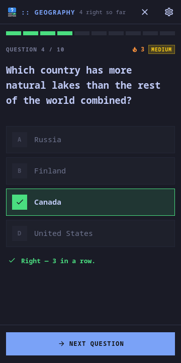
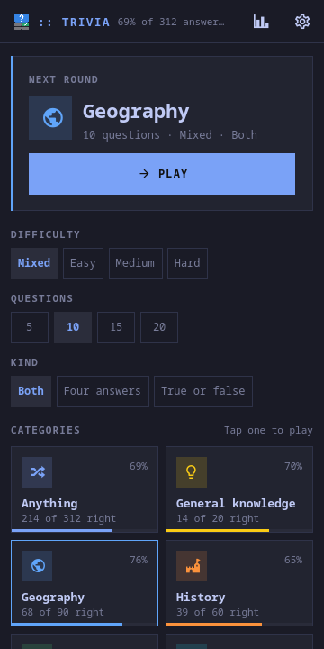
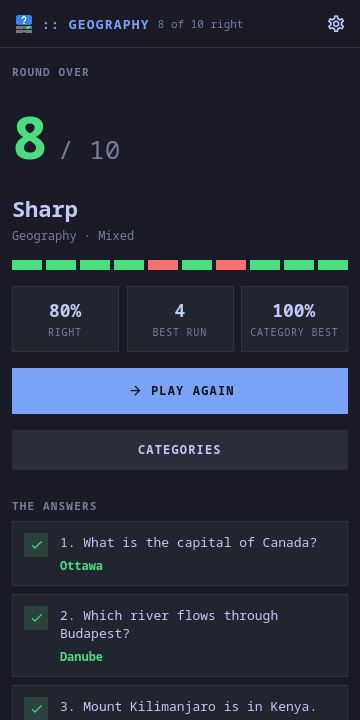
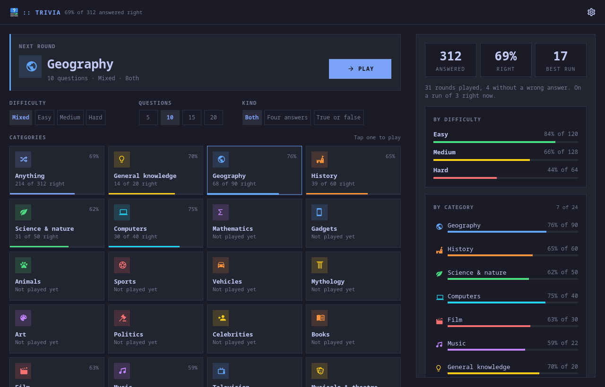

# moarchy-trivia

Multiple-choice quizzes for a Linux phone: twenty-four categories from the Open
Trivia Database, three difficulties, four answers or true and false, and a
record of every answer you have given, by category.

<p align="center">
  
  
  
</p>
<p align="center">
  
</p>

<p align="center"><em>360×720, and a desktop window. One app: below 720 px it
lays out as a phone app, above it the record sits beside the categories. The
categories are the active Omarchy theme's own hues, and a theme switch repaints
them while a round is on the screen.</em></p>

A Quickshell app. Inside the Omarchy shell it is a panel the shell keeps
loaded, so opening it is showing a window rather than starting a process; on
any other Quickshell desktop `moarchy-trivia` runs it as its own.

## The one online game

Every other game in this repository is offline: the rules, the opponent and
the puzzles are in the package. A quiz cannot be. A few hundred questions
bundled with the app would be answered by heart within a week, and the
question writers who keep a quiz fresh are somewhere else -- in this case the
Open Trivia Database, about five thousand questions written and checked by its
users, free, keyless, CC BY-SA 4.0.

So the app is built around asking as little as possible, and never at a bad
moment:

- **A round is one request.** All ten questions, with their answers, arrive
  together. Nothing is fetched while a question is on the screen, so a tunnel
  halfway through a round costs nothing.
- **The round is written to the file the moment it arrives.** A phone reclaims
  apps rather than closing them; a round that came back as a new request would
  be ten different questions. It comes back as the same question, with the
  same answers in the same order, and the pick you had made.
- **Nothing is asked with the window shut**, and nothing is asked on open:
  the categories are drawn from the app, not fetched.

## What it does

- **Tap a category and it is a round.** The difficulty, the length (5, 10, 15
  or 20) and the kind (four answers, true or false, or both) are chips over
  the grid, and stay as you left them. The last pick is the big Play button
- **The answer is marked with a shape as well as a colour** -- a tick on the
  right one, a cross on the one you picked if it was not -- and the rest fade
- **The round is a row of squares** over the question, green and red as it
  goes, and the score screen draws the same row finished
- **Every question again on the score screen**, with what you said struck
  through and what was right under it
- **A record** of every answer: the share right, by difficulty and by
  category, the longest run of right answers, and the last rounds
- **Leave a round and come back to it.** Back goes to the categories with the
  round kept, and they offer it back; the cross in the header throws it away

## Open Trivia DB, and its four rules

`Trivia.js` has all of this, and `tests/tst_trivia.qml` has the bodies the live
API answered with.

**One question request per five seconds per address.** A request inside the
five seconds is HTTP 429 with `response_code` 5. The app counts the gap itself
and waits it out -- "Asking in 3 s" under the spinner, rather than an
error -- and if the server still says 5 it waits again, three times.

**A session token.** Asked with one, the server does not repeat a question
until every question matching the pick has been served. The token is kept in
the file with when it was last used, and a token older than five hours is
replaced before it is used: the server forgets them after six, and finding out
costs a request. Code 3 (token unknown) gets a new one.

**Code 1 is "not that many", and so is code 4.** Hard mathematics has twenty
questions, two of them true or false. Asked for more than there are, the server
says 1 -- or, with a token, 4, "this token has had every question", even for a
token minutes old. So both mean the same first: the app asks for half as many,
down to one, says so under the spinner, and says how many it got. Only a 4 at
one question resets the token, once, and starts the halving over.

**The text is HTML-escaped by default.** `&quot;`, `&#039;`, `&eacute;` and a
long tail of others. Asked for `encode=url3986` instead, every string comes
percent-encoded, and `decodeURIComponent` undoes it exactly -- where a table of
HTML entities is a list that is never finished.

## The record

Every answer is counted **the moment it is given**, not at the end of the
round, so a round left half-played still counts the half that was played. The
round itself -- one score, one line in Recent -- is counted when its score
screen is reached, once: the file says whether it has been (`recorded`), for
the same reason Tic-tac-toe's does.

The headline is the **share of answers right** and the **longest run**, not
rounds won. There is no winning a quiz alone, and a round of hard questions at
half right is a good round -- which is also why the words on the score screen
run from "A clean sweep" down to "One to forget", and never to a grade.

## The file

`~/.local/share/moarchy-trivia/trivia.json`, or `$MOARCHY_TRIVIA_DIR`.

```json
{
 "schema": 1,
 "pick": {"category": 22, "difficulty": "any", "type": "any", "amount": 10},
 "token": {"value": "0286f2…", "used": 1790640000000},
 "round": {"category": 22, "questions": [{"text": "…", "answers": ["…"], "correct": 2,
           "category": 22, "difficulty": "medium", "type": "multiple"}],
           "picks": [1, 3], "index": 1, "recorded": false},
 "stats": {"answered": 312, "right": 214, "streak": 3, "bestStreak": 17,
           "byDifficulty": {"easy": {"answered": 120, "right": 101}},
           "byCategory": {"22": {"answered": 90, "right": 68, "rounds": 9, "best": 100}}},
 "recent": [{"at": 1790640000000, "category": 22, "difficulty": "any", "right": 8, "of": 10}]
}
```

`picks` is one answer per question answered and `index` the question on the
screen; they differ by one while an answer is showing and not yet moved on
from. A round whose questions will not play -- a `correct` out of range, no
answers -- is dropped rather than believed, and the app opens on the
categories. A file that will not parse is moved aside as
`trivia.broken-<time>.json` before anything is written over it.

## Running it

```sh
quickshell -p apps/trivia/shell.qml
```

With a round and a record rather than an empty start:

```sh
export MOARCHY_TRIVIA_DIR=$(mktemp -d)
python3 apps/trivia/dev/demo.py          # question 4 of 10, answered
python3 apps/trivia/dev/demo.py done     # ...or the score screen
quickshell -p apps/trivia/shell.qml
```

## Checks

```sh
docker run --rm -v "$PWD:/src" -w /src moarchy-qml scripts/app-check.sh trivia
docker run --rm -v "$PWD:/src" -w /src moarchy-qml scripts/app-shot.sh trivia
```

The first is qmllint, the parsing, the rounds and the file (`tests/`), and a
real run that fails on any QML warning. The second photographs `dev/shots` at a
phone's size and a desktop's, offline, from `dev/demo.py`'s round.

On a desktop: `1`–`4` or `a`–`d` answer, Enter moves on or plays again, `p`
plays the last pick, `r` shows the record.

| variable | what it does |
|---|---|
| `MOARCHY_TRIVIA_DIR` | where the record lives |
| `MOARCHY_TRIVIA_OFFLINE` | never ask the network: a round asked for is an error |
| `MOARCHY_QUIT_AFTER` | quit after N seconds, for headless runs |
| `MOARCHY_TRIVIA_PAGE` | open on `record`, `home`, `error` or `settings`, for the screenshots |

`omarchy-shell` reaches it over IPC as `trivia`: `play <category id>`,
`answer <0-3>`, `next`, `question`, `view`.

## Licence

MIT. The questions are the Open Trivia Database's, under
[CC BY-SA 4.0](https://creativecommons.org/licenses/by-sa/4.0/), and are
fetched at play time, not shipped.
