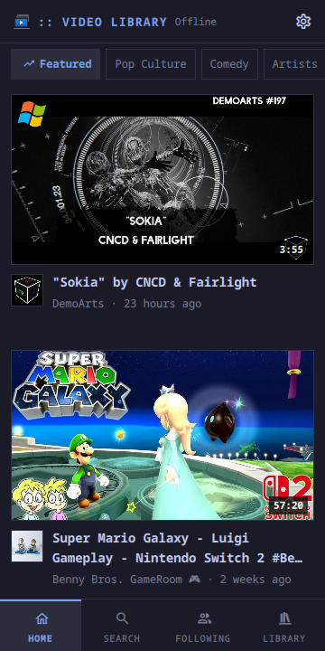
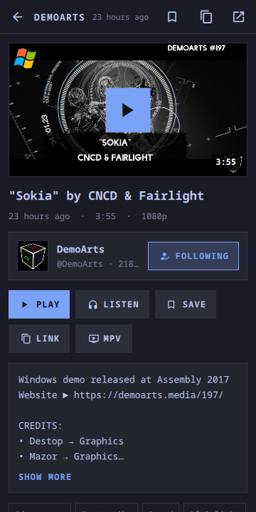
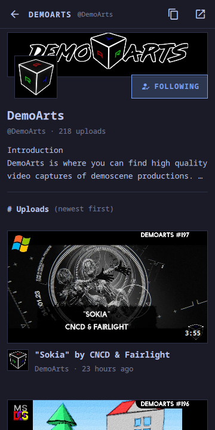
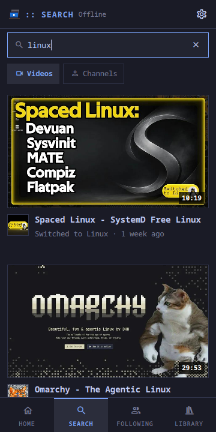
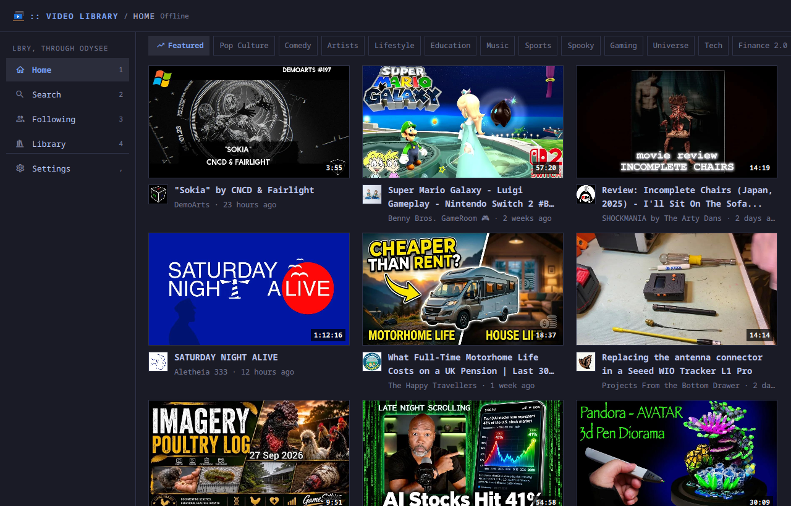
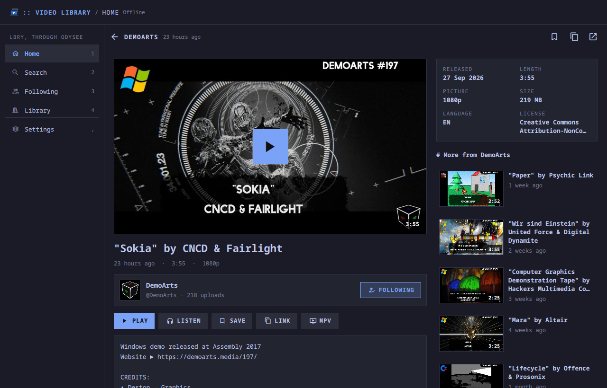
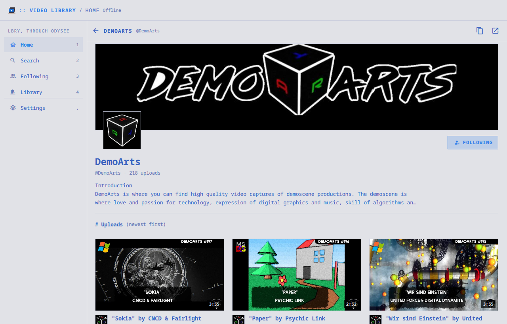

# moarchy-video-library

LBRY's videos, as Odysee serves them to anybody: its front page by category,
search, channels to follow and a library of your own, with no account and
nothing sent anywhere but the questions. Videos play in the page, with
controls made for a finger.

<p align="center">
  
  
  
  
</p>
<p align="center">
  
</p>
<p align="center">
  
  
</p>

<p align="center"><em>360×720, and a desktop window. One app: below 720 px it
lays out as a phone app with the tabs at the bottom and one card to a row;
wider, the tabs are a rail and the cards fill the width. The colours are the
active Omarchy theme's. The shots are taken offline, on answers
<code>dev/capture.py</code> recorded from Odysee, so what is on them is what
was on its front page that day.</em></p>

A Quickshell app. Inside the Omarchy shell it is a panel the shell keeps
loaded, so opening it is showing a window rather than starting a process; on
any other Quickshell desktop `moarchy-video-library` runs it as its own.

## What it does

Four tabs. On a phone they are along the bottom; on a desktop they are the
rail, and `1` to `4`.

**Home** — Odysee's own front page. Its categories (Featured, Tech, Gaming,
Music and a dozen more) are lists of channels somebody at Odysee chose, and a
category is those channels' videos from the last weeks, most talked-about
first, one or two per channel, with shorts, paid videos and mature ones left
out. The list of categories is asked for once a day and kept.

**Search** — through Lighthouse, Odysee's own index, which ranks far better
than the chain's text search: videos or channels, as you type. Paste an
odysee.com link, an `lbry://` URL or an `@channel` and Enter opens what it
names.

**Following** — the channels you follow as a row of faces, and everything
they put up, newest first.

**Library** — what you saved for later, and what you played, last first.

A **video** is the picture with a play button on it, its channel with a
follow button, Play, Listen (the sound only), Save, Link and mpv, what the
uploader wrote, its tags (a tap searches one), and — beside it on a desktop,
under it on a phone — its facts and more from the same channel. A
**channel** is its banner, its face, what it says about itself and all of its
uploads, a page at a time.


## Where it comes from

Three public endpoints, none of them with a key (`Lbry.js` has them all):

- `api.na-backend.odysee.com/api/v1/proxy` — the LBRY SDK's JSON-RPC:
  `claim_search` for every list, `resolve` for a pasted link
- `lighthouse.odysee.tv/search` — search; it answers claim ids, which one
  `claim_search` fills in
- `odysee.com/$/api/content/v2/get` — the front page's categories

and two CDNs: `player.odycdn.com` for the stream, which wants a Referer and
gets one, and `thumbnails.odycdn.com` for each picture at the size it is
drawn, so a grid of thumbnails is a few hundred kilobytes rather than a few
hundred megabytes of the originals.

Every request is one `curl`, and only while the window is open.

## Playing

In the page, where the picture was, through Qt Multimedia. A tap shows the
controls and they go again after three seconds: play and pause, ten seconds
back and on (or a double-tap on either side of the picture), a timeline to
drag, the quality, and fullscreen. Fullscreen is the same video lifted over
the whole window, so it neither stops nor reloads; a landscape video on a
portrait phone turns on its side there. Back leaves it.

Odysee makes 1080p, 720p, 360p and 144p renditions of most videos (HLS)
beside the file as uploaded. Video Library plays 720p on a phone and 1080p on a
desktop, and a tap on the label steps through the rest; the choice is kept.
A video with no renditions plays from the original file. Qt decodes in
software: on a Pixel 3a 720p is about a core of eight.

Leaving the page keeps the sound going, with pause and stop in a bar under
the tabs; closing the window pauses a video. Listen plays the sound alone,
and the mpv button hands the video to mpv in its own window, with your own
`mpv.conf`, when that is what you want.

Paid videos and those for a channel's members are marked on the card and
do not play: that needs an Odysee account, which this app does not have.

## Where it keeps things

`~/.local/share/moarchy-video-library/`:

- `library.json` — the channels you follow, what you saved, what you played
  (the last 200). Copies of the claims, so the Library opens with no signal.
- `homepage.json` — Odysee's categories, and when they were fetched.

## Keys

| | |
|---|---|
| `1` – `4` | Home, Search, Following, Library |
| `/` | Search |
| arrows, `Enter` | Move through a grid, open a video |
| `p`, `Space` | Play or pause, on a video's page |
| `←` `→` | Ten seconds back or on, while it plays |
| `f` | Fullscreen |
| `a` | Listen: the sound only |
| `s` / `Shift F` | Save the video / follow its channel |
| `r` | Refresh |
| `,` | Settings |
| `Esc` | Back one step |

`qs ipc call video-library search <text>`, `open <link>`, `play <link>`, `pause`,
`fullscreen`, `position`, `stop`, `playing` and `following` do the same from a
script, and `moarchy-video-library <link>` opens a
link — the desktop file registers it for `lbry:` URLs.

## Checking it

```sh
docker run --rm -v "$PWD:/src" -w /src moarchy-qml scripts/app-check.sh video-library
python3 apps/video-library/dev/capture.py          # the answers and pictures for the shots
docker run --rm -v "$PWD:/src" -w /src moarchy-qml scripts/app-shot.sh video-library .shots/video-library
```

`tests/tst_video_library.qml` is `Lbry.js` against claims shaped like the proxy's:
what counts as a video, the wire's failures, the links, every figure on a
card, and the library file. `dev/capture.py` writes `dev/fixture.json`, the
answers by the key Video Library asks with, and `dev/.thumbs/`, which is not
committed: the pictures are other people's.
