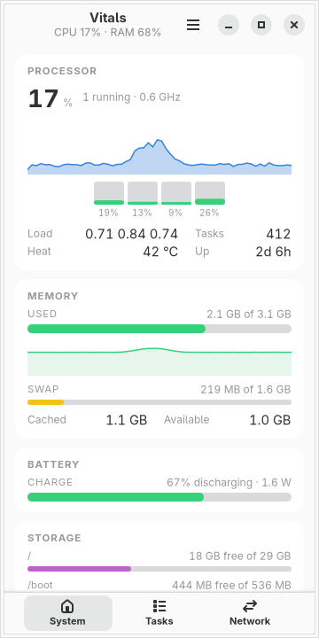
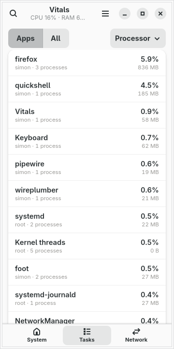
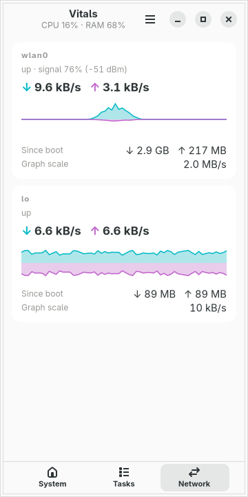
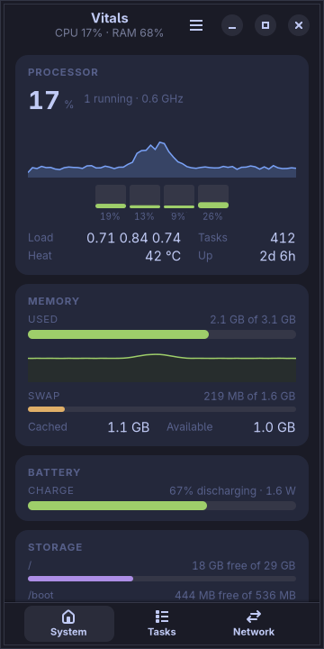
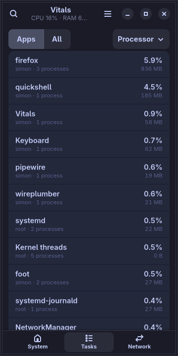
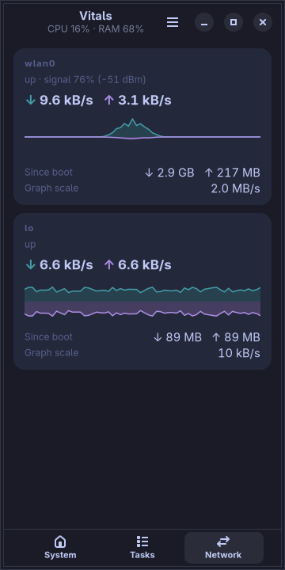

# moarchy-vitals

A task manager for a Linux phone: what the processor, the memory, the storage,
the battery and the network are doing, what is doing it, and one tap to stop it.
Most of what btop puts in four boxes, on a screen that fits one.

<p align="center">
  
  
  
</p>

<p align="center"><em>360×720, the size of a PinePhone's screen under
mobileomarchy. The colours are not the app's own — they are the active Omarchy
theme's, and <code>omarchy-theme-set</code> repaints the graphs while they are
on the screen.</em></p>

Built for [mobileomarchy](https://github.com/SimonSchubert/mobileomarchy), but
nothing in it is specific to that: it is a GTK4/libadwaita app that reads
`/proc`, and it runs on Phosh, Plasma Mobile, postmarketOS or an ordinary
desktop.

## This one is not a gap

Every app in this repo either answers a row in moarchy-store's
`docs/android-gaps.md` or says plainly that it does not. This is one that does
not. Linux has system monitors, and two of them are already in the store's own
catalogue: `gnome-usage`, listed and measured as fitting, and `bottom`, which is
there with the summary *"System monitor that fits a tiled terminal at 47
columns, unlike btop"*. `resources` is in `sweep/verdicts.toml` as deferred —
richer than Usage, and listing both would be listing one thing twice.

So the gap is not "a system monitor". It is these four things:

- **btop does not fit.** That is not a guess, it is the catalogue's own reason
  for listing `bottom` instead. And the one that does fit is still a program in
  a terminal: on a phone that means opening a terminal, on a keyboard that
  covers half the screen, to answer "what is eating my battery".
- **Usage is three of the five boxes.** The catalogue's summary of it is *"What
  is using the processor, the memory and the disk"*. The two it leaves out are
  the network and the machine's own heat and charge — which on a phone are the
  two questions asked most, because they are the two that cost you the
  afternoon.
- **A phone's processes are not a phone's apps.** A browser is twenty rows in
  every desktop task manager. Here it is one row that adds up to 836 MB, with
  the twenty behind it for when the answer really is a particular pid.
- **It is the phone's colours.** Every meter, graph and bar is drawn from the
  active theme, and a theme change repaints them in place, which is the property
  that makes an app belong on this phone rather than merely run on it.

Whether Usage or Resources is pleasant at 360px is a question for moarchy-store's
sweep, which scores packages on exactly that and has already answered it for
both. This is not an argument that they are unusable — it is an app written to a
different brief.

## What it does

Three pages, and the switcher is along the bottom where a thumb already is.

**System** — btop's four boxes, stacked and scrolled:

- the processor as a figure, a graph of the last two minutes, and **one bar per
  core**, which is the reading that matters on a big.LITTLE phone: one pegged
  core out of four is 25% on the headline figure and feels like the phone has
  stopped
- load average, running tasks, clock speed, **temperature** — coloured, not just
  printed, because 42 °C and 81 °C should not need reading
- memory used against total, the page cache counted separately, and **swap**,
  which on a 2 GB phone is zram and is where the phone goes to die
- **battery**: charge, whether it is charging, and what it is drawing in watts
- every mounted filesystem with a bar, and the disk's own read and write rates

**Tasks** — what is running:

- **Apps**, grouped: one row per app, its processor share and memory summed over
  every process in it
- **All**, when the answer is a particular process — with its command line,
  state, threads, parent, owner and processor time on its own page
- sort by processor, memory or name; search by name
- **End task** and **Force stop**, which are two different signals and say so

**Network** — one panel per interface:

- download and upload as a **mirrored graph**, down above the line and up below
- wireless link quality and signal strength in dBm
- totals since boot, and the scale the graph is drawn at, because a graph that
  rescales itself to its own peak is always full and never comparable

## The phone's colours

<p align="center">
  
  
  
</p>

One measurement, one hue, everywhere it appears: the processor is the theme's
accent in the figure, in the graph, in the core bars and in the task list's
processor column; memory is its green in all of them. A phone screen has no room
for a legend, so the colour is the legend — which only works if nothing else on
the screen is also that colour. Load is a ramp rather than a hue, because "this
core is at 97%" and "this one is at 12%" have to be tellable apart at arm's
length in daylight, and one colour at two lengths does not manage it.

## Where the numbers come from

`/proc` and `/sys`, and nothing else. No daemon, no `psutil`, no `lm_sensors`,
no shelling out to `ps`. The package's dependencies are the GUI stack the phone
already has, which is the whole of what it costs onto a stock image.

Everything is read through one object that knows *where* those files are, and
that is the most load-bearing decision in the app:

- **The tests write a machine.** `tests/fixtures.py` writes a directory shaped
  like `/proc` — two cores, three processes, a wireless interface — and the app
  reads it with exactly the code that reads a phone. So "two hundred busy ticks
  out of a thousand is twenty per cent" is a claim a test makes about a file it
  wrote, and every one of them runs on a Mac with no `/proc` in it at all.
- **The screenshots run a phone.** `demo.py` writes *sixty-four* such
  directories, two seconds apart, with a browser opening a page a third of the
  way through, and `sysinfo.Reel` reads one per tick. A system monitor
  photographed on a real machine two seconds after launch is a flat line against
  the left edge and whatever the container happened to be running; this has a
  past. The arithmetic is generated once and shared: each process is given a
  share of the machine, and the `/proc/stat` in the frame is the *sum* of those
  shares — so the task list and the processor graph agree because they came from
  one number rather than being dressed to match.
- **A fixture cannot signal anything.** The demo data has a pid 1 in it, and the
  container this is developed in is one where `os.kill(1, SIGKILL)` would be
  believed. A `Reel` records the attempt and sends nothing; the real one refuses
  pid 1 outright and lets the kernel refuse everything else.

Rates are differences between two readings, and the clock is `/proc/uptime`
rather than the wall clock — which is what lets a fixture advance its own time
by writing a different number, and is the same trick the screenshot harness uses
to pin today's date for Habits.

## Ending a task

Two buttons, because TERM and KILL are not two strengths of the same one:

- **End task** asks the process to stop, and it can save what it was doing —
  which on a phone is the note somebody was typing.
- **Force stop** takes it away mid-write. The dialog says so in those words,
  because "Force stop" on its own reads as "the one that actually works".

Both ask first. Ending an *app* signals every process in it, lowest pid first.
A process that belongs to another user is refused by the kernel and the app says
so plainly rather than as an error: a phone task manager runs as you, and you do
not own the processes that keep the phone up.

## What it costs to leave open

- **Two seconds a tick.** A processor reading is a difference between two
  samples, so a shorter interval measures a shorter span and reports more noise
  as load — and costs twice the work per minute on a phone.
- **The walk of `/proc` is optional.** Reading every process is a few hundred
  file reads; the System and Network pages need none of them, so they do not do
  them. The three files per process that never change — owner, command line,
  cgroup — are read once and cached under a key that includes the process's
  start time, because a pid is reused within minutes on a busy machine and a
  cache keyed on the pid alone eventually shows one process wearing a dead one's
  name.
- **It stops when it is not on screen.** A monitor still sampling after the
  phone is in a pocket is a battery bug wearing a feature's clothes — and on a
  phone an app is not closed, it is hidden, so that is the normal case rather
  than an edge one.

## Running it

```sh
python3 -m moarchy_vitals
```

That reads the machine you are on. To see it against the phone in the
screenshots instead:

```sh
export MOARCHY_VITALS_DIR=$(mktemp -d)
python3 demo.py
python3 -m moarchy_vitals
```

`demo.py` refuses to run without `MOARCHY_VITALS_DIR` set, because it writes a
couple of thousand files. With it set, the app reads that directory instead of
`/proc` — including for the two buttons that end a task, which is why the demo
is safe to run anywhere.

## On the phone

Run on a PinePhone under mobileomarchy — 4 cores, 2 GB, a Mali-400 with no GL —
reading its own `/proc`: 185 processes, 118 of them kernel threads in one row,
the battery at 0.5 W, the SoC at 42 °C, wlan0's throughput, and the whole thing
in the device's own theme. Two bugs came out of that in the first ten seconds,
and neither could have been found anywhere else:

- **The Wi-Fi signal was read as dBm.** This phone's Realtek reports the level
  column as its own 0-100 figure with a positive sign, so "47" was rendered
  through a dBm ramp and the panel read *signal 104%, clamped to 100*. The sign
  turns out to be the only thing in the file that says which unit is meant, and
  that is now what decides. The `link` column, which the first cut divided by
  70, is not used at all any more: its denominator is not in the file.
- **Five of the eleven rows on the first screen of the task list were cut
  short** — "moarchy-keyboar", "xdg-desktop-por", "evolution-sourc". The kernel
  stores fifteen characters of a process name, and a phone's programs are named
  by people who expected a desktop. The full name is in the command line, so it
  is taken from there — but only when the name that arrived is exactly fifteen
  characters and the executable's basename extends it, because a process that
  renamed itself to "Isolated Web Co" means that and should not be turned back
  into "firefox".

The graphs also start empty there and fill over the first two minutes, which is
what a real machine looks like and is the whole reason `demo.py` exists.

One thing that is not this app's to fix: every GTK4 app on that image logs
*"Unable to create a GL context"* at `window.present()` — `moarchy-keep` does it
identically — because the image sets no `GSK_RENDERER` and a Mali-400 has none
to give. GTK falls back to cairo, which is what the dev container is pinned to
anyway, so what is drawn is what was tested.

## Checks

```sh
scripts/check.sh vitals
```

ruff, then every file format and every rate against hand-written machines, then
the widgets on a virtual screen, then a real run that fails on any GTK warning.
That last one is the one that matters: a layout error is not an exception — the
app starts, the window appears, and one widget is the wrong size, with a single
line on stderr as the only sign.

The unit tests include one class that goes the other way and reads the *real*
`/proc`, asserting only that the answers are sane. A fixture proves the parser
is right about a file; only the live kernel proves the file is the one the
parser was written for, because the fixture was written by the same person as
the parser.

| variable | what it does |
|---|---|
| `MOARCHY_VITALS_DIR` | read this directory instead of `/proc` — a frame, or a reel of them |
| `MOARCHY_VITALS_QUIT_AFTER` | quit after N seconds, for headless runs |
| `MOARCHY_VITALS_PAGE` | open on `overview`, `tasks` or `network` |
| `MOARCHY_VITALS_TASKS` | `apps` or `all` |
| `MOARCHY_VITALS_SORT` | `cpu`, `memory` or `name` |
| `MOARCHY_VITALS_SEARCH` | open with the search bar up, holding this text |
| `MOARCHY_VITALS_PICK` | open straight onto a pid, or an app or process by name |

## Licence

MIT.
