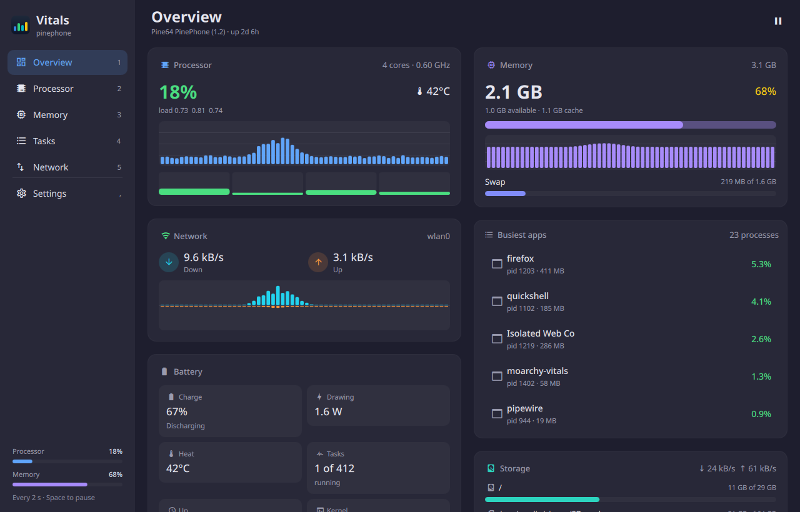
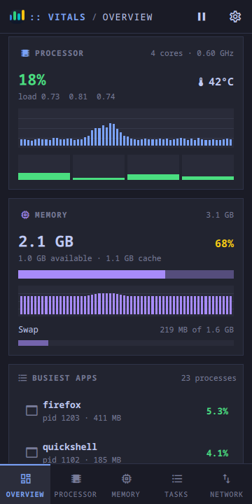
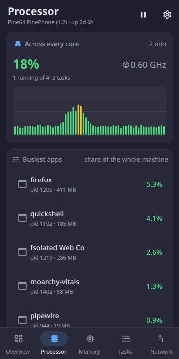
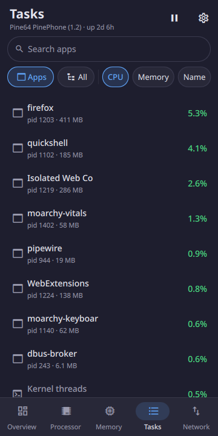
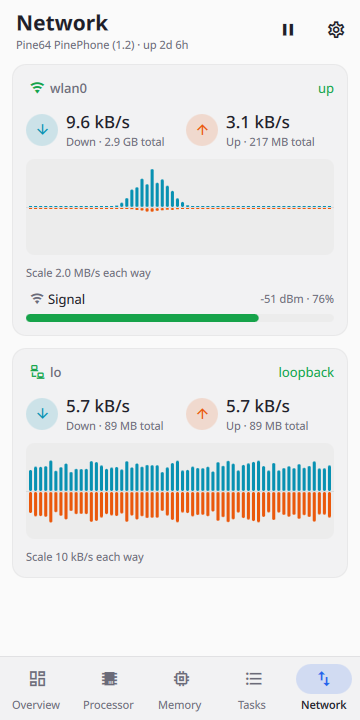
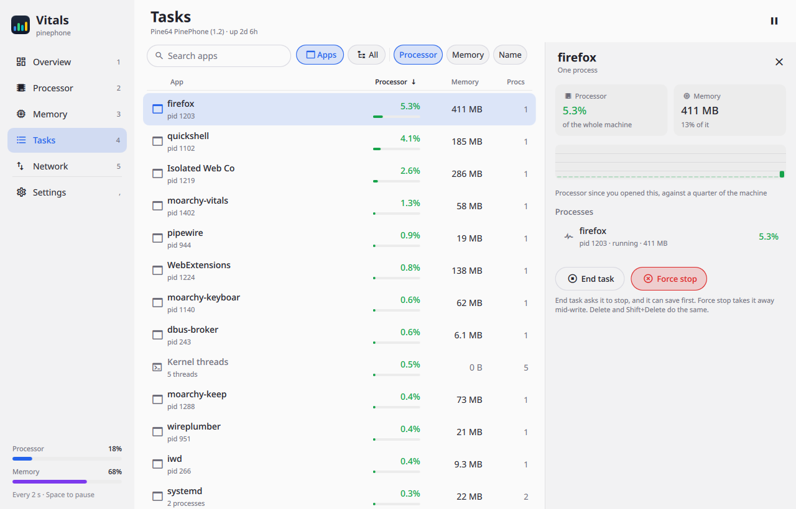

# Vitals

A task manager for Quickshell desktops and Linux phones. It shows what the
processor, memory, storage, battery and network are doing, what is using them,
and gives you a tap to stop it. It lays itself out for a desktop window and for
a 360 px phone screen.



<p>
  
  
  
  
</p>



<sub>The machine in these pictures is `dev/demo.py`'s recording of a PinePhone,
not the computer that took them.</sub>

## What it does

- **Overview**: every section below as a card, in one column on a phone and
  two or three across on a desktop. Each card opens its page.
- **Processor**:
  - the total as a number and as two minutes of history
  - one bar per core. On a big.LITTLE phone, one core pegged out of four shows
    as 25% overall, and the per-core bars are what make that visible.
  - load average, tasks, temperature and clock speed
  - the busiest apps
- **Memory**:
  - used against total, with the page cache shown separately because the
    kernel gives it back when an app needs it
  - swap, the disk's read and write rates, and each local filesystem with a
    bar
  - the apps using the most memory
- **Tasks**:
  - **Apps** lists one row per app, with the processor and memory of all its
    processes added up
  - **All** lists every process
  - sort by processor, memory or name
  - search by name, command line or pid
  - on a desktop, the task you pick opens in a pane beside the list
- **Network**: one card per interface. Download is drawn above the line and
  upload below it, on a fixed scale that is printed on the card. The card also
  shows totals since boot and, for wireless, the signal in dBm.
- **Detail**: the app or process's processor and memory, and a graph of its
  processor use since you opened the page. A process also shows its state,
  threads, processor time, start time, owner, parent, the app it belongs to,
  and its command line. From here you can **End task** or **Force stop**.

Processes with the same name count as one app: a browser's twenty processes
are one row with one total. Kernel threads are grouped into one row as well.

## Ending a task

There are two buttons because TERM and KILL are different signals:

- **End task** asks the process to stop, so it can save what it was doing
  first.
- **Force stop** kills it immediately, even in the middle of writing a file.

Both ask for confirmation first. Ending an app signals every process in it.
Vitals refuses to signal pid 1 or kernel threads. If a process belongs to
another user, the kernel refuses the signal and the app tells you so.

## Install

On Arch Linux or Arch Linux ARM, with a Wayland desktop, from the AUR:

```sh
yay -S moarchy-vitals      # or any AUR helper
```

This installs Quickshell too if it is missing, and adds a `moarchy-vitals`
command and an app menu entry. Vitals opens in its own window, and closing the
window ends it. Under Omarchy, when the shell has the plugin installed, it
opens inside the shell.

It uses the Omarchy theme either way. Standalone, it reads the same
`~/.local/state/omarchy/current/theme/colors.toml` and `shell.toml` the shell
does, and follows a theme change. The load colours and the memory, storage
and network colours come from the theme's red, yellow, green, magenta, blue,
cyan and orange, unless two of them would look alike. Without an Omarchy
theme it follows the desktop's light or dark preference. **Settings →
Appearance** can set it to light or dark instead.

On Omarchy Mobile the tabs and sheets stay above the gesture bar, and the
subtitle names the handset from the image's `device.conf`.

To open it with a key on Hyprland:

```
bind = SUPER SHIFT, Escape, exec, moarchy-vitals
```

0.1.0 was a GTK4/libadwaita app written in Python. 0.2.0 replaces it with this
Quickshell app under the same package name and command, so an upgrade replaces
the old app. Python and GTK are no longer needed for it.

## What it costs to leave open

- **Nothing while it is closed.** In the shell the plugin stays loaded, but it
  reads nothing until its window is on screen. When the window closes, it
  forgets its history.
- **One reading per tick**, every two seconds by default (1 s and 5 s are in
  **Settings**). Each reading runs one `sh`, one `awk` and one `df`. The
  earlier version ran a `cat` for every file, which on a Pixel 3a took 2.4 s of
  processor per reading. One `awk` over the same files takes 71 ms.
- **Processes only when a page shows them.** The network page does not read
  the few hundred per-process files.
- **Space pauses** the readings, which is also how you stop a sorted list from
  moving while you read it.

## Keys (desktop)

| Key | Action |
| --- | --- |
| `1`–`5` | Overview, Processor, Memory, Tasks, Network |
| `,` | Settings |
| `Space` | Pause or resume |
| `/` | Search tasks |
| `↑` `↓` `PgUp` `PgDn` `Enter` | Move through the task list, open one |
| `a` | Apps or every process |
| `s` | Next sort order |
| `Delete` | End the task (`Shift+Delete`: force stop) |
| `Esc` | Back one step |

## Where the numbers come from

Everything comes from `/proc` and `/sys`, plus `df` for how full each
filesystem is (the kernel does not keep that in a file). There is no daemon,
no helper library and no network access.

- Processor use is the difference between two readings. The time between
  readings comes from `/proc/uptime`, not the wall clock.
- A process's share is of the whole machine. One process using one full core
  of eight shows as 12.5%.
- A process that started since the last reading shows no rate yet. With only
  one reading, a process a millisecond old would look like a whole core.
- A pid that has been reused is recognised by its start time, so a new
  process is not credited with the old one's processor time.
- Memory used is total minus `MemAvailable`, which is the kernel's own
  estimate of what a new app could get.
- A wireless signal level is read as dBm when it is negative and as the
  driver's own 0–100 figure when it is not. That sign is the only place the
  file says which unit it uses.
- The kernel cuts process names to 15 characters. When a name is exactly that
  long and the command line extends it, the full name comes from the command
  line.

## Privacy and security

- **Network.** Vitals makes no network connections.
- **Processes.** Each reading runs one `sh -c` script. The script is fixed
  except for two things: the directory to read, which is quoted, and the pid of
  the process on screen, which is parsed as a number first. The script runs
  `awk` over a fixed list of paths, then `timeout 2 df -lPkT`, which covers
  local filesystems only so a network mount that stops answering cannot hang
  the reading. Ending a task runs `kill` with an argument list, not through a
  shell.
- **Files.** It writes only `~/.local/state/moarchy-vitals/prefs.json`, which
  holds the page you were on, the task list's mode and sort, the interval and
  the appearance. It stores nothing about the machine. Inside the Omarchy
  shell without the package, it also writes one app menu entry to
  `~/.local/share/applications`.

## Remove

```sh
sudo pacman -Rns moarchy-vitals
rm -rf ~/.local/state/moarchy-vitals
```

## Developing

```sh
quickshell -p apps/vitals/shell.qml                     # this machine
MOARCHY_VITALS_DIR=$(mktemp -d) sh -c \
  'python3 apps/vitals/dev/demo.py && quickshell -p apps/vitals/shell.qml'   # the recorded phone
```

`dev/demo.py` writes 64 frames of a PinePhone, two seconds apart, with a browser
loading a page partway through. Each frame's `/proc/stat` is the sum of its
processes' shares, so the task list and the graph agree. With
`MOARCHY_VITALS_DIR` set, the app plays the frames through, holds the last
one, and signals nothing.

Checks and pictures, in the `moarchy-qml` image (`docker/Dockerfile.qml`, plus
`ttf-jetbrains-mono-nerd` for the icons):

```sh
qmltestrunner -input apps/vitals/tests        # the parsers and the collector
qmllint apps/vitals/*.qml
apps/vitals/dev/shots.sh                          # docs/screenshots, both sizes
```

| variable | what it does |
|---|---|
| `MOARCHY_VITALS_DIR` | read demo.py's recording instead of this machine |
| `MOARCHY_VITALS_ROOT` | read a directory shaped like `/` instead of `/` |
| `MOARCHY_VITALS_PAGE` | open on `overview`, `processor`, `memory`, `tasks`, `network` or `settings` |
| `MOARCHY_VITALS_TASKS` | `apps` or `all` |
| `MOARCHY_VITALS_PICK` | open straight onto an app by name, or a pid |
| `MOARCHY_VITALS_QUIT_AFTER` | quit after N seconds, for headless runs |

## Credits

MIT licensed. Not affiliated with Omarchy or Quickshell.
