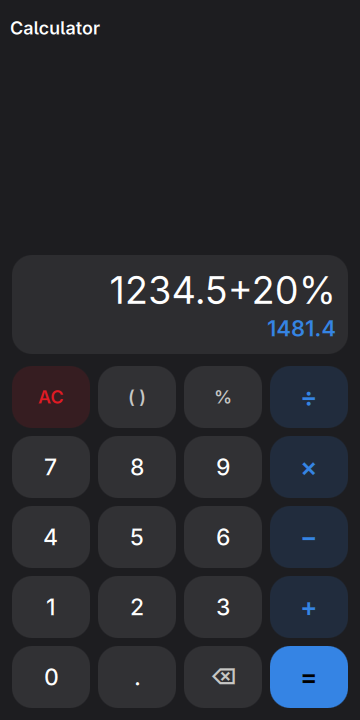
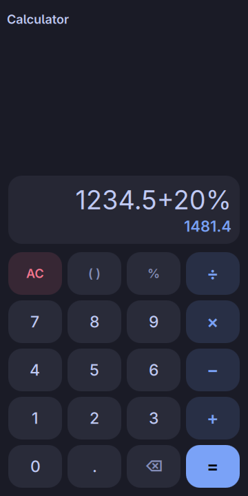
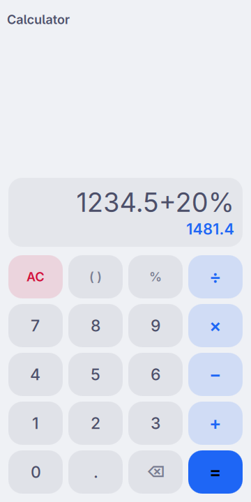

# Calculator, in the shell

The four operations, and arithmetic that counts in tens.

<p align="center">
  
  
  
</p>

<p align="center"><em>360×720, the size of a PinePhone's screen under
mobileomarchy. Every colour is the active Omarchy theme's, and
<code>omarchy-theme-set</code> repaints the keypad without restarting the
shell.</em></p>

This one is not a port. The rest of `plugins/` is the QML half of an app in
`apps/`; there is no GTK calculator here and there is not going to be one. It
was written for the shell first, which is what it should have been: a plugin is
an `Item` the shell already holds, so summoning it is `visible = true` on a
window that exists rather than four seconds of starting Python and GTK. A
calculator is the app that argument is *about* — it is opened for eleven
seconds, several times a day, usually while somebody is holding something else
in their other hand.

## This one is not a gap either

Every app in this repository that answers a row in moarchy-store's
`docs/android-gaps.md` says so. This is not one, and the honest version is
shorter than most: GNOME has shipped a calculator for twenty-five years, it is
`gnome-calculator` in `extra`, it is adaptive, and it is better at mathematics
than this will ever be — it does bases, currencies, matrices and a hundred
functions this has no key for.

What it is not is a *phone* calculator, and two things here are:

- **The keys are 62px.** A keypad is the one surface on a phone where a slip
  costs a wrong number rather than a wrong screen, and the usual thumb floor of
  44 is a floor rather than a target. Five rows of 62 still leave a third of the
  window for the sum.
- **It starts instantly**, because it is already running. See above.

There is no scientific mode, no memory, no history and no second page of keys
behind a toggle. Each of those is a row answering a question somebody standing
at a till does not have, and there is a `gnome-calculator` for anybody who does.
Twenty keys and one screen.

## The bottom of the screen is not ours

The shell keeps it: the gesture bar across the middle and moarchy-keyboard's
toggle at the right. Both are layer surfaces, so they draw over any app and take
the taps that land on them.

Drawn under them, this app's bottom row loses the middle of `=` to the keyboard
toggle — the pill sits exactly where the glyph is — and the same bite out of `.`
and the backspace to the gesture bar. Vitals draws under both and loses half of
its Network tab; a keypad cannot make the same trade, because the keys it would
lose are the ones people press. So the keypad reserves the bottom 60px when it
is running inside the shell.

Only inside the shell. Run from `shell.qml` on a laptop there is no furniture
down there, and a reserved strip would be a bug rather than a fix.

It was measured rather than guessed, and it needed the phone: the container that
runs the checks has no shell around the window, so there was nothing over the
keypad to see.

## It counts in tens

`0.1 + 0.2` in JavaScript is 0.30000000000000004, and every language with IEEE
doubles says the same thing for the same good reason. A calculator is the one
app on a phone where that is not a rounding detail to be tidied up on the way to
a label: it is a wrong answer, on the screen, in the program whose entire
product is being right about arithmetic. Rounding the display does not save it,
either — `0.1+0.2-0.3` would still come out a millionth of a millionth instead
of nought, and that is the sum people actually try.

Python's half of this repository would reach for `decimal` and the question
would not arise. QML has no decimal, so `Decimal.js` is one: a number is a sign,
a string of digits and a power of ten, and the four operations are the ones
taught at school, on strings. Add and subtract align the exponents and work
right to left with a carry; multiply accumulates partial products into a column
each and normalises once at the end; divide takes one digit at a time by
repeated subtraction. Thirty digits at a time makes all four instant — the
longest of them is nine hundred digit products, which a phone does between two
frames several thousand times over.

Thirty carried, twelve shown. The eighteen in between are guard digits, and they
are why `1 ÷ 3 × 3` comes back as 1.

## The percentages

The one piece of arithmetic every calculator is expected to get right and a good
half get wrong, because there are four answers depending on what is in front of
it:

| typed | means | answer |
|---|---|---|
| `200+10%` | ten per cent **of the 200**, added | 220 |
| `200−10%` | ten per cent of the 200, taken away | 180 |
| `200×10%` | an ordinary tenth | 20 |
| `200÷10%` | divided by a tenth | 2000 |

A percentage added to or taken from something is a percentage *of* that
something; multiplied or divided it is just a hundredth. The rule is four lines
in `Calc.js` and it deliberately does not reach one step further out —
`200+2×10%` is 200.2, because the thing being added is no longer a bare
percentage.

## The whole sum, then the answer

This is formula entry: you build `12+3×4` and the app tells you it is 24. The
four-function chain calculator would answer 60, because it applies each operator
as it is typed — which is the right design for a device with an eight-digit
display and nowhere to show what you typed, and the wrong one for a phone, which
has room. So the expression stays on the screen, × and ÷ bind tighter than + and
−, and **the running answer sits under it before `=` is ever pressed**. Most
sessions never press it.

It appears only once the sum has an operator in it: `12` under `12` is a line of
the display spent saying that twelve is twelve, and a preview that is always
there stops being read.

`=` replaces the sum with its answer, and keeps the answer to the digit rather
than to the twelve the display shows — so carrying on from it carries on from
what the arithmetic had, not from what was legible.

## A key that cannot be pressed does something instead of nothing

Typing `+` twice is not an error to reject, it is somebody changing their mind,
so the second replaces the first. A digit after `)` inserts the multiplication
that was meant. A minus straight after `×` is a sign rather than a second
operator, so `6×−2` is a sum you can type. One bracket key opens or closes by
where the sum has got to — after an operator only an open bracket can follow,
after a number only a close one can, and there is nothing in between. Pressing
`=` on `12+3×` answers 15 rather than counting brackets at you.

All of that is in `Calc.js`, and it is there so that **nothing else in the app
has to ask whether the expression is valid**. It cannot be made invalid from the
keypad, which is what lets the answer be recomputed on every keystroke.

## The file

`~/.local/share/moarchy-calculator/calculator.json`, or
`$MOARCHY_CALCULATOR_DIR`. Two fields.

```json
{
 "schema": 1,
 "entry": "1234.5+20%",
 "answered": false
}
```

A desktop calculator is a window you leave open; a phone calculator is a thing
you are holding when somebody rings, and what happens next is that the
compositor reclaims the app without asking. Coming back to a blank screen is
what makes a phone calculator annoying, so the sum is written down — not per
keystroke, which is a write per digit onto a phone's flash, but when the window
stops being mapped, which is the event immediately before being reclaimed.

`answered` is there because it cannot be worked out from the rest. The entry
comes back either from `=`, in which case it is an answer and the next digit
starts a new sum, or from the window going away mid-sum, in which case it is a
number being typed and the next digit belongs on the end of it. Both look like
`1428` in a file.

**The file is read exactly once, at startup.** That guard is not an
optimisation. `setText` writes the file, the watch on it fires, and the reload
hands back what was saved — so without it, pressing `=` and carrying on typing
puts the answer back on the display a moment later and takes the new sum away
with it. Every other plugin here gets away without the guard because re-reading
its own write restores the state it was already in; this one has a field that
moves on between the write and the read, which is what made it visible. It was
found in a screenshot, not in a test.

## Install on the phone

```sh
plugins/org.moarchy.calculator/install-on-device.sh
```

That copies the plugin into `~/.config/omarchy/plugins/org.moarchy.calculator`,
asks the shell to validate and enable it, writes a `.desktop` entry so the
drawer can summon it, and restarts the shell. Then tap **Calculator** in the
drawer.

```sh
omarchy-shell shell toggle org.moarchy.calculator
omarchy plugin validate org.moarchy.calculator
```

## Run it without the shell

`shell.qml` is the same app as its own Quickshell process, for a machine that
has Quickshell and none of omarchy:

```sh
plugins/org.moarchy.calculator/run-local.sh          # vendors ui/, then quickshell -p
MOARCHY_CALCULATOR_TYPED=1234.5+20% plugins/org.moarchy.calculator/run-local.sh
```

## Checks

```sh
scripts/qml-check.sh org.moarchy.calculator
```

qmllint with every warning fatal, then the three test files, then a real run at
360×720 that fails on any QML diagnostic.

The tests are worth more here than in most of these plugins, because the thing
being tested has a right answer that predates the app. `tst_decimal.qml` is the
arithmetic against sums a person would write down; `tst_calc.qml` is the four
percentage readings and every key that has to do something sensible with a
keypress that makes no sense; `tst_store.qml` is a file that has been edited by
hand.

| variable | what it does |
|---|---|
| `MOARCHY_CALCULATOR_DIR` | where the sum is kept |
| `MOARCHY_CALCULATOR_TYPED` | keys to press on arrival, for the screenshots |
| `MOARCHY_CALCULATOR_QUIT_AFTER` | quit after N seconds, for headless runs |

## Licence

MIT.
