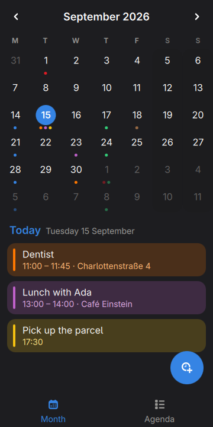
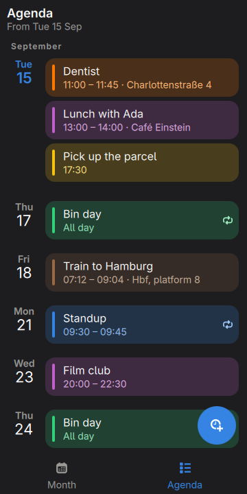
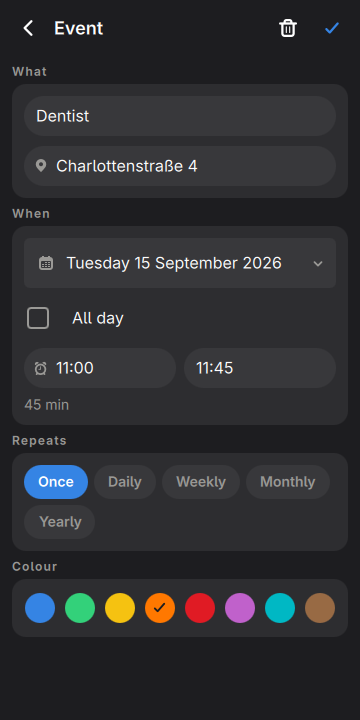
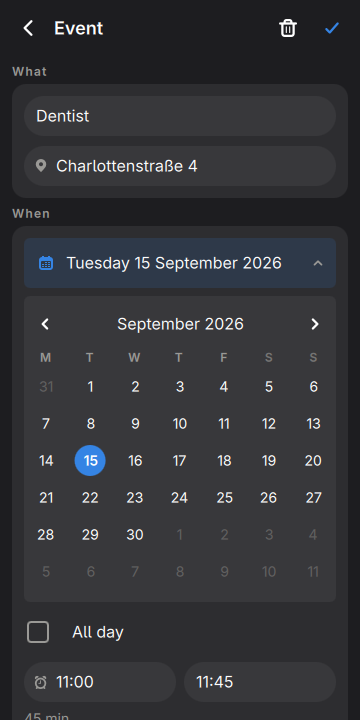
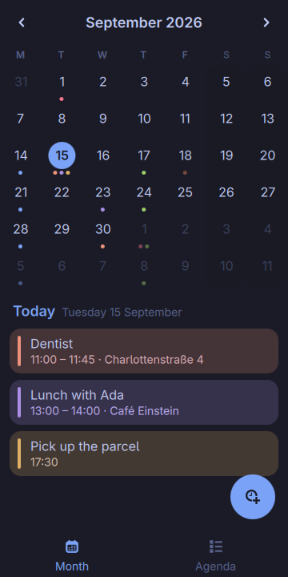
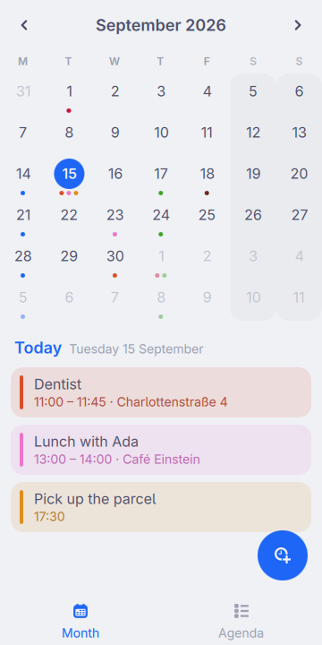

# Calendar, in the shell

The month, the day under it, and what is next.

<p align="center">
  
  
  
</p>

<p align="center">
  
  
  
</p>

<p align="center"><em>360×720, the size of a PinePhone's screen under
mobileomarchy. Every colour is the active Omarchy theme's, and
<code>omarchy-theme-set</code> repaints the grid without restarting the
shell.</em></p>

This one is not a port. There is no GTK calendar in `apps/` and there is not
going to be one: it was written for the shell first, which is what a calendar
should have been. A plugin is an `Item` the shell already holds, so summoning
it is `visible = true` on a window that exists rather than four seconds of
starting a process — and a calendar is opened for six seconds, several times a
day, usually while somebody is being asked whether Thursday works.

## This one is not a gap either

Every app in this repository that answers a row in moarchy-store's
`docs/android-gaps.md` says so. This is not one. There is no calendar row on
that list at all, and the reason is that the store already has one:
`gnome-calendar` is in `extra`, it is in the catalogue, it is *featured* there,
and the sweep that measures whether a thing fits 360px was complimentary about
it — "a seven-column month grid with week numbers at 360px is as tight as that
can be drawn, and it is legible".

So this needs an argument, and it is the calculator's argument with one number
attached. On the container these checks run in — Qt, Quickshell, and no GTK at
all — `pacman -S gnome-calendar` wants **112 packages**. The heavy one is
`evolution-data-server`, 30 MB installed, which is a hard dependency and brings
GTK3 alongside the GTK4 that is already there, `libphonenumber`, `libldap`,
Kerberos, and WebKit. Then `libedataserverui4` brings the *other* WebKit,
because it is built against GTK4 and the first one is not. Two browser engines
behind a month grid.

None of that is anybody's fault. Evolution's data server is the whole personal
information stack — mail, contacts, tasks, calendars, and the OAuth sign-in
that needs a browser widget to show somebody a Google consent screen. If what
is wanted is a calendar with accounts in it, that is the price of accounts, and
it is a fair one.

This is the other thing: **a calendar with no accounts in it**. One JSON file,
no daemon, no sync, nothing on the network, and three screens that were drawn
for a phone rather than reflowed onto one. It is worth having next to
`gnome-calendar` rather than instead of it.

The other calendar in the catalogue is the reason the screen size is not a
throwaway remark. `calindori` is listed as *clipped*, and the sweep's note on
it reads: "The month view is a seven-column grid drawn wider than the screen.
Monday and Sunday are cut off at both edges... Two days of the week are not
visible." A phone calendar can fail at exactly one thing and that is it.

## What it does not do

Worth saying before the rest, because all four are things a calendar usually
has:

- **It does not ring.** Nothing here raises a notification, and an event is
  something you look at rather than something that interrupts you.
- **There are no accounts.** No CalDAV, no Google, no Exchange, no `.ics`
  import or export. What is in the file is what there is.
- **It does not sync.** One phone, one file. Two phones would need a third
  thing, and that third thing is what evolution-data-server is.
- **Nobody is invited.** No attendees, no free/busy, no replies.

Each of those is a row that would have to be answered by a screen, and the
whole shape of this app is that it has three.

## Floating time

Everything here is a local calendar day written `2026-09-15` and a time written
as minutes past midnight. No UTC, no offset, no timezone. An event at nine on
Tuesday is at nine on Tuesday in Berlin and at nine on Tuesday in Lisbon.

That is not a shortcut, it is iCalendar's *floating time* — RFC 5545's
DATE-TIME form with neither a `Z` nor a `TZID`, "not bound to any time zone" —
and it is what a dentist's appointment in somebody's own phone actually means.
Habits made the same choice for the same reason, and its comment says it
shorter: a day is a label, not an instant.

The alternative is one line and is wrong in a way that does not show up in
Berlin: `new Date("2026-09-15")` is parsed as **UTC** midnight by the
ECMAScript specification, so `.getDate()` on it returns the 14th anywhere west
of Greenwich. `Dates.js` has no `Date` object in it except to ask the phone
what today is. A day is an integer — days since 1970-01-01 — and the two
functions that convert are Howard Hinnant's `days_from_civil` and
`civil_from_days`, which are exact for every year and twenty lines between
them.

## Five repeats, and not RFC 5545

Once, daily, weekly, monthly, yearly. Not `BYSETPOS`, not `BYDAY=-1SU`, and not
an RRULE parser: the recurrences a phone is given are a birthday, a standup, a
rent day and a bin collection, and everything else is what somebody types into
a desktop once a year.

There is no expansion into a list of occurrences and no cache of one. An
occurrence is a question asked of a day — `occursOn(event, "2026-09-15")` —
which the month grid asks 42 times per event and the agenda asks 400 times.
For a calendar with fifty things in it that is a few thousand string
comparisons, which is less work than the animation that put the grid on screen.

The two rules worth writing down are the ones every calendar has to choose:

| the event | the month | what happens |
|---|---|---|
| monthly, on the 31st | February | nothing. It does not move to the 28th, and it does not move to the 1st |
| yearly, on 29 February | 2027 | nothing. It happens in 2028 |

Both are RFC 5545's own rule for `BYMONTHDAY` — a recurrence instance that is
not a real date is ignored — and both are the answer that does not invent an
appointment on a day nobody chose. `tests/tst_events.qml` is where they are
written down.

A repeat can also be given an end, and the editor has no row for it: `until` is
a field the file can carry, shown in the line under the chips when it is there.
The repeats a phone is actually given do not end.

## A time is typed

There is no wheel and no spinner. A phone with an on-screen keyboard has no
room for either, and `930` is what people type when a box says 09:30 — so all
of these are half past nine:

```
9:30   930   0930   09:30   9.30   9h30   9 30   9:30 pm
```

A bare number is the hour, `12am` is midnight and `12pm` is noon, and anything
that is not a time at all — `25:00`, `9:75`, `elevenish` — is refused rather
than guessed at: the field says so and puts back what was there. Moving the
start moves the end with it and keeps the length, which is what every calendar
does and what nobody has ever had to be told.

Times are shown on the 24-hour clock, and that is not a setting. The phone's
clock, the shell's bar and the rest of this app are all on it, and a calendar
that disagreed with the bar above it would be the only thing on the screen
needing to be read twice.

## The week starts where the phone says it does

Which day a week begins on is the phone's business, not this app's.
`Qt.locale().firstDayOfWeek` is Monday here, Sunday in the United States and
Saturday in much of the Gulf, and it is the one thing on this screen that would
be *wrong* rather than merely foreign if it were hardcoded. The day names stay
English, because the rest of the app is.

The grid is six rows whatever the month needs — four, five and six all happen —
because a grid that changed height would move the day's events up and down
under it. Tapping the 30th and having the list jump a row is the sort of thing
nobody reports and everybody feels.

## Colour is the theme's

An event's colour is stored as a name — `green`, `magenta` — and resolved
through the active palette, so the same file under a different theme draws in
that theme's green rather than in a green from 2026. There are eight, they are
the eight hues every Omarchy theme defines, and a new event takes **whichever
is used least**. Nobody is asked to choose a colour and the calendar still
comes out looking like one.

The cards are washed in their colour rather than outlined in it. An outline at
360px is two pixels of hue against the window and reads as a border; a wash is
the whole row and can be seen without being looked at, which is what a colour
is for. The dots under a date are the same colours, up to four, because four
dots in four colours is the difference between a day with the dentist in it and
a day with four meetings — and a number would be smaller and would say less.

## A row this app cannot read is kept

`~/.local/share/moarchy-calendar/calendar.json`, or `$MOARCHY_CALENDAR_DIR`.

```json
{
 "schema": 1,
 "events": [
  {
   "id": "demo-4",
   "title": "Dentist",
   "where": "Charlottenstraße 4",
   "date": "2026-09-15",
   "start": "11:00",
   "end": "11:45",
   "colour": "orange"
  }
 ]
}
```

Times go out as `"11:00"` rather than as `660`, and the list is written in date
order, because the file is meant to be legible to the person whose calendar it
is — and the two who will read it are a person with a text editor and a script
with `jq`, in that order.

The part worth explaining is what happens to a row this app cannot read.
Quickshell's `FileView` already refuses to overwrite a file that will not
parse, and moves a broken one aside; that guards the *document*. It does not
guard a *row*: a file that parses cleanly can hold an event with no date on it,
there is nowhere to draw such a thing, and the next save would write the file
back without it. So every row that cannot be read is kept exactly as it was
found and written back untouched. The app is then free to ignore it, which is
the only way to ignore something without destroying it.

Two rows sharing an `id` get one each on the way in, because that is what a
copied and pasted file looks like and it is the shape that makes deleting one
event delete two.

## A script can put something in it

```sh
qs ipc call calendar today
qs ipc call calendar on 2026-09-18
qs ipc call calendar on ""          # whichever day is selected
qs ipc call calendar show 2026-12-24
qs ipc call calendar add '{"title":"Release","date":"2026-09-30","start":"16:00"}'
```

`add` is the only way into the file that is not a thumb, and it is the reason a
build that finishes at four can put itself in somebody's calendar. It returns
the id it wrote, which is what `remove` takes.

## What it costs while it is closed

Nothing, and that had to be made true rather than assumed.

`keepLoaded` in the manifest means the shell instantiates this app while *it*
is starting, hours before anybody taps Calendar — which is the whole argument
for a plugin, and also the thing that makes a plugin dangerous. A fault in an
app that starts when you open it is a broken app. A fault in an app the shell
holds open is a broken **phone**: the shell never finishes starting, and there
is no bar, no drawer and no way to get at anything.

This app shipped that fault. The month pager is a `ListView` over eighteen
hundred months, and it was laying itself out in the unopened window and then
jumping the nine hundred months from the start of its model to this one,
building and throwing away a grid per month on the way. On a phone that is a
core at 99%, no IPC targets registered, and a wallpaper. It did not show up in
any check here, because `shell.qml` opened the window on the first line and so
never once exercised the state the shell actually runs it in.

So the pager's model is empty until the window is on screen, the agenda's is
too, and `shell.qml` grew a switch for the state that was missing:

```sh
MOARCHY_CALENDAR_HIDDEN=1 MOARCHY_CALENDAR_QUIT_AFTER=20 \
  plugins/org.moarchy.calendar/run-local.sh
```

That loads the app and opens nothing, which is what the shell does. Watch what
the process burns: it should be nothing, and on the phone it is six ticks in
ten seconds against the nine hundred a pinned core would be.

## The bottom of the screen is not ours

The shell keeps it: the gesture bar across the middle and moarchy-keyboard's
toggle at the right. Both are layer surfaces, so they draw over any app and
take the taps that land on them — measured on a PinePhone at 360x740 by the
calculator, which reserves the bottom 60px for the same reason this does.

Here it is the tab bar that cannot be under them. Vitals draws under both and
loses half of its Network tab; a switcher nobody can press is worse than that.
So the 60px is reserved **only inside the shell**, where `shell` is not null.
Run from `shell.qml` on a laptop there is no furniture down there and a
reserved strip would be a bug rather than a fix.

## Install on the phone

```sh
plugins/org.moarchy.calendar/install-on-device.sh
```

That copies the plugin into `~/.config/omarchy/plugins/org.moarchy.calendar`,
asks the shell to validate and enable it, writes a `.desktop` entry so the
drawer can summon it, and restarts the shell. Then tap **Calendar** in the
drawer.

```sh
omarchy-shell shell toggle org.moarchy.calendar
omarchy plugin validate org.moarchy.calendar
```

## Run it without the shell

`shell.qml` is the same app as its own Quickshell process, for a machine that
has Quickshell and none of omarchy:

```sh
plugins/org.moarchy.calendar/run-local.sh
MOARCHY_CALENDAR_DIR=/tmp/c plugins/org.moarchy.calendar/demo.py
MOARCHY_CALENDAR_DIR=/tmp/c plugins/org.moarchy.calendar/run-local.sh
```

## Checks

```sh
scripts/qml-check.sh org.moarchy.calendar
scripts/qml-shot.sh org.moarchy.calendar
```

qmllint with every warning fatal, then the three test files, then a real run at
360×720 that fails on any QML diagnostic.

The tests are worth more here than in most of these plugins, because what is
being tested has a right answer that predates the app: the 29th of February
exists in 2024 and not in 2026 whatever this code thinks. `tst_dates.qml` is
the arithmetic — the civil-date conversion both ways for every day of four
years, the grid, and every way a person writes half past nine. `tst_events.qml`
is the recurrence table above and a file somebody has edited by hand.
`tst_store.qml` is what goes out, what comes back, and the row that is kept
even though it cannot be read.

| variable | what it does |
|---|---|
| `MOARCHY_CALENDAR_DIR` | where the calendar is kept |
| `MOARCHY_CALENDAR_TODAY` | pin today, so two shots either side of midnight agree |
| `MOARCHY_CALENDAR_WEEK_START` | pin the first day of the week, 0 Sunday to 6 Saturday |
| `MOARCHY_CALENDAR_DAY` | the day to open on |
| `MOARCHY_CALENDAR_PAGE` | `agenda` opens on the agenda |
| `MOARCHY_CALENDAR_EDIT` | open an event by name, for the editor shots |
| `MOARCHY_CALENDAR_PICKING` | with it, open the date picker too |
| `MOARCHY_CALENDAR_NEW` | open on a new event |
| `MOARCHY_CALENDAR_HIDDEN` | load it and do not open it, which is how the shell runs it |
| `MOARCHY_CALENDAR_QUIT_AFTER` | quit after N seconds, for headless runs |

## Licence

MIT.
