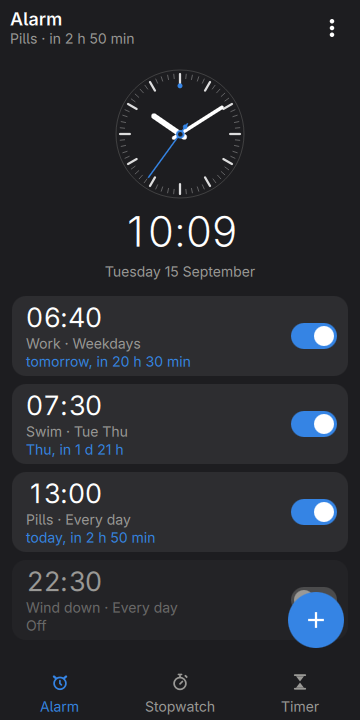
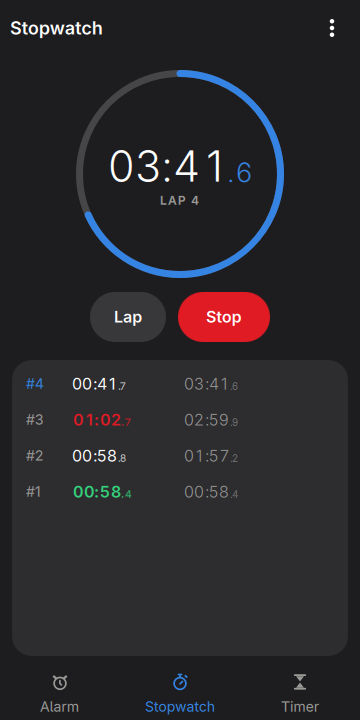
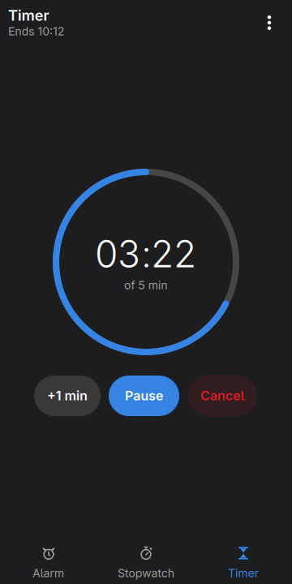
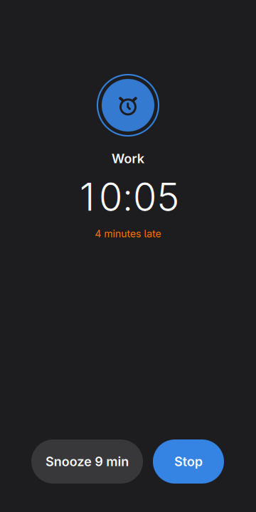
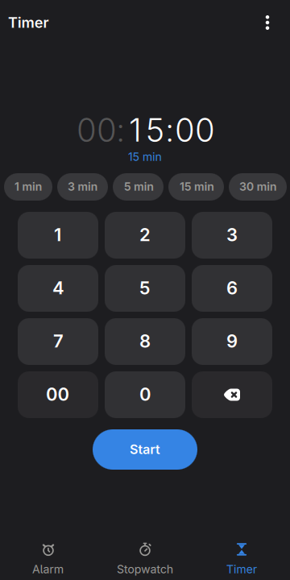
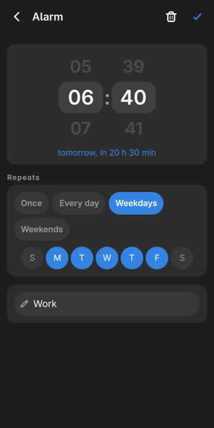
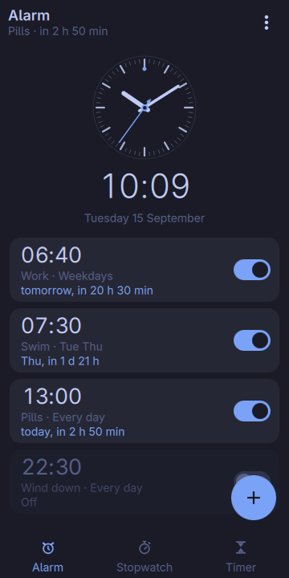
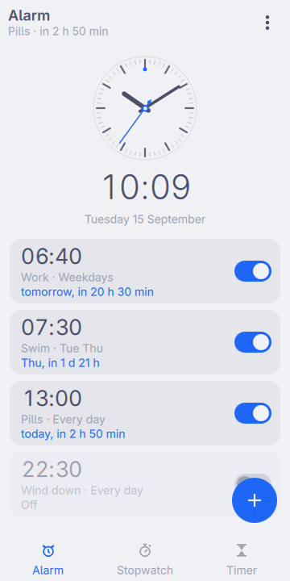
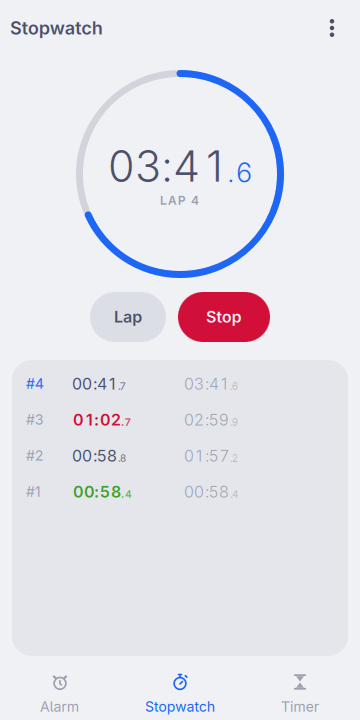

# Clock, in the shell

The time, an alarm that says when it is late, a stopwatch and a timer.

<p align="center">
  
  
  
  
</p>

<p align="center">
  
  
</p>

<p align="center">
  
  
  
</p>

<p align="center"><em>360×720, the size of a PinePhone's screen under
mobileomarchy. Every colour is the active Omarchy theme's, and
<code>omarchy-theme-set</code> repaints the dial without restarting the
shell.</em></p>

This one is not a port. The rest of `plugins/` is the QML half of an app in
`apps/`; there is no GTK clock here and there is not going to be one. And
unlike Calculator, where being a plugin is a *convenience* — eleven seconds of
use should not cost four of starting Python — being a plugin is the only
arrangement in which this app's headline feature works at all.

## The alarm is the whole argument

`"keepLoaded": true` in the manifest means the plugin host instantiates
`Clock.qml` when the shell starts and keeps it. So the timer that watches for
an alarm is running while there is no window anywhere on the screen, inside a
process that is already running for a dozen other reasons — the bar, the
gestures, the drawer.

The alternative shapes are both worse, and both were what a GTK app in `apps/`
would have had to be:

- **An app that has to be open.** Its alarm rings while somebody is looking at
  it, which is the one time they do not need it.
- **An app plus a background service.** Two things to install, two things to
  keep alive, and the alarm then lives in a process the app cannot see — so
  editing an alarm means a d-bus call, and the two halves can disagree about
  what is set. That is a second package for a hundred lines of `Timer`.

The plugin needs neither. There is one `Item`, it holds the alarms, it watches
the clock, and the window is a view onto it.

### What that costs when nothing is happening

**Nothing measurable.** Instantiated the way the host does it, with four alarms
loaded, no timer running and no window ever mapped, the process used *0.00
seconds of CPU over eighteen* — the whole app is asleep between wakeups.

That is a number worth having rather than assuming, because `keepLoaded` cuts
both ways: a plugin the host builds at startup can pin a core and take the
entire shell down with it, drawing nothing but the wallpaper, with a shell log
that ends cleanly and says nothing at all. It has happened in this repository
to a sibling of this plugin. So the idle path here is deliberately almost
empty — one `Qt.createQmlObject` probe for the text size, a few `env` reads, a
`mkdir`, one file read — and the only thing still running afterwards is a
single `Timer`.

That timer is the whole of the machinery. Its interval is the time until the
next thing that has to happen, capped at a minute and floored at a second:
a phone with an alarm eight hours away is woken sixty times an hour rather
than three thousand six hundred, and one second before the alarm it is woken
once. It runs only while the window is *down* — the one-second beat that drives
the dial takes over while it is up, and two timers both moving the clock would
restart each other for ever.

## What it cannot do, in as many words

**It cannot wake a sleeping phone.** Nothing a user process can do will:
`WakeSystem=true` on a systemd timer is root's, and so is `rtcwake`. An alarm
here is a `Timer` in a running process, and a suspended phone runs nothing.

So the behaviour is the honest one rather than the hopeful one. When the phone
comes back, `Alarms.due()` asks whether the most recent occurrence of each
alarm has been rung yet, and:

- **within the hour**, it rings, and the screen says *4 minutes late* — which
  is the screenshot above, because that is a state the app can actually reach;
- **past the hour**, it does not ring. It is recorded as having happened and
  the app says *06:40 went by while the phone was off*. Ringing at ten for a
  seven o'clock alarm is not a late alarm, it is a confusing one.

`Alarms.LATE_LIMIT` is that hour, it is a parameter, and `tst_alarms.qml`
drives both sides of it.

The same rule covers a snooze slept through and a timer that finished while the
phone was off, because all three are the same question asked of three different
stored instants.

## It is not a gap either

Every app in this repository that answers a row in moarchy-store's
`docs/android-gaps.md` says so. This does not, and the honest version is short:
**`gnome-clocks` is `extra/gnome-clocks` 50.0-2 for aarch64** — checked with
`pacman -Si`, not remembered — it has alarms, a stopwatch, a timer and world
clocks, it is a GNOME app with an adaptive layout, and it has been maintained
for fifteen years.

What it is not is a *plugin*, and on this image that is a structural difference
rather than a preference: an app is a process somebody has to start and
something has to keep, and mobileomarchy has no GNOME session to keep one.
Whether `gnome-clocks` survives that in practice — and whether it survives
360px — is a question for moarchy-store's sweep, which exists to score exactly
that. This README is not going to guess at it.

What can be measured without a phone is what it costs to put there, and on the
container these checks run in — Qt, Quickshell and no GTK at all — `pacman -S
gnome-clocks` wants **73 packages and 60 MB of download**. Five of them are a
geolocation stack: `geoclue`, `geocode-glib`, `libgweather-4`,
`gweather-locations` and `libmm-glib`, the last of which is there so that a
clock can ask the modem where it is. That is the price of the world-clock page,
it is a fair price if a world clock is what is wanted, and it is the page this
app does not have.

Which is the first of two things here that are about the phone rather than the
desktop:

- **No world clock.** Android's clock has one and this does not. The page that
  would carry it is the page a phone already has a clock on, in its own status
  bar, and the rest of a world-clock screen is a list of somewhere else — a
  search problem, a timezone database, a geolocation permission, and a screen
  most people open twice. Three tabs, and the first of the three is a dial.
- **The keys are the size they are for a thumb.** The timer's keypad is
  100×58, close to Calculator's 62, because a duration is typed in the same
  hurry a sum is.

## The three screens

### Alarm

A dial, the time under it, and the alarms under that — in one scrolling
column, so the dial goes away when the list needs the room.

The **dial has no numerals**. At 132px, six pixels of "12" is a smudge, and
four smudges at the quarters is what makes a drawn clock look like a skin
rather than an instrument. Sixty ticks do the job better: twelve long,
forty-eight short, and the eye reads the hour from where the hand points
between them. Twelve o'clock carries a dot in the accent, which is what tells
you the dial is the right way up.

The **seconds hand sweeps, and it sweeps without JavaScript.** A
`RotationAnimator` drives it on the render thread for a minute at a time,
phase-locked whenever the app re-reads the clock. A ticking hand would need a
wakeup a second to look right and would *still* stall for a beat every couple
of minutes, because a QML `Timer` fires on the first frame after its interval
and that error accumulates. Only the hour and minute hands move on the beat,
and at that scale a beat is invisible.

The dial sits on the **window's own background**, the colour of the status bar
above it. It used to sit on a band washed in a hue that followed the hour, and
the shell does not draw an app under the status bar — so the wash ended in a
hard line across the top of the screen, under a bar that was a different
colour. The ringing screen lost its wash for the same reason; its colour is in
the ring and the glyph.

Each row says three things: the time, what it is for, and **when it will next
go off**, as *today, in 2 h 50 min* or *Thu, in 1 d 21 h*. That last line is
the answer to the question the app was opened for, and it is also in the title
bar, so on most openings nobody has to scroll at all.

The switch is a switch and not the kit's tick box. A tick box says *this one is
selected*; a switch says *this one is on*, and an alarm is the second. It is
the one control here that gets used without anything being read, so it has to
be the shape the thumb already knows.

### Stopwatch

**Tenths, not hundredths.** A hundredth is 10ms, a thumb arrives within about
200 of where it meant to, and the second digit of a phone stopwatch is
therefore decoration that costs ten times the wakeups to draw. The *marks* are
kept to the millisecond — it is the display that stops at a tenth, so a lap
read off the screen is a lap the screen could see.

**Nothing counts.** The stopwatch is *when it started* plus what it had accrued
before the last pause; the timer is *when it ends*. A tick that arrives late,
or does not arrive at all because the phone suspended for twenty minutes,
cannot make either of them wrong. A stopwatch driven by `+= interval` loses
exactly the time the phone spent asleep, which is the time somebody was most
likely measuring — `tst_watch.qml` asserts the twenty minutes with no ticks in
them.

Laps are stored as marks on the elapsed time rather than as durations, so the
list can be read forwards and so deleting the arithmetic leaves the marks
intact. Best and worst are marked over the *finished* laps only, and only when
there are two that differ: a single lap is not a personal best, and neither is
a lap still being run. They are marked in the theme's green and red **and** in
bold, because a colour alone is not a signal everybody gets.

The ring shows the minute rather than the hour. A ring that has to show an hour
moves a degree a minute and reads as broken; this is the seconds hand of the
thing being timed, redrawn once a second while the digits move ten times.

### Timer

Digits push in from the right, which is how every microwave and every phone
timer has worked: 5, 0, 0 is five minutes. Ninety seconds typed as `0-0-9-0`
stays `00:00:90` while it is being typed and becomes a minute and a half when
it starts — the only place the app normalises what somebody typed is when they
press Start, and the line under the entry says what will run before they do.

The untyped leading zeros are drawn dim. It is a small thing and it is what
makes `00:05:00` read as five minutes rather than as a number to parse.

Running, the ring empties clockwise from twelve — the gap opens the way a hand
travels — and `+1 min` grows the total with it, so the ring is never asked to
draw more than a full turn.

## The sound

Nothing here ships a tone. The one an alarm should make is already on the
phone — `alarm-clock-elapsed` in the freedesktop sound theme, which is what
every GNOME alarm has used for fifteen years — and the players are whichever of
pipewire's, pulse's or libcanberra's happens to be installed.

Which one that is, is not asked. It is found the way the kit finds an icon: try
the first, and treat a non-zero exit as the answer. When the list runs out the
ring is silent **and the screen says so**, because an alarm that is quietly
mute is the worst failure this app has, and it is not going to be silent about
that as well.

Every candidate goes through `sh -c`, and that one detail is the difference
between the paragraph above being true and being a comment. Handed a binary
that is not installed, Quickshell's `Process` **does not emit `exited` at
all** — it logs *"Process failed to start, likely because the binary could not
be found"* and puts `running` back to false. So the first version of this walk
stopped dead at `pw-play` on a machine that had none of the three, never tried
the other four, never set the flag, and said nothing. That is measured, not
guessed: it is what the log said in a container with no audio player in it.

`sh` is always there. With the wrapper the process always starts, a missing
player is an ordinary exit code 127, and the walk reads it — five candidates,
five 127s, and the screen carrying the sentence. The arguments go through as
positional parameters rather than pasted into the script, so none of this
depends on a path without a space in it.

It loops with a gap in it. A tone on a loop with no space is a siren; the gap
is what makes it an alarm clock. And a ring nobody answers gives up after five
minutes and says afterwards that it rang to nobody — roughly what a bedside
clock radio managed before its own timer cut it.

`Silent ring` in the overflow menu turns the sound off and leaves the screen.

## One file

`~/.local/share/moarchy-clock/clock.json` holds three unrelated things that
share a file because they share an app: the alarms, the stopwatch as it was
left, and the timer as it was left. Only the first is worth keeping in the
sense that losing it matters. The other two are in there so that answering the
door does not reset a stopwatch, which is the single thing that makes a phone
stopwatch useless.

Every time in it is an epoch in **milliseconds**, in the file and in the code.
One unit rather than two: the stopwatch needs tenths, seconds would not carry
them, and a module taking seconds beside one taking milliseconds is a division
by a thousand waiting to be forgotten in the one place where being out by that
factor means an alarm that rings in 1970.

Writes happen when something happens — an alarm set, a lap taken, a timer
started — and on the window leaving the screen, which on this phone is the
event immediately before the app is reclaimed. **No tick in this app touches
the disk.**

The kit's `JsonFile` already refuses to overwrite a document that will not
parse and moves a broken one aside. It does not guard a *row*: a file that
parses cleanly can hold an alarm with no hour on it, there is nowhere to draw
such a thing, and the next save would write the file back without it. So every
row that cannot be read is kept exactly as found and written back untouched,
and the app says how many it ignored. Calendar's arrangement, for Calendar's
reason — that is the only way to ignore something without destroying it.

Two smaller rules, both in `Store.js` and both tested: a watch that claims to
be running with no start time stops where it stood rather than starting from
1970, and lap marks that do not climb are dropped, because a file somebody has
reordered by hand would otherwise produce negative laps.

## Time, and the two ways this repository does it

Calendar's `Dates.js` opens by saying there is no `Date` object in it. This
file's `Alarms.js` opens by saying the opposite, and the difference is the
point: a calendar's nine o'clock is **floating** — nine on Tuesday wherever you
are — and an alarm's seven o'clock is an **instant**, the one at which this
phone's clock reads 07:00.

So `setHours` and `setDate` are exactly the right tools here and exactly the
wrong ones there. They are also the only two operations that know where the
daylight-saving boundaries are, which is why every day step in this app is
`setDate(+1)` and never `+86400000`; the two differ twice a year and the
difference is the whole bug. Spring forward over an alarm set for 02:30 and
`setHours(2, 30)` lands on 03:30 — the hour that exists, and the answer every
phone gives.

## Three glyphs, and a line in the shared kit

Adwaita has an alarm clock. It has no stopwatch and no hourglass, and nor does
hicolor; GNOME Clocks draws its own and ships them inside a resource bundle a
Quickshell plugin cannot read. So the three tab icons are drawn here as a set —
all three, including the alarm, because a tab bar whose icons come from two
different hands looks wrong without anybody being able to say why.

Getting them on screen took one small change to `shared/qs_ui/Icon.qml`: a
`direct()` that returns a name which is already a path —
`Qt.resolvedUrl("glyph-stopwatch.svg")`, `file://…`, or anything starting with
a slash — and one changed line in `candidate()` to prefer it over the map. The
themed name still goes after it in the list as the fallback. It means an app
with artwork of its own does not need a second copy of the kit's icon loader to
draw it, and it is additive: nothing that was resolving before resolves
differently.

It also needed one changed line each in `scripts/qml-check.sh` and
`scripts/qml-shot.sh`, which vendored `*.qml`, `*.js` and `manifest.json` into
their temp trees and not `*.svg`. Without it the app lints clean and runs clean
with three empty tab icons — which is precisely the failure mode both of those
scripts exist to catch, and it had been true for any plugin shipping artwork
since the day the harnesses were written.

## The bottom of the screen is not ours

The shell keeps it: the gesture bar across the middle and moarchy-keyboard's
toggle at the right. Both are layer surfaces, so they draw over any app and
take the taps that land on them. Calculator measured the strip at 60px.

The tab bar is **flush with the bottom anyway**, as it is in every other app
here with one. It first sat on a reserved 60px strip, and later reached the
bottom edge as one 116px item with its tabs in the top 56 — and on the phone
both read as what they were: a band of nothing under the tabs, in two apps out
of seven. The cost is that the toggle sits over part of the Timer tab, as it
already does over the right-hand tab in Files, Coins, Launches and Vitals.
That is the shell's to fix with an exclusive zone, once, rather than every
app's to work round with a strip of its own.

The screens with no tab bar under them still clear the strip: the alarm editor
and the ringing screen, whose last controls would otherwise be the ones the
shell's furniture takes. Only inside the shell — `shell` is null when this runs
as its own Quickshell process, and there is no furniture to clear.

## `close()` has to close

This one is not visible from a laptop, and it is the host's contract rather than
a choice. Read `/usr/share/omarchy/shell/shell.qml`:

```qml
function hide(pluginId)      { ... invokeIfLoaded(id, "close", null) ... }
function isPluginOpen(id)    { ... return loader.item.opened === true ... }
function toggle(id, payload) { return isPluginOpen(id) ? hide(id) : summon(id, payload) }
```

So the shell closes an app by calling the plugin's own `close()`, and asks
whether it is open by reading the plugin's own `opened`. A `close()` that only
resets page state — which is what this one was, and what its siblings in this
repository still are — leaves `opened` true for ever. The first tap on the
drawer icon opens the app and **no tap ever closes it again**.

Measured on the phone, tapping each icon twice:

| plugin | after one tap | after two |
|---|---|---|
| `org.moarchy.clock` | open | **closed** |
| `org.moarchy.calculator` | open | open |
| `org.moarchy.keep` | open | open |
| `org.moarchy.coins` | open | open |

The fix here is three lines: `close()` saves if it needs to and hides the
window. The one exception is a ring — nothing that can happen by accident
should be able to lose an alarm that is going off, and a tap on a drawer icon
is the definition of something that happens by accident, so `close()` returns
early while something is ringing and only `Stop` or `Snooze` will do.

It is not visible from a laptop because standalone there is no shell to call
`close()` at all; the back gesture goes through `dismiss()`, which always took
the window down. That is why this app was finished, checked, photographed and
installed before anybody found it.

## Working on it

```sh
docker build --platform linux/arm64 -f docker/Dockerfile.qml -t moarchy-qml .
docker run --rm --platform linux/arm64 -v "$PWD:/src" -w /src moarchy-qml \
  scripts/qml-check.sh org.moarchy.clock
```

qmllint at `-W 0`, then the three test suites, then a real run of `shell.qml`
offscreen that fails on any QML warning.

The tests are the part that matters here more than in most of these apps,
because the thing that can be wrong is a morning somebody would otherwise have
to wait for. Eighty-four cases across three files, all of them over plain
`.pragma library` JavaScript with no QML in it:

- `tests/tst_alarms.qml` — does a weekday alarm on a Friday evening wait for
  Monday, is 00:05 at midnight five minutes away or a day, does an alarm that
  came due while the phone was off ring, does one that came due three hours ago
  stay quiet, does a snooze outrank the schedule, does a one-off switch itself
  off, and does an alarm that is *on* always have a next time.
- `tests/tst_watch.qml` — twenty minutes with no ticks in them, laps that do not
  climb, the best lap not being the one still running, and the countdown
  rounding up so the last second is on screen for the whole of it.
- `tests/tst_store.qml` — a row with no hour survives a save, two rows with one
  id do not become one alarm, and nobody has chosen twelve or twenty-four hours
  until somebody has.

On a laptop, without the shell:

```sh
plugins/org.moarchy.clock/run-local.sh
MOARCHY_CLOCK_PAGE=stopwatch plugins/org.moarchy.clock/run-local.sh
```

The alarm only watches the clock while that window is open — there is nothing
standalone to keep the plugin loaded, which is the argument at the top of this
file seen from the other side.

The pictures are `scripts/qml-shot.sh org.moarchy.clock`, and `shots.sh` says
which screens. The clock is pinned to 10:09:36 on Tuesday 15 September 2026 in
both halves at once — `demo.py` dates its fixture from `MOARCHY_CLOCK_NOW` and
the app reads its clock from it — because a clock photographed at whatever time
the run happens is a clock whose pictures all disagree. 10:09 is the time every
watch in every advertisement has ever shown: the hands make a V and none of the
three covers another.

## On the phone

```sh
plugins/org.moarchy.clock/install-on-device.sh
```

Copies the plugin with `shared/qs_ui` vendored as `ui/`, lays the icon and the
desktop entry down, adds the id to `~/.config/omarchy/shell.json`, and
restarts the shell. Then tap Clock in the drawer, or:

```sh
omarchy-shell shell toggle org.moarchy.clock
```

`IpcHandler` answers five questions and takes two orders, which is what a
status bar widget or a headset button would want:

```sh
qs ipc call clock next        # "06:40 in 20 h 30 min"
qs ipc call clock elapsed     # "03:41.6"
qs ipc call clock remaining   # "03:22"
qs ipc call clock snooze
qs ipc call clock stop
```
