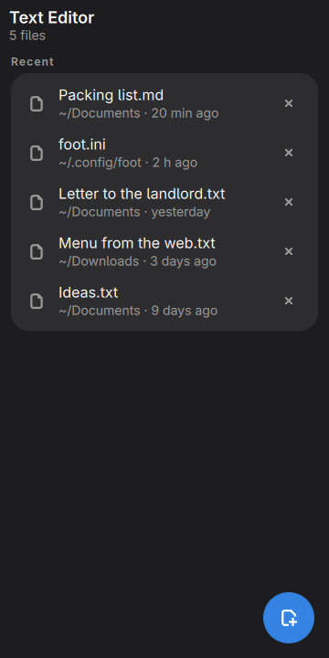
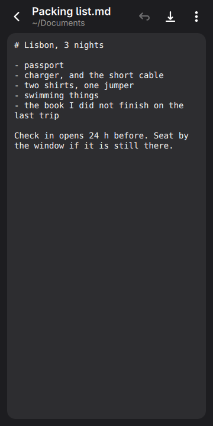
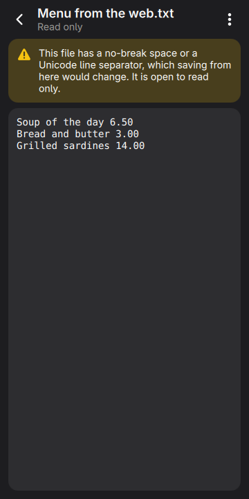
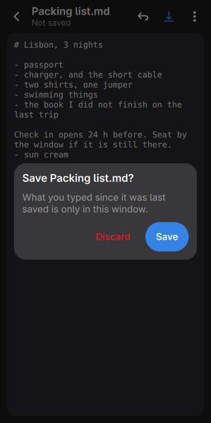
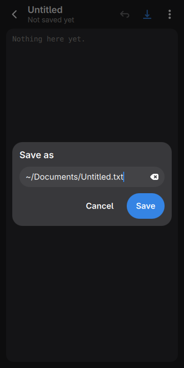
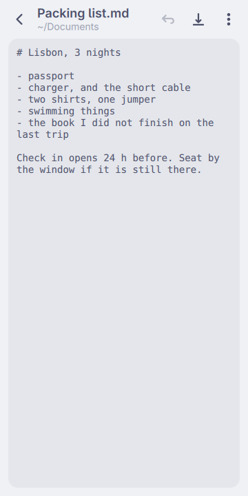

# Text Editor, in the shell

One text file at a time, with undo and save where a thumb can reach them.

<p align="center">
  
  
  
</p>
<p align="center">
  
  
  
</p>

<p align="center"><em>360×720, the size of a PinePhone's screen. Every colour
is the active Omarchy theme's.</em></p>

Two screens. **The list** is the files this has opened, newest first. **The
file** is the text in a box, with undo and save in the bar above it — because
the phone's keyboard has no Ctrl key, and an editor whose undo is Ctrl+Z is an
editor with no undo.

It replaces `gnome-text-editor` as the phone's editor, which means two jobs and
not one: what opens when a text file is tapped in Files, and what `git commit`
runs as `$EDITOR`. The second is the one that shaped it.

## It is not a gap

GNOME Text Editor is good, it is adaptive, and it does a great deal this does
not: tabs, search and replace, syntax highlighting, spell checking, sessions it
restores after a crash. In the container these checks run in — Qt and
Quickshell and no GTK — `pacman -S gnome-text-editor` wants 70 packages and
55.5 MB. On the phone most of that is already there for Loupe and Papers, so
that number is not a saving; it is the cost of the argument the other plugins
here make, which is that summoning an app should be a window becoming visible
rather than a process starting.

What this has instead is what a phone uses an editor for: a note, a config file
somebody told you to change, and a commit message.

## Being $EDITOR

A plugin is not a process, so opening a file in it returns at once. That is
right for a tap in Files and wrong for `git commit`, which reads the message
back the moment its editor exits — so an editor that exits at once is a commit
with no message.

`bin/moarchy-editor --wait FILE` is the process that waits. It names a marker
file in the summon, and the plugin touches the marker at the moments a separate
editor would have exited: the file is closed, another file replaces it, or the
window goes away. Waiting forks nothing — it is a bash `read -t` on a
descriptor that never has anything on it, measured at 0 CPU ticks. Every twenty
seconds it asks the plugin whether it still holds the marker, so a shell that
restarted in the middle ends the wait rather than hanging the terminal; three
unanswered asks end it too.

Back from a file that was opened this way closes the window as well, and the
bar says *Go back when you are done* while a caller is waiting, because nothing
else on the screen would.

## What it will not write

Qt's text control does not hand text back exactly as it was given. Measured
against the phone's Qt: a no-break space comes back as a space, U+2028 and
U+2029 come back as newlines, a lone carriage return comes back as a newline,
and CRLF comes back as LF. An editor that saved those files would change
characters nobody touched, and nothing would say so.

So:

- **CRLF throughout** is folded to LF for editing and put back on save, which
  is exact.
- **A no-break space, a Unicode line separator, or mixed line endings** opens
  read only, with a box above the text that says why.
- **A NUL** is not a text file, and **U+FFFD** means the file was not UTF-8 and
  the bytes that were not are already gone from what was read. Both open read
  only.
- **A file without write permission** opens read only too, and Save offers to
  save a copy somewhere else.

Nothing is read before one `stat` has said what it is. FileView reads a file
whole into the shell's own process, and the shell is the phone's UI, so a
folder, a file you cannot read, and anything over 256 KB are refused before a
byte of them is loaded. The 256 KB is a guess rather than a measurement: one
TextEdit lays the whole file out on a Cortex-A53, and the number is low enough
that a mistaken tap on a log costs a second and not the shell.

Saving goes through FileView, which writes atomically, through a symlink to its
target, keeps the file's mode, and makes missing folders. Each of those was
measured in the container before anything here relied on it.

## Unsaved edits

Opening another file, starting a new one and closing this one all go through
one question: *Save* or *Discard*, and a tap outside it keeps editing. Hiding
the window does not ask. What is typed and not saved stays in the window and is
there the next time it is summoned, which is how a phone app is left rather
than closed — but it is not on disk, and anything waiting on the file is let go
with the file as it is on disk.

## Install on the phone

```sh
plugins/org.moarchy.editor/install-on-device.sh
```

That installs the plugin, both desktop entries and `~/.local/bin/moarchy-editor`,
and changes no defaults. On an image whose moarchy package knows the name,
`omarchy-default-editor moarchy-editor` makes it the editor and the handler for
text files.

## Run it without the shell

```sh
plugins/org.moarchy.editor/run-local.sh
MOARCHY_EDITOR_OPEN=/etc/hostname plugins/org.moarchy.editor/run-local.sh
```

The list of files and the wrap setting live in
`~/.local/share/moarchy-editor/state.json`, or `$MOARCHY_EDITOR_DIR` if set.

## Two desktop entries

`org.moarchy.Editor.plugin.desktop` is the drawer's, and toggles the window.
`org.moarchy.Editor.open.desktop` is hidden from the drawer and is what xdg-open
runs for a text file: `omarchy-shell shell summon org.moarchy.editor %f`.

They cannot be one entry. A toggle with a path in it hides an editor that is
already open instead of opening the file, and the drawer finds a plugin's
window by `shell toggle <id>` in an entry's Exec, so the drawer's entry cannot
summon instead.

## What it does not do

- No tabs: one file at a time, and the list is how you get to the others.
- No search, no replace, no syntax highlighting, no spell check.
- No way to pick a file from inside it. Files does that, and tapping a text
  file there opens it here.
- No selecting part of the text. On a 360px screen a drag has to scroll, or a
  long file cannot be moved through at all — so the menu has *Copy all* and
  *Paste*, which are the two a phone needs, and nothing in between.
