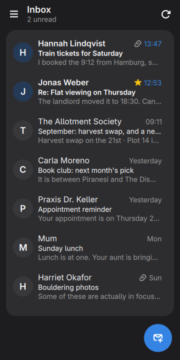
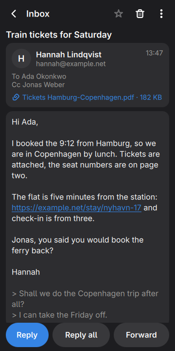
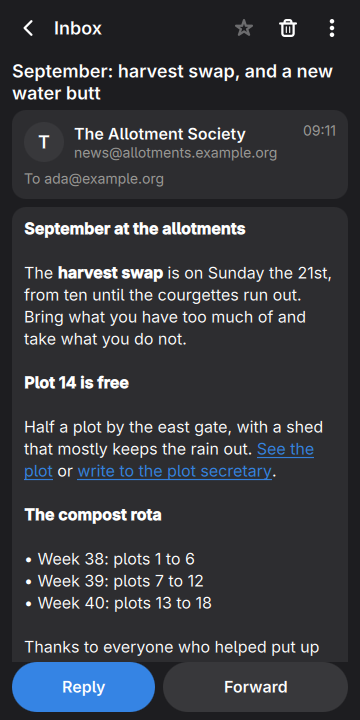
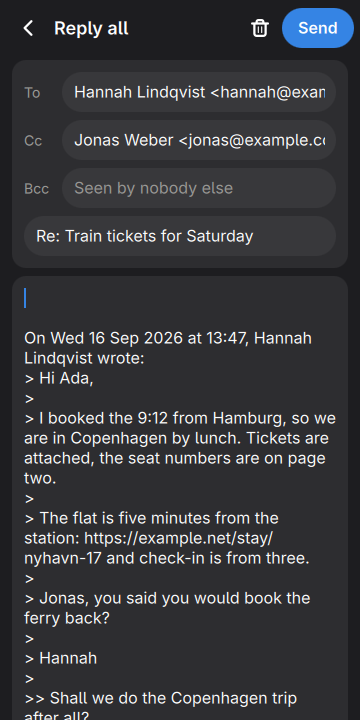
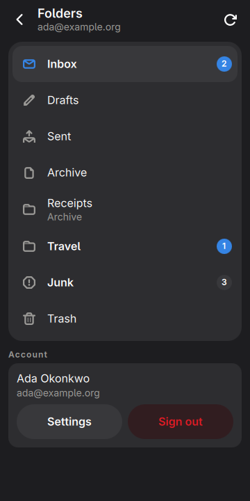
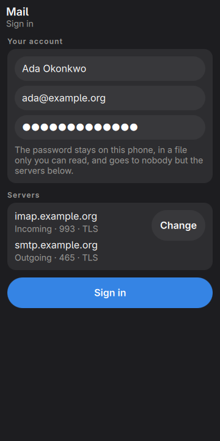
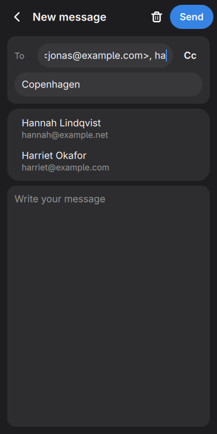
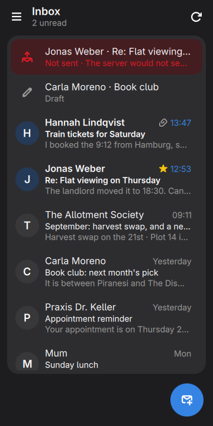
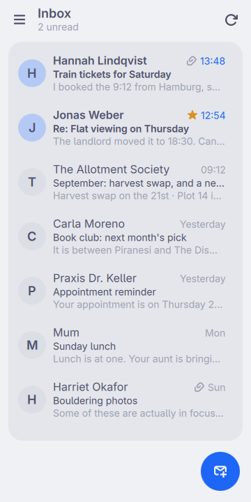

# Mail, in the shell

One email account: its folders, reading, replying, and new mail in the Inbox
noticed with the window closed.

<p align="center">
  
  
  
</p>
<p align="center">
  
  
  
</p>
<p align="center">
  
  
  
</p>

<p align="center"><em>360×720, the size of a PinePhone's screen. Every colour
is the active Omarchy theme's.</em></p>

This replaces Geary on moarchy. Geary is a good mail client and it was on the
image for a reason, but moarchy-store's sweep rejected it for this screen —
*"desktop-shaped three-pane mail client. Also wants an unlocked keyring"* —
and where no keyring is unlocked, the prompt for one maps behind Geary's own
window, the way the catalogue records it doing to Fractal. In the Qt-only
container these checks run in, `pacman -S geary` wants 127 packages and a
162 MB download, most of it a WebKit to draw HTML in.

## How it reaches a server

QML cannot open a TLS socket, so the plugin never talks to a server itself.
`bin/moarchy-mail` does, one run per request — a verb, the request as JSON on
stdin, one JSON object on stdout — and exits. It is Python with nothing but
the standard library: `imaplib`, `smtplib` and `email`, which is where the
years of charset and MIME handling already are.

| the app wants | moarchy-mail does |
| --- | --- |
| a folder | `STATUS`, `EXAMINE`, the UIDs and flags from the oldest message the app already has, and headers plus the first 3 KB of body only for the ones it does not |
| older messages | `UID SEARCH` below the oldest, the next fifty |
| a message | `UID FETCH BODY.PEEK[]`, kept as `.eml`, parsed into text and links |
| read, starred | `UID STORE`, drawn at once and held until the server has said yes |
| delete | `UID MOVE` to Trash (or `COPY` and `EXPUNGE`); in Trash, gone, after asking twice |
| send | SMTP, then `APPEND` to Sent unless the provider files it there itself, and `\Answered` or `$Forwarded` on the original |
| what is new | `STATUS INBOX` and `UID SEARCH UNSEEN` above the last UID seen, every fifteen minutes |

Between refreshes the app draws from its own files, so a folder opens at once
and a message read before opens without the network.

## No HTML is drawn

`moarchy-mail` turns an HTML message into text, bold and links, and the app
draws the result as StyledText. Every tag in that string was written by
`moarchy-mail`: there is no ``, so nothing in a message can make the phone
fetch a picture — which is how a sender learns that, when and where a message
was read — and a link's `href` is only an index. Tapping a link shows where it
goes before opening it, because in mail the words of a link and its address
are two different claims.

What is lost is layout. A newsletter comes out as its headings, paragraphs,
lists and links, and says how many pictures it had.

## The password

It is in `~/.local/share/moarchy-mail/password`, mode 0600, in a 0700
directory, and nowhere else: not in `account.json`, not on a command line, and
not in the app, which hands it to `moarchy-mail` once on stdin when the form is
sent. That is how aerc, neomutt and msmtp keep one. It is not in the keyring
because that is the thing Geary was waiting on: the keyring on this phone is
locked until something prompts, and the prompt maps behind the window that
wanted it.

Anybody who can read your home directory can read it. On a phone that is you.

## New mail

The shell keeps the plugin loaded. Ninety seconds after the shell starts, and
every fifteen minutes after that, it runs `moarchy-mail peek`: one login, one
`STATUS`, and headers only if there is something new. New mail rings
feedbackd's `message-new-email` and puts a line in the shade. It is not IMAP
IDLE, which would be a process holding a connection open all day for a message
that can wait a quarter of an hour.

With the window closed it does nothing else. Loaded and closed, it measured 0
ticks of CPU in 20 seconds, and every screen but the Inbox is built only while
it is on screen.

## Install on the phone

```sh
plugins/org.moarchy.mail/install-on-device.sh
```

That installs the plugin, `~/.local/bin/moarchy-mail`, the drawer's entry and a
hidden one that `mailto:` links open. Geary's mail, settings and keyring entry
are left where they were.

Then tap **Mail** in the drawer, or:

```sh
omarchy-shell shell toggle org.moarchy.mail
qs ipc call mail compose "ada@example.org"
qs ipc call mail check
```

## Run it without the shell

```sh
plugins/org.moarchy.mail/run-local.sh
```

Standalone, it only looks for mail while its window is open.

## Checks

```sh
docker run --rm --platform linux/arm64 -v "$PWD:/src" -w /src moarchy-qml scripts/qml-check.sh org.moarchy.mail
docker run --rm --platform linux/arm64 -v "$PWD:/src" -w /src moarchy-qml plugins/org.moarchy.mail/tests/e2e.sh
```

The first is every plugin's: lint, the JS tests, a real run. The second is
`moarchy-mail` against a real server — Dovecot, installed into the container
for the run, plain and over TLS with a certificate from a CA made on the spot
— and an SMTP server in the test that keeps what it is sent. It signs in with
a wrong password and a closed port, lists folders with a name in UTF-7, pages
back through a folder, fetches a body and an attachment, marks, moves, deletes,
finds new mail, and forwards a message with its PDF, then looks for the copy in
Sent.

## What it does not do

- One account.
- No OAuth. Gmail, Yahoo and iCloud need an app password instead of the
  account's own; Microsoft accounts no longer take a password over IMAP at
  all. The sign-in screen says which, before the password is typed. None of
  the four has been signed in to from here yet — only Dovecot has.
- No conversations: each message is its own row.
- No search.
- No pictures, and no HTML layout — see above.
- No attaching files to a new message. A forward carries the original's
  attachments; there is no file picker to choose one from.
- No signature, no rules, no push. New mail is noticed within fifteen minutes.
- Drafts stay on the phone rather than in the server's Drafts folder.
