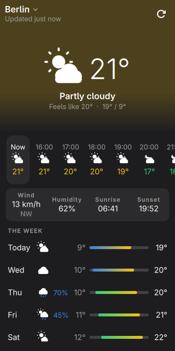
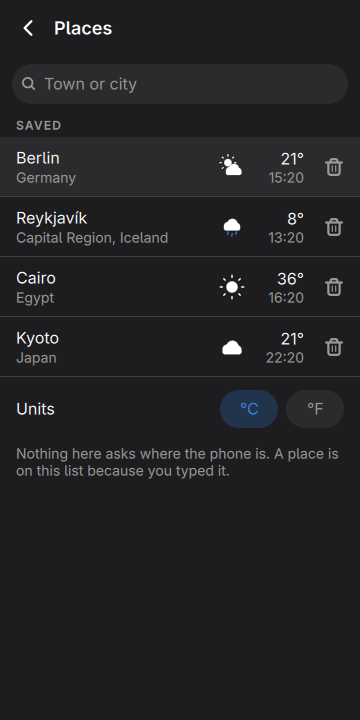
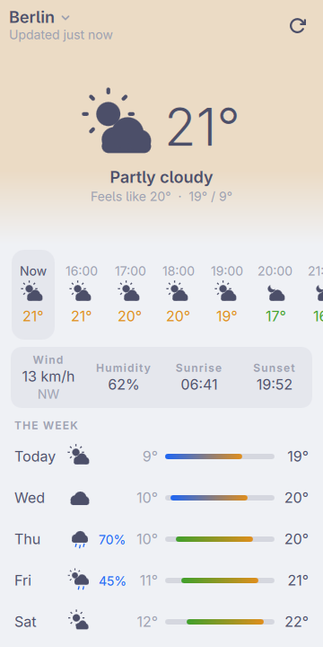

# Weather, in the shell

Now, the next day, and the week — for the places you named.

<p align="center">
  
  
  
</p>

<p align="center"><em>360×720, the size of a PinePhone's screen under
mobileomarchy. Every colour is the active Omarchy theme's — the band across
the top is the temperature's own hue, mixed from the palette rather than
picked — and <code>omarchy-theme-set</code> repaints it without restarting the
shell.</em></p>

This one is not a port. There is no GTK weather app in `apps/`, and there is
not going to be one: it was written for the shell first, which is what an app
opened for nine seconds several times a day should be. Summoning it is
`visible = true` on a window the shell already holds, and the last forecast is
already in memory, so the answer is on the screen before the radio is asked.

## What this is, and what it is not

moarchy-store's `docs/android-gaps.md` puts **Breezy Weather** in tier one —
"radar, air quality, pollen, warnings, many sources" — and names it one of the
three worth writing first. **This is not that app.** There is no radar here, no
air quality, no pollen, no warnings and one source. Writing those was not the
job; the row stays open.

What the same catalogue already has is `gnome-weather`, which is listed,
featured, and whose sweep verdict reads *"Ran at 360x674 and drew correctly;
follows the theme. 1 packages, 0.15 MB"* — and `kweather` beside it. So the
honest version is the calculator's: **this is not a gap, it is the shell
argument**, and two things here are a phone's rather than a desktop's.

- **It is one screen.** Now, today and the week are one column you scroll, not
  three places to navigate between. The places live behind the title, because
  choosing a town is something you do twice a year and reading the sky is
  something you do at a bus stop.
- **It starts instantly**, because it is already running.

## The screen

- **The band** is the temperature's hue mixed into the window's own colour —
  blue when it is cold, red when it is hot, weaker after dark — so the screen
  has answered before the number is read. It moves rather than jumps: a
  quarter-second fade when the town changes or the sun goes down.
- **The strip** is the next twenty-four hours, the one you are in marked both
  by a pill and by the ink of its label. A chance of rain appears above ten per
  cent and not below, because a column of "0%" is twenty-four numbers nobody
  reads.
- **The week** is seven bars on **one scale**: the coldest and warmest of the
  whole week are the two ends of every row, so a bar further right is a warmer
  day. Per-row scaling would draw every day identically and mean nothing. The
  colour is decoration — both ends of each bar carry their own number.
- **The symbols are drawn**, not loaded: eleven of them out of rectangles and
  circles — three with a night half, so fourteen pictures — at whatever size
  they are asked for. Adwaita ships weather
  symbolics and they are drawn on a 16px canvas, where the hero here is 84.
  Rectangles rather than a `Canvas` for Vitals' reason — thirty-two of these
  are on screen at once, and a rectangle repaints nothing when nothing changed.

Nothing carries its meaning by colour alone. Roughly one man in twelve cannot
tell this app's green from its red, so every temperature is written as well as
tinted, and a wet hour says what per cent it is.

## The clock is the forecast's, not the phone's

Every time on the screen — the hours in the strip, sunrise, sunset, which day
is today — is the clock **where the weather is**. That is the whole reason the
request asks for `timeformat=unixtime`: Open-Meteo's default sends naive local
strings like `2026-09-15T14:00` with the offset reported separately, and then
a phone in Berlin reading Denver's forecast has to work out which of the two
clocks each string is on. As seconds it is arithmetic — the wire is UTC, the
offset comes with it, and the local wall clock is `t + offset` read in UTC.

The places page is where that stops being a claim: each town carries its own
time under its temperature, which is also the most useful thing a list of four
towns can say.

## Nothing here asks where the phone is

There is no geolocation, no IP lookup and no "use my location" button. A place
is on the list because somebody typed it. That is a smaller app than the one
with a location button, and it is the version whose network behaviour can be
written down completely:

- one `GET` of Open-Meteo's forecast endpoint per place being looked at, at
  most four times an hour, and only while the window is on the screen;
- one `GET` of its geocoder while somebody is typing a town, three hundred and
  fifty milliseconds after they stop;
- nothing else, ever. No key, no account, no identifier — Open-Meteo's free
  tier answers unauthenticated requests and asks for non-commercial use.

A refresh that fails leaves the forecast on screen, says `Not updating · 4 min
ago` in the header, and backs off — a minute, then two and a half, then five,
then ten, and ten minutes flat when the answer was a rate limit.

## The files

`~/.local/share/moarchy-weather/`, or `$MOARCHY_WEATHER_DIR`.

`places.json` is the only thing here a person made — the towns, which one is on
screen, and which scale of degrees. `forecast.json` is the last answer about
each of them and is disposable by definition; it exists so that opening the app
in a tunnel shows this morning's forecast rather than a spinner.

```json
{
 "schema": 1,
 "units": "metric",
 "current": "52.524,13.411",
 "places": [
  {"id": "52.524,13.411", "name": "Berlin", "admin": "Berlin",
   "country": "Germany", "lat": 52.524, "lon": 13.411}
 ]
}
```

The id is coordinates to three places — about a hundred metres, closer than any
model resolves — rather than the geocoder's own number, because it is also the
key the cache is stored under and a place typed in off a map has no number.

The cache is written **when the window stops being mapped**, which on this
phone is the event immediately before the app is reclaimed. Not on every
fetch: that is a write onto flash every quarter of an hour, for a file whose
entire purpose is the next cold start.

Both files are read through the kit's `JsonFile`, so one that has been
truncated is moved aside as `*.broken-<epoch>.json` rather than overwritten,
and a forecast off the disk is read exactly as strictly as one off the wire.

## Install on the phone

```sh
plugins/org.moarchy.weather/install-on-device.sh
```

That copies the plugin into `~/.config/omarchy/plugins/org.moarchy.weather`,
asks the shell to validate and enable it, writes a `.desktop` entry so the
drawer can summon it, and restarts the shell. Then tap **Weather** in the
drawer.

```sh
omarchy-shell shell toggle org.moarchy.weather
omarchy-shell weather refresh        # also: place, temperature, toggle
```

## Run it without the shell

`shell.qml` is the same app as its own Quickshell process, for a machine that
has Quickshell and none of omarchy:

```sh
plugins/org.moarchy.weather/run-local.sh          # vendors ui/, then quickshell -p

# ...or with four towns and a week of made-up weather, and no network at all:
MOARCHY_WEATHER_DIR=/tmp/w plugins/org.moarchy.weather/demo.py
MOARCHY_WEATHER_DIR=/tmp/w MOARCHY_WEATHER_OFFLINE=1 \
  plugins/org.moarchy.weather/run-local.sh
```

The plugin host is the only thing that goes missing, and everything that needed
it was already optional: `shell` stays null so the summon-and-return calls are
skipped, `colors.toml` is not staged so the built-in palette stands, and
closing the window ends the process instead of hiding a surface the shell would
otherwise keep alive.

## Checks

```sh
scripts/qml-check.sh org.moarchy.weather
scripts/qml-shot.sh org.moarchy.weather     # the pictures above
```

qmllint with every warning fatal, then the two test files, then a real run at
360×720 that fails on any QML diagnostic.

What the tests cannot reach was checked by hand against the live API, in the
container, under the compositor the phone runs: a place with no forecast
fetches one and draws it, typing five letters of a town lists it, and closing
the window writes the week to the disk. Two of those three had never run
outside a fixture, and the first of them is where the fifteen-minute bug
above came from.

The tests are worth more here than the drawing is, because every answer in them
predates the app: a WMO code means what WMO 4677 says it means, 06:41 in Berlin
is 04:41Z whatever the phone is set to, and a week's coldest and warmest are
arithmetic. `tst_forecast.qml` is that half — including the case the live API
found and the fixture had not, that `current` is a *fifteen-minute* observation
and so is never on the hour. `tst_store.qml` is the two files after somebody
has edited them by hand.

| variable | what it does |
|---|---|
| `MOARCHY_WEATHER_DIR` | where the places and the cache are kept |
| `MOARCHY_WEATHER_OFFLINE` | draw the cache and never open a socket |
| `MOARCHY_WEATHER_UNITS` | `metric` or `imperial`, for one run |
| `MOARCHY_WEATHER_PAGE` | `places` to open on the places page |
| `MOARCHY_WEATHER_SEARCH` | open the places page with this typed, and look it up — the one screen a harness cannot reach on its own, because a headless compositor has no pointer to tap the field with. It needs the network, so it is not in `shots.sh` |
| `MOARCHY_WEATHER_NOW` | pin the clock, so two pictures agree |
| `MOARCHY_WEATHER_QUIT_AFTER` | quit after N seconds, for headless runs |

## What is not here

No radar, no air quality, no pollen, no warnings, no second source, no widget
on the bar and no notification. The first four are the Breezy Weather row and
are the reason it stays open; air quality is the one of them Open-Meteo would
answer today, on a second endpoint, and it is not here because nobody asked for
it yet.

## Licence

MIT. Forecasts from [Open-Meteo](https://open-meteo.com), whose data is
CC-BY-4.0.
